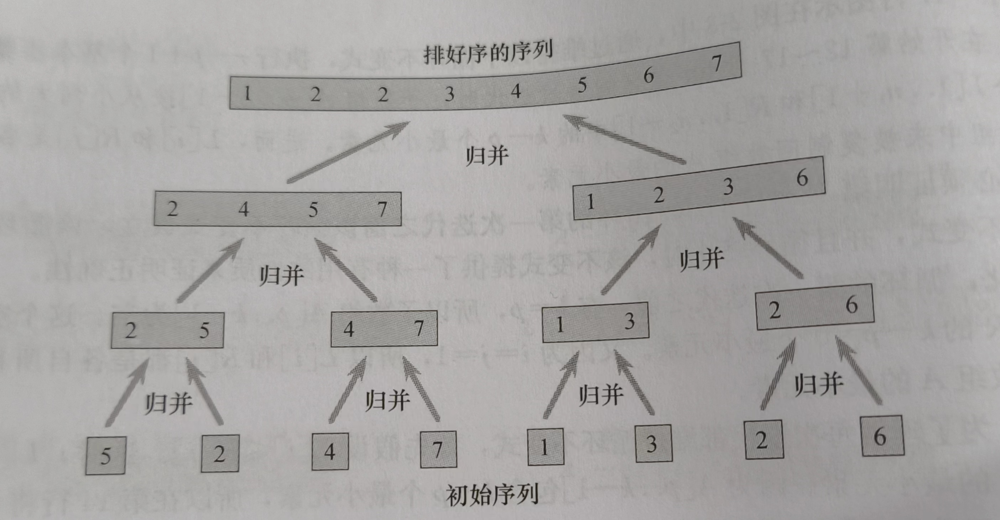
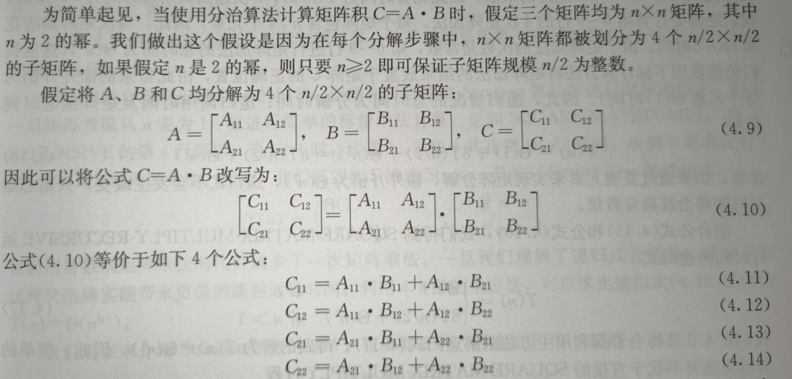
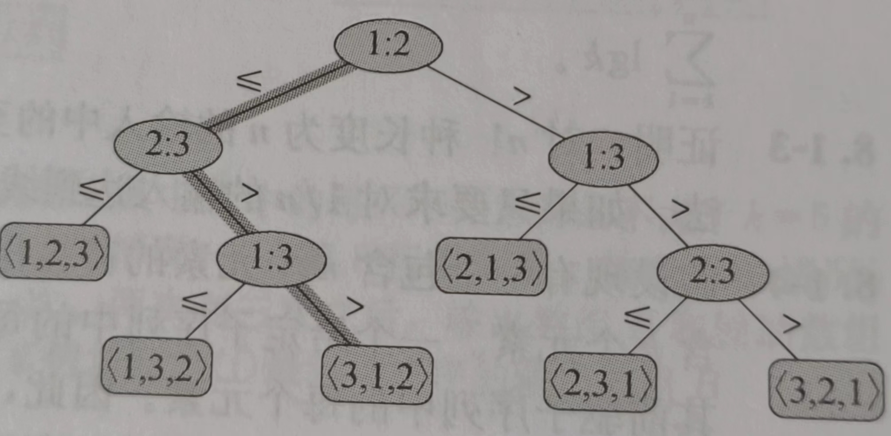

# 算法基础
## 概念
数据结构：是一种存储和组织数据的方式，旨在便于访问和修改。
算法：任何良定义的计算过程，该过程取某个值或值的集合作为输入并产生某个值或值得集合作为输出。
**衡量一个算法优劣的标准是看它所消耗的时间和空间**

算法的复杂性是指算法执行所需的计算资源和时间的量度。通常用时间复杂度和空间复杂度来衡量算法的复杂性。
时间复杂度是指算法执行所需的时间，通常用大0符号表示，例如，0(1)表示常数时间复杂度，0(n)表示线性时间复杂度，0(n^2)表示平方时间复杂度等等。时间复杂度越低，算法执行所需的时间越短，算法效率越高。
空间复杂度是指算法执行所需的内存空间，也通常用大0符号表示。例如，0(1)表示常数空间复杂度，0(n)表示线性空间复杂度，0(n^2)表示平方空间复杂度等等。空间复杂度越低，算法执行所需的内存空间越小，算法效率越高。
衡量算法的复杂性可以帮助我们选择最优的算法来解决问题，提高程序的效率和性能
## 分治思想
分治模式在每层递归时都有三个步骤：**分解、解决和合并**
分解：原问题为若干子问题，这些子问题是原问题的规模较小的实例
解决：递归求解子问题
合并：子问题的解成原问题的解

 分治策略常会用到递归式，而求解递归式的三种方法：
 1. 代入法
 2. 递归树法
 3. 主方法
### 最大子数组问题
最大子数组使用分支策略，将数组分为两半，即A\[low……mid]和A\[mid……high]
则最大子数组有三种情况：
- 仅在A\[low……mid]区域
- 仅在A\[mid……high]区域
- 横跨过mid点，即在A\[mid……high]也在A\[low……mid]区域
第一种情况和第二种情况还是再求一个数组的最大子数组，不过是规模变小了，因此要求的应该是第三种，横跨两边的情况
伪代码
```java
FIND-MAX-CROSSING-SUBARRAY(A,low,mid,high)
	left-sum = -∞
	sum = 0
	for i = mid downto low
		sum = sum + A[i]
		if sum > left-sum
			left-sum = sum
			max-left = i
	//1-7求出左半部分A[low……mid]最大子数组
	right-sum = -∞
	sum = 0
	for j = mid + 1 to high
		sum = sum + A[j]
		if sum > right-sum
			right-sum = sum
			max-right = j
	//9-15求出右半部分A[mid……reight]最大子数组
	return (max-left,max-right,left-sum+right-sum)
```
示例代码
```java
package study.january.nineteen;  
  
import java.util.Arrays;  
  
public class MaxArray {  
    public static void main(String[] args) {  
        int[] arr = new int[]{1, 2, -4, 9, 7, 6, 2, -5};  
        System.out.println(Arrays.toString(arr));  
  
        Result result = maxCrossArray(arr, 0, arr.length / 2, arr.length - 1);  
        System.out.println(result);  
    }  
  
    private static Result maxCrossArray(int[] arr, int low, int mid, int high) {  
        int sum = 0;  
        int max_left = 0;  
        int left_sum = -Integer.MAX_VALUE;  
        for (int i = mid; i >= low; i--) {  
            sum += arr[i];  
            if (sum > left_sum) {  
                left_sum = sum;  
                max_left = i;  
            }  
        }  
        sum = 0;  
        int max_right = 0;  
        int right_sum = -Integer.MAX_VALUE;  
        for (int i = mid + 1; i <= high; i++) {  
            sum += arr[i];  
            if (sum > right_sum) {  
                right_sum = sum;  
                max_right = i;  
            }  
        }  
        return new Result(max_left, max_right, left_sum + right_sum);  
    }  
}  
  
class Result {  
    private Integer begin;  
    private Integer end;  
    private Integer sum;  
  
    public Result(Integer begin, Integer end, Integer sum) {  
        this.begin = begin;  
        this.end = end;  
        this.sum = sum;  
    }  
  
    @Override  
    public String toString() {  
        return "Result{" +  
                "begin=" + begin +  
                ", end=" + end +  
                ", sum=" + sum +  
                '}';  
    }  
  
    public Integer getBegin() {  
        return begin;  
    }  
  
    public void setBegin(Integer begin) {  
        this.begin = begin;  
    }  
  
    public Integer getEnd() {  
        return end;  
    }  
  
    public void setEnd(Integer end) {  
        this.end = end;  
    }  
  
    public Integer getSum() {  
        return sum;  
    }  
  
    public void setSum(Integer sum) {  
        this.sum = sum;  
    }  
}
```

在这个测试用例中，最大子数组就横跨左右
一个数组包含n个元素（即n = high - low + 1），由于两个for循环每次迭代话费O(1)时间，因此仅需要统计一共进行了多少次迭代：
（mid - low + 1) + (high - mid) = high - low + 1 = n

完整伪代码
```java
FIND-MAXIMUM-SUBARRAY(A,low,high)
	if high == low
		return (low,high,A[low])
	else mid = ⌊(low + high) / 2⌋
		(left-low,left-high,left-sum) = FIND-MAXIMUM-SUBARRAY(A,low,mid)
		(right-low,right-high,right-sum) = FIND-MAXIMUM-SUBARRAY(A,mid+1,high)
		(cross-low,cross-high,cross-sum) = FIND-MAX-CROSSING-SUBARRAY(A,low,mid,high)
		if left-sum >= right-sum and left-sum >= cross-sum
			return (left-low,left-right,left-sum)
			
		else if right-sum >= left-sum and right-sum >= cross-sum
			return (right-low,right-right,right-sum)
		else return (cross-low,cross-right,cross-sum)
```
完整代码
```java
package study.january.nineteen;  
  
import java.util.Arrays;  
  
public class MaxArray {  
    public static void main(String[] args) {  
        int[] arr = new int[]{13,-3,-25,29,-3,-16,-23,18,20,-7,12,-5,-22,15,-4,7};  
        System.out.println(Arrays.toString(arr));  
  
        Result result = maxArray(arr, 0, arr.length - 1);  
        System.out.println(result);  
    }  
  
    private static Result maxArray(int[] arr, int low, int high) {  
        if (high == low) {  
            return new Result(low, high, arr[low]);  
        } else {  
            int mid = (low + high) / 2;  
            Result left = maxArray(arr, low, mid);  
            Result right = maxArray(arr, mid + 1, high);  
            Result cross = maxCrossArray(arr, low, mid, high);  
            if (left.getSum() >= right.getSum() && left.getSum() >= cross.getSum()) {  
                return left;  
            } else if (right.getSum() >= left.getSum() && right.getSum() >= cross.getSum()) {  
                return right;  
            } else {  
                return cross;  
            }  
        }  
  
    }  
  
    private static Result maxCrossArray(int[] arr, int low, int mid, int high) {  
        int sum = 0;  
        int max_left = 0;  
        int left_sum = -Integer.MAX_VALUE;  
        for (int i = mid; i >= low; i--) {  
            sum += arr[i];  
            if (sum > left_sum) {  
                left_sum = sum;  
                max_left = i;  
            }  
        }  
        sum = 0;  
        int max_right = 0;  
        int right_sum = -Integer.MAX_VALUE;  
        for (int i = mid + 1; i <= high; i++) {  
            sum += arr[i];  
            if (sum > right_sum) {  
                right_sum = sum;  
                max_right = i;  
            }  
        }  
        return new Result(max_left, max_right, left_sum + right_sum);  
    }  
}  
  
class Result {  
    private Integer begin;  
    private Integer end;  
    private Integer sum;  
  
    public Result(Integer begin, Integer end, Integer sum) {  
        this.begin = begin;  
        this.end = end;  
        this.sum = sum;  
    }  
  
    @Override  
    public String toString() {  
        return "Result{" +  
                "begin=" + begin +  
                ", end=" + end +  
                ", sum=" + sum +  
                '}';  
    }  
  
    public Integer getBegin() {  
        return begin;  
    }  
  
    public void setBegin(Integer begin) {  
        this.begin = begin;  
    }  
  
    public Integer getEnd() {  
        return end;  
    }  
  
    public void setEnd(Integer end) {  
        this.end = end;  
    }  
  
    public Integer getSum() {  
        return sum;  
    }  
  
    public void setSum(Integer sum) {  
        this.sum = sum;  
    }  
}
```
测试数据：
```
13,-3,-25,29,-3,-16,-23,18,20,-7,12,-5,-22,15,-4,7
```
测试结果：

### 矩阵乘法
给定两个矩阵A=$（a_{ij})$,B=$(b_{ij})$,二者皆为 n \* n方阵，定义C=A \* B,则$$c_{ij}=\sum_{k=1}^na_{ij} * b_{ij}$$
暴力破解的话肯定是需要O($n^3$)时间
通过Strassen可以让n * n矩阵乘法只花费O($n^{lg_7}$)——即O($n^{2.81}$)

同样是将原来的矩阵分解，在普通的分治算法中是求8个矩阵乘法，而Strassen只求7次，实现了O($n^{lg_7}$)时间消耗
1. 将A、B和C分解为 $n/2 * n/2$的矩阵，采用下标计算方法
2. 创建10个$n/2 * n/2$矩阵，递归计算$S_1$……$S_7$
3. 递归计算$P_1$……$P_7$, 每个也都是$n/2 * n/2$的矩阵
4. 通过$P_i$矩阵的不同组合进行加减计算，极端出结果矩阵C的子矩阵

后面的代入法、递归树和主方法解递归树的方法太抽象了😅😅😅，全是公式，看不懂写起来也费劲就不写了😅

## 概率分析和随机算法
输入的不确定性会导致输出的不确定，并且结果可能是天差地别的
### 生日悖论
即求在一个房间最少多少人就会有两个人生日在同一天，约定不考虑闰年，且每个人生日独立
经过推导求出：**$$e^{-k(k-1)/2n}\le \cfrac12$$**
当${-k(k-1)/2n}\le \cfrac12$成立，n默认为365，则必有$$k\ge23$$
### 礼券收集问题
每个随机变量$n_i$服从几何分布，成功的概率是** $\frac{b-i+1}b$ **
假设需要收集k种礼券，则大约需要收集 $blnb$张随机礼券才能成功
## 算法思维收集
### 余数问题
问：今天是星期日，100天后是星期几？
100%7=2——所以是星期二
$10^8$天呢？
100000000%7=2——还是星期二
$10^100$天呢？
如果直接计算，数值太大根本计算不了，需要找到规律：
#### 思路

规律是显而易见的：每增加6个0星期数就相同，因此将0的个数处于6即可
$100\%6=4$
因此答案是星期四——是和上方的规律对应起来得出的星期四，即四个零所以是星期四
### 乘方问题
$1234567^{987654321}$的个位数是什么呢?
#### 思路
我们无需对整个数字乘方，那样就算只是3次方也很大，我们只需要关注最后一位——7的阶乘就可以

| 指数 | 个位数字 |
| ---- | ---- |
| 0 | 1 |
| 1 | 7 |
| 2 | 9 |
| 3 | 3 |
| 4 | 1 |
| 5 | 7 |
| 6 | 9 |
| 7 | 3 |
可以看出周期为4，则只需要用987654321%4=1，则答案为7

## 奇偶问题
奇偶校验——计网中有
题目：
```txt
在一个小王国中，有8个村子(A~H)。如图所示，各个村之间有道路相连(黑
点表示村子，线表示道路)。而你要寻找流浪在这个王国的你唯一的恋人。
你的恋人住在这8个村子中的某一个里。她每过1个月便顺着道路去另一个村子，每个月都一定会换村子，然而选择哪个村子是随机的，预测不了。例如，如果恋人这个月住在G村，那么下个月就住在“C、F、H中的某个村子”。
目前你手头上掌握的确凿信息只有:1 年前(12个月前)，恋人住在 G村。请求出这个月恋人住在 A 村的概率。
```

看似很难，其实也只是奇偶规律问题：
奇数次移动在A、C、F、H村之一
偶数次移动在B、D、E、G村之一
所以题目答案是0%
## 图论问题

经典题目：一笔画走完七座桥
我们假设如此“完成了一笔画”，那么可能出现以下两种情况。
1. 起点和终点相同的情况
	一笔画成，也就意味着“边走边减”的结果是所有的顶点的度数变为(数。为什么呢?因为如果还存在度数不为0的顶点，那么也就存在没经过的边。
	经过“边走边减”之后，经过的顶点的性不变。由此我们可知度数变为0(数的经过点，在原图中本来就是偶点。此外，起点度数减1，终点度数也减 1，变为0。然而，起点和终点是相同的，因此相同顶点的度数减了 2，所以该顶点也变成了偶点。
	结论，在“起点和终点相同”的一笔画中，图中的顶点都是偶点
2. 起点和终点不同的情况
	和(1)相同的思路，经过的顶点全部是点。只有起点和终点是奇点。据此，在“起点和终点不同”的一笔画中，图中只有2个奇点。
至此，我们可知以下命题是成立的
**如果“可以一笔画成”=>“所有的顶点都是偶点，或者有2个奇点”**
图中四个顶点都是奇点，所以不能够一笔画

## 归纳问题
求1+2+3+4……+100的和
只需要计算1+2+3+4……+100和100+99+……+3+2+1的和即可，100 * 101 = 10100
则原来的答案为：10100 / 2 = 5050

## 递归问题
**递归和归纳， 只是方向不同。"从一般性前提推出个别性结论 " 的是递归(recursive) 的思想。 而 "从个别性前提推出一般性结论" 的是归纳(inductive)的思想。**
### 汉诺塔
```java
package study.january.twentytwo;  
  
import java.util.Scanner;  
  
public class HanoiTest {  
    private  static int flag = 0;  
    public static void main(String[] args) {  
        Scanner scanner = new Scanner(System.in);  
        int n = scanner.nextInt();  
        hanoi(n,'A','B','C');  
        System.out.printf("共计%d次\n",flag);  
    }  
  
    private static void hanoi(int n, char a, char b, char c) {  
        if (n>0){  
            hanoi(n-1,a,c,b);  
            System.out.printf("%c->%c\n",a,b);  
            flag++;  
            hanoi(n-1,c,b,a);  
        }  
    }  
}
```

# 排序算法


## 冒泡排序
### 算法步骤
1. 比较相邻的元素。如果第一个比第二个大，就交换他们两个。
2. 对每一对相邻元素作同样的工作，从开始第一对到结尾的最后一对。这步做完后，最后的元素会是最大的数。
3. 针对所有的元素重复以上的步骤，除了最后一个。
4. 持续每次对越来越少的元素重复上面的步骤，直到没有任何一对数字需要比较。
### 动图演示

**当输入的数据已经是正序时最快，当输入的数据是反序时最慢**
### 代码实现
```java
package study.january.twentyone;  
  
/**  
 * 冒泡排序  
 * 普通冒泡：  
 *      数据量：80000  
 *      用时：8739  
 * 进阶冒泡：  
 *      数据量：80000  
 *      用时：8522  
 */  
public class BubbleSort {  
    public static void main(String[] args) {  
        int[] arr = new int[80000];  
        for (int i = 0; i < arr.length; i++) {  
            arr[i] = (int) (Math.random() * 80000);  
        }  
  
        long start = System.currentTimeMillis();  
        bubbleSortPlus(arr);  
  
        long end = System.currentTimeMillis();  
  
        System.out.println("最终结果：");  
        for (int item : arr) {  
            System.out.printf(item + " ");  
        }  
        System.out.println();  
        System.out.println("用时：" + (end - start));  
    }  
  
  
    private static void bubbleSort(int[] arr) {  
        for (int i = 0; i < arr.length - 1; i++) {  
            for (int j = 0; j < arr.length-1 - i; j++) {  
                if (arr[j] > arr[j + 1]) {  
                    int temp = arr[j];  
                    arr[j] = arr[j+1];  
                    arr[j+1] = temp;  
                }  
            }  
        }  
    }  
  
    private static void bubbleSortPlus(int[] arr) {  
        boolean flag = false;  
        for (int i = 0; i < arr.length - 1; i++) {  
            for (int j = 0; j < arr.length-1 - i; j++) {  
                if (arr[j] > arr[j + 1]) {  
                    flag = true;  
                    int temp = arr[j];  
                    arr[j] = arr[j+1];  
                    arr[j+1] = temp;  
                }  
            }  
            if (!flag){  
                break;  
            }else {  
                flag = false;  
            }  
        }  
    }  
}
```

## 选择排序
### 算法步骤
1. 首先在未排序序列中找到最小（大）元素，存放到排序序列的起始位置。
2. 再从剩余未排序元素中继续寻找最小（大）元素，然后放到已排序序列的末尾。
3. 重复第二步，直到所有元素均排序完毕。
### 动图演示

### 代码实现
```java
package study.january.twentyone;  
  
/**  
 * 选择排序  
 *      数据量：80000  
 *      用时：2458  
 */  
public class SelectSort {  
    public static void main(String[] args) {  
        int[] arr = new int[80000];  
        for (int i = 0; i < arr.length; i++) {  
            arr[i] = (int) (Math.random() * 80000);  
        }  
  
        long start = System.currentTimeMillis();  
        selectSort(arr);  
  
        long end = System.currentTimeMillis();  
  
        System.out.println("最终结果：");  
        for (int item : arr) {  
            System.out.printf(item + " ");  
        }  
        System.out.println();  
        System.out.println("用时：" + (end - start));  
    }  
  
    private static void selectSort(int[] arr) {  
        for (int i = 0; i < arr.length-1; i++) {  
            int min = i;  
            for (int j = i+1; j < arr.length; j++) {  
                if (arr[j]<arr[min]){  
                    min = j;  
                }  
            }  
            if (i!=min){  
                int temp = arr[i];  
                arr[i] = arr[min];  
                arr[min] = temp;  
            }  
        }  
    }  
}
```
## 插入排序
### 算法步骤
1. 将第一待排序序列第一个元素看做一个有序序列，把第二个元素到最后一个元素当成是未排序序列。
2. 从头到尾依次扫描未排序序列，将扫描到的每个元素插入有序序列的适当位置。（如果待插入的元素与有序序列中的某个元素相等，则将待插入元素插入到相等元素的后面。）

伪代码
```java
for i = 2 to A.length
	key = A[i]
	j = i - 1;
	while j > 0 and A[j] >key
		A[j+1] = A[j];
		j = j - 1;
	A[j+1] = key;
```

### 动图演示

### 代码实现
```java
public class InsertSort {  
    public static void main(String[] args) {  
        int[] arr = new int[]{1, 2, 4, 6, 2, 8, 4, 9};  
        insertSort(arr);  
        for (int j : arr) {  
            System.out.print(j + " ");  
        }  
        System.out.println();  
    }  
  
    private static void insertSort(int[] arr) {  
        for (int i = 2; i < arr.length; i++) {  
            int j = i - 1;  
            int key = arr[i];  
            while (j > 0 && arr[j] > key) {  
                int temp = arr[j + 1];  
                arr[j + 1] = arr[j];  
                arr[j] = temp;  
                j--;  
            }  
            arr[j + 1] = key;  
        }  
    }  
}
```

## 希尔排序

### 算法步骤
1. 选择一个增量序列 t1，t2，……，tk，其中 ti > tj, tk = 1；
2. 按增量序列个数 k，对序列进行 k 趟排序；
3. 每趟排序，根据对应的增量 ti，将待排序列分割成若干长度为 m 的子序列，分别对各子表进行直接插入排序。仅增量因子为 1 时，整个序列作为一个表来处理，表长度即为整个序列的长度。
### 动图演示

### 代码实现
```java
package study.january.sort;  
  
/**  
 * 希尔排序  
 *      数据量：80000  
 *      用时：14ms  
 */
 public class ShellSort {  
    public static void main(String[] args) {  
        int[] arr = new int[80000];  
        for (int i = 0; i < arr.length; i++) {  
            arr[i] = (int) (Math.random() * 80000);  
        }  
  
        long start = System.currentTimeMillis();  
        shellSort(arr);  
  
        long end = System.currentTimeMillis();  
  
        System.out.println("最终结果：");  
        for (int item : arr) {  
            System.out.printf(item + " ");  
        }  
        System.out.println();  
        System.out.println("用时：" + (end - start));  
    }  
  
    private static void shellSort(int[] arr) {  
        for (int step = arr.length / 2; step >= 1; step /= 2) {  
            for (int i = step; i < arr.length; i++) {  
                int temp = arr[i];  
                int j = i - step;  
                while (j >= 0 && arr[j] > temp) {  
                    arr[j + step] = arr[j];  
                    j -= step;  
                }  
                arr[j + step] = temp;  
            }  
        }  
    }  
}
```


## 归并排序

> [!NOTE] 归并排序
> 
> However, it is not possible to do so in JavaScript, as the recursion goes too deep for the language to handle.
> JavaScript是单线程的，并且使用调用栈（call stack）来管理函数的调用和执行。每当函数被调用时，一个新的帧（frame）被推入调用栈，而当函数执行完成时，对应的帧被弹出。然而，JavaScript引擎对调用栈的深度有一定的限制，超过这个限制就会导致栈溢出错误。
  归并排序的递归深度取决于数组的大小，对于非常大的数组，递归深度可能会超过JavaScript调用栈的最大深度，从而导致栈溢出。
> 
### 算法步骤
1. 申请空间，使其大小为两个已经排序序列之和，该空间用来存放合并后的序列；
2. 设定两个指针，最初位置分别为两个已经排序序列的起始位置；
3. 比较两个指针所指向的元素，选择相对小的元素放入到合并空间，并移动指针到下一位置；
4. 重复步骤 3 直到某一指针达到序列尾；
5. 将另一序列剩下的所有元素直接复制到合并序列尾。
### 动图演示

### 代码实现
```java
package study.january.sort;  
  
import java.util.Arrays;  
  
/**  
 * 希尔排序  
 *      数据量：80000  
 *      用时：1628ms  
 */public class MergeSort {  
    public static void main(String[] args) {  
        int[] arr = new int[80000];  
        for (int i = 0; i < arr.length; i++) {  
            arr[i] = (int) (Math.random() * 80000);  
        }  
  
        long start = System.currentTimeMillis();  
        int[] mergeSort = mergeSort(arr);  
  
        long end = System.currentTimeMillis();  
  
        System.out.println("最终结果：");  
        for (int item : mergeSort) {  
            System.out.printf(item + " ");  
        }  
        System.out.println();  
        System.out.println("用时：" + (end - start));  
    }  
  
    private static int[] mergeSort(int[] arr) {  
        if (arr.length<2){  
            return arr;  
        }  
  
        int mid = arr.length / 2;  
        int[] left = Arrays.copyOfRange(arr, 0, mid);  
        int[] right = Arrays.copyOfRange(arr, mid, arr.length);  
  
        return merge(mergeSort(left), mergeSort(right));  
    }  
  
    private static int[] merge(int[] left, int[] right) {  
        int[] resultArray = new int[left.length + right.length];  
  
        int i = 0;  
        while (left.length >0 && right.length>0){  
            if(left[0]<=right[0]){  
                resultArray[i++] = left[0];  
                left = Arrays.copyOfRange(left,1,left.length);  
            }else {  
                resultArray[i++] = right[0];  
                right = Arrays.copyOfRange(right,1,right.length);  
            }  
        }  
  
        while (left.length>0){  
            resultArray[i++] = left[0];  
            left = Arrays.copyOfRange(left,1,left.length);  
        }  
  
        while (right.length > 0){  
            resultArray[i++] = right[0];  
            right = Arrays.copyOfRange(right,1,right.length);  
        }  
  
        return resultArray;  
    }  
}
```

## 快速排序

> [!NOTE] 快速排序和归并排序比较
> 快速排序的最坏运行情况是 O(n²)，比如说顺序数列的快排。但它的平摊期望时间是 O(nlogn)，且 O(nlogn) 记号中隐含的常数因子很小，比复杂度稳定等于 O(nlogn) 的归并排序要小很多。所以，对绝大多数顺序性较弱的随机数列而言，快速排序总是优于归并排序。
### 算法步骤

1. 从数列中挑出一个元素，称为 "基准"（pivot）;
2. 重新排序数列，所有元素比基准值小的摆放在基准前面，所有元素比基准值大的摆在基准的后面（相同的数可以到任一边）。在这个分区退出之后，该基准就处于数列的中间位置。这个称为分区（partition）操作；
3. 递归地（recursive）把小于基准值元素的子数列和大于基准值元素的子数列排序；
### 动图演示

### 伪代码
```java
QUICKSORT(A,p,r)
	if p < r
		q = PARTITION(A,p,r)
		QUICKSORT(A,p,q-1)
		QUICKSORT(A,q+1,r)
```
在QUICKSORT中，A数组被划分为两个子数组，其中A[p……q-1]是小于A[q]的元素集合，A[q+1……r]是大于A[q]的元素集合，因此计算下标q是重要的一环
```java
PARTITION(A,p,r)
	x = A[r]
	i = p - 1
	for j = p to r-1
		if A[j]<=x
			i = i + 1
			exchange A[i] with A[j]
	exchange A[i+1] with A[r]
	return i + 1

```
### 代码实现
```java
package study.january.sort;  
  
/**  
 * 快速排序  
 *      数据量：80000  
 *      用时：13ms  
 * *      数据量：800000  
 *      用时：63ms  
 */
 public class QuickSort {  
    public static void main(String[] args) {  
        int[] arr = new int[800000];  
        for (int i = 0; i < arr.length; i++) {  
            arr[i] = (int) (Math.random() * 800000);  
        }  
  
        long start = System.currentTimeMillis();  
        int[] result = quickSort(arr, 0, arr.length - 1);  
  
        long end = System.currentTimeMillis();  
  
        System.out.println("最终结果：");  
        for (int item : result) {  
            System.out.printf(item + " ");  
        }  
        System.out.println();  
        System.out.println("用时：" + (end - start));  
    }  
  
    private static int[] quickSort(int[] arr, int left, int right) {  
        if (left < right) {  
            int partitionIndex = partition(arr, left, right);  
            quickSort(arr, left, partitionIndex - 1);  
            quickSort(arr, partitionIndex + 1, right);  
        }  
        return arr;  
    }  
    private static int partition(int[] arr, int left, int right) {  
        int pivot = arr[right];  
        int index = left - 1;  
        for (int i = left; i < right; i++) {  
            if (arr[i] <= pivot) {  
                index++;  
                swap(arr, index, i);  
            }  
        }  
        swap(arr, index + 1, right);  
        return index + 1;  
    }  
  
    private static void swap(int[] arr, int i, int index) {  
        int temp = arr[i];  
        arr[i] = arr[index];  
        arr[index] = temp;  
    }  
}
```
## 线性时间排序
### 比较排序
对输入序列的元素进行比较，来获得元素间次序信息。
#### 决策树模型

深色是在输入序列为<$a_1$=6,$a_2$=8,$a_3$=5>时所做的决策
**在最坏情况下，任何算法都需要做$\Omega(n lg n)$次比较**
### 计数排序
对每个输入元素x,确定小于x的元素个数，就可以把x放到对应的输出序列位置上——对于相同的元素就需要另外修改
😅
# 基本数据结构
## 栈和队列
栈(stack)：采用后进先出(Last-In-First-Out,LIFO)策略
队列(queue)：采用先进先出(First-In-First-Out,FIFO)策略
栈有push和pop操作，当stack.length = 0时栈为空，且栈只能从栈顶push和pop
队列有enqueue和dequeue操作，总是从队尾入队，从队头出队
## 链表
链表(LinkedList)可以分为单向链表（链表第一个元素的next指针指向下一个元素直到最后）、双向链表（每个元素的head指向前一个元素，next指向后一个元素，第一个元素的head和最后一个元素的next为空）、循环链表（每个元素的head指向前一个元素，next指向后一个元素，第一个元素的head指向最后一个元素，同时最后一个元素的next指向第一个元素）


# 分治
## binarySearch
### 基本的BinarySearch
给定有序数列，查找到对应的target,没有返回-1
```java
package practice.january.search;  
  
public class BinarySearch {  
    public static void main(String[] args) {  
        int[] nums = {1,3};  
        int target = 2;  
        Solution solution = new Solution();  
        int result = solution.searchInsert(nums,target);  
        System.out.println(result);  
    }  
}  
  
class Solution {  
    public int searchInsert(int[] nums, int target) {  
        int length = nums.length;  
        int result = fun(nums,0,length-1,target);  
        return result;  
    }  
  
    public int fun(int[] arr,int left,int right,int target){  
  
        if(left > right){  
            return -1;  
        }  
        int mid = (left + right) / 2;  
        if(arr[mid] > target){  
            return fun(arr,left,mid-1,target);  
        }else if(arr[mid] < target){  
            return fun(arr,mid+1,right,target);  
        }else{  
            return mid;  
        }  
    }  
}
```
### 进阶的BinarySearch
给定有序数列，查找到对应的target,没有返回它应该被插入的位置
```java
package practice.january.search;  
  
public class BinarySearch {  
    public static void main(String[] args) {  
        int[] nums = {1,3};  
        int target = 2;  
        Solution solution = new Solution();  
        int result = solution.searchInsert(nums,target);  
        System.out.println(result);  
    }  
}  
  
class Solution {  
    public int searchInsert(int[] nums, int target) {  
        int length = nums.length;  
        if(target < nums[0]){  
            return 0;  
        }  
        if(target > nums[length-1]){  
            return length;  
        }  
        int result = fun(nums,0,length-1,target);  
        return result;  
    }  
  
    public int fun(int[] arr,int left,int right,int target){  
  
        if(left > right){  
            return find(arr,target);  
        }  
        int mid = (left + right) / 2;  
        if(arr[mid] > target){  
            return fun(arr,left,mid-1,target);  
        }else if(arr[mid] < target){  
            return fun(arr,mid+1,right,target);  
        }else{  
            return mid;  
        }  
    }  
  
    public int find(int[] arr,int target){  
        for(int i = 0; i <= arr.length - 2;i++){  
            if(arr[i] < target && arr[i+1] > target ){  
                return i+1;  
            }  
        }  
        return -1;  
    }  
}
```

### BinarySearch ArrayList
给你一个满足下述两条属性的 m x n 整数知阵:
1. 每行中的整数从左到右按非严格递增顺序排排列
2. 每行的第一个整数大于前一行的最后一个整数
给你一个整数 target ，如果 target 在知阵中，返回 true ;否则，返回 false 。
```java
package practice.january.search;  
  
public class BinarySearchArray {  
    public static void main(String[] args) {  
        int[][] arr = {{1, 2, 8, 9}, {2, 4, 9, 12}, {4, 7, 10, 13}, {6, 8, 11, 15}};  
        boolean find = Find(15, arr);  
        System.out.println(find);  
    }  
  
    public static boolean Find(int target, int[][] array) {  
        if (array == null || array[0].length == 0) {  
            return false;  
        }  
        int x = 0;  
        int y = array.length - 1;  
  
        while (x < array[0].length && y >= 0) {  
            if (array[y][x] > target) {  
                y--;  
            } else if (array[y][x] < target) {  
                x++;  
            } else {  
                return true;  
            }  
        }  
  
        return false;  
    }  
}
```

### 查找首尾target
给你一个按照非递减顺序排列的整数数组 nums，和一个目标值 target 。请你找出给定标值在数组中的开始位置和结束位置。
如果数组中不存在目标值 target ，返回 [-1，-1]。
你必须设计并实现时间复杂度为 o(log n) 的算法解决此问题
```java
class Solution {  
    public int[] searchRange(int[] nums, int target) {  
        int x = binarySearch(nums,target,true);  
        int y = binarySearch(nums,target,false)-1;  
        if(x<=y&&nums[x]==target&&nums[y]==target&&y<nums.length){  
            return new int[]{x,y};  
        }  
  
        return new int[]{-1,-1};  
    }  
    public int binarySearch(int[] arr,int target,boolean flag){  
        int left = 0;  
        int right = arr.length - 1;  
        int temp = arr.length;  
        while(left <= right){  
            int mid = (left+right) / 2;  
            if(arr[mid] > target || (flag && arr[mid] >= target)){  
                right = mid - 1;  
                temp = mid;  
            }else{  
                left = mid + 1;  
            }  
        }  
        return temp;  
    }  
}
```


