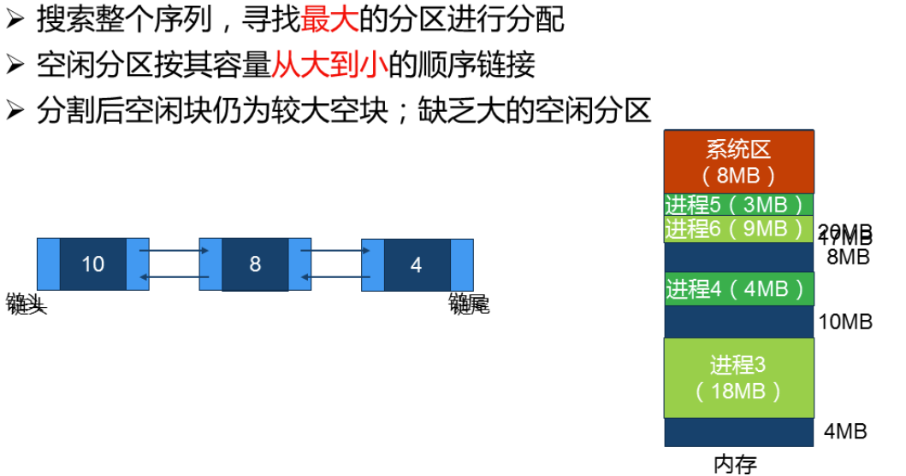
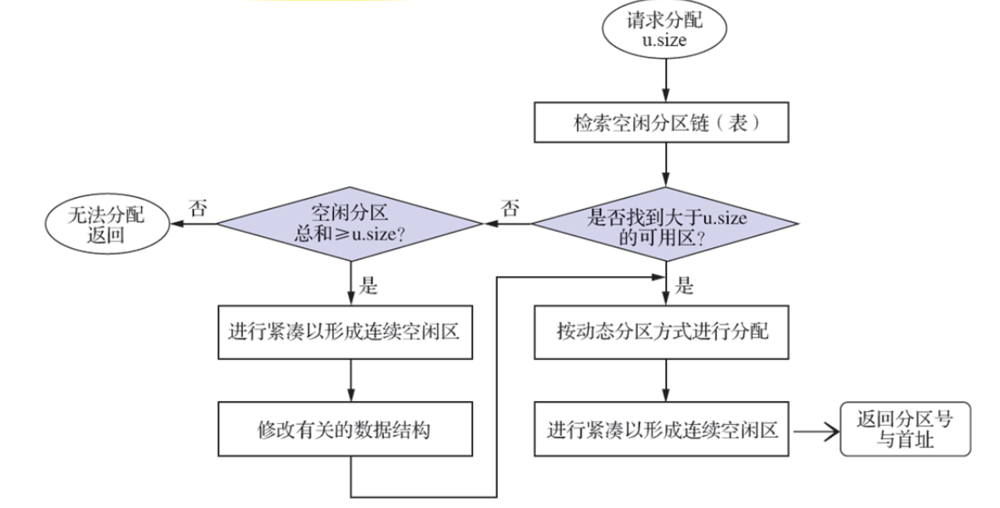
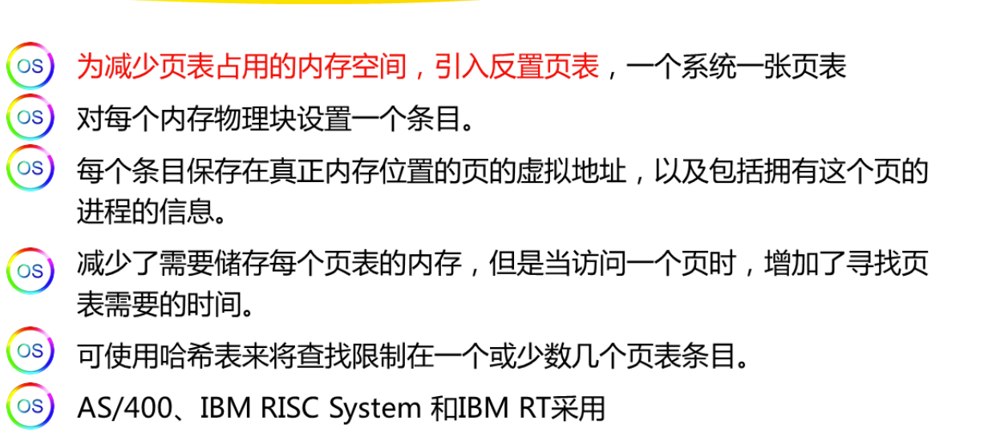
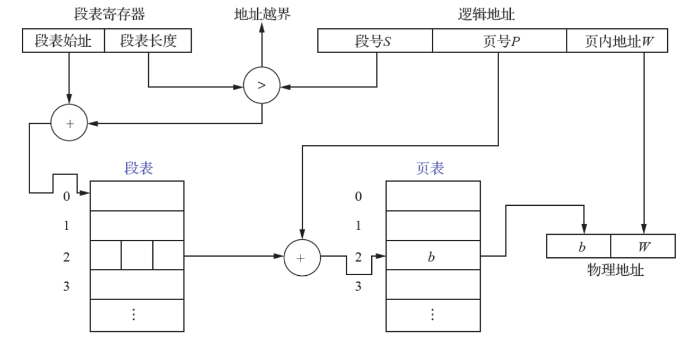
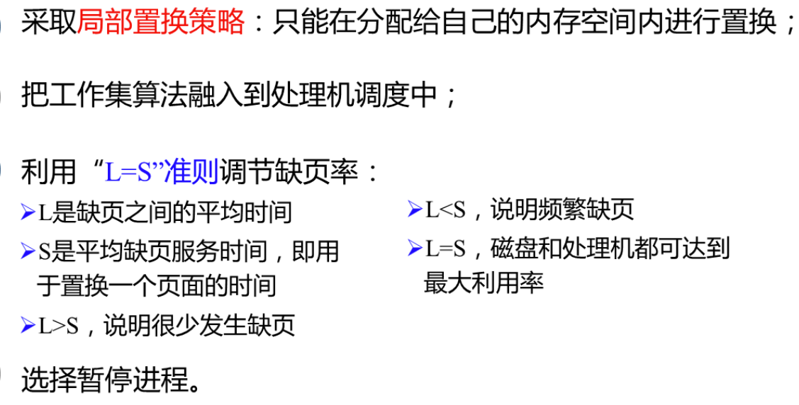
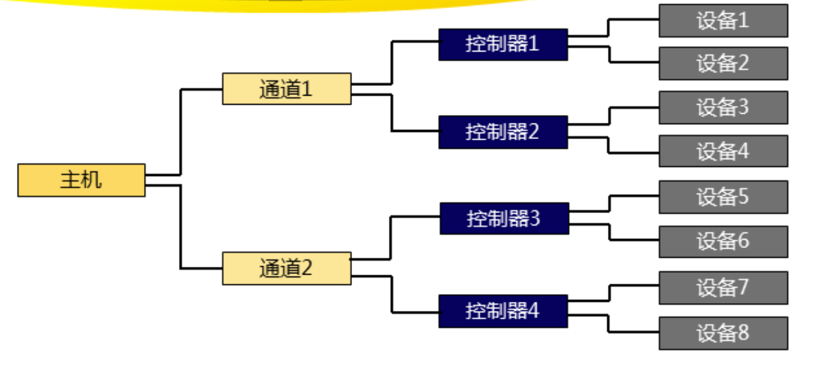
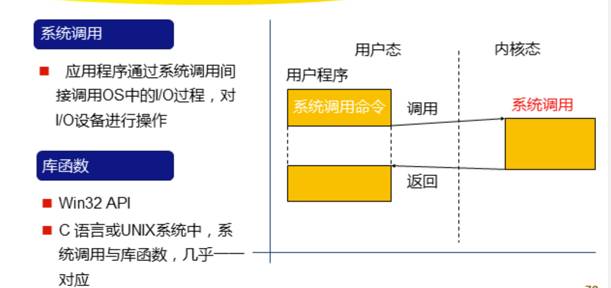
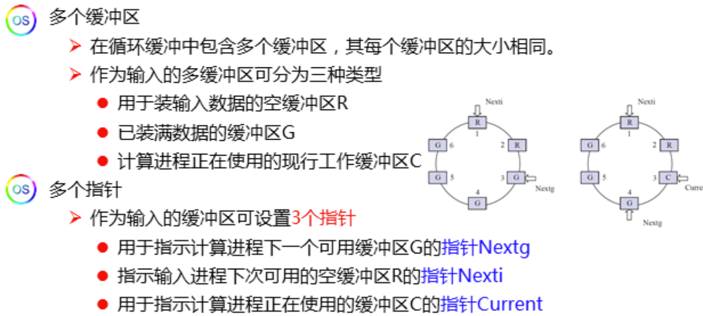
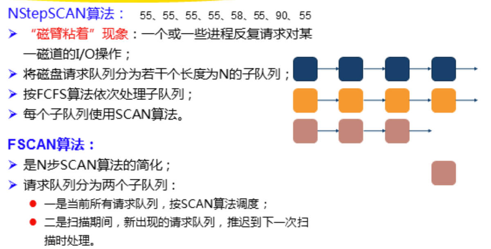
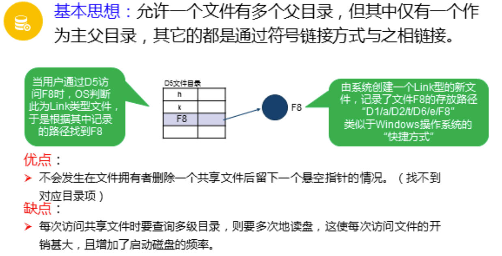

# 计算机操作系统

## 第一章 引论

**操作系统(operating system,OS)是配置在计算机硬件爱你上的第一层软件，是对硬件系统的首次扩充，其主要作用是管理硬件设备，提高它们的利用率和系统吞吐量，并为用户和应用程序提供一个简单的接口，以便于用户和应用程序使用硬件设备。**

### 1.1 操作系统的目标和作用

#### 1.1.1 目标

#### 1.1.2 作用

**方便性、有效性、可扩充性**


### 1.2 操作系统的发展过程

#### 1.2.1 未配置操作系统的计算机系统

##### 1. 人工操作

1. 用户独占主机
2. CPU等待人工操作

##### 2. 脱机I/O方式

1. 减少了CPU空闲时间
2. 提高了I/O速度

#### 1.2.2 单道批处理系统

**优点：提高资源利用率和系统吞吐量**

**缺点：系统中资源得不到充分利用**

#### 1.2.3 多道批处理命令

实现：即在某个资源分配给某一道指令时，其他的资源可以去分配给其他指令，使CPU始终处于忙碌状态

**优点：**

1. 资源利用率高
2. 系统吞吐量大

**缺点：**

1. 平均周期时间长
2. 无交互能力

虽然多道批处理命令还有不足，但是操作系统已经初具模型，**OS是一组能有效地阻滞和管理吉萨UN及硬件和软件资源，合理地对各类作业进行调度，以及方便用户使用的程序集合**

#### 1.2.4 分时系统

##### 分时系统优点

**人机交互和共享主机**

##### 关键问题

1. 及时接收
2. 及时处理

##### 特征

1. 多路性：按分时原则可以为多个终端服务
2. 独立性：用户拥有自己的独立环境
3. 及时性：很短时间内响应用户请求
4. 交互性：用户可通过终端与系统进行广泛的人机交互

#### 1.2.5 实时系统

##### 类型

1. 工业控制系统
2. 信息查询系统
3. 多媒体系统
4. 嵌入式系统

##### 实时任务类型


##### 实时系统和分时系统特征比较

​							分时																		实时

1. 多路性：*按分时原则为多个终端服务*			    	*周期性的采集信息并对多个用户服务*
2. 独立性：  								用户拥有自己的独立环境
3. 及时性：两者都能在很短的时间处理信息，但是原理不同，一个是根据分时片段，一个是周期性
4. 交互性：*不如分时系统*
5. 可靠性：*实时系统对系统可靠性要求更高*

#### 1.2.6 微机操作系统

1. 单用户单任务OS
2. 单用户多任务OS
3. 多用户多任务OS

#### 1.2.7 嵌入式操作系统

**嵌入式系统仅仅为了完成某个特定任务而存在**

特点：

1. 内核小
2. 精简
3. 实时性高
4. 具有可配置性

*参考32开发板这类*

#### 1.2.8 网络操作系统

**网络OS适用于在计算机网络环境下对网络资源进行管理和控制，实现数据通信及对网络资源的共享，为用户提供网络资源接口的一组软间和规程的集合**

#### 1.2.9 分布式操作系统

**distributed system: 基于软件实现的一种处理机系统，是多个处理机通过通信线路互联而构成的松散耦合系统，系统的处理和控制功能分布在各个处理机上**

*例如：万物互联，鸿蒙OS*

特点：

1. 分布性
2. 透明性
3. 同一性
4. 全局性

分布式OS较单机OS多了如下功能：

1. 通信管理功能
2. 资源管理功能：对所有资源统一管理、分配和调度
3. 进程管理功能

### 1.3 操作系统的基本特征

#### 1.3.1 并发

##### 并行与并发

**并行指两个或多个事件在同一时刻发生**

**并发指两个或多个事件在同一时间间隔内发生**

##### 进程(process)

**指在系统中能独立运行并能作为资源分配对象的基本单位，它由一组机器指令、数据和堆栈组成，是一个能独立运行的活动实体——多个进程可并发执行并交换信息**

#### 1.3.2 共享

1. 互斥共享——资源不多，要的人却多，而且每一个还要独占资源
2. 同时共享——要的人多，但是资源可以共用

#### 1.3.3 虚拟

##### 时分复用技术

**利用处理机的空闲时间来运行其他程序以提高处理机的利用率**

1. 虚拟处理机技术：利用多道程序设计技术，为每道程序建立至少一个进程，使多道程序并发执行

2. 虚拟设备技术：将一台物理上的I/O设备虚拟为多台逻辑上的I/O设备，允许多个用户占用一台逻辑I/O设备

##### 空分复用技术

**利用存储器的空闲时间来存放其他程序以提高内存利用率**

#### 1.3.4 异步

**因为资源有限，进程的执行不可能一气呵成，而会走走停停，因此每道程序总共需要多少时间运行完是不可知的**

### 1.4 操作系统的运行环境

#### 1.4.1 硬件支持

**计算机启动：计算机启东时需要一个初始程序或引导程序(bootstrap program),**它一般位于固件(firmware)中,如ROM(只读存储器，read-only memory),或电擦除可编程只读存储器(electrically-erasable programmable read-only memory,EEPROM)等。**它会初始化系统组件，以及内存内容，简单说就是将系统加载到内存，让系统开始运行**

#### 1.4.2 操作系统内核


#### 1.4.3 处理机的双重工作模式

**即操作系统的内核态和用户态——计算机通过一个模式为来表示当前模式，如0为内核，1为用户**

**用户态可以执行用户指令，即非特权指令**

**内核态除了可以执行非特权指令可以执行特权指令，即系统指令——中断指令等**

#### 1.4.4 中断与异常

**现代OS是中断驱动**

**中断是硬件通过系统总线发送信号到CPU来触发的**

**陷阱或异常总是由软件引起的**

### 1.5 操作系统主要功能


### 1.6 操作系统的结构

#### 1.6.4 微内核结构


#### 1.6.5 外核结构

基本思想：*内核不提供传统OS中的进程、虚拟存储器等抽象事物，而是专注于物理资源的隔离与复用*

### 1.7 系统调用

**程序借口是OS专门为用户程序而设置的，被提供给程序员**

#### 1.7.1 系统调用的基本概念

1. 运行在不同的系统状态

    一般过程调用都是仅在内核态或者用户态，**而系统调用的调用程序在用户态，被调用程序在内核态**

2. 状态的切换

    **因为系统调用设计状态切换，所以通过软中断机制先切换状态，经内核分析后再转向相应的处理子程序**

3. 返回问题

    会根据优先级执行

4. 嵌套调用

#### 1.7.2 系统调用类型

1. 进程控制类系统调用
2. 文件操纵类系统调用
3. 进程通信类系统调用

### 1.8 第一章小结

1. 一个完整的计算机系统由硬件和软件组成。硬件是软件得以建立和开展活动的基础，而软件则是对硬件功能的扩充。OS是裸机上的第一层系统软件，它向下管理系统中各类资源，向上为用户和程序提供服务
2. OS的发展：早期的批处理系统、分时系统、实时系统、还有现在的微机OS、嵌入式OS、网络OS和分布式OS
3. OS具有并发、共享、虚拟和异步等特征，其运行需要硬件支持。为了保护系统不被破坏，处理机分为用户态和内核态。OS是中断驱动的，因此中断机制是计算机中的重要机制
4. 传统OS具备：进程管理，内存管理，设备管理，文件管理和接口管理。现代OS除了上述还具备保障系统安全、支持用户通过互联网获取服务、可处理多媒体信息等
5. OS是一个大型的系统软件，采用结构化的设计。早起OS基本没设计，现代OS多采用模块化结构，分层式结构，你微内核结构等设计——最新的还采用外核结构设计
6. 系统调用是OS内核与用户程序之间的接口，每个OS都提供大量的系统调用给程序员使用

### 课后习题


## 第二章 进程的描述与控制

### 2.1 前趋图和程序执行

#### 前趋图

前趋图是一个有向无环图，用于描述进程间执行的先后顺序。每个节点代表一个进程或一段程序，节点的有向边表示节点之间存在的偏序或者前趋关系

#### 程序顺序执行

- 顺序性：处理机会严格按照程序规定的顺序执行语句
- 封闭性：程序在封闭环境运行——独占全机资源且运行后不受干扰
- 可再现性：只要程序的初始条件相同，都可获得相同的执行结果

#### 程序并发执行

只有不存在前趋关系的程序才可以并发执行，否则无法并发执行——并发执行是为了使计算机资源利用率更高

- 间断性：因为并发执行且共享资源，就涉及到在使用临界资源时需要涉及资源争抢，没拿到资源的暂停执行
- 失去封闭性
- 不可再现性失去封闭性导致失去再现性

### 2.2 进程

#### 进程的描述

##### 进程的定义

为了使参与并发执行的每个程序和他们的数据都能独立运行，在OS中配置了一个专门的数据结构——**进程控制块(process control block,PCB)**,OS利用PCB来吗，描述进程的信息进而管理和控制。

*一般把进程实体简称为进程，进程定义为：进程是程序的执行过程，是系统进行资源分配和调度的一个独立单位*

##### PCB——进程管理表

OS管理的控制表可以分为：内存表、设备表、文件表和进程表(用于进程管理)——PCB就是进程表

PCB作用是使一个在多道程序环境下不能独立运行的程序(含数据)，成为一个可以独立运行的基本单位，即一个能与其他程序并发执行的进程

###### PCB的作用

- 作为独立运行的基本单位的标志
- 实现间断性运行方式
- 提供进程管理所需要的信息
- 提供进程调度所需要的信息
- 实现与其他信息的同步与通信

###### PCB中的信息


###### PCB组织方式

- 线性方式
- 链接方式
- 索引方式

##### 进程的特征

1. 动态性：进程的实质是程序的执行过程，它是一直动态改变的——进程由创建而产生，由调度而执行，由撤销而消亡
2. 并发性：指多个进程共存于内存中，且能在同一时间同时执行
3. 独立性——参考进程的定义
4. 异步性：进程是按异步方式运行的，即按各自独立的、不可预知的速度向前推进

##### 进程的基本状态与转换

1. 就绪状态(ready)：进程已经分配到除了CPU以外的所有资源，进入就绪队列等待调度
2. 执行状态(running)：被调度后获得CPU
3. 阻塞状态(block)：当进程触发了某个事件后无法继续执行，即阻塞。OS会把处理机分配给别的进程，而让阻塞进程进入阻塞队列——因为不同原因引起的阻塞会被分到不同的阻塞队列，提高效率
4. 创建状态：首先由进程申请一个空白PCB,并向PCB中填写用于控制和管理进程的信息；然后由进程分配运行时所需的资源；最后，把进程状态转换为就绪状态将它插入就绪队列中
5. 终止状态：首先等待OS进行善后处理；然后将进程的PCB清零，并将PCB空间返还给OS


###### 挂起

挂起操作引入是为了：

- 终端用户的需要
- 父进程的需要
- 负荷调节的需要
- OS的需要

挂起操作引入后的状态转换——**引入挂起原语Suspend和激活原语Active**


###### 综合后的基本状态转换


#### 进程控制

进程的层次：即进程可以创建子进程，在拥有孙进程——子进程再创建子进程……值得注意的是在Windows中不存在进程层次结构，所有的进程都有同等的地位

进程图：描述进程间关系的一棵有向树

引起进程创建的时间：

- 用户登录
- 作业调度
- 提供服务
- 应用事件

##### 进程的创建

1. 申请空白的PCB——进程的创建需要分配资源和对信息进行管理，因此需要先创建PCB以方便系统对他管控
2. 为新的进程分配其运行所需要的资源——包括各种物理资源和逻辑资源
3. 初始化PCB
    - 初始化标志信息
    - 初始化处理机状态信息
    - 初始化处理机控制信息
4. 如果进程就绪队列能够接纳新的进程，就将新进程插入就绪队列

##### 进程的终止

###### 引起终止事件

1. 正常结束：表示进程的任务已经完成，准备退出运行
2. 异常结束：
    - 越界错：特指存储访问越界
    - 保护错：访问文件错误
    - 指令错：非法指令
    - 特权指令错：进程试图执行特权指令
    - 运行超时
    - 等待超时：事件等待超时
    - 算术运算错：执行禁止的运算——被0除
    - I/O错

3. 外界干预：指进程应外界请求而终止运行

###### 进程终止过程

调用进程终止原语，执行以下操作：

1. 根据被终止进程的标识符，在PCB集合中检索出该进程PCB,从该进程PCB读出进程状态
2. 若被终止进程处于执行状态就立即终止该进程的执行，并置调度标志为真，以指示该进程被中止后应该重新进行调度
3. 若被终止进程有子孙进程也一并终止，防止它们成为不可控进程
4. 将被终止进程的所有资源归还给父进程或OS
5. 将被终止进程的PCB从所在队列(或者链表)中移出，等待其他程序来搜集信息

##### 进程的阻塞与唤醒

###### 引起进程阻塞的事件

1. 向系统请求共享资源失败
2. 等待某种操作完成
3. 新数据尚未到达
4. 等待新任务到达

###### 进程阻塞过程

**上述事件发生后进程便会通过调用阻塞原语block将自己阻塞——因此阻塞是进程自身的一种主动行为**

进入block阶段后，由于该进程还处于执行状态，因此OS会首先立即停止执行该进程，把PCB中的现行状态由执行改为阻塞，并将PCB插入阻塞队列——可能是对应阻塞事件的阻塞队列；最后转至调度程序进行重新调度操作，将处理机分配给另一就绪进程并进行切换——保留被阻塞进程的处理机态，按新进程的PCB中的处理机状态设置CPU环境

###### 进程唤醒过程

**当阻塞进程所期待的事件——即引起阻塞的事件在完成后，相关进程就会调用唤醒原语wakeup以将等待该事件的进程唤醒。**

首先把阻塞的进程从等待该事件的阻塞队列中移出，将其PCB状态从阻塞改为就绪，再把该PCB插入就绪队列

**block和weakup必须成对出现，否则可能造成某个进程的的永久阻塞**

###### 挂起与激活

挂起：suspend原语

激活：active原语

#### 进程通信

**指进程间的信息交换**


##### 共享存储器系统

在共享存储器系统(shared-memory system),相互通信的进程共享某些数据结构或存储区，进程之间能够通过这些空间进行通信。

1. 基于共享数据结构的通信方式：效率低
2. 基于共享存储区的通信方式：高级通信

##### 管理通信系统

管道：用于连接读写进程以实现它们间通信的共享文件，又名pipe文件

- 互斥：当一个进程在对管道操作时，另一个进程需要等待


- 同步：当管道中没有数据时，读进程休眠，直到写进程操作后写进程休眠，唤醒读进程，在读进程操作完成之前写进程也休眠

- 确定对方是否存在：只有确定对方存在，才能进行通信

    

##### 消息传递系统

进程间的通信以格式化的消息为单位，进程通过操作系统提供的"发送消息/接收消息"原语来实现通信

- 直接通信方式：消息直接挂到接收进程的消息缓冲队列上

- 间接通信方式：首先将消息发送到中间实体

    

##### 客户机-服务机系统

**即client-server system,C/S模式**

###### 套接字(socket)

一个套接字就是一个童心标志类型的数据结构，包含通信目标地址、端口号，通信网络的传输层协议、进程所在网络地址等是进程通信和网络通信的基本构建。

1. 基于文件型：一个套接字基于一个文件，进程通过读写文件进行通信
2. 基于网络型：采用非对称方式通信，发送者需要提供接收者的名称

###### 远程过程调用和远程方法调用(RMI)

(remote procedure call,RPC)是一个通信协议，用于通过网络连接的系统。

#### 消息传递通信的实现方式

###### 直接通信

1. 直接通信原语

    - 对称寻址
    - 非对称寻址

    区别：对称寻址需要通信双方显式提供对方标识符，非对称寻址的接收方可以接受来自任何进程的消息，仅需要对参数进行检验

2. 消息格式需要统一且尽量减少开销
3. 进程同步方式
    - 发送进程阻塞，接受进程阻塞
    - 发送进程不阻塞，接收进程阻塞
    - 发送进程和接收进程均不阻塞

4. 通信链路：单向和双向

###### 简介通信(信箱通信)

1. 信箱结构

    信箱头：信箱描述信息

    信箱体：存放消息

2. 信箱通信原语

    信箱的创建和撤销：进程利用原语创建和撤销——创建时要给出信息头

    信息的发送和接收：应该使用共享信箱：并利用通信原语通信

3.信箱类型

私有、公用、共享


### 2.3 线程

#### 线程的概念

**进程的目的是使多个程序能够并发执行，以提高资源利用率和系统吞吐量。**

**线程则是为了减少程序在并发执行时所付出的时空开销，以使OS有更好的并发性**

##### 进程的两个基本属性

1. 进程是一个可拥有独立资源的独立单位
2. 进程同时又是一个可独立调度和分派的基本单位

##### 程序并发执行所需付出的时空开销

1. 创建进程需要分配资源，创建PCB等
2. 撤销进程必须先对其所占有资源执行回收，然后再撤销PCB
3. 进程切换，在对进程进行上下文切换时需要保存当前进程的CPU环境，然后再设置为新进程的环境

**如上所述，因为一个进程无论是创建、切换还是撤销都需要大量的时空开销，因此线程诞生了**

**线程——作为调度和分配的基本单位**

##### 线程与进程的比较

线程具有传统进程的很多特征，因此也被称为轻型进程(light-weight process,LWP)或进程元；相应的传统进程叫做重型进程(heavy-weight process,HWP),它只有一个线程的任务

1. 调度的基本单位

线程成为了计算机分配资源和调度的基本单位，且同一个进程中的线程切换所需开销远小于进程切换——也不会引起进程切换，但是当两个进程中的线程切换时会引起进程切换

2. 并发性

3. 拥有资源
4. 独立性
5. 系统开销
6. 支持多处理机系统

##### 线程状态和线程控制块

1. 线程执行的3个状态

    - 执行状态
    - 就绪状态
    - 阻塞状态

2. 线程控制块

    **TCB是线程控制块，相当于PCB**

    - 线程标识符
    - 一组寄存器
    - 线程的执行状态
    - 优先级
    - 线程专有存储区——线程切换时存储信息
    - 信号屏蔽
    - 堆栈指针——过程调用，可能出现多重嵌套，，因此要为每个线程设置一个堆栈，还有两个指向堆栈的指针：指向用户自己堆栈的指针和指向核心栈的指针——分别对应线程运行在用户态和核心态时使用的堆栈

3. 多线程OS的进程属性

    - 进程是一个可拥有资源的基本单位
    - 多个线程可并发执行
    - 进程已不是可执行的实体，线程才是OS中作为独立运行的基本单位

#### 线程的实现方式

##### 内核支持线程

kernel supported thread,KST,是在内核的支持下运行线程——TCB管理

优点：

1. 在多处理机OS中，内核可以调度同一进程中的多个线程同时运行
2. 当一个线程阻塞，可以调度同进程中的其他县城占用处理机，也可以调度其他进程的线程
3. 内核支持线程具有很小的数据结构和堆栈，切换起来开销小
4. 内核本身可以采用多线程技术，提高系统的执行速度

*因为主要是在内核中调度，因此对于用户的进程开销较大*


##### 用户级线程

user level thread,ULT,与KST相反，是在用户空间实现对线程的操作,线程TCB都在用户态，因此内核不知道ULT的存在，无法对他们进行管理

优点：

- 线程切换不需要转到内核态
- 调度算法可以是进程专有的
- 用户级线程的实现与OS平台无关，因为面向线程管理的代码是属于用户态，所有应用程序可以共享代码

缺点：

- 系统调用阻塞问题：因为在用户态，所以每次系统调用都会引起阻塞
- ULT中，多线程应用不能利用多处理机可以多重处理的优点——CPU给每个进程只有一个CPU,因此一个进程只有一个线程可以运行


##### 两种线程的组合方式

组合方式中：内核支持KST的建立、调度和管理，同时允许用户应用程序的建立、调度和管理ULT


###### 多对一模型

优点：线程管理开销小，效率高

缺点：如果有一个线程阻塞，整个进程都会被阻塞；任何事都只有一个线程可以访问内核


###### 一对一模型

优点：一个阻塞可以调度另一个线程，并发性好；允许多个线程并行运行在多处理机系统上

缺点：没创建一个ULT就要创建一个KST，开销大


###### 多对多模型

优点：可以并发运行多个线程，也开销小


#### 线程的具体实现

##### KST实现

系统在创建一个新进程时，便为它分配一个任务数据区(per task data area,PTDA),其中包含若干个TCB空间，每当创建新的线程，就为新线程分配一个TCB,同时填充信息和分配资源。加入TCB分配完了而还要创建新的线程，那么只要线程数没超过系统允许值，就会在分配TCB空间；撤销线程时回收资源，但有时并不会立即回收，当再创建时拿这个旧的TCB作为新的线程

**与进程非常相似，也有抢占式和非抢占式**

##### ULT实现

所有ULT都有相同结构，运行在一个中间系统上——当前两种方式实现的中间系统，运行时系统和核心线程

###### 运行时系统(runtime system)

用于管理和控制线程的函数的集合，其中包括用于创建和撤销线程的函数、用于控制线程同步和通信的函数以及用于实现线程调度的函数等

###### 核心线程


## 第三章 处理机调度与死锁

### 处理机调度

#### 处理机调度概述

在多道程序环境下，内存中存在着多个进程，其数目往往多于处理机数目——要求系统能够按照某种算法将处理机分配给处于就绪状态的进程以使之执行。

##### 处理机调度层次

###### 高级调度——作业调度

调度对象：作业

调度过程：根据某种算法将外存上处于后备队列中的作业调入内存，为其创建进程和分配资源，然后让其在就绪队列等待调度

调度应用：主要用于多道批处理系统

**无—>创建态—>就绪态	运行频率低**

###### 中级调度——内存调度

调度对象：**前情提要：当进程处于挂起状态时，会被从内存转移至外存**

调度过程：中级调度就是根据某种算法，在挂起队列中选择合适的进程，将它处于外存的数据调入内存运行

**挂起态—>就绪态	运行频率中**

###### 低级调度——进程调度

调度对象：进程

调度过程：根据某种算法决定就绪队列中的哪个进程获得处理机

*是操作系统中最基本的一种调度*

调度应用：主要用于多道批处理系统、分时、实时OS

**就绪态—>执行态	运行频率高**

##### 作业调度

###### 作业

作业：比程序概念更广泛，*不但有程序和数据，还有JCB*

作业控制块（Job Control Block，JCB）是操作系统中管理进程或作业的数据结构之一。它通常包含了进程或作业的诸多信息，包括进程或作业的标识、状态、优先级、寄存器内容、内存分配情况、打开文件列表、调度信息等。

JCB是操作系统中对进程或作业进行管理的基础，是操作系统进行进程或作业调度、资源分配和管理等操作的核心数据结构之一。操作系统通过管理JCB来实现对进程或作业的控制和管理，如进程的创建、调度、阻塞、唤醒、终止等操作。

###### 主要任务

接纳多少作业？接纳哪些作业？

##### 进程调度

###### 主要任务

- 保护处理机的现场信息
- 按某种算法选取进程
- 把处理机分配给进程

###### 进程调度机制

1. 排队器：用于将就绪进程插入相应的就绪队列
2. 分派器：用于将选定的进程移出就绪队列
3. 上下文切换器：进行新旧进程之间的相互切换


###### 进程调度方式


**非抢占式**：—旦把处理机分配给某进程后，便让该进程—直执行，而**绝不会因为时钟中断或其他原因去抢占该进程的处理机**，直至该进程完成或发生某事件而被阻塞时，才再把处理机分配给其他进程。——*实现简单，系统开销小但是无法及时处理紧急任务，适用于早实现简单，系统开销小但是无法及时处理紧急任务，适用于早期批处理系统*

**抢占式**：允许调度程序根据某种原则，去暂停某个正在执行的进程，将已分配给该进程的处理机重新分配给另—进程。(现代OS广泛采用)抢占方式:允许调度程序根据某种原则，去暂停某个正在执行的进程，将已分配给该进程的处理机重新分配给另-进程.(现代OS广泛采用)——*可以优先处理更紧急的进程，也可实现让进程按时间片被轮流服务。适合于分时操作可以优先处理更紧急的进程，也可实现让进程按时间片被轮流服务.适合于分时操作系统、实时操作系统*

##### 处理机调度算法的目标

###### 共同目标

- 提高资源利用
- 公平性
- 平衡性
- 策略强制执行


###### 批处理系统的目标

平均周转时间短、系统吞吐量大、处理及利用率高


###### 分时系统的目标

响应时间快、均衡性

###### 实时系统的目标

截止时间的保证、可预测性

###### 周转时间


###### 响应时间

用户通过键盘提交请求到系统首次出现处理结果为止的一段时间

###### 进程调度等待时间

进程在就绪队列等待调度的所有时间之和——如果是作业还有在后备队列等待的时间

#### 调度算法

##### FCFS先到先服务算法

**非抢占式算法**

FCFS（First-Come, First-Served）是一种作业调度算法，它按照作业到达的先后顺序进行调度，即先到先服务。

在FCFS算法中，当一个作业进入就绪队列时，它会被放到队列的尾部，等待CPU调度执行。如果当前CPU正在执行一个作业，那么直到该作业完成后才会调度执行下一个作业。

FCFS算法的优点是**简单、公平，适合于大量长作业的情况**。但是，它也存在一些缺点。例如，如果一个长作业先到达，那么后续短作业需要等待较长时间才能得到执行，这会导致短作业的响应时间变长。此外，FCFS算法没有考虑作业的紧急程度和执行时间，可能**会导致低优先级的作业长时间等待**。


###### 导致饥饿

FCFS调度算法可能会导致饥饿问题。在FCFS调度算法中，如果一个长作业进入队列并开始执行，那么后面的短作业需要等待长作业执行完成之后才能执行。如果此时有很多长作业进入队列，短作业就可能一直等待，导致饥饿问题。

##### SJF短作业优先算法

SJF（Shortest Job First）调度算法是一种基于作业预计执行时间的非抢占式调度算法，它将作业队列中的所有作业按照执行时间的长短进行排序，然后将执行时间最短的作业先分配CPU时间片。在一定程度上，SJF算法可以减少平均等待时间，提高CPU的利用率。

算法思想：追求最短的平均等待时间、最短的平均周转时间、最短的平均带权时间。

算法规则：

- 对作业∶从后备队列中选择若干个估计运行时间最短的作业。
- 对进程︰从就绪队列中选择估计运行时间最短的进程。

###### SJF两种进程调度方式

1. 非抢占式SJF调度算法：在非抢占式SJF调度算法中，所有作业进入队列后，根据它们的执行时间排序，然后按照顺序依次执行。这种算法可以保证作业在最短时间内得到执行，但是如果有一个长时间的作业排在队列的前面，那么所有短时间的作业都必须等待它执行完毕，容易造成短作业的饥饿。
2. 抢占式SJF调度算法：抢占式SJF调度算法是一种可以中断正在执行的进程，并让其他短作业先执行的算法。在这种算法中，短作业的优先级更高，当新的短作业到来时，如果它的执行时间比正在执行的作业的时间还要短，那么就中断正在执行的作业，让短作业先执行。抢占式SJF算法可以更好地减少平均等待时间和短作业的饥饿问题，但是可能会增加上下文切换的开销。

需要注意的是：**SJF调度算法需要预测作业的执行时间，但是作业的执行时间在实际中是难以预测的。因此，SJF调度算法往往是用于作业的调度，而不是进程的调度**。在实际应用中，通常采用一些近似算法来实现SJF调度算法，例如把实际运行时间作为预计执行时间来进行排序。

###### 缺点

- 只能估算进程的运行时间(估值不准确)
- 对长作业不利
- 完全未考虑作业的紧迫程度

##### 高响应比优先调度算法(HRRN)

高响应比优先调度算法（Highest Response Ratio Next, HRRN）是一种基于SJF调度算法的进程调度算法，旨在兼顾长作业和短作业的优先级。

###### 响应比的计算公式

HRRN算法会计算每个进程的响应比（Response Ratio, RR），并按照RR从高到低的顺序进行调度。

**RR = (等待时间 + 服务时间) / 服务时间**

*响应比大于等于1*

等待时间为从进入就绪队列到开始执行的时间，服务时间为进程需要的CPU时间。

HRRN算法的优点是可以避免长作业等待时间过长的问题，同时又能避免短作业的饥饿现象。不过，计算响应比需要考虑等待时间，因此在实现上可能需要进行额外的计时器和统计信息的处理。

###### 导致饥饿

需要注意的是，HRRN算法仍然可能存在进程饥饿的问题。例如，如果有一个长作业在等待执行，但是短作业不断进入就绪队列并被立即执行，那么这个长作业就会一直等待下去，导致饥饿现象的发生。因此，HRRN算法只能在特定场景下获得更好的性能，而并非完全解决进程调度问题。

###### 非抢占算法

只有当前运行的作业/进程主动放弃处理机时，才需要调度，才需要计算响应比。

###### 优缺点

优点：

- 如等待时间相同，运行时间越短，类似于SJF;
- 如运行时间相同，取决于等待时间，类似于FCFS.

缺点：

每次调度都要计算响应比，开销大。

##### 优先级调度算法(PR)

优先级调度算法是一种常见的进程调度算法，它根据进程的优先级来决定下一次执行哪个进程。通常，进程优先级可以根据进程的特性、重要性等因素进行评估和设定，较高优先级的进程会优先被调度执行。当多个进程有相同的优先级时，可以采用时间片轮转等算法进行调度。

在优先级调度算法中，每个进程被赋予一个优先级，CPU在可执行进程中选择优先级最高的进程进行执行。当优先级相同时，通常采用轮转法或先进先出法进行调度。由于优先级的设置是关键，因此需要保证优先级的合理性，避免出现优先级反转等问题。

###### 饥饿问题

如果一个进程的优先级非常高，可能会一直占用CPU，导致低优先级的进程无法得到执行，产生饥饿的问题

*解决：可以采用动态优先级调度算法，根据进程的等待时间等因素动态调整进程的优先级。*

###### 非抢占式

简单来说就是对就绪队列中等待的进程按照优先级进行排序，只有当当前运行的进程主动放弃处理机时才对排序好的进程进行调度

###### 抢占式

在非抢占的基础上，还会对就绪队列进行“监控”，每当就绪队列改变就要检查是否需要发生抢占


###### 优先级

静态优先级：优先级在进程创建时赋给，简单、开销小，但是死板，会出现饥饿

动态优先级：优先级在进程创建时赋给，随着进程推进或时间增加而改变

- 如果进程在就绪队列中等待了很长时间
- 如果进程占用处理机运行了很长时间
- 如果发现一个进程频繁地进行VO操作

##### 时间片轮转调度算法(RR)

时间片轮转调度算法（Round Robin Scheduling Algorithm）是一种基于时间片的调度算法，常用于多道程序系统中。时间片指定了一个固定的时间段，每个进程被分配一个时间段来执行，执行结束后切换到下一个进程，按照轮流的方式进行执行，直到所有进程都被执行完毕。

该算法的基本思想是：将所有就绪队列中的进程按照FCFS的顺序排列，然后每次取出队首的进程，分配一个时间片给该进程执行，当时间片用尽之后，将该进程放回就绪队列的队尾，取出队首的下一个进程执行。

时间片大小通常是一个固定的数值，例如10ms或20ms等。当一个进程的时间片用尽时，如果该进程仍然处于运行状态，它将被抢占并放回就绪队列队尾，下一个进程被分配时间片继续执行*——抢占式算法*

**这种机制可以保证所有进程都能够得到执行，且不会有某个进程一直占用CPU而导致其他进程饥饿的情况。**

###### 时间片注意

太大：退化为FCFS,会导致进程响应时间变慢

太小：进程上下文切换会很耗费资源

准则：**时间片/10>进程上下文切换时间——切换进程的开销不能超过1%**

##### 多级队列调度算法

多级队列调度算法是一种将进程分为多个队列，每个队列具有不同的优先级，并按照优先级的高低来确定进程的执行顺序的调度算法。

在多级队列调度算法中，进程被分为多个不同的队列，每个队列有不同的优先级，通常高优先级队列中的进程会被优先执行，低优先级队列中的进程则可能需要等待较长时间才能执行。进程可以根据其特征被分配到不同的队列中，例如CPU密集型进程可以被分配到高优先级队列中，而I/O密集型进程则可以被分配到低优先级队列中。

多级队列调度算法还可以进一步改进，例如引入时间片轮转算法，即在每个队列中使用轮转调度算法，以保证每个进程都能够获得一定的CPU时间，从而避免了低优先级进程长时间等待的问题。同时，在高优先级队列中仍然使用优先级调度算法，以保证高优先级进程的优先执行。

多级队列调度算法可以根据具体的应用场景进行定制化的配置，以满足不同的需求。例如在实时系统中，可以将实时进程分配到高优先级队列中，从而保证其及时响应。而在普通的多用户操作系统中，可以将交互式进程分配到高优先级队列中，以提高用户体验。

###### 饥饿

多级队列调度算法的确有可能导致饥饿问题。当某个进程所在的队列级别比较低时，如果高级别队列中一直有进程在运行，那么该进程就可能一直等待，无法被调度执行。为了解决这个问题，通常采用抢占式调度策略，即当高级别队列中出现新的进程时，可以暂停低级别队列中正在运行的进程，让高级别队列中的进程先执行。这样可以避免某些进程长时间等待而无法被调度执行的情况。

###### 优点

1. 提高系统性能：多级队列调度算法可以根据不同的进程特征将其分配到不同的队列中，从而可以更好地满足不同进程的优先级和调度要求，提高系统的整体性能。
2. 公平性：多级队列调度算法能够保证高优先级进程的优先处理，而低优先级进程也能在一定时间内获得处理的机会，这样可以提高系统的公平性。
3. 灵活性：多级队列调度算法可以根据实际需求设置不同的队列个数和调度策略，从而可以根据不同系统的特点进行灵活配置，满足各种应用需求。
4. 可靠性：多级队列调度算法可以防止低优先级进程长时间占用CPU，导致高优先级进程无法得到及时处理，从而提高系统的可靠性和稳定性。

##### 基于公平原则的调度算法

保证调度算法：性能优先保证

公平共享调度算法：考虑用户进程数目

#### 实时调度

实时调度指的是在实时计算系统中，基于实时环境中的实时信息，对计算任务进行调度的一种技术。它的目的是最大化地利用计算资源，让系统中的每一个任务都能够得到最优的处理。

实时调度系统包括实时调度算法、实时任务调度器和实时资源管理器等组件。实时调度算法根据实时信息，按照预定的策略进行实时任务调度，保证系统中的所有任务都能够得到最优的处理。实时任务调度器负责实时任务的调度，根据实时调度算法的规则，将任务分配给不同的处理单元。实时资源管理器负责对系统中的资源进行实时管理，检测系统中是否有空闲资源，以及处理器的使用情况等。

实时调度是实时计算系统中的重要组成部分，可以有效地利用计算资源，提高系统的处理效率，保证系统的可靠性和可用性。

##### 基本条件


##### 硬实时(HRT)

硬实时调度器（Hard Real-Time Scheduler）是指能够在精确的时间范围内完成任务的调度器，它具有非常高的可靠性和实时性，可以保证实时系统的可靠性和稳定性。它主要用于实时任务，比如航空控制系统、汽车控制系统、自动驾驶系统和医疗诊断系统等，它们都需要满足一定的时间要求，并且不能出现任何错误。

硬实时调度器的基本原理是基于所谓的“最先发出者优先”（First Come First Serve）原则。它会根据每个任务的预定执行时间计算出每个任务的每个步骤的执行时间，并且按照这个时间顺序执行任务，以便保证实时性。

硬实时调度器的优点是它可以完全控制实时任务的运行，可以确保每个任务都在指定的时间点运行完成，具有非常高的可靠性。缺点是它有一定的复杂性，需要花费一定的时间来设计和实现，而且它的调度有一定的局限性，只能满足部分系统的需求。

##### 软实时(SRT)

软实时调度是指将任务安排到特定的处理器上以便满足其实时性要求的一种调度技术。软实时调度算法分为基于优先级的和基于时间的两种。前者又分为简单优先级调度算法和复杂优先级调度算法，而后者则又可分为时间片轮转调度算法、时间片优先级调度算法和可预测实时调度算法。

1. 简单优先级调度算法: 简单优先级调度算法是一种基于优先级的调度算法，它根据每个任务的优 先级来调度任务。它把任务分为可调度和不可调度两类，可调度的任务按优先级从高到低依次分配，不可调度的任务将被延迟执行，直到可调度的任务执行完毕。

2. 复杂优先级调度算法: 复杂优先级调度算法是一种改进的简单优先级调度算法，它采用了静态优 先级和动态优先级相结合的方式。静态优先级按任务固有的优先级来分配任务，而动态优先级则是根据任务的执行情况，动态调整任务的优先级，从而提高任务执行的效率。

3. 时间片轮转调度算法: 时间片轮转调度算法是一种基于时间的实时调度算法，它将任务按照一定 的时间片进行调度，每次调度一个任务，当一个任务的时间片用完时，再调度下一个任务，以此类推。

4. 时间片优先级调度算法: 时间片优先级调度算法是一种结合了时间片轮转调度算法和优先级调度 算法的混合调度算法。它将任务分为可调度和不可调度两类，可调度任务按优先级从高到低依次调度，每个任务被调度一定的时间片，当一个任务的时间片用完时，再调度下一个任务，不可调度任务将被延迟执行，直到可调度任务执行完毕。

5. 可预测实时调度算法: 可预测实时调度算法是一种融合了时间片轮转调度算法和优先级调度算法 的混合调度算法。它根据每个任务的可预测性来调度任务，可预测的任务将按时间片调度，而不可预测的任务将按优先级调度。

### 死锁

#### 死锁概述

死锁(Deadlock )∶指多个进程在运行过程中因争夺资源而造成的一种僵局，当进程处于这种僵持状态时，若无外力作用，这些进程都将永远不能再向前推进。

死锁产生的4个必要条件：
1. 互斥条件：指进程对所分配到的资源进行排它性使用，即在一段时间内某资源只由一个进程占有 ；
2. 请求和保持：进程至少持有一个资源，但又提出了新的资源请求，而该资源又被其他进程占有，此时请求进程被阻塞但又对自己占有的资源保持不放
3. 不可抢占：进程所获得的资源在未使用完之间，不能被其他进程抢占，只能主动释放
4. 循环等待条件：指在发生死锁时，必然存在一个进程——资源的环形链，即进程集合{P0，P1，P2，…，Pn}中的P0正在等待一个P1占用的资源，P1正在等待P2占有的资源，…，而Pn正在等待已被P0占有 的资源。

#### 死锁预防

**破坏死锁的四个必要条件中一个或多个**

##### 互斥不能被破坏反而要保证

互斥是资源共享必须的，所以不能破坏反而要保证

##### 请求和保持

进程只获得运行初期所需的资源后，便开始运行﹔其后在运行过程中逐步释放已分配的且用毕的全部资源，然后再请求新资源

###### 缺点

资源利用率太低，可能出现饥饿

##### 不可抢占

1. 如果一个进程的申请没有实现，它要释放所有占有的资源
2. 主动释放
3. 被动剥夺

###### 缺点

1. 实现复杂
2. 延长了周转时间，增加了系统开销，降低了系统吞吐量
3. 导致饥饿

##### 死循环等待

对所有资源类型进行线性排序，并赋予不同的排序号，要求进程按照递增顺序申请资源

假设有10个资源在任一时刻，总有一个进程拥有的资源编号是最大，那这个进程申请之后的资源必然畅通无阻。因此，不可能出现所有进程都阻塞的死锁现象

###### 缺点

1. 如何规定每种资源的序号是十分重要的
2. 限制新类型设备增加
3. 作业使用资源的顺序与系统规定的顺序不同，导致资源浪费;
4. 限制用户简单、自主的编程。

#### 死锁避免

**在资源动态分配时采用某种方法防止系统进入不安全状态**


如果一个系统在安全状态就没有死锁，因此避免死锁就是确保系统不会进入不安全的状态

##### 银行家算法

**核心思想∶在进程提出资源申请时，先预判此次分配是否会导致系统进入不安全状态。如果会进入不安全状态，就暂时不答应这次请求，让改进程先阻塞等待。**

银行家算法（Banker's Algorithm）是一种用于解决资源分配问题的算法，它用于确保一个进程在获得资源的同时不会导致系统进入不安全状态。主要思想是：在给每个进程分配资源前，通过检查系统的安全状态来确定是否可以满足该进程的需求。如果可以，则分配资源；如果不可以，则拒绝该进程的请求。

银行家算法的步骤如下：

（1）定义Max矩阵，表示每个进程最多可以获得的资源数量。

（2）定义Allocation矩阵，表示当前每个进程已经得到的资源数量。

（3）定义Need矩阵，Need[i][j]表示第i个进程还需要多少个资源j才能完成任务。Need[i][j] = Max[i][j] - Allocation[i][j]

（4）定义Available向量，Available[j]表示第j种资源当前可用的数量。

（5）检查系统是否处于安全状态。即检查Need[i] ≤ Available，如果都满足，则系统处于安全状态，可以分配资源；否则，说明系统进入不安全状态，无法分配资源。

（6）如果系统处于安全状态，则把请求资源分配给该进程。Allocation[i][j] = Allocation[i][j] + Request[i][j]; Available[j] = Available[j] - Request[i][j];

（7）重复步骤5和6，直到资源被全部分配完成。

```java
package zhuxuanyu;

import java.util.Arrays;

/**
 * @title: BankerAlgorithm
 * @Author 竹玄羽
 * @Date: 2023/4/19 10:35
 */

public class BankerAlgorithm {
    private int[] available; // 可用资源向量
    private int[][] max; // 最大需求矩阵
    private int[][] allocation; // 已分配资源矩阵
    private int[][] need; // 需求资源矩阵
    private int[] work; // 工作向量，记录当前系统可用资源

    public BankerAlgorithm(int[] available, int[][] max, int[][] allocation) {
        this.available = Arrays.copyOf(available, available.length);
        this.max = Arrays.copyOf(max, max.length);
        this.allocation = Arrays.copyOf(allocation, allocation.length);
        this.need = new int[max.length][max[0].length];
        this.work = Arrays.copyOf(available, available.length);
        calculateNeed();
    }

    // 计算需求资源矩阵
    private void calculateNeed() {
        for (int i = 0; i < max.length; i++) {
            for (int j = 0; j < max[i].length; j++) {
                need[i][j] = max[i][j] - allocation[i][j];
            }
        }
    }

    // 判断系统是否处于安全状态
    public boolean isSafe() {
        boolean[] finish = new boolean[max.length];
        Arrays.fill(finish, false);
        int[] workCopy = Arrays.copyOf(work, work.length);

        int count = 0;
        while (count < max.length) {
            boolean found = false;
            for (int i = 0; i < max.length; i++) {
                if (!finish[i] && isLessOrEqual(need[i], workCopy)) {
                    finish[i] = true;
                    for (int j = 0; j < workCopy.length; j++) {
                        workCopy[j] += allocation[i][j];
                    }
                    found = true;
                    count++;
                }
            }
            if (!found) {
                break;
            }
        }

        return count == max.length;
    }

    // 判断资源请求是否安全
    public boolean isSafe(int processId, int[] request) {
        if (isLessOrEqual(request, need[processId]) && isLessOrEqual(request, available)) {
            int[] workCopy = Arrays.copyOf(work, work.length);
            int[][] allocationCopy = copy2DArray(allocation);
            int[][] needCopy = copy2DArray(need);

            for (int i = 0; i < request.length; i++) {
                workCopy[i] -= request[i];
                allocationCopy[processId][i] += request[i];
                needCopy[processId][i] -= request[i];
            }

            boolean[] finish = new boolean[max.length];
            Arrays.fill(finish, false);

            int count = 0;
            while (count < max.length) {
                boolean found = false;
                for (int i = 0; i < max.length; i++) {
                    if (!finish[i] && isLessOrEqual(needCopy[i], workCopy)) {
                        finish[i] = true;
                        for (int j = 0; j < workCopy.length; j++) {
                            workCopy[j] += allocationCopy[i][j];
                        }
                        found = true;
                        count++;
                    }
                }
                if (!found) {
                    break;
                }
            }

            if (count == max.length) {
                return true;
            } else {
                return false;
            }
        } else {
            return false;
        }
    }

    // 复制二维数组
    private int[][] copy2DArray(int[][] array) {
        int[][] copy = new int[array.length][array[0].length];
        for (int i = 0; i < array.length; i++) {
            for (int j = 0; j < array[i].length; j++) {
                copy[i][j] = array[i][j];
            }
        }
        return copy;
    }

    // 判断数组a是否小于等于数组b的每个元素
    private boolean isLessOrEqual(int[] a, int[] b) {
        for (int i = 0; i < a.length; i++) {
            if (a[i] > b[i]) {
                return false;
            }
        }
        return true;
    }

    public static void main(String[] args) {
        int[] available = {10, 5, 7};
        int[][] max = {{7, 5, 3}, {3, 2, 2}, {9, 0, 2}, {2, 2, 2}, {4, 3, 3}};
        int[][] allocation = {{0, 1, 0}, {2, 0, 0}, {3, 0, 2}, {2, 1, 1}, {0, 0, 2}};

        BankerAlgorithm bankerAlgorithm = new BankerAlgorithm(available, max, allocation);

        // 判断初始状态是否安全
        System.out.println("初始状态是否安全：" + bankerAlgorithm.isSafe());

        // 判断P1再请求（1,0,2）是否安全
        int[] request1 = {1, 0, 2};
        System.out.println("P1再请求（1,0,2）是否安全：" + bankerAlgorithm.isSafe(1, request1));

        // 判断P0请求（0,2,0）是否可分配
        int[] request2 = {0, 2, 0};
        System.out.println("P0请求（0,2,0）是否可分配：" + bankerAlgorithm.isSafe(0, request2));
    }
}
```

#### 死锁的检测

**事先不采取任何措施，允许死锁发生，但OS及时检测死锁发生。**

#### 死锁的解除

**检测到死锁发生时，OS采取相应措施，将进程从死锁状态中解脱出来。**

## 第四章 进程同步

### 进程同步的基本概念

#### 互斥与同步

##### 进程同步的概念

进程具有异步性，各个进程独立执行、不可预知的速度执行会很麻烦，所以需要进程同步——信息通信

###### 主要任务

使并发执行的诸进程之间能有效地共享资源和相互合作，从而使程序的执行具有可再现性

###### 进程间的制约关系

1. 直接相互制约关系(同步关系)

    进程间相互合作

2. 间接相互制约关系(互斥关系)

    进程互斥使用临界资源

###### 临界资源

- 系统中某些资源—次只允许一个进程使用，称这样的资源为临界资源或互斥资源或共享变量。
- 诸进程间应采取互斥方式，实现对这种资源的共享

#### 临界区问题

1. 空闲让进
2. 忙则等待
3. 有限等待
4. 让权等待


### 进程同步机制


#### 软件同步机制

##### Peterson解决方案

即孔融让梨，主动争取，主动谦让没检查对方是否想要

#### 硬件同步机制

1. ##### 关中断

    即在进行锁测试之前，关闭中断，知道完成锁测试上锁之后，才能打开中断

    优点：简单高效

    缺点：不适用于多处理机;只适用于操作系统内核进程，不适用于用户进程;影响系统效效率

2. ##### 利用Test-and-Set指令实现互斥

    TS指令把°上锁”和“检查”操作用硬件的方式变成了一气呵成的原子操作。

    优点︰实现简单，不用像软件实现方法那样严格检查是否会有逻辑漏洞﹔适用于多处理机

    缺点∶不满足“让权等待”原则，暂时无法进入临界区的进程会占用CPU并循环执行TS指令，从而导致“忙等”。

3. ##### Swap指令实现互斥

    Swap指令执行过程不允许被中断，只能一气呵成

    

优点∶实现简单，不用像软件实现方法那样严格检查是否会有逻辑漏洞﹔适用于多处理机

缺点︰不符合“让权等待”原则，浪费CPU时间;很难解决复杂的同步问题

#### 信号机制

##### 信号量机制介绍


###### wait、signal操作定义


1. 整型信号量

    

2. **记录型信号量**

    

3. AND型信号量

    AND型信号量同步的基本思想︰将进程在整个运行过程中需要的所有资源，一次性全部分配给进程，待进程使用完后再一起释放。

4. 信号量集

    

##### 信号量的应用

###### 实现进程互斥


###### 实现前趋关系

因为进程的实现可能需要某些先决条件——比如a进程的执行需要b进程的结果

因此信号量机制可以实现这一点

###### 实现进城同步


#### 管程机制

*因为信号量机制实现困难、维护困难还容易出错*

解决方法：

要么用编程语言解决同步互斥问题

要么用管程


##### 管程定义

一个管程定义了一个数据结构和能为并发进程所执行（在该数据结构上)的一组操作（函数)，这组操作能同步进程和改变管程中的数据


##### 管程实现


##### 管程功能


### 经典的进程同步问题

#### 生产者-消费者问题


#### 哲学家就餐问题


#### 读者-写者问题


*其实和生产者和消费者是一样的*

**死锁∶两个或多个进程无限期地等待一个事件的发生，而该事件正是由其中的一个等待进程引起的。死锁:两个或多个进程无限期地等待一个事件的发生，而该事件正是由其中的一个等待进程引起的.**

**饥饿︰无限期地阻塞，进程可能永远无法从它等待的信号量队列中移去（只涉及一个进程）。**

### 重要概念

#### 互斥分析


#### 同步分析


#### PV操作讨论


#### 信号量同步缺点


#### 例题


## 第五章 存储器管理


### 程序的装入与链接


#### 地址的绑定和内存保护

##### 逻辑地址

逻辑地址是由CPU生成的虚拟地址，它是在程序中使用的地址。

##### 物理地址

物理地址是实际存在于计算机物理内存中的地址，它对应于内存模块或芯片上的物理存储单元。

##### 内存保护

内存保护是一种计算机系统的安全措施，用于保护内存中的数据和指令免受未经授权的访问或修改。内存保护通常由操作系统或硬件实现，旨在确保系统的稳定性、可靠性和安全性。

内存保护可以通过以下几种方式来实现：

1. 访问权限控制：操作系统或硬件可以设置对内存中的每个页面或区域的访问权限，例如读、写、执行等。只有被授权的进程或用户才能访问具有相应权限的内存区域，从而防止未经授权的访问或修改。
2. 地址空间隔离：不同的进程或用户可以拥有自己独立的地址空间，彼此之间互相隔离，防止彼此之间的内存访问冲突或干扰。这可以通过虚拟内存管理来实现，其中每个进程拥有自己的虚拟地址空间，而不需要直接访问物理地址。
3. 内存错误检测和修复：硬件可以通过错误检测和修复机制来检测和修复内存中的硬件错误，例如存储器单元的故障或数据位翻转等，从而保护内存中的数据免受硬件错误的影响。
4. 栈溢出和缓冲区溢出保护：操作系统或编程语言可以实现对栈和缓冲区溢出的保护措施，例如栈随机化、缓冲区边界检查、堆溢出检测等，从而防止恶意代码通过溢出攻击来访问或修改内存中的数据。

内存保护在计算机系统中起着重要的作用，可以帮助防止未经授权的访问、数据泄漏、恶意代码攻击等安全威胁，从而保障系统的安全性和稳定性。

*基地址寄存器和界限寄存器判断——二者需要内核态加载*

**基地址<=物理地址<基地址+界限地址**

#### 程序的装入

##### 绝对装入方式

即编译时产生的地址是绝对地址——每次更改程序都需要重新编译

##### 可重定位装入方式——静态重定位

编译后的目标模块使用相对地址——在进程装入时一次性完成地址转换

##### 动态运行时装入方式

编译链接后的装入模块使用相对地址——装入内存后还是相对地址，需要重定位寄存器帮助

#### 程序的链接

##### 静态链接（Static Linking）

在静态链接中，编译器将所有目标文件和库文件的代码和数据合并到一个单一的可执行文件中。这样生成的可执行文件包含了所有需要的代码和数据，无需依赖外部的库文件，在执行时可以独立运行。静态链接的优点是简单、独立、无需外部依赖，但缺点是可执行文件较大，可能造成代码冗余和浪费。

##### 动态链接（Dynamic Linking）

在动态链接中，编译器将程序的目标文件和库文件中的符号引用保留为未解析状态，直到程序运行时才由链接器将其与操作系统或运行时环境中的共享库文件进行链接。这样生成的可执行文件较小，只包含程序的代码和数据，共享库文件在运行时由系统加载和链接，从而减小了可执行文件的大小和内存占用。动态链接的优点是节省内存和磁盘空间，便于共享和更新，但缺点是需要依赖外部的共享库文件，并可能受到版本和兼容性的限制。

### 对换与覆盖

常用的内存扩充技术包括对换、覆盖、紧凑和虚拟存储器

#### 对换

##### 问题引入

多道批处理系统中：

1. 在内存中的某些进程由于某事件尚未发生而被阻塞运行，但它却占用了大量的内存空间，甚至有时可能出现在内存中所有进程都被阻塞而迫使CPU停止下来等待的情况;
2. 另一方面，却又有着许多作业在外存上等待，因无内存而不能进入内存运行的情况。

**浪费资源，降低系统吞吐量。**

##### 简介

对换(swapping)是一种将进程暂时从主存（RAM）中移到辅助存储器（如硬盘）中的技术，以便为其他进程腾出足够的主存空间或者满足内存资源的动态分配需求。对换技术允许操作系统根据进程的内存需求和系统资源的可用性，动态地将进程的部分或全部页面从主存中移出，从而优化系统的内存利用率。

##### 目的

提高系统的内存管理效率，从而允许系统同时运行更多的进程，并为每个进程提供足够的内存空间，从而提高系统的性能和吞吐量

##### 步骤

1. 页面置换（Page Replacement）：当主存空间不足时，操作系统需要选择一个或多个页面从主存中移出，以便为新的页面腾出空间。页面置换算法是一种决策算法，用于选择被置换的页面。常见的页面置换算法包括最佳（Optimal）、先进先出（FIFO）、最近最久未使用（LRU）、时钟（Clock）等。
2. 页面调度（Page Scheduling）：当需要将页面从主存移出时，操作系统需要将页面的内容写回到辅助存储器中，并记录页面的位置信息，以便将来需要时能够重新加载到主存。页面调度算法用于决定页面写回到辅助存储器的时机和顺序，以及页面重新加载到主存的时机和位置。
3. 页面加载（Page Loading）：当需要从辅助存储器加载页面到主存时，操作系统需要负责将页面的内容读取到主存中，并更新页面的状态信息。页面加载通常涉及到辅助存储器的读取操作和主存中页面的分配操作。

##### 对换区的管理


##### 进程的换出与换入


#### 覆盖

##### 解决问题

程序大小超过物理内存总和

##### 思想

固定区：任何时候只在内存中保留所需的指令和数据

覆盖区：程序的不同部分相互替换

*简单来说就是把固定区的东西不变，每次只需要改变覆盖区的东西*

程序员声明覆盖结构后，OS来完成覆盖过程

##### 优点

不需要OS的特别支持

##### 缺点

程序设计复杂

### 连续分配存储管理方式

#### 单一连续分配


#### 固定分区分配


#### 动态分区分配

##### 数据结构

1. 空闲分区表
    - 一个空闲分区占一个表目
    - 一个表目包括分区号，分区大小和分区起始地址
2. 空闲分区链
    - 双向单链表结构

##### 分配算法


###### 基于顺序搜索的动态分配算法

1. 首次适应算法（FF）——**地址递增，保留了高地址的大的空闲分区**

    

2. 循环首次适应算法（NF）——**地址递增，空闲分区分布更均匀**

    

3. 最佳适应算法（BF）

    

4. 最坏适应算法（WF）

    

###### 基于索引的动态分配算法

1. 快速适应算法

    

2. 伙伴系统

    

3. 哈希算法

    

##### 分区分配与回收

###### 分配内存

指系统利用某种分配算法，从空闲分区链表中找到所需大小的分区


###### 内存回收

1. 回收区与插入点的前一个空闲分区相邻接

    

2. 回收区与插入点的后一个空闲分区相邻接

    

3. 回收区同时与插入点前、后两个空闲相邻接

    

4. 回收区的前、后都没有相邻的空闲分区


###### 回收流程


#### 动态重定位分区分配




### 离散分配存储管理方式

#### 分页存储管理方式

##### 分页存储基本方法

###### 页面和物理块

1. 页面：分页存储管理将进程的地址空间分成若干个页，并未每页编号——即页号
2. 页框：内存空间也分成若干个块，编号即为页框号
3. 页面大小：应为2的幂

###### 地址结构


**某个操作系统对内存的管理采用页式存储管理方法，所划分的页面大小必须相同**

###### 页表

分页时，每个进程拥有一个页表，且页表驻留在内存中，记录页面和页框之间对应关系的数据结构

1. 一个进程对应一张页表
2. 进程的每一页对应一个页表项

3. 每个页表项由“页号”和“块号”组成

4. 页表记录进程页面和实际存放的内存块之间的对应关系

    

**页表项的地址a=页表基址A+页号n×表项的字节数w**

##### 地址变换机构

*系统设置一个页表寄存器存储页表在内存中的起始地址和页表长度*


###### 例题


##### 快表

在这个机制中，每一次的数据/指令存取需要两次内存访问，一次是访问页表，一次是访问数据/指令。解决两次访问的问题，是采用小但专用且快速的硬件缓冲，这种缓冲称为转换表缓冲器(TLB)或联想寄存器。


**在分页内存管理中，每次从内存区数据需要访问3次内存**

*

1. 页表在内存的起始地址
2. 在起始地址查找内存中的页表拼接成物理地址
3. 根据物理地址访问内存中数据

*

##### 两级页表和多级页表


###### 两级页表


###### 多级页表


##### 反置页表



#### 分段存储管理方式


##### 基本原理

###### 分段


###### 段表


###### 地址变换


###### 分页分段区别


##### 信息共享


#### 段页式存储管理方式

##### 基本原理

分段和分页原理的结合，即先将用户程序分成若干段，再把每个段分成若干个页，并为每个段赋予一个段名

优点：

1. 既有分段系统的便于实现、可共享、易于保护、可动态链接;

2. 又能像分页系统，很好地解决内存的外部碎片问题。

##### 结构


###### 地址转换



## 第六章 虚拟存储器

### 虚拟存储器概述

#### 局部性原理

指程序在访问存储器时，很可能会访问到离上一次访问比较近的数据或指令，而不是完全随机的访问存储器

1. 时间局部性：指一个程序在某个时间访问某个存储单元的概率很高，也就是说，如果一个存储单元被访问了一次，那么在不久的将来它很可能会被再次访问。
2. 空间局部性：指一个程序在某个时间访问某个存储单元的附近存储单元的概率很高，也就是说，如果一个存储单元被访问了一次，那么它附近的存储单元也很可能会被访问。

#### 虚拟存储器的定义与特征

虚拟存储管理系统的基础是程序的局部性原理

##### 定义

**具有请求调入功能和置换功能，能从逻辑上对内存容量加以扩充的一种存储系统**

虚拟存储器是一种计算机内存管理技术，它将计算机内存抽象为一个地址空间，使得应用程序在执行时可以使用比物理内存更大的内存空间，而无需知道实际上内存中的数据是不是真正存在。虚拟存储器通过将不常用的数据从物理内存中转移到磁盘等外部存储器中，从而增加了计算机内存的有效容量，减少了内存不足导致的程序运行错误和崩溃。虚拟存储器可以优化内存使用和提高程序运行效率，是现代操作系统中必不可少的一部分。

**逻辑容量由内存容量和外存容量之和决定的，运行速度接近内存速度，存储位的成本接近外存**

**最大容量由计算机的地质结构决定的**

##### 特征

1. 多次性：只一个作业不需要一次性全部装入内存，允许被分成多次装入——对应传统存储的一次性
2. 对换性：指一个作业中的程序和数据无需在作业运行一直常驻内存，而允许他们在作业运行时进行换入、换出操作——对应传统存储的驻留性
3. 虚拟性：指能从逻辑上扩大内存容量，使用户所看到的内存容量远大于实际内存容量

#### 实现方法

##### 请求分页系统

1. 硬件支持：请求分页的页表机制；缺页中断机制；地址变换机构
2. 软件支持：请求调页的软件和实现页面置换的软件

##### 请求分段系统

1. 硬件支持：请求分段的段表机制；缺段中断机制；地址变换机构
2. 软件支持：请求调段的软件和实现段置换的软件

*现代系统用的大部分虚拟存储器是建立在段页式系统基础上的，增加请求调页和页面置换功能实现*

### 请求分页存储管理方式

#### 硬件支持

##### 请求页表机制

在请求分页系统中需要的主要数据结构是**请求页表**，其基本作仍然是将**用户地址空间中的逻辑地址**映射为**内存空间中的物理地址**。


- *状态位（存在位）P*：用于指示该页是否已调入内存
- *访问字段A*：用于记录本页在一段时间内被访问的次数
- *修改位M*：标识该页在调入内存后是否被修改过
- *外存地址*：用于指出该页在外存上的地址

##### 缺页中断机制

在请求分页系统中，每当所要访问的页面不在内存时，便产生一**缺页中断**，请求OS将所缺之页调入内存。

缺页中断是一种特殊的中断，它与一般的中断相比有着明显的区别，主要表现在两个方面：

- 在**指令执行期间**产生和处理中断信号
- 一条指令在执行期间**可能产生多次**缺页中断

##### 地址变换机构


#### 内存分配

##### 最小物理块数的确定

即能保证程序运行的最小物理块数——取决于指令的格式、功能和寻址方式

##### 内存分配策略

1. 固定分配局部配置（Fixed Allocation with Local Replacement）：每个进程都分配固定数量的页面，这些页面在进程执行过程中一直被占用。如果进程需要更多的页面，则必须等待其他进程释放它们。如果进程需要的页面数超出了它的固定分配页面数，则会出现“缺页中断”。

2. 可变分配全局配置（Variable Allocation with Global Replacement）：在这种策略中，所有进程共享一个可变大小的内存池。当进程需要页面时，操作系统会为其分配一定数量的页面，如果需要更多的页面，则可以从内存池中分配。如果内存池中没有足够的页面，则需要进行页面替换（置换）。

3. 可变分配局部置换（Variable Allocation with Local Replacement）：在这种策略中，每个进程可以从一个可变大小的内存池中分配页面。如果进程需要更多的页面，则可以从内存池中分配。如果内存池中没有足够的页面，则需要进行页面替换（置换）。与可变分配全局配置不同，每个进程拥有自己的页面替换算法，这意味着当一个进程需要进行页面替换时，只会考虑该进程中的页面，而不是所有进程中的页面。

#### 物理块分配算法

1. 平均分配算法：将系统中所有可供分配的物理块，平均分配给各个进程
2. 按比例分配算法：根据进程的大小按比例分配物理块


3. 考虑优先权的分配算法：两部分，一部分按比例分配，一部分根据各个进程的优先权进行分配

#### 页面调入策略

##### 何时调入

1. 预调页策略：一次调入若干个相邻的页面
2. 请求调页策略：缺页时请求——IO开销大

##### 从何处调入

1. 系统拥有足够的对换空间，可以直接从对换区调入全部所需页面
2. 对换区不够时，凡不会被修改的文件都从文件区调入；凡修改的在换出时须要将他们调到对换区，需要在调入
3. UNIX方式：凡是未运行过的页面都从文件区调入；运行过但又换出的从对换区调入

##### 如何调入

1. 每当访问的页面不在内存——即触发了缺页中断时，中断处理程序首先保留CPU现场环境
2. 通过查找页表得到该页的外存地址
3. 如果内存还能容纳新页就IO调入内存然后修改页表；如果内存满了则需要根据页面置换算法调出某个，再把所缺少的页面调入内存，并修改相应的表项
4. 并且将此页表项写入快中
5. 重启应用进程

##### 缺页率

假设一个进程逻辑空间为n页，分配的内存物理块为m(m<=n)，运行过程中访问页面成功的次数为S,访问失败的次数为F:

**该进程总的页面访问次数：A=S+F**

**缺页率：f=F/A;**

影响因素：

1. 页面大小：页面较大则缺页率较低；反之则高
2. 进程所分配物理块数：越多越低
3. 页面置换算法
4. 程序固有的特性

### 页面置换算法

**抖动**：抖动是指在页面置换算法中，由于内存不足，进程反复申请内存，导致系统不断进行页面置换，频繁地将页面淘汰和调入，导致系统响应变慢，出现卡顿等现象。

*一个进程的页面刚刚换出马上又要换入内存，刚刚换入的页面马上又要换出外存*

**工作集理论**∶根据程序运行的局部性原理，如果能够预知某段时间内程序要访问的页面，并将它们预先调入内存，将会大大降低缺页率。

**抖动预防**


#### 最佳页面置换算法(OPT)

最佳页面置换算法（Optimal Page Replacement Algorithm），又称为“理想情况”置换算法。它是一种理论上的算法，也是一种最佳的置换算法，但实际上无法在实际的操作系统中实现。

##### 思想

对于每个需要置换的页面，选择下一次最晚使用的时间最远的页面进行置换，即选择最久未被访问的页面进行置换。这样可以保证置换出去的页面不会再次被访问，从而最大限度地减少缺页次数。

##### 缺点

就是无法在实际的操作系统中实现：因为在实际操作系统中，不可能事先知道下一次访问哪个页面，因此无法预测哪个页面是最晚被访问的页面。


#### 先进先出页面置换算法(FIFO)

先进先出页面置换算法（FIFO）是一种简单的页面置换算法，其核心思想是选择最早进入内存的页面进行替换。

当需要替换页面时，选择最早进入内存的页面进行替换。

##### 思想

FIFO 算法实现起来比较简单，只需要维护一个先进先出的队列即可。当需要替换页面时，选择队列头部的页面进

行替换。由于 FIFO 算法只考虑页面进入内存的时间，而不考虑页面使用频率和未来使用概率等因素，因此其性能相对较差。


##### 代码

```java
import java.util.LinkedList;
import java.util.Queue;

public class FIFOCache<K, V> {
    private final int CACHE_SIZE;
    private final Queue<K> keyQueue = new LinkedList<>();
    private final Queue<V> valueQueue = new LinkedList<>();

    public FIFOCache(int cacheSize) {
        CACHE_SIZE = cacheSize;
    }

    public void put(K key, V value) {
        if (keyQueue.size() >= CACHE_SIZE) {
            keyQueue.poll();
            valueQueue.poll();
        }
        keyQueue.offer(key);
        valueQueue.offer(value);
    }

    public V get(K key) {
        int index = keyQueue.indexOf(key);
        if (index >= 0) {
            return valueQueue.toArray(new Object[0])[index];
        } else {
            return null;
        }
    }

    public static void main(String[] args) {
        FIFOCache<Integer, String> cache = new FIFOCache<>(3);
        cache.put(1, "A");
        cache.put(2, "B");
        cache.put(3, "C");
        System.out.println(cache.get(1)); // 输出 A
        cache.put(4, "D");
        System.out.println(cache.get(2)); // 输出 null
    }
}
```

#### 最近最久未使用页面置换算法(LRU)

最近最久未使用页面置换算法（LRU，Least Recently Used）是一种页面置换算法，它的基本思想是：在选择牺牲页时，选择最长时间未被访问的页予以淘汰。

##### 思想

LRU算法基于一个假设：如果一个页面在过去很长一段时间内都没有被访问，那么在最近的未来它也不可能被访问。所以，当需要置换页面时，应当选择最近最少被访问的页面进行淘汰。

具体实现上，可以使用一个栈来保存已经被访问的页面。当某个页面被访问时，将其放入栈的顶部；当需要置换页面时，选择栈底的页面进行淘汰。这样，栈中靠近栈顶的页面就是最近最常用的页面，栈底的页面就是最近最少被使用的页面。

##### 优点

LRU算法的优点是：它是一种理论上最优的页面置换算法，可以最大程度地保证页命中率；缺点是：实现比较复杂，需要额外的数据结构来保存访问历史记录，并且每次访问都需要更新记录，增加了算法的开销。


##### 代码

```java
import java.util.HashMap;
import java.util.Map;
import java.util.Stack;

public class LRUCache<K, V> {
    private final int capacity;
    private final Stack<K> stack;
    private final Map<K, V> map;

    public LRUCache(int capacity) {
        this.capacity = capacity;
        stack = new Stack<>();
        map = new HashMap<>();
    }

    public void put(K key, V value) {
        if (stack.size() == capacity) {
            K oldest = stack.remove(0);
            map.remove(oldest);
        }
        stack.remove(key);
        stack.push(key);
        map.put(key, value);
    }

    public V get(K key) {
        if (!map.containsKey(key)) {
            return null;
        }
        stack.remove(key);
        stack.push(key);
        return map.get(key);
    }
}
```

#### 最少使用页面置换算法

最少使用（Least Frequently Used，LFU）页面置换算法是一种根据页面被访问的频率来进行页面置换的算法。其原理是通过维护每个页面被访问的次数，从而找出访问频率最小的页面进行置换。

##### 代码

```java
import java.util.HashMap;
import java.util.LinkedHashSet;
import java.util.Map;

public class LFUCache {
    private Map<Integer, Integer> values;  // 存储key-value对
    private Map<Integer, Integer> counts;  // 存储key的访问次数
    private Map<Integer, LinkedHashSet<Integer>> lists;  // 存储访问次数相同的key的集合
    private int capacity;
    private int minCount;  // 记录访问次数最小值

    public LFUCache(int capacity) {
        this.capacity = capacity;
        this.minCount = 0;
        this.values = new HashMap<>();
        this.counts = new HashMap<>();
        this.lists = new HashMap<>();
        this.lists.put(1, new LinkedHashSet<>());
    }

    public int get(int key) {
        if (!values.containsKey(key)) {
            return -1;
        }
        int count = counts.get(key);
        counts.put(key, count + 1);
        lists.get(count).remove(key);
        if (count == minCount && lists.get(count).size() == 0) {
            minCount++;
            lists.remove(count);
        }
        if (!lists.containsKey(count + 1)) {
            lists.put(count + 1, new LinkedHashSet<>());
        }
        lists.get(count + 1).add(key);
        return values.get(key);
    }

    public void put(int key, int value) {
        if (capacity <= 0) {
            return;
        }
        if (values.containsKey(key)) {
            values.put(key, value);
            get(key);
            return;
        }
        if (values.size() >= capacity) {
            int evictKey = lists.get(minCount).iterator().next();
            lists.get(minCount).remove(evictKey);
            values.remove(evictKey);
            counts.remove(evictKey);
        }
        values.put(key, value);
        counts.put(key, 1);
        minCount = 1;
        lists.get(1).add(key);
    }
}
```

#### Clock页面置换算法

Clock页面置换算法（也称为最近未用页面置换算法）是一种基于FIFO页面置换算法和最近使用页面置换算法的改进，旨在避免FIFO的缺陷和最近未用的问题。

##### 思想

在Clock算法中，页面被保存在一个循环链表中，每个页面有一个被访问位（accessed bit）和一个修改位（modified bit）。

当需要置换页面时，算法从链表的头部开始扫描页面，如果页面的accessed bit为0，表示该页面没有被访问过，那么就置换该页面。如果accessed bit为1，表示该页面已经被访问过，那么将accessed bit清零，并将该页面移到链表的尾部。如果所有页面的accessed bit都为1，那么算法会从链表的头部开始扫描页面，找到第一个accessed bit为0的页面进行置换。

##### 代码

```java
import java.util.*;

public class ClockAlgorithm {
    private final int capacity;  // 缓存容量
    private final List<Integer> frames;  // 缓存页面
    private final List<Boolean> accessedBits;  // 访问位

    private int clockPointer;  // 指针

    public ClockAlgorithm(int capacity) {
        this.capacity = capacity;
        this.frames = new ArrayList<>(Collections.nCopies(capacity, null));
        this.accessedBits = new ArrayList<>(Collections.nCopies(capacity, false));
        this.clockPointer = 0;
    }

    public void refer(int page) {
        int index = frames.indexOf(page);

        if (index != -1) {  // 页面已经存在于缓存中
            accessedBits.set(index, true);  // 设置访问位为true
        } else {  // 页面不存在于缓存中
            while (accessedBits.get(clockPointer)) {
                accessedBits.set(clockPointer, false);  // 清零访问位
                clockPointer = (clockPointer + 1) % capacity;  // 指针移动到下一个页面
            }

            frames.set(clockPointer, page);  // 将该页面放到缓存中
            accessedBits.set(clockPointer, true);  // 设置访问位为true
            clockPointer = (clockPointer + 1) % capacity;  // 指针移动到下一个页面
        }
    }

    public void print() {
        System.out.println(frames);
    }
}
```


#### 改进型Clock页面置换算法

改进型Clock页面置换算法引入了一个使用次数计数器，用于记录页面被访问的次数。除了使用次数计数器之外，该算法的工作方式与传统的Clock页面置换算法相同。当需要置换一个页面时，算法从当前指针位置开始查找。它首先搜索一圈：找到这一圈中最先被访问的且使用次数为0的页面。如果找到了这样的页面，则该页面被选中进行置换。如果没有找到，则算法进入第二个搜索阶段：选择这一圈中使用次数为1的页面进行置换。在第二个搜索阶段中，同样首先搜索一圈，然后在这一圈中选择使用次数为1的页面。


##### 代码

```java
import java.util.ArrayList;
import java.util.List;

public class ImprovedClockPageReplacementAlgorithm {
    
    public static final int PAGE_FRAMES = 3;
    public static final int MAX_REFERENCES = 5;
    
    public static void main(String[] args) {
        // Initialize reference string
        int[] referenceString = {1, 2, 3, 4, 1, 2, 5, 1, 2, 3};
        
        // Initialize page frames as empty
        int[] pageFrames = new int[PAGE_FRAMES];
        for (int i = 0; i < pageFrames.length; i++) {
            pageFrames[i] = -1;
        }
        
        // Initialize a reference class list
        List<Integer> referenceClass = new ArrayList<>();
        
        // Start the clock algorithm
        int pageFaults = 0;
        int currentReference = 0;
        while (currentReference < referenceString.length) {
            // Check if current reference is already in a page frame
            boolean hit = false;
            for (int i = 0; i < pageFrames.length; i++) {
                if (pageFrames[i] == referenceString[currentReference]) {
                    hit = true;
                    break;
                }
            }
            
            // If current reference is not in any page frame, replace a page using NRU algorithm
            if (!hit) {
                pageFaults++;
                
                // Check if there is an empty page frame
                boolean emptyFrameFound = false;
                for (int i = 0; i < pageFrames.length; i++) {
                    if (pageFrames[i] == -1) {
                        pageFrames[i] = referenceString[currentReference];
                        emptyFrameFound = true;
                        break;
                    }
                }
                
                // If there is no empty frame, select a page to replace using NRU algorithm
                if (!emptyFrameFound) {
                    int replacePage = -1;
                    
                    // Update the reference class for all pages in page frames
                    for (int i = 0; i < pageFrames.length; i++) {
                        int page = pageFrames[i];
                        
                        // Find the minimum reference class among all pages in page frames
                        if (!referenceClass.contains(page)) {
                            // If the current page is not in the reference class, add it with class 0
                            referenceClass.add(page);
                        }
                        int currentClass = referenceClass.indexOf(page);
                        
                        // Update the reference class of the page
                        if (replacePage == -1 || currentClass < referenceClass.indexOf(replacePage)) {
                            replacePage = page;
                        }
                    }
                    
                    // Replace the selected page with the current reference
                    for (int i = 0; i < pageFrames.length; i++) {
                        if (pageFrames[i] == replacePage) {
                            pageFrames[i] = referenceString[currentReference];
                            break;
                        }
                    }
                    
                    // Clear the reference class
                    referenceClass.clear();
                }
            }
            
            // Move the current reference to the next one
            currentReference++;
            
            // If the maximum number of references is reached, clear the reference class
            if (currentReference % MAX_REFERENCES == 0) {
                referenceClass.clear();
            }
        }
        
        // Print the page fault rate
        double pageFaultRate = (double) pageFaults / referenceString.length;
        System.out.println("Page fault rate: " + pageFaultRate);
    }

}
```

#### 页面缓冲算法

页面缓冲算法是一种用于管理计算机内存中的页面或数据块的算法，它旨在最小化内存中的页面或数据块的数量，并确保最常用的页面或数据块总是可用于快速访问。该算法通常用于数据库管理系统中的缓存机制。

页面缓冲算法的主要思想是将内存分成固定大小的块，并在块中存储页面或数据块。当需要访问某个页面或数据块时，算法会首先查看该页面或数据块是否已经在内存中，如果是，则直接访问该页面或数据块；如果不是，则需要将该页面或数据块从磁盘读取到内存中，并将其存储在内存中的一个块中。


### 抖动与工作集

#### 抖动

抖动是指当系统内存不足时，操作系统为了腾出空间而频繁地将内存中的页面（页框）换出到磁盘中，然后又立即将需要使用的页面换入内存，如此反复地进行，导致系统的响应时间明显降低，出现卡顿现象。

为了避免抖动问题，可以采用工作集算法。工作集算法是一种根据进程的工作集（Working Set）信息进行页面置换的算法，它可以确保一个进程所需要的内存空间始终处于内存中，不会被频繁地置换。

##### 抖动预防



#### 工作集

工作集是指进程当前正在使用的一组页面，它的大小取决于进程的工作量和内存大小。工作集算法通过记录每个页面的访问情况，判断页面是否属于当前进程的工作集，如果不属于则将其换出。这样可以确保当前进程的工作集始终在内存中，从而避免了抖动问题。

具体实现上，可以使用类似LRU或者Clock算法的思想，不断更新页面的访问时间或状态，以确定哪些页面应该留在内存中。但需要注意的是，工作集算法需要对每个进程分别进行页面置换，需要耗费较多的系统资源。


## 第七章 输入/输出系统

### I/O系统的功能、模型与接口

#### I/O系统的基本功能

1. 隐藏I/O设备的细节
2. 保证设备无关性
3. 提高处理机和I/O设备的利用率
4. 对I/O设备进行控制
5. 确保对设备的正确共享
6. 处理错误

*方便用户使用I/O设备；提高处理机和I/O设备的利用率；给用户共享设备提供方便，是系统有条不紊的运行*

#### I/O系统的层次结构与模型

##### I/O系统的层次结构


**设备驱动程序负责与硬件设备进行直接的交互，包括向设备寄存器写入命令或数据。**

**用户层软件负责对用户的权限进行管理和验证，包括检查用户是否有权使用特定的设备；设备驱动程序负责与硬件设备进行直接的交互，包括向设备寄存器写入命令或数据。**

**设备独立性软件负责处理与设备无关的操作，包括对缓冲区的管理、数据的缓存和调度等。**

##### I/O系统的模型

设备驱动程序层的作用：为内核 I/O子系统隐藏设备控制器之间的差异


#### I/O系统的接口


##### 块设备

1. **指数据的存取和传输都是以数据块为单位的设备**

2. 隐藏磁盘二维结构

3. 将抽象命令映射为低层操作( read/write/seek )如收到读磁盘命令时，先将抽象命令中的逻辑块号转换为磁盘的盘面、磁道和扇区等

##### 流设备接口

1. **即数据的存取和传输都是以字符为单位的设备——通常采用中断驱动I/O方式。**

2. get和put操作∶字符设备采用顺序存取方式。

    - get操作用于从字符缓冲区取得一个字符（到内存)，并将它返回给调用者。

    - put操作用于将一个新字符（从内存)输出到字符缓冲区网络。

3. in-control指令∶包含许多参数，每个参数均表示一个与具体设备相关的特定功能。

##### 网络通信

**OS需要提供相应的网络软件和网络通信接口**——参考计算机网络

### I/O设备和设备控制器

#### I/O设备

##### 类型


##### 设备与设备控制器之间的接口

通常，设备并不是直接与CPU进行通信，而是与设备控制器通信，因此，在设备与设备控制器之间应有一接口，在该接口中有三类信号各对应一条信号线。


#### 设备控制器

##### 功能

1. **主要功能∶控制一个或多个IO设备，以实现l/O设备和计算机之间的数据交换**

    

2. 设备控制器是CPU与/O设备之间的接口，接收从CPU发来的命令，并去控制I/O设备工作

3. 设备控制器是一个可编址的设备

    > 当仅控制一个设备时，它只有一个惟一的设备地址
    >
    > 若控制器可连接多个设备时，则应含有多个设备地址，并使每一个设备地址对应一个设备

##### 设备控制器的组成


#### 内存映像I/O


*驱动程序将抽象I/O命令转换成具体的命令和参数等装入设备控制器的相应寄存器，由控制器执行这些命令，具体实施对I/O设备的控制。*


#### I/O通道


##### IO通道类型

###### 字节多路通道


###### 数组选择通道


###### 数组多路通道


##### 瓶颈问题

原因：因为通道价格昂贵，通道不足造成导致瓶颈问题

 解决方法：

1. 增加设备到CPU间的通路而不增加通道
2. 多通路方式不仅解决了“瓶颈”问题，而且提高了系统的可靠性

##### 单通路与多通路对比

单通路



多通路


#### I/O设备的控制方法

##### 轮询的可编程I/O方式

**串行操作——全过程都需要CPU干预**


#####  中断的可编程I/O方式

**并行操作——开始和结束才需要CPU干预**


##### 直接存储器访问(DMA)

**块设备的主要I/O控制主要采用DMA方式**


##### I/O通道方式

**传输多个数据块才进行干预——需要CPU干预最少**


### 中断和中断处理程序

#### 中断（Interrupt）

中断是指在计算机执行过程中，发生了一个与当前正在执行的指令无关的事件，需要立即中断当前指令的执行，并转而处理该事件。常见的中断事件包括外部设备的输入/输出请求、时钟中断、硬件故障等。当发生中断时，计算机会暂停当前的执行流程，保存当前的上下文（程序计数器、寄存器等），并跳转到中断处理程序中去执行相应的操作。中断机制可以提高计算机系统的并发性和响应性。

陷入是一种有意引发的异常事件，也称为软中断（Software Interrupt）。它通常是由计算机程序中的特殊指令或软件调用触发的，用于进行系统调用、软件调试、异常处理等操作。陷入指令会中断当前的执行流程，并跳转到陷入处理程序中执行相应的操作。与中断不同的是，陷入是由程序主动触发的，通常用于用户程序与操作系统之间的交互。

**中断是由外部事件触发的，用于处理与当前指令无关的事件；而陷入是由程序内部触发的，用于进行系统调用或异常处理等操作**

##### 中断向量表

中断向量表存放每个设备的中断处理程序的入口地址，并为每个设备的中断请求作为一个中断号，对应于中断向量表中的一个表项

##### 中断优先级

系统为每个中断源规定不同的优先级

##### 多中断源的处理


#### 中断处理程序


### 设备驱动程序

#### 概述


#### 处理过程

1. 将抽象要求转换为具体要求
2. 校验服务请求
3. 检查设备的状态
4. 传送必要的参数
5. 启动I/O设备

#### 框架


### 与设备无关的I/O软件

与设备无关的I/O软件通常被称为设备驱动程序或设备接口层。它们是操作系统和设备之间的软件接口，提供了对设备的统一访问和控制。

这些软件层的主要目标是屏蔽底层硬件的细节，使上层应用程序能够以统一的方式与不同类型的设备进行交互，而无需关注特定设备的细节。它们提供了一组标准的函数或接口，供应用程序调用以执行输入和输出操作。

**实现了设备独立性，也称设备无关性。**


#### 基本概念

设备无关性是指操作系统或软件能够屏蔽底层设备的差异性，使得上层应用程序可以统一、简单地访问不同类型的设备，而无需关心设备的具体细节和特性。

#### 共有操作


#### 设备分配与回收

##### 数据结构——DCT


##### 设备分配的考虑因素


###### 分配算法

1. FCFS
    FCFS（First-Come, First-Served）是设备分配中最简单的算法之一，也称为先来先服务算法。它按照请求设备的顺序分配设备资源，即先到达的进程或用户先获得设备的使用权。

    FCFS算法的工作原理如下：

    1. 当进程或用户请求使用设备时，操作系统将其加入设备请求队列的末尾。
    2. 如果当前设备空闲，操作系统将设备分配给队列中的第一个进程或用户，并开始执行设备操作。
    3. 当设备操作完成后，操作系统从队列中移除该进程或用户，释放设备资源，并将设备分配给下一个请求的进程或用户。
    4. 这个过程循环进行，直到设备请求队列为空。

    FCFS算法的特点是简单直观，按照请求的先后顺序进行设备分配，公平且无偏好。然而，它可能会导致长作业等待时间增加，产生"饥饿"问题。因为如果一个长时间运行的进程先请求设备，后续的短作业可能会被阻塞等待较长时间。

2. 最高优先级优先算法（Highest Priority First，简称HPF）是一种设备分配算法，它根据进程或作业的优先级来决定设备资源的分配顺序。具有最高优先级的进程或作业将首先获得设备的使用权。

    HPF算法的工作原理如下：

    1. 当进程或作业请求使用设备时，操作系统会根据其优先级将其插入到相应的优先级队列中。通常，优先级较高的进程会被插入到队列的前面。
    2. 如果当前设备空闲，操作系统将设备分配给具有最高优先级的进程或作业，并开始执行设备操作。
    3. 当设备操作完成后，操作系统可能会继续分配设备给同一优先级队列中的下一个进程或作业，或者根据调度策略决定是否切换到更高优先级队列中的进程或作业。
    4. 这个过程循环进行，直到所有队列为空或系统中没有更高优先级的进程或作业。

    HPF算法的特点是根据优先级来进行设备分配，优先级高的进程或作业具有较高的执行优先权。它适用于需要快速响应高优先级任务的场景，如实时系统。然而，如果系统中存在长时间运行的低优先级任务，可能会导致低优先级任务长时间等待设备资源，造成资源浪费或低优先级任务的延迟。

##### 独占设备的分配程序

1. 分配设备： 在这一步骤中，系统根据进程或作业的需求以及设备的可用性，将设备分配给请求设备的进程或作业。设备可以是硬件设备，如打印机、磁盘驱动器或网络接口卡，也可以是软件资源，如数据库连接或文件句柄。

    设备的分配通常涉及设备管理器的操作。设备管理器负责跟踪设备的状态、分配情况和可用性。当有进程或作业请求设备时，设备管理器会检查设备的状态并决定是否将设备分配给请求者。

2. 分配控制器： 在这一步骤中，系统根据设备的类型和性质，将设备分配给相应的设备控制器。设备控制器是硬件组件，用于控制和管理特定类型的设备。每个设备控制器通常负责管理一组具有相似功能的设备。

    分配控制器的目的是将设备与相应的控制器关联起来，以确保设备可以通过控制器进行适当的操作和管理。系统会根据设备的类型和设备控制器的可用性来进行分配。设备管理器会维护设备与控制器之间的关系，并确保分配的设备与其相应的控制器匹配。

3. 分配通道： 在这一步骤中，系统将为分配给进程或作业的设备分配相应的通道。通道是设备与计算机之间的物理连接，用于传输数据和控制信息。每个设备控制器通常具有多个通道，用于支持并发的数据传输。

    分配通道的目的是将设备与可用的通道关联起来，以确保数据的传输和控制信息的交互。系统会根据设备的要求和可用通道的状态来决定分配哪个通道。通常，设备管理器会跟踪通道的状态，并将分配的设备与可用的通道进行匹配。

#### 逻辑物理设备名映射


#### I/O调度


### 用户层的I/O软件

*大部分V/O软件都放在OS内部，仍有一小部分在用户层*

用户层的I/O软件是位于操作系统之上的一层软件，它提供了用户级别的I/O功能和接口，使应用程序能够方便地进行输入和输出操作。用户层的I/O软件主要包括以下几个方面的功能：

1. 文件系统：
   用户层的I/O软件提供了文件系统的功能，使应用程序能够进行文件的创建、打开、读取、写入和关闭等操作。它提供了一组文件操作的接口和函数，如文件的读写操作、目录的管理、文件权限的设置等。通过文件系统，应用程序可以方便地对文件进行管理和访问。

2. 设备驱动程序：
   用户层的I/O软件提供了设备驱动程序的功能，使应用程序能够通过统一的接口与不同类型的设备进行交互。设备驱动程序负责处理底层硬件设备的读写操作，并将结果传递给应用程序。它隐藏了底层设备的细节，使应用程序可以以统一的方式访问不同类型的设备。

3. 缓冲管理：
   用户层的I/O软件提供了缓冲管理的功能，通过缓冲区来提高I/O性能。它将应用程序的输入和输出数据缓存到内存中，以减少与外部设备的直接交互次数。缓冲管理可以提高数据传输的效率，减少了频繁的设备访问，同时也提供了数据的预读取和回写功能。

4. 文件和设备的共享：
   用户层的I/O软件提供了文件和设备的共享功能，使多个应用程序可以同时访问和使用同一个文件或设备。它通过实现文件和设备的访问控制机制，确保在并发访问的情况下数据的一致性和安全性。

5. 错误处理和异常处理：
   用户层的I/O软件提供了错误处理和异常处理的机制，以应对可能出现的错误和异常情况。它可以捕获和处理设备操作过程中可能发生的错误，例如设备故障、连接中断等。通过适当的错误处理和异常处理，应用程序可以更好地处理和恢复错误情况，提高系统的可靠性和稳定性。

用户层的I/O软件通常是在操作系统的系统调用接口基础上实现的，**它提供了一组高级的接口和函数供应用程序调用，隐藏了底层的硬件和操作系统细节，使应用程序能够方便地进行输入和输出操作**。不同操作系统和编程语言可能有不同的用户层I/O软件实现方式和接口规范。

#### 系统调用与库函数



#### 假脱机系统

##### SPOOLing——假脱机技术


##### 假脱机系统组成


##### 特点

1. 提高了I/O速度
2. 将独占设备改造为共享设备
3. 实现了虚拟设备功能

##### 假脱机打印机——例题


1. 磁盘缓冲区
2. 打印缓冲区
3. 假脱机管理进程和假脱机打印进程

### 缓冲区管理

缓冲区管理是操作系统中的一项重要任务，用于管理系统中的缓冲区资源，以提高系统的性能和效率。在计算机系统中，缓冲区是一块用于临时存储数据的内存区域，用于缓冲磁盘、网络或其他设备之间的数据传输。

缓冲区管理的主要目标是优化数据的读取和写入操作，以减少对底层存储设备的访问次数和延迟。它通过以下几个方面来实现：

1. 缓存：缓冲区管理使用缓存机制，将频繁访问的数据缓存到内存中，以提供快速访问。当应用程序需要读取数据时，首先在缓冲区中查找，如果找到则直接返回，减少了对底层存储设备的访问。

2. 预读和预写：缓冲区管理可以通过预读和预写来提前将数据加载到缓冲区或将数据写入到存储设备，以减少实际读写操作的延迟。预读可以在应用程序访问数据之前预先将数据加载到缓冲区，提高数据的可用性和响应速度。预写可以将数据缓冲到内存中，然后定期将数据批量写入存储设备，减少实际写入操作的次数和延迟。

3. 缓冲区替换策略：当缓冲区空间有限时，缓冲区管理需要选择合适的缓冲区替换策略来决定哪些数据应该留在缓冲区中，哪些数据应该被替换出去。常见的缓冲区替换策略包括最近最少使用（LRU）、先进先出（FIFO）和最不常用（LFU）等。

4. 同步和异步操作：缓冲区管理可以通过同步和异步操作来控制数据的读取和写入。同步操作要求应用程序等待数据的读取或写入完成后再继续执行，而异步操作则允许应用程序继续执行其他任务，而不必等待数据操作完成。

总的来说，缓冲区管理在操作系统中起着至关重要的作用，它通过合理地管理缓冲区资源，提高数据访问的效率和性能，从而改善系统的整体运行效果。

#### 功能


#### 单缓冲


#### 双缓冲


#### 环形缓冲

**引入多缓冲机制，可将多个缓冲组织为循环缓冲。**




#### 缓冲池

为了提高缓冲区的利用率，引入公用缓冲池，在池中设置了多个可供若干个进程共享的缓冲区。


### 磁盘性能概述和磁盘调度

磁盘是计算机系统中的一种外部存储设备，用于持久化地存储大量的数据。它由一个或多个旋转的磁盘片组成，每个磁盘片上有一个或多个磁道和扇区。磁盘通过磁头来读取和写入数据，磁头可以在磁盘上的不同磁道和扇区之间移动。

磁盘的工作原理基于磁性存储技术。每个磁盘片被划分为多个同心圆的磁道，每个磁道又被划分为多个扇区。每个扇区可以存储固定大小的数据块。当计算机需要读取或写入数据时，磁头会定位到相应的磁道和扇区，进行数据的读取或写入操作。

磁盘的特点包括：

1. 容量大：磁盘通常具有大容量，可以存储大量的数据，从几百兆字节到几十或上百太字节不等。

2. 随机访问：磁盘可以进行随机访问，即可以根据指定的磁道和扇区号快速访问相应的数据，而不需要按照顺序进行读写操作。

3. 较慢的访问速度：相对于内存等主存储器，磁盘的访问速度较慢。由于磁头需要移动到目标位置，并等待磁盘片旋转到相应的扇区，磁盘的访问延迟较高。

4. 持久性存储：磁盘是一种持久性存储设备，它可以在断电后保持数据的存储，因此适用于长期存储和持久化数据。

磁盘在计算机系统中扮演重要的角色，被广泛应用于操作系统、数据库管理系统、文件系统等领域。它提供了大容量、持久性存储和随机访问等特性，为计算机系统的数据存储和处理提供了重要的支持。

#### 磁盘性能

##### 磁盘结构


##### 磁盘访问时间


#### 磁盘调度算法

磁盘调度算法是指操作系统中用于决定磁盘访问请求顺序的算法。磁盘调度算法的目标是优化磁盘的访问效率，减少磁盘访问的平均响应时间和等待时间——因此，**磁盘调度的目标，是使磁盘的平均寻道时间最小**。以下是几种常见的磁盘调度算法：

1. ##### 先来先服务（FCFS）

    按照磁盘请求的到达顺序进行处理，先到达的请求先被执行。这种算法简单直接，但可能导致磁盘头在不同的磁道之间频繁移动，造成平均寻道时间较长。

    

    *如果请求访问的磁道比较集中，算法性能尚可;如果请求访问的磁道很分散,算法性能就会很差*

2. ##### 最短寻道时间优先（SSTF）

    选择离当前磁道最近的请求进行处理。这种算法可以减少磁头的寻道距离，提高磁盘访问效率。

    *性能较好，平均寻道时间短可能产生“饥饿”现象*

3. ##### 扫描算法（SCAN）

    磁头按照一个方向依次访问磁道，直到到达磁盘的边界，然后改变方向继续访问。这种算法可以避免频繁的磁头移动，但可能导致某些磁道的访问延迟较高。

4. ##### 循环扫描算法（C-SCAN）

    类似于扫描算法，磁头朝某个特定方向移动，随着移动不断的处理请求。不过，当磁头移动最外欲访问磁道，马上返回到最里欲访问磁道，返回时并不处理请求。将柱面当作—个环链，将最后柱面和第一柱面相连。这样可以使磁道的访问时间更加均衡。

5. ##### 最佳（最优）算法（OPT）

    根据未来的磁盘访问情况，选择最优的磁道进行访问。这种算法需要预测未来的请求，因此在实际中很难实现，但可以作为磁盘调度算法的理想标准进行评估。

6. ##### NStepScan调度算法和FSCAN调度算法

    

不同的磁盘调度算法有不同的适用场景和效果。选择适合特定环境的磁盘调度算法可以提高磁盘的访问效率，减少访问延迟。在实际应用中，通常会根据系统的负载情况和性能要求选择合适的磁盘调度算法。

## 第八章 文件管理

### 文件和文件系统

#### 基本概念

##### 数据项

1. 基本数据项：描述一个对象的某种属性的字符集——是数据组织中可以命名的最小逻辑数据单位
2. 组合数据项：由若干个基本数据项所组成

##### 记录

记录是一组相关数据项的集合，用于描述一个对象在某方面的属性

每个记录应该有一个关键字，能够唯一标识该记录

##### 文件

指由创建者所定义的、具有文件名的一组相关元素的集合，可分为有结构文件（记录）和无结构文件（字符流）

**在文件系统中，文件是最大的数据单位，描述一个对象集**

文件的属性：

1. 文件类型——源文件、目标文件、可执行文件等
2. 文件长度
3. 文件的物理位置——用户所能看到的是逻辑地址，而非物理
4. 文件的建立时间

#### 文件系统的层次结构

*这是文件系统模型*


##### 对对象进行操作和管理的软件集合

1. 对文件存储空间的管理
2. 对文件目录的管理
3. 用于将文件的逻辑地址转换为物理地址的机制
4. 对文件读和写的管理
5. 对文件的址享和保护

##### 文件系统层次结构

1. I/O控制层：文件系统的最底层，由磁盘驱动程序组成

2. 基本文件系统：用于实现内存与磁盘之间数据块测交换

3. 文件组织模块：完成与磁盘I/O有关的事务

4. 逻辑文件系统：处理和记录与文件有关的操作

    

### 文件的逻辑结构

1. 文件的逻辑结构、

    从用户观点所观察的文件组织形式

2. 文件的物理结构

    文件的存储结构，指系统将文件存储在外存上所形成的一种存储组织形式
    不仅与存储介质的存储性能有关也与所采用的外存分配方式有关

#### 文件逻辑结构类型

##### 是否有结构分类

1. 有结构

    定长记录：文件中所有记录长度都相同

    变长记录：文件中记录的长度不一定相同

2. 无结构

    源程序、可执行文件等

##### 组织方式分类

1. 顺序文件
2. 索引文件
3. 索引顺序文件

#### 顺序文件

##### 排列方式

串结构∶按存入时间的先后排序，记录间的顺序与关键字无关——检索比较费时

顺序结构∶指定一个字段为关键字，所有记录按关键字排序——检索时可利用有效的查找算法，折半查找法、插值查找法、跳步查找法等

##### 优缺点

优点:

有利于大批记录读写存取效率最高
可存储在顺序存储设备（磁带)上

缺点：
查找或修改单个记录:差
增加或删除一个记录∶难

例，一个顺序文件有10000条记录，则采用顺序查找法查找到一个指定的记录，平均需要查找5000次。
(统计结果)

##### 记录寻址

1. 隐式寻址

    ```Rptr、Wptr为读、写指针，L为记录的长度```

    定长记录︰下一条记录的地址Rptr=Rptr+L / Wptr=Wptr+L

    变长记录∶下一条记录的地址Rptr=Rptr+L; / Wptr=Wptr+Li

2. 显式寻址方式

    通过文件中记录的位置

    利用关键字


#### 索引文件

1. 按关键字建立索引

    为变长记录文件建立一张索引表

    索引表按关键字排序

    实现直接存取

    ```本身是一个定长记录的顺序文件```

2. 具有多个索引表的索引文件

    为顺序文件建立多个索引表
    为每一个可能成为检索条件的数据项配置一张索引表

#### 索引顺序文件

有效克服了变长记录文件不便于直接存取的缺点。

保留了顺序文件的关键特征∶记录按关键字的顺序组织。

**一级目录平均访盘次数=1/2盘块数**


### 文件目录

文件目录也是一种数据结构，用于标志系统中的文件及其物理地址，供检索使用

对目录管理的要求：

- 实现“按名存取”
- 提高对目录的检索速度
- 文件共享
- 允许文件重名

#### 文件控制块(FCB)和索引节点

**文件控制块(FCB)︰管理和控制文件的数据结构，与文件一一对应**

文件目录∶文件控制块的集合，即一个文件控制块就是一个文件目录项

目录文件∶文件目录也被看做是一个文件

##### 文件控制块包含信息

1. 基本信息类︰文件名、文件物理位置、文件逻辑结构、文件物理结构
2. 存取控制信息类︰文件主的存取权限、核准用户的存取权限以及一般用户的存取权限
3. 使用信息类∶文件的建立日期和时间、文件上一次修改的日期和时间及当前使用信息

##### 索引节点

**减少磁盘访问次数**


#### 目录结构

##### 简单结构——单级文件目录


##### 简单结构——两级文件目录

MFD:即主文件目录，记录用户名及相应用户文件目录的存放位置

UFD:用户文件目录，由该用户的文件FCB组成

特点：

- 提高了检索目录的速度
- 在不同的UFD中，可以使用相同的文件名
- 不便于共享文件

##### 树形结构

文件管理的树形目录结构是一种常见的文件组织方式，它使用树状结构来表示文件系统中的文件和目录之间的层次关系。树形目录结构由根目录开始，通过目录（文件夹）和文件的嵌套关系形成层次结构。

树形目录结构具有以下特点和功能：

1. 根目录（Root Directory）：根目录是树形目录结构的顶层目录，它是整个文件系统的起点。根目录可以包含多个子目录和文件。

2. 目录（Directory）：目录是文件系统中用于组织和存储文件的容器。每个目录可以包含其他目录和文件，形成目录层次结构。目录可以用于分类、归类和管理文件，提供更好的组织和查找功能。

3. 子目录（Subdirectory）：子目录是位于其他目录中的目录，它扩展了目录层次结构。子目录可以进一步包含其他子目录和文件，形成更深的层次结构。

4. 文件（File）：文件是存储数据的实体，可以是文本文件、图像文件、可执行文件等。文件存储在目录中，可以通过目录层次结构来定位和访问。

5. 路径（Path）：路径是用于唯一标识文件或目录在树形目录结构中位置的字符串。它由从根目录到目标文件或目录的目录层次序列组成，通常使用斜杠（/）作为分隔符。

6. 创建和删除目录：树形目录结构允许用户创建新的目录或删除现有的目录。目录的创建和删除可以通过操作系统提供的命令或文件管理接口进行。

7. 移动和重命名文件或目录：树形目录结构允许用户移动文件或目录到不同的位置，或者修改文件或目录的名称。这样可以对文件和目录进行组织和管理，以适应不同的需求。

8. 文件和目录权限管理：树形目录结构可以应用权限控制机制，限制对文件和目录的访问和操作。用户可以通过权限设置来保护敏感文件和目录的安全性。

树形目录结构提供了一种灵活且直观的文件管理方式，使用户能够方便地组织和访问文件。它可以帮助用户快速定位和查找特定文件或目录，提高文件管理的效率和可靠性。同时，树形目录结构也为操作系统和文件系统提供了一种有效的数据结构，用于实现文件的存储、索引和管理。

*这张图看起来其实更加像B树*


### 文件共享

#### 有向无环图


##### 索引节点解决


#### 符号链接



### 文件保护

#### 保护域

 **访问矩阵**

 	用矩阵来描述系统的访问控制

​	行代表域;列代表对象;每一项为访问权


**具有域切换权的访问控制矩阵**

​	能够将进程从一个保护域切换为另一个域

​	如，由于域D和D所对应的项目中有一个S(即切换权)，则允许在域D中的进程切换到域D2中。

#### 权限

1. 复制权

    利用复制权将某个域所拥有的访问权access(ii)扩展到同一列的其他域中

2. 所有权

    利用所有权(owner right)能增加某种访问权，或者能删除某种访问权

3. 控制权

    用于改变矩阵内同一行(域)中的各项访问权，亦即，用于改变在某个域中运行的进程对不同对象的访问权

## 第九章 磁盘存储器管理

**目的和要求**

1. 有效利用存储空间
2. 提高磁盘的I/O速度
3. 提高磁盘的可靠性

### 外存组织方式

#### 连续组织


#### 链接组织


#### 索引组织


### 文件存储空间的管理

**文件存储空间的基本分配单位是盘块(block )**

#### 常用管理方式

1. 空闲区表法

    系统为外存上所有空闲区建立一张空闲表，属于连续分配方式 

2. 空闲链表法

    

     

3. 位示图法

    

    

    

4. 成组链接法


### 提高磁盘I/O

1. 提高文件的访问速度

    改进文件的目录结构以及检索目

    录的方法

    选取好的文件存储结构

    提高磁盘I/O速度

2. 磁盘I/O速度远低于内存的访问速度，已成为瓶颈

3. 磁盘高速缓存:在内存中为磁盘盘块设置一个缓冲区在该缓冲区中保存了某些盘块的副本

    

4. 其他方法:提前读、延迟写、优化物理块的分布、虚拟盘等

    

    

    

### 提高磁盘可靠性

#### 容错技术

1. 通过在系统中设置几余部件来提高系统可靠性的一种技术
2. 广泛采用磁盘容错技术

#### 磁盘容错技术分为三个级别

1. 第一级，低级磁盘容错技术
2. 第二级，中级磁盘容错技术
3. 第三级，基于集群系统的容错技术(系统容错技术SFT)


### 存储新技术

#### 传统


#### 新型


#### 硬盘新技术


### 数据一致性控制

**所谓数据一致性问题，是指保存在多个文件中的同一个数据，在任何情况都必须能保证相同**

即保证事务的原子性

#### 检查点


##### 用于实现事务顺序性的技术称为并发控制

1. 利用互斥锁实现顺序性
2. 利用百斥锁和共享锁实现顺序性

主文件或数据结构中的数据应与各备份文件中对应的数据保持一致，应保证不同处的同一数据结构中(可能已被修改的)数据的一致性

重复文件的一致性:当有重复文件时，如果一个文件复制被修改，则必须同时修改其他几个文件复制，以保证各相应文件中数据的一致性。

链接数一致性检查:共享文件的索引节点数与链接计数count应一致


## 公式


## 例题

### 第一章 操作系统引论

#### 概念题

1. 在计算机系统上配置OS的目标是什么？作用表现在哪几个方面？

    在计算机系统上配置OS，主要目标是实现：方便性、有效性、可扩充性和开放性；
    OS的作用主要表现在以下3个方面：
    1）OS作为用户与计算机硬件系统之间的接口；
    2）OS作为计算机系统资源的管理者；
    3）OS实现对计算机资源的抽象。

2. 试说明OS与硬件、其他系统软件以及用户之间的关系。

    操作系统是覆盖在硬件上的第一层软件，他管理计算机的硬件和软件资源，并向用户提供良好的界面。操作系统与硬件密切相关，它直接管理着硬件资源，为用户完成所有与硬件相关的操作，从而极大地方便了用户对硬件资源的使用并提高了硬件资源的利用率。操作系统是一种特殊的系统软件，其他系统软件运行在操作系统的基础之上，可获得操作系统提供的大量服务，也就是说操作系统是其他系统软件与硬件之间的接口。而一般用户使用计算机除了需要操作系统支持以外，还需要用到大量的其他系统软件和应用软件，以使其工作更高效和方便。

3. 试说明推动OS发展的主要动力是什么。

    1）计算机系统资源的利用率不断提高；
    2）方便用户；
    3）器件不断更新换代；
    4）计算机体系结构不断发展；
    5）新的应用需求不断被提出。

4. 在OS中，何谓脱机I/O方式和联机I/O方式？

    脱机I/O方式是指事先将装有用户程序或数据的纸带或卡片装入纸带输入机或卡片机，在外围机的控制下，把纸带或卡片上的数据或程序输入到磁带上，该方式下的I/O操作由外围机控制完成，并且是在脱离主机的情况下进行的，因此叫作脱机I/O方式。联机I/O方式是指程序和数据的I/O都是在主机的直接控制下进行的。

5. 试说明推动分时系统形成和发展的主要动力是什么？

    1）CPU（central processing unit，中央处理机）的分时使用缩短了作业的平均周转时间；
    2）人机交互功能的提供使用户能方便地直接控制自己的作业；
    3）主机的共享使多个用户（包括远程用户）能同时使用一台计算机独立地、互不干扰地处理各自的作业。

6. 为什么要引入实时系统？

    实时系统是指系统能及时响应外部事件的请求，在规定的时间内完成对外部事件的处理，并控制所有实时任务协调一致地运行。引入实时系统是为了更好地满足实时控制领域和实时信息处理领域的需要。

7. 什么是HRT任务和SRT任务？试举例说明。

    1）硬实时任务是指系统必须满足任务对截止时间的要求，否则可能出现难以预测的结果，如运载火箭的控制等；
    2）软实时任务对截止时间的要求并不严格，偶尔错过任务的截止时间，对系统产生的影响也不大，如网页内容的更新、火车售票系统剩余票数的更新等。

8. 试从及时性、交互性及可靠性方面对分时系统和实时系统进行比较。

    1）从交互性方面来考虑。交互性问题是分时系统的关键问题。在分时系统中，用户可以通过终端与系统进行广泛的人机交互，如文件编辑、数据处理和资源共享等。实时系统也具有交互性，但在实时系统中，交互性仅限于访问系统中某些特定的专用服务程序，也就是说，它的交互性具有很大的局限性；
    2）从及时性方面来考虑。分时系统的及时性是指用户能在很短的时间间隔内获得系统的响应，这一时间间隔是根据人们能接受的等待时间来确定的，一般为2～3s。对实时系统来说，及时性是它的关键问题之一，实时信息系统的及时性要求与分时系统相似，而实时控制系统的及时性要求则是由被控制对象所要求的开始截止时间和完成截止时间决定的，一般为秒级、百毫秒级、毫秒级，甚至更低；
    3）从可靠性方面来考虑。可靠性是实时系统的另一个关键问题，实时系统中的任何差错都可能带来巨大的经济损失，甚至导致无法预料的灾难性后果，因此实时系统往往采取多级容错措施来保证系统高度可靠。分时系统虽然也要求可靠，但比实时系统的要求要低。

9. OS具有哪几大特征？它们之间有何关系？

    并发、共享、虚拟和异步这4个基本特征；
    1）并发和共享是OS最基本的特征。为了提高计算机资源的利用率，OS必然要采用多道程序设计技术，使多个程序共享系统的资源、并发地执行；
    2）并发性和共享性互为存在的条件。一方面，资源的共享是以程序（进程）的并发执行为条件的，若系统不允许程序并发执行，就不会存在资源共享问题；另一方面，若系统不能对资源共享实施有效管理，协调好各进程对共享资源的访问，则必将影响程序的并发执行，甚至会使程序无法并发执行；
    3）虚拟性以并发性和共享性为前提。为了使并发进程能更方便、更有效地共享资源，OS常采用多种虚拟技术在逻辑上增加CPU和设备的数量以及存储器的容量，从而解决并发进程对有限系统资源的共享问题；
    4）异步性是并发性和共享性的必然结果。OS允许多个并发进程共享资源、相互合作，使得每个进程的运行过程受到了其他进程的制约，不再“一气呵成”，这必然会导致异步这一特征的产生。

10. 是什么原因使OS具有异步特征？

    在多道程序环境下，允许多个进程并发执行。但由于资源等因素的限制，进程的执行通常并非“一气呵成”，而是以“走走停停”的方式进行。内存中的每个进程在何时执行、何时暂停、以怎样的速度向前推进，都是不可预知的。故而作业完成的先后次序与进入内存的先后次序并不完全一致，亦即进程是以异步方式运行的。但在有关进程控制及同步机制等的支持下，只要运行环境相同，作业经多次运行都会获得完全相同的结果，因而异步方式是允许的。因此，OS具有异步特征。

11. 何谓OS内核？OS内核的主要功能是什么？

    在现代OS理论中，一般将OS划分为若干层次，再将OS的不同功能分别设置在不同层次中。通常将一些与硬件紧密相关的模块（如中断处理程序等）、各种常用设备的驱动程序以及运行频率较高的模块（如时钟管理模块、进程调度模块和公用基本操作模块等）都安排在紧靠硬件的软件层次中，让它们常驻内存，进而形成了所谓的OS内核。
    OS内核的主要功能有：①支撑功能，包括中断处理、时钟管理和原语操作等；②资源管理功能，包括进程管理、存储器管理、设备管理等。

12. 何谓原语？何谓原子操作？

    原语：是指由若干条指令组成的，用于完成一定功能的一个过程；
    原子操作：是指一个操作中的所有动作要么全做，要么全不做，换言之，它是一个不可分割的基本单位。因此，原语在执行过程中是不允许被中断的。原子操作在内核态下执行，常驻内存。

13. 简要描述处理机的双重工作模式。

    一般地，处理机至少需要两种单独运行模式：用户态和内核态。
    1）用户态也称为目态，计算机硬件可以通过一个模式位为1来表示它。当计算机系统执行用户程序时，系统处于用户态；
    2）内核态也称为管态或系统态，计算机硬件可以通过一个模式位为0来表示它。每当OS能够控制计算机时，它就处于内核态。例如，当用户程序通过系统调用请求OS服务时，系统必
    须从用户态切换到内核态，以响应请求。

14. 处理机管理有哪些主要功能？它们的主要任务是什么？

    处理机管理的主要功能有进程管理、进程同步、进程通信和处理机调度。各部分的主要任务为：
    1）进程管理，为作业创建进程，撤销已结束进程，控制进程在运行过程中的状态转换；
    2）进程同步，协调多个进程（含线程）的运行；
    3）进程通信，实现在相互合作的进程之间进行信息交换；
    4）处理机调度，包括作业调度和进程调度。作业调度是按照一定的算法从后备队列里选出若干个作业，为它们分配运行所需的资源；进程调度是按照一定的算法从进程的就绪队列中选出一个进程，把处理机分配给它，并设置运行现场，使进程投入执行。

15. 存储器管理有哪些主要功能？它们的主要任务是什么？

    内存管理的主要功能有内存分配、内存保护、地址映射和内存扩充。各部分的主要任务为：
    1）内存分配，为每道程序分配内存；
    2）内存保护，确保每道程序仅在自己的内存空间运行，彼此互不干扰；
    3）地址映射，将地址空间的逻辑地址转换为内存空间对应的物理地址；
    4）内存扩充，即从逻辑上扩充内存，实现请求调入功能和置换功能等。

16. 什么是微内核OS？它具有哪些优点？

    微内核OS具有如下4个特征：①足够小的内核；②基于客户/服务器模式；③应用策略与机制分离原则；④采用面向对象技术。
    微内核OS的主要优点包括：①提高了系统的可扩展性；②增强了系统的可靠性和可移植性；③提供了对分布式系统的支持；④融入了面向对象技术。

17. 什么是系统调用？系统调用与一般用户程序和库函数有何区别？

    系统调用是OS提供给程序员的唯一接口。程序员利用系统调用，在源程序层面动态请求和释放系统资源，并调用系统中已有的系统功能来完成那些与机器硬件部分相关的工作以及控制程序的执行速度等。因此，系统调用像一个“黑箱子”，对用户屏蔽了OS的具体动作而只提供有关的功能。
    系统调用与一般用户程序、库函数的区别在于：
    1）系统调用（程序）在内核态执行，调用它们时需要一个类似于硬件中断处理机制的中断处理机制来提供系统服务；
    2）普通的用户程序是直接为用户完成某特定功能而设计的，它们一般在用户态执行；
    3）库函数是把函数放到库里供别人使用的一种方式，是面向应用开发、方便人们编程的。

#### 综合题

1. 有三个程序A、B、C，它们使用同一个设备进行I/O操作，并按A、B、C的优先次序执行。这三个程序的计算和1/0操作时间按如表所示。假设调度的时间可忽略不计，请分别画出单道程序环境和多道程序环境 (注:1、多道非抢战式;2、多道抢占式) 下它们运行的时间关系图 (假设内存中可同时装入这三道程序) ，并比较它们的总运行时间

    

    多道抢占式：

    

    多道非抢占式：

    T=30+60+10+20+40+20=180ms

    单道系统：

    T=T(A)+T(B)+T(C)=80+100+80=260ms

2. 

    ```
    1).串行工作
    2).40/320=1/8=12.5%
    3).3者串行工作，导致一个工作时，另外两个都是空闲的，因此工作效率不高
    4).让3者并行————过于简单，不画了
    ```

### 进程的描述与控制

#### 概念题

1. 什么是进程？OS中为什么要引入进程？它会产生怎么样的影响？

    >在计算机科学中，进程（Process）是指正在运行的程序实例。一个进程可以看作是一个独立的执行单元，具有自己的内存空间、代码、数据和系统资源。操作系统（OS）引入进程的主要目的是为了实现多任务处理和资源管理。

    > 引入进程的主要原因包括以下几点：
>
    > 1. 多任务处理：操作系统可以同时运行多个进程，每个进程执行不同的任务。这种能力使得计算机可以同时处理多个应用程序，例如同时运行浏览器、文字处理器和音乐播放器。
> 2. 资源分配和管理：操作系统通过进程来管理计算机的资源。每个进程可以被分配和访问一定数量的内存、处理器时间、文件和设备等。进程管理确保资源得到合理分配，避免进程之间互相干扰或竞争。
    > 3. 进程间通信：多个进程可能需要相互通信和协调工作。操作系统提供了各种机制，如管道、消息队列和共享内存等，用于进程之间的通信和数据交换。

    > 引入进程对操作系统和计算机系统产生了多种影响：
>
    > 1. 并发执行：通过引入进程，操作系统能够实现多任务并发执行，提高计算机系统的效率和吞吐量。
> 2. 资源管理：操作系统通过进程管理来分配和控制系统资源，确保资源的合理利用和公平分配。
    > 3. 隔离和保护：每个进程运行在独立的内存空间中，从而实现了进程之间的隔离和保护。这样，如果一个进程崩溃或出现错误，不会影响其他进程的正常运行。
> 4. 稳定性和可靠性：通过进程管理，操作系统可以监控和控制进程的执行，包括进程的创建、终止和调度等，从而提高系统的稳定性和可靠性。

总之，引入进程使操作系统能够同时管理和执行多个任务，实现资源的合理分配和多任务处理。这为计算机系统的效率、稳定性和可靠性提供了重要支持。

2. 请给出PCB的主要内容。描述当进程发生转换(就绪->运行、运行->阻塞)时，OS需要使用/修改PCB的那些内容？

    >PCB中的内容包括: 标识进程运行状态的状态位、用户ID、Group D、进程PID，调度参数(如优先级)、存储区位置和长度、页表指针、进程收到的signal、进程打开的文件列表、上下文相关信息(寄存器状态、栈状态)、系统调用返回值、中断相关参数等。
    >
    >发生就绪一运行和运行一阻塞状态转换时，系统要修改标识进程运行状态的状态位。

3. 再创建一个进程时，OS需要完成的主要工作是什么？

    > - OS 发现请求创建新进程事件后,调用进程创建原语Creat();
    > - 申请空白PCB;
    > - 为新进程分配资源;
    > - 初始化进程控制块;
    > - 将新进程插入就绪队列.

4. 用户级线程和内核支持线程有何区别？

    > - 内核支持线程是OS内核可感知的，而用户级线程是OS内核不可感知的。
    > - 用户级线程的创建、撤消和调度不需要OS内核的支持，是在语言（如Java）这一级处理的；而内核支持线程的创建、撤消和调度都需OS内核提供支持，而且与进程的创建、撤消和调度大体是相同的。
    > - 用户级线程执行系统调用指令时将导致其所属进程被中断，而内核支持线程执行系统调用指令时，只导致该线程被中断。
    > - 在只有用户级线程的系统内，CPU调度还是以进程为单位，处于运行状态的进程中的多个线程，由用户程序控制线程的轮换运行；在有内核支持线程的系统内，CPU调度则以线程为单位，由OS的线程调度程序负责线程的调度。
    > - 用户级线程的程序实体是运行在用户态下的程序，而内核支持线程的程序实体则是可以运行在任何状态下的程序。

#### 综合题

1. 现代OS一般都提供多进程运行环境，请回答：

    (1). 为支持多进程的并发执行，系统必须创建那些关于进程的数据结构

    (2).为支持进程的变迁，系统至少应提供哪些进程控制原语

    (3).在执行每一个进程控制原语时，进程状态发生什么变化？相应的数据结构会发生什么变化？

    

    ```
    (1) 为支持多进程的并发执行，系统必须创建以下关于进程的数据结构：
    
    - 进程控制块（PCB）：每个进程都有一个对应的PCB，用于记录进程的相关信息，包括进程状态、程序计数器（记录下一条将要执行的指令地址）、寄存器内容、内存分配情况、打开的文件列表、进程优先级等。PCB是操作系统管理进程的关键数据结构。
    
    - 进程表：进程表是一个数据结构，用于存储系统中所有活动进程的PCB。操作系统通过进程表来管理和调度进程。
    
    - 进程队列：为了实现进程的调度和优先级管理，操作系统通常会维护多个进程队列，每个队列按照一定的调度策略（如先来先服务、优先级调度等）组织进程。
    
    (2) 为支持进程的变迁，系统至少应提供以下进程控制原语：
    
    - 创建进程（Create）：用于创建新的进程。在创建进程时，系统会为新进程分配资源并创建相应的PCB。
    
    - 终止进程（Terminate）：用于终止一个正在运行的进程。在进程终止时，系统会释放进程所占用的资源，并将其PCB标记为不活动。
    
    - 阻塞进程（Block）：用于将一个进程置于阻塞状态，即暂时停止该进程的执行，并将其从可调度进程队列中移除。通常用于等待某个事件发生，如等待输入/输出完成。
    
    - 解除阻塞（Unblock）：用于将一个阻塞的进程解除阻塞状态，使其重新可调度，并放回适当的进程队列中。
    
    - 挂起进程（Suspend）：用于将一个正在执行的进程挂起，暂停其执行。与阻塞不同的是，挂起的进程可以由操作系统恢复执行。
    
    - 恢复进程（Resume）：用于从挂起状态中恢复一个进程的执行。
    
    - 进程切换（Context Switch）：用于保存当前进程的上下文信息并切换到另一个进程。这是实现多任务并发执行的关键原语。
    
    (3) 在执行每个进程控制原语时，进程状态和相应的数据结构会发生以下变化：
    
    - 创建进程：系统会为新进程分配资源并创建一个新的PCB，将其加入进程表和适当的进程队列。进程状态从新建（New）转变为就绪（Ready）或运行（Running）。
    
    - 终止进程：系统会释放进程占用的资源，将其PCB标记为不活动，从进程表和进程队列
    
    中移除。进程状态从运行或就绪转变为终止（Terminated）。
    
    - 阻塞进程：系统将进程从可调度队列中移除，将其状态设置为阻塞（Blocked），并等待某个事件的发生。
    
    - 解除阻塞：系统将阻塞的进程从阻塞状态恢复为就绪状态，并放回适当的进程队列中。
    
    - 挂起进程：系统将进程的状态从就绪或运行转变为挂起（Suspended），暂停进程的执行，并可能将其从可调度队列中移除。
    
    - 恢复进程：系统将挂起的进程状态从挂起转变为就绪或运行，使其可以继续执行。
    
    - 进程切换：系统保存当前执行进程的上下文信息，包括寄存器内容、程序计数器等，并将其PCB更新。然后，系统选择下一个要执行的进程，恢复其上下文，并将控制权切换到该进程，使其开始执行。
    
    每个进程控制原语的执行都会导致进程状态的变化，并涉及相应的数据结构的更新，以实现进程的管理和调度。
    ```


### 第三章 处理机调度与死锁

#### 概念题

1. 简述引起进程调度的原因


```
1. 时间片耗尽：当一个进程的时间片（即分配给进程的固定执行时间）用完时，操作系统需要将CPU切换给其他就绪状态的进程，以实现公平的资源分配和多任务处理。

2. 优先级调度：进程可能具有不同的优先级，优先级较高的进程往往会在优先级较低的进程之前得到执行。操作系统通过调度算法选择具有最高优先级的进程来运行。

3. 等待资源：如果一个进程在等待某些必要的资源（如等待磁盘I/O、等待用户输入等），操作系统可能会将CPU分配给另一个就绪状态的进程，以充分利用系统资源。

4. 新进程创建：当一个新进程被创建时，操作系统需要决定该进程是否立即执行以及何时执行。这通常涉及到调度算法的选择和资源管理。

5. 阻塞状态解除：当一个进程从阻塞状态解除时，它可能成为一个可执行的就绪进程。操作系统可能会调度该进程以继续执行。

6. 中断处理：当系统发生中断事件（如时钟中断、硬件故障等），操作系统需要执行相应的中断处理程序。这可能导致当前进程被中断并切换到中断处理程序。

7. 优化性能：进程调度可以通过合理的调度算法和策略来提高系统的性能，例如最小化响应时间、最大化吞吐量或最大化资源利用率。(chatGPT回答，了解即可)

总之，进程调度的原因包括时间片耗尽、优先级调度、等待资源、新进程创建、阻塞状态解除、中断处理以及优化系统性能。操作系统根据这些原因选择合适的调度算法来决定进程的执行顺序.
```

2. 什么是死锁？产生死锁的原因和必要条件是什么？如何预防死锁？

    >死锁是指多个进程（线程）因互相等待对方所占用的资源而无法继续执行的情况。
    >
    >死锁产生的原因是资源竞争和进程调度的不恰当。
    >
    >死锁的必要条件包括互斥条件（资源独占性）、请求与保持条件（进程持有资源同时又请求其他资源）、不剥夺条件（资源不能被抢占）、环路等待条件（进程之间形成循环等待资源）。
    >
    >预防死锁的方法包括破坏死锁的必要条件，如引入资源的有序分配、避免进程持有多个资源、引入抢占机制、避免进程循环等待资源等。

#### 综合题

1. 用户输入n表示有几个进程，然后每个进程在对应输入到达时间和执行时间，然后实现利用不同的调度算法，算出在不同调度算法下n个进程的平均周转时间、平均带权周转时间，每个进程的周转时间、带权周转时间。

    java代码：
    
    ```java
    import java.util.*;
    
    /**
     * @title: Main
     * @Author 竹玄羽
     * @Date: 2023/5/25 22:13
     */
    
    class Process {
        double arrivalTime;
        int burstTime;
        int completionTime;
        int turnaroundTime;
        double waitingTime;
    
        Process(double arrivalTime, int burstTime) {
            this.arrivalTime = arrivalTime;
            this.burstTime = burstTime;
        }
    }
    
    class SchedulingAlgorithms {
        List<Process> processes;
    
        SchedulingAlgorithms(List<Process> processes) {
            this.processes = processes;
        }
    
        void calculateCompletionTime() {
            double currentTime = 0;
            for (Process process : processes) {
                if (process.arrivalTime > currentTime) {
                    currentTime = process.arrivalTime;
                }
                process.completionTime = (int) (currentTime + process.burstTime);
                currentTime = process.completionTime;
            }
        }
    
        void calculateTurnaroundTime() {
            for (Process process : processes) {
                process.turnaroundTime = process.completionTime - (int) process.arrivalTime;
            }
        }
    
        void calculateWaitingTime() {
            for (Process process : processes) {
                process.waitingTime = process.turnaroundTime - process.burstTime;
            }
        }
    
        void calculateAverageTimes() {
            int totalTurnaroundTime = 0;
            double totalWaitingTime = 0;
    
            for (Process process : processes) {
                totalTurnaroundTime += process.turnaroundTime;
                totalWaitingTime += process.waitingTime;
            }
    
            double averageTurnaroundTime = (double) totalTurnaroundTime / processes.size();
            double averageWaitingTime = totalWaitingTime / processes.size();
    
            System.out.println("Average Turnaround Time: " + averageTurnaroundTime);
            System.out.println("Average Waiting Time: " + averageWaitingTime);
        }
    
        void printProcessDetails() {
            System.out.println("Process\tArrival Time\tBurst Time\tCompletion Time\tTurnaround Time\tWaiting Time");
            for (int i = 0; i < processes.size(); i++) {
                Process process = processes.get(i);
                System.out.println((i + 1) + "\t\t" + process.arrivalTime + "\t\t\t" + process.burstTime + "\t\t\t"
                        + process.completionTime + "\t\t\t" + process.turnaroundTime + "\t\t\t" + process.waitingTime);
            }
        }
    }
    
    public class ProcessScheduling {
        public static void main(String[] args) {
            Scanner scanner = new Scanner(System.in);
    
            System.out.print("Enter the number of processes: ");
            int n = scanner.nextInt();
    
            List<Process> processes = new ArrayList<>();
    
            for (int i = 0; i < n; i++) {
                System.out.println("Enter details for process " + (i + 1) + ":");
                System.out.print("Arrival Time: ");
                double arrivalTime = scanner.nextDouble();
                System.out.print("Burst Time: ");
                int burstTime = scanner.nextInt();
    
                Process process = new Process(arrivalTime, burstTime);
                processes.add(process);
            }
    
            SchedulingAlgorithms scheduler = new SchedulingAlgorithms(processes);
    
            System.out.println("\nSelect the scheduling algorithm:");
            System.out.println("1. First Come, First Served (FCFS)");
            System.out.println("2. Shortest Job Next (SJN)");
            System.out.println("3. Round Robin (RR)");
            System.out.println("4. Priority Scheduling");
            System.out.println("5. Highest Response Ratio Next (HRRN)");
    
            System.out.print("Enter your choice: ");
            int choice = scanner.nextInt();
    
            switch (choice) {
                case 1:
                    scheduler.calculateCompletionTime();
                    break;
                case 2:
                    processes.sort(Comparator.comparingInt(p -> p.burstTime));
                    scheduler.calculateCompletionTime();
                    break;
                case 3:
                    System.out.print("Enter the time quantum for Round Robin: ");
                    int timeQuantum = scanner.nextInt();
                    roundRobinScheduler(processes, timeQuantum);
                    break;
                case 4:
                    processes.sort(Comparator.comparingDouble(p -> p.arrivalTime));
                    scheduler.calculateCompletionTime();
                    break;
                case 5:
                    calculateResponseRatio(processes);
                    scheduler.calculateCompletionTime();
                    break;
                default:
                    System.out.println("Invalid choice!");
                    return;
            }
    
            scheduler.calculateTurnaroundTime();
            scheduler.calculateWaitingTime();
    
            System.out.println("\nProcess Scheduling Results:");
            scheduler.printProcessDetails();
            scheduler.calculateAverageTimes();
        }
    
        static void roundRobinScheduler(List<Process> processes, int timeQuantum) {
            Queue<Process> readyQueue = new LinkedList<>(processes);
            Queue<Process> waitingQueue = new LinkedList<>();
            double currentTime = 0;
    
            while (!readyQueue.isEmpty() || !waitingQueue.isEmpty()) {
                Process currentProcess = readyQueue.poll();
    
                if (currentProcess == null) {
                    currentTime++;
                    continue;
                }
    
                if (currentProcess.burstTime <= timeQuantum) {
                    currentProcess.completionTime = (int) (currentTime + currentProcess.burstTime);
                    currentTime = currentProcess.completionTime;
                    currentProcess.burstTime = 0;
                } else {
                    currentProcess.burstTime -= timeQuantum;
                    currentTime += timeQuantum;
                }
    
                while (!waitingQueue.isEmpty() && waitingQueue.peek().arrivalTime <= currentTime) {
                    readyQueue.add(waitingQueue.poll());
                }
    
                if (currentProcess.burstTime > 0) {
                    waitingQueue.add(currentProcess);
                } else {
                    currentProcess.turnaroundTime = currentProcess.completionTime - (int) currentProcess.arrivalTime;
                    currentProcess.waitingTime = currentProcess.turnaroundTime - currentProcess.burstTime;
                }
            }
        }
    
        static void calculateResponseRatio(List<Process> processes) {
            double currentTime = 0;
    
            for (Process process : processes) {
                process.completionTime = (int) (currentTime + process.burstTime);
                currentTime = process.completionTime;
                process.turnaroundTime = process.completionTime - (int) process.arrivalTime;
                process.waitingTime = process.turnaroundTime - process.burstTime;
            }
    
            for (Process process : processes) {
                double waitingTimeSum = 0;
                int count = 0;
    
                for (Process p : processes) {
                    if (p.arrivalTime <= process.completionTime) {
                        waitingTimeSum += p.waitingTime;
                        count++;
                    }
                }
    
                double averageWaitingTime = waitingTimeSum / count;
                double responseRatio = (averageWaitingTime + process.burstTime) / process.burstTime;
                process.waitingTime = averageWaitingTime;
                process.turnaroundTime = (int) (responseRatio * process.burstTime);
            }
        }
    }
    
    ```

    例：
    
    

###### C版本

```C
[[include]] <stdio.h>
[[include]] <stdlib.h>

struct Process {
    double arrivalTime;
    int burstTime;
    int completionTime;
    int turnaroundTime;
    double waitingTime;
};

void calculateCompletionTime(struct Process *processes, int n) {
    double currentTime = 0;
    int i;

    for (i = 0; i < n; i++) {
        if (processes[i].arrivalTime > currentTime) {
            currentTime = processes[i].arrivalTime;
        }
        processes[i].completionTime = currentTime + processes[i].burstTime;
        currentTime = processes[i].completionTime;
    }
}

void calculateTurnaroundTime(struct Process *processes, int n) {
    int i;

    for (i = 0; i < n; i++) {
        processes[i].turnaroundTime = processes[i].completionTime - (int)processes[i].arrivalTime;
    }
}

void calculateWaitingTime(struct Process *processes, int n) {
    int i;

    for (i = 0; i < n; i++) {
        processes[i].waitingTime = processes[i].turnaroundTime - processes[i].burstTime;
    }
}

void calculateAverageTimes(struct Process *processes, int n) {
    int totalTurnaroundTime = 0;
    double totalWaitingTime = 0;
    double averageTurnaroundTime, averageWaitingTime;
    int i;

    for (i = 0; i < n; i++) {
        totalTurnaroundTime += processes[i].turnaroundTime;
        totalWaitingTime += processes[i].waitingTime;
    }

    averageTurnaroundTime = (double)totalTurnaroundTime / n;
    averageWaitingTime = totalWaitingTime / n;

    printf("\nAverage Turnaround Time: %.2f\n", averageTurnaroundTime);
    printf("Average Waiting Time: %.2f\n", averageWaitingTime);
}

void printProcessDetails(struct Process *processes, int n) {
    int i;

    printf("\nProcess\tArrival Time\tBurst Time\tCompletion Time\tTurnaround Time\tWaiting Time\n");
    for (i = 0; i < n; i++) {
        printf("%d\t\t%.2f\t\t%d\t\t%d\t\t\t%d\t\t\t%.2f\n", i + 1, processes[i].arrivalTime,
               processes[i].burstTime, processes[i].completionTime, processes[i].turnaroundTime,
               processes[i].waitingTime);
    }
}

void fcfsScheduler(struct Process *processes, int n) {
    calculateCompletionTime(processes, n);
    calculateTurnaroundTime(processes, n);
    calculateWaitingTime(processes, n);
}

void sjnScheduler(struct Process *processes, int n) {
    int i, j;

    for (i = 0; i < n - 1; i++) {
        for (j = 0; j < n - i - 1; j++) {
            if (processes[j].burstTime > processes[j + 1].burstTime) {
                struct Process temp = processes[j];
                processes[j] = processes[j + 1];
                processes[j + 1] = temp;
            }
        }
    }

    calculateCompletionTime(processes, n);
    calculateTurnaroundTime(processes, n);
    calculateWaitingTime(processes, n);
}

void roundRobinScheduler(struct Process *processes, int n, int timeQuantum) {
    struct Process *readyQueue = (struct Process *)malloc(n * sizeof(struct Process));
    struct Process *waitingQueue = (struct Process *)malloc(n * sizeof(struct Process));
    int readyQueueSize = 0, waitingQueueSize = 0;
    double currentTime = 0;
    int i;

    for (i = 0; i < n; i++) {
        readyQueue[readyQueueSize++] = processes[i];
    }

    while (readyQueueSize > 0 || waitingQueueSize > 0) {
        struct Process currentProcess;
        int j;

        if (readyQueueSize > 0) {
            currentProcess = readyQueue[0];
            for (j = 0; j < readyQueueSize - 1; j++) {
                readyQueue[j] = readyQueue[j + 1];
            }
            readyQueueSize--;
        }
        else {
            currentTime++;
            continue;
        }

        if (currentProcess.burstTime <= timeQuantum) {
            currentProcess.completionTime = (int)(currentTime + currentProcess.burstTime);
            currentTime = currentProcess.completionTime;
            currentProcess.burstTime = 0;
        }
        else {
            currentProcess.burstTime -= timeQuantum;
            currentTime += timeQuantum;
        }

        for (j = 0; j < waitingQueueSize; j++) {
            if (waitingQueue[j].arrivalTime <= currentTime) {
                readyQueue[readyQueueSize++] = waitingQueue[j];
                for (; j < waitingQueueSize - 1; j++) {
                    waitingQueue[j] = waitingQueue[j + 1];
                }
                waitingQueueSize--;
                j--;
            }
        }

        if (currentProcess.burstTime > 0) {
            waitingQueue[waitingQueueSize++] = currentProcess;
        }
        else {
            currentProcess.turnaroundTime = currentProcess.completionTime - (int)currentProcess.arrivalTime;
            currentProcess.waitingTime = currentProcess.turnaroundTime - currentProcess.burstTime;
        }
    }

    free(readyQueue);
    free(waitingQueue);
}

void calculateResponseRatio(struct Process *processes, int n) {
    int i, j;

    calculateCompletionTime(processes, n);
    calculateTurnaroundTime(processes, n);

    for (i = 0; i < n; i++) {
        double waitingTimeSum = 0;
        int count = 0;

        for (j = 0; j < n; j++) {
            if (processes[j].arrivalTime <= processes[i].completionTime) {
                waitingTimeSum += processes[j].waitingTime;
                count++;
            }
        }

        double averageWaitingTime = waitingTimeSum / count;
        double responseRatio = (averageWaitingTime + processes[i].burstTime) / processes[i].burstTime;
        processes[i].waitingTime = averageWaitingTime;
        processes[i].turnaroundTime = (int)(responseRatio * processes[i].burstTime);
    }
}

int main() {
    int n, i, choice, timeQuantum;
    struct Process *processes;

    printf("Enter the number of processes: ");
    scanf("%d", &n);

    processes = (struct Process *)malloc(n * sizeof(struct Process));

    for (i = 0; i < n; i++) {
        printf("\nEnter details for process %d:\n", i + 1);
        printf("Arrival Time: ");
        scanf("%lf", &processes[i].arrivalTime);
        printf("Burst Time: ");
        scanf("%d", &processes[i].burstTime);
    }

    printf("\nSelect a scheduling algorithm:\n");
    printf("1. First-Come, First-Served (FCFS)\n");
    printf("2. Shortest Job Next (SJN)\n");
    printf("3. Round Robin (RR)\n");
    printf("4. Priority Scheduling\n");
    printf("5. Highest Response Ratio Next (HRRN)\n");
    printf("Enter your choice: ");
    scanf("%d", &choice);

    switch (choice) {
        case 1:
            fcfsScheduler(processes, n);
            break;
        case 2:
            sjnScheduler(processes, n);
            break;
        case 3:
            printf("Enter the time quantum for Round Robin: ");
            scanf("%d", &timeQuantum);
            roundRobinScheduler(processes, n, timeQuantum);
            break;
        case 4:
            // Implement Priority Scheduling algorithm
            break;
        case 5:
            calculateResponseRatio(processes, n);
            sjnScheduler(processes, n);
            break;
        default:
            printf("Invalid choice!\n");
            return 0;
    }

    calculateAverageTimes(processes, n);
    printProcessDetails(processes, n);

    free(processes);

    return 0;
}

```

2. 假设系统中有下述3种解决的方法：

    - 银行家算法
    - 检测死锁，终止处于死锁状态的进程，释放该进程所占有的资源
    - 资源预分配

    简述上述那种方法允许最大的并发性？请按“并发性”从大到小对上述3种方法排序

    >1. 检测死锁，终止处于死锁状态的进程，释放该进程所占有的资源：这种方法允许更多的进程无等待地向前推进，因为它允许进程申请并分配资源，直到出现死锁。然后系统会介入解决死锁，终止死锁进程并释放资源，从而允许其他进程继续执行，提高并发性。
    >2. 银行家算法：银行家算法允许进程自由地申请资源，但在分配资源时会检查系统是否处于安全状态。如果系统处于安全状态，则可以立即分配资源；如果不安全，则会拒绝分配资源。通过安全性检查，银行家算法确保资源的分配不会导致死锁的发生，从而保证了一定程度的并发性。
    >3. 资源预分配：资源预分配要求进程在运行之前申请所需的全部资源才能开始执行。这种方法会导致一些进程因为无法立即获得所需的全部资源而无法开始执行，同时也可能造成资源的浪费。因此，资源预分配在并发性方面相对较低。

3. 某银行要实现一个电子转账系统，基本业务流程是：首先对转出方和转入方的账户进行加锁，然后办理转账业务，最后对转出方和转入方的账户进行解锁。若不采取任何措施，则系统会不会产生死锁？为什么？请设计一个能够避免死锁的方法。

    >会发生死锁。
    >
    >例如两个账号A和B，有两个转账业务，分别是从A转入B和从B转入A。这两个业务在执行时可能会发生:一个业务锁定A账户，试图锁定B账户失败而等待:另一个业务锁定B账户，试图锁定A账户也失败，也在等待。系统处于死锁状态。
    >
    >为避免死锁，应采用两阶段加锁方室:每个账户设定一个唯一的账号，在业务执行前，必须按照账号大小依次获得所有账户的锁，业务完成后按照加锁次序，将后锁定的账户先解锁。

### 第四章 进程同步

#### 概念题

1. 如果用于进程同步的信号量的P、V操作不用原语实现，则会产生什么后果？举例说明。

    >会导致信号量混乱，或者陷入死锁，比如使用记录型信号量进行p操作被中断，s-value已经小于零，但是没有阻塞队列。

#### 综合题

45.(8分)某银行提供1个服务窗口和10个供顾客等待的座位。顾客

到达银行时，若有空座位，则到取号机上领取一个号，等待叫号。取

号机每次仅允许一位顾客使用。当营业员空闲时，通过叫号选取一位

顾客，并为其服务。顾客和营业员的活动过程描述如下:

>cobegin
>

　{
　     process 顾客i
　　{
　　         从取号机获得一个号码;
　　         等待叫号;
　　         获得服务;
　　}
　　process 营业员
　　{
　　         while (TRUE)
　　         {
　　                   叫号;
　　                   为顾客服务;
　　         }
　　}
　　} coend

请添加必要的信号量和P、V(或wait()、signal())操作，实现上述过

程中的互斥与同步。要求写出完整的过程，说明信号量的含义并赋初值。

>//首项应该定义信号量
>semaphore mutex=1,seats=10,service =0;
>semaphore mutex = 1,service = 0,seets = 10;
>//然后开始写进程
>
>//顾客进程
>void customers(){
>    P(seats); //首先需要进行申请座位
>    P(mutex); //顾客之间的取号进程是互斥的，用metex来实现
>    取号;
>    V(mutex);
>    V(service);//等待叫号
>    等待获取服务；
>}
>
>//`营业员进程
>void assistant(){
>    P(service); //提供服务
>   叫号并且为客户提供服务；
>    V(seats); //生产座位
>}
>
>void main(){
>    cobegin
>        customers();
>        assistant();
>    coend
>}

### 第七章 I/O系统

#### 综合题

1. 某磁盘的转速为10000r/min,平均寻道时间为6ms，磁盘传输速率为20MB/s，磁盘控制器时延为0.2ms,读取一个4KB的扇区所需的平均时间约为多少

```
要计算读取一个4KB扇区所需要的平均时间，我们可以考虑以下几个因素：

1. 寻道时间（Seek Time）：寻道时间是磁头从当前磁道移动到目标磁道所需的时间。根据题目给出的信息，平均寻道时间为6ms。

2. 旋转延迟（Rotational Delay）：旋转延迟是等待目标扇区旋转到磁头位置的时间。对于一个转速为10000r/min的磁盘，每分钟旋转次数为10000次，即每秒旋转次数为10000/60 ≈ 166.67次。平均旋转延迟为1/2个旋转周期，即1/(2*166.67) ≈ 3ms。

3. 传输时间（Transfer Time）：传输时间是将数据从磁盘传输到计算机内存的时间。根据题目给出的信息，磁盘传输速率为20MB/s。对于一个4KB的扇区，传输时间为 (4KB / 20MB/s) ≈ 0.2ms。

4. 控制器时延（Controller Time）：控制器时延是磁盘控制器处理读取请求的时间。根据题目给出的信息，磁盘控制器时延为0.2ms。

综上所述，读取一个4KB扇区的平均时间约为：
平均寻道时间 + 旋转延迟 + 传输时间 + 控制器时延
= 6ms + 3ms + 0.2ms + 0.2ms
= 9.4ms

因此，读取一个4KB的扇区所需的平均时间约为9.4毫秒。请注意，这只是一个估算值，实际的读取时间可能会受到其他因素的影响，如磁盘负载、磁道布局等。
```

2. 假设当前磁头在110号磁道，磁头方向是向磁道号增加的方向移动，请求队列分别为30,145,120,78,82,140,20,42,165,55,65，分别用FCFS和SCAN调度算法，请写出磁道访问书顺序和每次磁头移动的距离，并计算平均移动磁道数

```
使用FCFS调度算法：
请求队列：30, 145, 120, 78, 82, 140, 20, 42, 165, 55, 65
初始磁头位置：110

磁道访问顺序和移动距离：
110 -> 30 (80磁道距离)
30 -> 145 (115磁道距离)
145 -> 120 (25磁道距离)
120 -> 78 (42磁道距离)
78 -> 82 (4磁道距离)
82 -> 140 (58磁道距离)
140 -> 20 (120磁道距离)
20 -> 42 (22磁道距离)
42 -> 165 (123磁道距离)
165 -> 55 (110磁道距离)
55 -> 65 (10磁道距离)

平均移动磁道数：(80 + 115 + 25 + 42 + 4 + 58 + 120 + 22 + 123 + 110 + 10) / 11 = 59.545

使用SCAN调度算法：
请求队列：30, 145, 120, 78, 82, 140, 20, 42, 165, 55, 65
初始磁头位置：110
磁头移动方向：向磁道号增加的方向移动

磁道访问顺序和移动距离：
110 -> 120 (10磁道距离)
120 -> 140 (20磁道距离)
140 -> 145 (5磁道距离)
145 -> 165 (20磁道距离)
165 -> 20 (145磁道距离)
20 -> 30 (10磁道距离)
30 -> 42 (12磁道距离)
42 -> 55 (13磁道距离)
55 -> 65 (10磁道距离)
65 -> 78 (13磁道距离)
78 -> 82 (4磁道距离)

平均移动磁道数：(10 + 20 + 5 + 20 + 145 + 10 + 12 + 13 + 10 + 13 + 4) / 11 = 30.818

因此，使用FCFS调度算法时，平均移动磁道数为59.545，使用SCAN调度算法时，平均移动磁道数为30.818。SCAN调度算法相比于FCFS调度算法能够更有效地减少磁头移动的距离。
```


### 文件管理

#### 综合题

1. 在一个文件系统中，其文件控制块FCB占64B,一个盘块大小为1kB,采用一级目录。假定文件目录有3200个目录项，问查找一个文件平均需要多少次访问磁盘？

    **一级目录平均访盘次数=1/2盘块数**

    ```
    3200*64B/1KB=200  200/2=100
    ```


## 考试

#### 第一章

1. 操作系统的作用    p3
2. 操作系统的发展过程  p5
3. 操作系统的基本特征  p15
4. 原语操作、处理的工作模式   p20
5. 系统调用   P34

26题

#### 第二章

1. 程序并发执行
2. **进程和进程通信**   p43
3. **进程的三种基本状态和转换**   p44
4. **PCB**  p48
5. **进程的生命周期**  p51
6. 线程     p63
7. 进程线程的比较   p64

#### 第三章

1. 处理机调度的三个层次  p74
2. **处理机调度的计算**   p77
3. **调度算法**——甘特图  p79
4. **死锁**  p92
5. **死锁的必要条件、处理方法**  p95
6. **死锁避免——银行家算法**   p99

19题

#### 第四章

1. p110
2. 临界区问题
3. **信号量机制**
4. 管程

17题

#### 第五章

1. 程序的装入与链接   p139
2. 对换和覆盖
3. **动态分区，分配算法**  p148
4. 紧凑  p153
5. **分页存储管理**   p155
6. **分段存储管理——分页和分段的区别**  p161
7. **段页式管理方式**


#### 第六章

1. 请求分页式管理方式
2. 缺页率
3. **页面置换算法**

18题、19、20

#### 第七章

1. I/O通道  p208
2. I/O控制设备的方式
3. 设备的分配与回收   p225
4. 假脱机技术   p229
5. 缓冲区  p232
6. **磁盘调度算法**   p241

17,18

#### 第八章

1. 文件系统层次结构
2. 文件逻辑结构   p254
3. **文件目录——FCB**   p260
4. 文件名存取

#### 第九章

1. 外存的组织方式
2. 位示图
