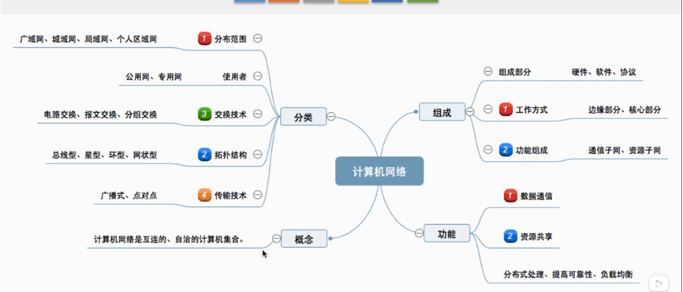
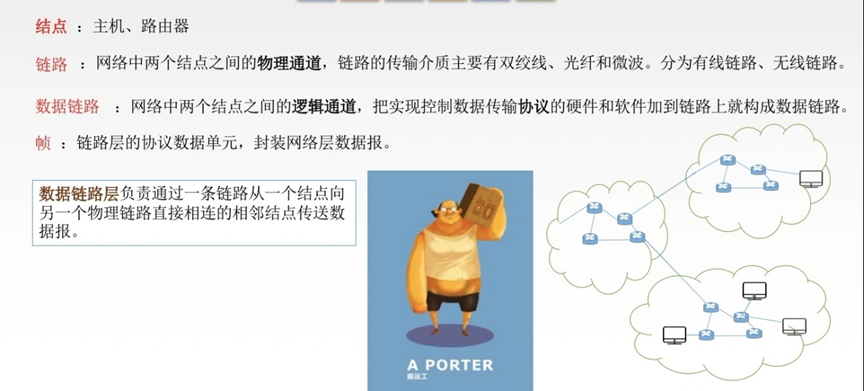
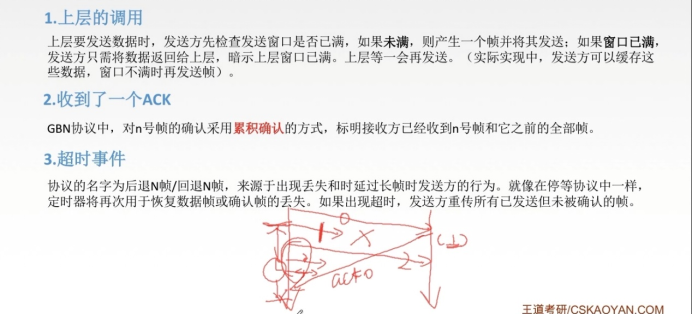
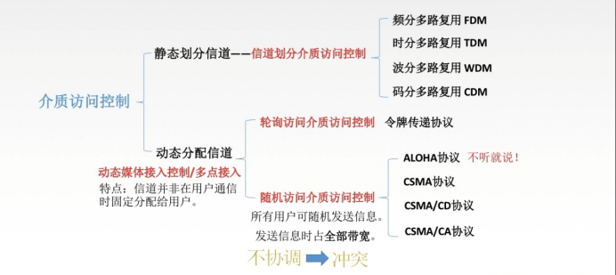
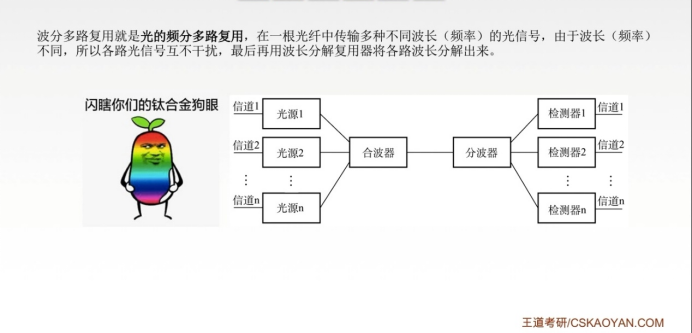
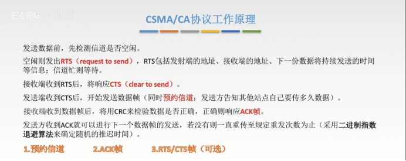
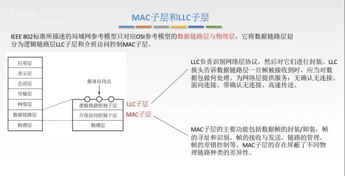
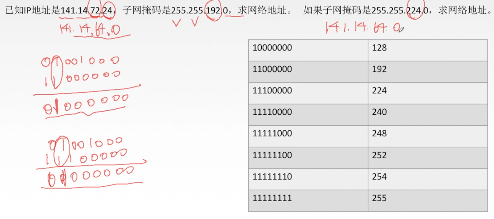

# 计算机网络

## 计算机网络体系结构

### 计算机网络概述

**概念：计算机网络是一个将分散的、 具有独立功能的计算机系统，通过通信设备与线路连接起来，由功能完善的软件实现资源共享和信息传递的系统。**

计算机网络定义：**以传输信息为基本目的，用通信线路和通信设备将多个计算机连接起来的计算机系统集合**

#### 网络的网络

**网络由若干结点和连接这些结点的链路组成，网络还可以由路由器连接起来形成互联网**

网络把许多主机连接在一起而互联网则把许多网络连接在一起

直接连接计算机的网络又叫*物理网络*，互联网络则是物理网络连接起来的*逻辑网络*

*internet*:互联网络，是一个通用名词，泛指多个计算机互联组成的网络

*Internet*:专用名词，指互联网

#### 1.1.1 计算机网络组成

1. 从组成部分上看， 一个完整的计算机网络主要由硬件、 软件、 协议三大部分组成
2. 从工作方式上看， 计算机网络（这里主要指 Internet) 可分为边缘部分和核心部分
3. 从功能组成上看， 计算机网络由通信子网和资源子网组成。

**边缘部分：边缘部分由连接在互联网上的主机组成，是用户直接使用的，又被称为端系统——客户端**

**核心部分：大量网络和连接这些网络的路由器组成，主要职责是为边缘部分提供服务。核心部分的关键部分是路由器。**

#### 1.1.2 计算机网络功能

##### 数据通信

它是计算机网络最基本和最重要的功能，用来实现联网计算机之间的各种信息的传输，并将分散在不同地理位置的计算机联系起来， 进行统一的调配、 控制和管理

##### 资源共享

资源共享可以是软件共享、数据共享，也可以是硬件共享。使计算机网络中的资源互通有无、 分工协作， 从而极大地提高硬件资源、 软件资源和数据资源的利用率。

##### 分布式处理

当计算机网络中的某个计算机系统负荷过重时，可以将其处理的某个复杂任务分配给网络中的其他计算机系统，从而利用空闲计算机资源以提高整个系统的利用率。

##### 提高可靠性

计算机网络中的各台计算机可以通过网络互为替代机，当一台计算机故障也不会造成太大影响

##### 负载均衡

将工作任务均衡地分配给计算机网络中的各台计算机。

#### 1.1.3 计算机网络分类

*还有第六种，根据传输介质分类：有线网络和无线网络*

广播式网络共享广播信道（如总线），通常是局域网的一种通信方式（局域网工作在数据链路层），因此不需要网络层，不存在路由选择问题，但是数据链路层使用物理层的服务必须通过服务访问点实现

####  1.1.4 互联网结构

多层次ISP结构：即用户通过互联网提供商接入互联网

第一层ISP为互联网主干网，并与其他第一层ISP相连

第二层ISP是第一层ISP的用户，覆盖范围较大，多为区域性和国家性，并与少数第一层ISP相连

第三层多为校园网或公司、家庭用网。

**当两个相同层次的ISP彼此直接相连，他们被称为彼此是对等的**

##### 拓扑结构

**拓扑结构主要是指通信子网的拓扑结构**

星形拓扑网络结构的物理链路=节点数-中心结点

##### 计算机网络标准化

因特网的所有标准都以RFC (Request For Comments) 的形式在因特网上发布， 但并非每个

RFC 都是因特网标准， RFC 要上升为因特网的正式标准需经过以下 4 个阶段。

1. 因特网草案 ( Internet Draft )——这个阶段还不是RFC 文档；
2.   建议标准 (Proposed Standard)——从这个阶段开始就成为RFC 文档；
3. 草案标准 ( Draft Standard)——2011年10开始取消该阶段；
4.  因特网标准 ( Internet Standard )。

#### 1.1.5 计算机网络性能指标

##### 带宽

带宽 (Bandwidth)。本来表示通信线路 允许通过的信号频带范围， 单位是赫兹 ( Hz )。而在计算机网络中，带宽表示网络的通信线路所能传送数据的能力，是数字信道所能传送的“最高数据率” 的同义语， 单位是比特／秒 ( b/s)。

##### 时延

时延 ( Delay)。指数据（一个报文或分组）从网络（或链路）的一端传送到另一端所需要的总时间， 它由 4 部分构成： 发送时延、传播时延、处理时延和排队时延。

- 发送时延。结点将分组的所有比特推向（传输）链路所需的时间，即从发送分组的 第一个比特算起，到该分组的最后一个比特发送完毕所需的时间，因此也称传输时延。计算公式为：**发送时延＝分组长度／信道宽度**
- 传播时延。电磁波在信道中传播一定的距离需要花费的时间 ， 即一个比特从链路的一端传播到另一端所需的时间。计算公式为：**传播时延＝信道长度／电磁波在信道上的传播速率**
- 处理时延。数据在交换结点为存储转发而进行的一些必要的处理所花费的时间。例如， 分析分组的首部、从分组中提取数据部分、进行差错检验或查找适当的路由等。
- 排队时延。分组在进入路由器后要先在输入队列中排队等待处理。路由器确定转发 端口后，还要在输出队列中排队等待转发，这就产生了排队时延。

**因此总时延 ＝ 发送时延 ＋ 传播时延 ＋ 处理时延 ＋ 排队时延**

*再做题时，它可能会提示忽略某些时延，因此总时延是要具体讨论的*

##### 时延带宽积

时延带宽积。指发送端发送的第 一个比特即将到达终点时， 发送端已经发出了多少个比特， 因此又称以比特为单位的链路长度， 即**时延带宽积 ＝ 传播时延 x信道带宽。**

##### 往返时延

往返时延 ( Round-TripTime, RTT)。指从发送端发送数据开始， 到发送端收到来自接收端的确认（接收端收到数据后立即发送确认），总共经历的时延。在互联网中，往返时 延还包括各中间结点的处理时延、排队时延及转发数据时的发送时延。

##### 吞吐量

吞吐量 ( Throughput)。指单位时间内通过某个网络（或信道、接口）的数据量。吞吐量受网络带宽或网络额定速率的限制。

##### 速率

速率 ( Speed)。网络中的速率是指连接到计算机网络上的主机在数字信道上传送数据的速率， 也称数据率或比特率， 单位为 bis （比特／秒）（或 bitJs,  有时也写为 bps )。数据率较高时， 可用 kb/s (k = 10节、 Mb/s (M = 106 )  或 Gb/s (G = 10罚 表示。在计算机网络中，通常把最高数据率称为带宽。

##### 信道利用率

信道利用率。指出某一信道有百分之多少的时间是有数据通过的， 即**信道利用率 ＝ 有数据通过时间／（有＋无）数据通过时间。**

#### 1.1.7 网络交换方式

##### 电路交换

**通信双方建立连接(分配通信资源)，然后进行通信(一直占用通信资源)，在通信结束后在释放连接(归还通信资源)**

*缺点：很明显在通信的整个过程，通信的两个用户始终占用端到端的通信资源，造成资源大量浪费；并且线路传输的效率往往很低*

##### 报文交换

通常要被发送的整个数据被称为报文，**报文交换就是将整个报文在附上控制信息等必要信息后，将它发送出去到交换机，交换机通过报文附带的信息，将它发往下一个交换机直到送到主机**

##### 分组交换

在分组交换中，**将报文分成n段等长数据，再给每段数据段加上由必要的控制信息等组成的包头，包头+数据段=分组(Packet),一个分组又被称为一个包。计算机通过通信链路将包发给分组交换机(Packet Switch)，分组交换机在检查它的包头，根据其中的目的地址查找转发表，在合适的接口把包转发出去——该方法被称为存储转发**

*计算机由两类典型的分组交换机：路由器和二层交换机*

##### 三种交换方式的对比

**三种交换方式各有优劣，但是相对而言：电路交换和分组交换应用更广**

分组交换要求吧数据分成大小相当的小数据片，每片都要加上控制信息（如目标地址），因而传送数据的总开销较多。相比于其他交换方式，分组交换信道利用率高。传播时延取决于传播介质及双方的距离。对各种通信方式，不同规格的终端都很难相互通信，因此它不是分组交换的缺点

### 计算机网络体系结构与参考模型

**计算机网络的体系结构就是这个计算机网络机器部件所应完成的功能的精确定义**

#### 1.2.1 计算机网络分层结构

1. 各层之间是独立的——每层都不知道下一层是如何实现，而仅仅需要通过接口知道下一层所能实现的服务就好
2. 灵活性好——各层仅用接口通信，一层出现变化，只要接口不变就不影响
3. 结构上可分裂开——可以采用最合适的技术来实现
4. 易于实现和维护——整个系统被分为一个个子系统
5. 有利于功能复用——下层可以为多个不同的上层提供服务
6. 能促进标准化工作

#### 1.2.2 实体、协议和服务

**实体：任何可以发送或接收信息的硬件或软件进程**——许多情况下是特定的软件模块

不同机器上的同一层称为*对等层*，同一层的实体称为*对等实体*

**协议是控制两个对等实体(或多个实体)进行通信的规则集合**

在协议的控制下，两个对等实体间的通信使得本层能够向上一层提供服务。要实现本层协议，还需要下面一层所提供的服务。

使用本层服务的实体只能看见服务而无法看见下面的协议。下面的协议对上面的实体是透明的。

**协议是水平的，服务是垂直的**

在计算机网络体系结构的各个层次中 ， 每个报文都分为两部分： **一是数据部分， 即 SDU; 二是控制信息部分， 即 PCI, 它们共同组成 PDU**。

服务数据单元 ( SDU )： 为完成用户所要求的功能而应传送的数据。第   n  层的服务数据单元记为 n-SDU。

协议控制信息 ( PCI)： 控制协议操作的信息。第 n 层的协议控制信息记为n-PCI。

协议数据单元( PDU )； 对等层次之间传送的数据单位称为该层的 PDU。第 n 层的协议数据单元记为 n-PDU。在实际的网络中 ， 每层的协议数据单元都有一个通俗的名称， 如*物理层的PDU 称为比特， 链路层的 PDU 称为帧， *网络层的 PDU 称为分组， 传输层的 PDU 称为报文。*

##### 计算机网络体系中的数据封装

**在各层间传输数据时， 把从第 n + I 层收到的 PDU 作为第n 层的 SDU, 加上第 n 层的 PCI, 就变成了第 n 层的 PDU, 交给第 n - I 层后作为 SDU 发送， 接收方接收时做相反的处理， 因此可知三者的关系为 n-SDU + n-PCI = n-PDU = (n - 1)-SDU**

1. 第 n 层的实体不仅要使用第 n - 1 层的服务来实现自身定义的功能， 还要向第n + 1 层提供本层的服务， 该服务是第 n 层及其下面各层提供的服务总和。
2. 最低层只提供服务 ， 是整个层次结构的基础； 中间各层既是下一层的服务使用者， 又是上一层的服务提供者；最高层面向用户提供服务。
3. 上一层只能通过相邻层间的接口使用下一层的服务， 而不能调用其他层的服务； 下一层所提供服务的实现细节对上一层透明。
4. 两台主机通信时， 对等层在逻辑上有一条直接信道， 表现为不经过下层就把信息传送到对方。

#### 1.2.3 计算机网络协议、接口、服务的概念

##### 协议

协议( Network Protocol)， 就是规则的集合。在网络中要做到有条不紊地交换数据， 就必须遵循一些事先约定好的规则。协议是水平的，不对等实体之间是没有协议的。

**协议由语法、语义和同步(时序)三部分组成**。语法规定了传输数据的格式；语义规定了所要完成的功能，即需要发出何种控制信息、完成何种动作及做出何种应答；同步规定了执行各种操作的条件、时序关系等，即事件实现顺序的详细说明。一个完整的协议通常应具有线路管理（建立、释放连接）、差错控制、数据转换等功能。

##### 接口

接口是同一结点内相邻两层间交换信息的连接点 ， 是一个系统内部的规定。*每层只能为紧邻的层次之间定义接口， 不能跨层定义接口。*在典型的接口上， 同一结点相邻两层的实体通过服务访问点 ( Service Access Point, SAP) 进行交互。服务是通过SAP 提供给上层使用的， 第 n 层的SAP 就是第 n + l 层可以访问第 n 层服务的地方。每个SAP 都有一个能够标识它的地址。SAP 是一个抽象的概念， 它实际上是一个逻辑接口（类似千邮政信箱）， 但和通常所说的两个设备之间的硬件接口是很不一样的。

##### 服务

服务是指下层为紧邻的上层提供的功能调用，它是垂直的。对等实体在协议的控制下，使得本层能为上一层提供服务， 但要实现本层协议还需要使用下一层所提供的服务。

上层使用下层所提供的服务时必须与下层交换一些命令， 这些命令在 OSI 中称为服务原语。

OSI 将原语划分为 4 类：

- 请求 ( Request )。由服务用户发往服务提供者， 请求完成某项工作。
- 指示 ( Indication) 。由服务提供者发往服务用户 ， 指示用户做某件事情。
- 响应 ( Response)。由服务用户发往服务提供者， 作为对指示的响应。
- 证实 ( Confirmation) 。由服务提供者发往服务用户 ， 作为对请求的证实。

计算机网络服务可以分类为：

a.   面向连接服务与无连接服务

b.   可靠服务与不可靠服务

c.   有应答服务和无应答服务

#### 1.2.4 计算机网络体系参考模型

##### OSI参考模型

因为OSI模型出来时市场已经被TCP/IP模型占据，并且OSI实现起来很困难，因此仅用于参考和学习

##### TCP/IP模型

**理念：网络核心部分越简单越好**

因为这种沙漏式的协议簇，TCP/IP可以为各式各样的应用提供服务，同时TCP/IP也允许IP在各式各样的网络构成的互联网上运行——也因此发展到全球规模

##### OSI与TCP/IP的区别

##### 综合模型

服务访问点：物理层的SAP是“网卡接口”，数据链路层的SAP是“MAC地址（网卡地址）”，网络层的服务网点是“IP地址（网络地址）”，传输层的SAP是“端口号”，应用层的SAP是“用户界面”。

## 物理层

### 物理层的基本概念

**物理层考虑的是怎样才能在连接各种计算机的传输媒体传输数据比特流，而不是指具体的传输媒体**

**物理层主要定义通信接口标准**

1. 传输媒体类型：规定传输媒体的类型，如铜线、光纤或无线电频等

2. 位的表示：规定如何用电磁等表示“0”或者"1",即如何编码

3. 数据率：规定每秒发送的比特数

4. 位同步：发送发与接收方不仅使用相同的比特率，还必须同步，即双方的时钟要保持一致

5. 链路配置：点对点是专用链路，多点配置是多设备共享一条链路

6. 物理拓扑结构

7. 传输方式：串行还是并行，还要规定传输方向

8. 与传输媒体的接口特性：规定传输媒体与传输介质的接口特性

    

    当在说二进制，具体电压数字和距离时指的是电气特性

    在说高低电平表示什么含义时指的是功能特性

### 数据通信

#### 通信模型

##### 三大部分

1. 源系统：包括信源和发送器
2. 传输系统
3. 目的系统：接收器和接收端

#### 术语解析

#### 通信方式

1. 单工通信：一方只能接受另一方的信息却不能发送
2. 半双工通信：双方都能发送和接收但是不能同时发送
3. 双工通信：双方可以同时发送和接收

#### 传输方式

1. 串行传输:一个比特接着一个比特。发送速度慢，费用低，适合远距离传输

    多为远距离传输

2. 并行传输同时发送多个比特。速度快，费用高，适合短距离传输

    多用于计算机内部信息传输——随处可见的并口接口

#### 码元

码元：指一个固定时长的信号波形，一个码元可以携带多个Bit的信息量，码元的离散状态有几种就是几进制码元，而该时长叫码元宽度——时长即为一个离散状态持续的时间长。

#### 波特、速率、带宽

**波特即码元传输速率=波特数/时间** 

### 香农定理和奈氏准则

#### 术语解析

- 失真：**指信号受到干扰变化，使接收方无法识别** —— 影响因素：1.码元传输速率，2.信号传输距离，3.噪声干扰，4.传输媒体质量
- 信道带宽：信道能通过的最高频率和最低频率之差
- 码间串扰：接收端收到的信号波形失去了码元之间清晰的界限的现象——因为信号频率太快，相互影响可能导致接收时分不清楚

#### 编码与调制

##### 基带信号与宽带信号

(HDMI转接线即使用基带信号)

###### 数据——数字信号(编码)

###### 数据——模拟信号(调制)

##### 编码

###### 数字数据——数字信号

1. 非归零编码(NRZ)：高1低0——编码容易实现但是没有检错也分不清楚开始和结束，因此**收发双方难以保持同步**
2. 归零编码(RZ)：信号电平在每个码元都要归为0
3. 反向归零编码(NRZI)：信号电平反转为0，不变为1
4. 曼彻斯特编码：将一个码元分成两个相等的间隔,前一个间隔为低电平后一个间隔为高电平表示码元1;码元0则正好相反。也可以采用相反的规定。该编码的特点是在每一个码元的中间出现电平跳变，位中间的跳变既作时钟信号（可用于同步),又作数据信号，但它所占的频带宽度是原始的基带宽度的两倍。——**一个码元被调制成两个电平，因此传输速率是调制速率的1/2**
5. 差分曼彻斯特编码：同1异0，常用于局域网传输，其规则是:若码元为1，则前半个码元的电平与上一个码元的后半个码元的电平相同，若为o，则相反。该编码的特点是，在每个码元的中间,都有一次电平的跳转，可以实现自同步，且抗干扰性强于曼彻斯特编码。
6. 4B/5B编码：用5位二进制编码4二进制，效率是80%

###### 模拟数据——数字信号：PCM脉码调制

##### 调制

###### 数字数据——模拟信号

调频：对基带信号解析，为1就有振幅，为0没振幅

调频：0时频率低，1时频率高

调相：将0和1的振幅给改变——正弦余弦区别

###### 模拟数据——模拟信号：将低频调制为高频

#### 奈氏准则

#### 香农定理

##### 信噪比

噪声存在于所有的电子设备和通信信道中。由于噪声随机产生，它的瞬时值有时会很大，因此噪声会使接收端对码元的判决产生错误。但是噪声的影响是相对的，若信号较强，那么噪声影响相对较小。因此，信噪比就很重要。信噪比=信号的平均功率/噪声的平均功率，常记为S/N，并用分贝（dB）作为度量单位
$$
信噪比（dB）=10log~10~(S/N)
$$

##### 香农定理

**香农定理:在带宽受限且有噪声的信道中，为了不产生误差，信息的数据传输速率有上限值。**
$$
信道的极限数据传输速率=Wlog~2~(1+S/N)
$$
*W:带宽（HZ）    S是信道所传信号的平均功率      N是信道内的高斯噪声功率*

1. 信道的带宽或信道中的信噪比越大，则信息的极限传输速率就越高。
2. 对一定的传输带宽和一定的信噪比，信息传输速率的上限就确定了.
3. 只要信息的传输速率低于信道的极限传输速率，就一定能找到某种方法来实现无差错的传输。
4. 香农定理得出的为极限信息传输速率，实际信道能达到的传输速率要比它低不少。
5. 从香农定理可以看出，若信道带宽W或信噪比S/N没有上限(不可能)，那么信道的极限信息传输速率也就没有上限。

#### 奈氏准则和香农定理

##### 奈氏准则的内忧

带宽受限无噪声条件下，为了避免码间串扰，码元传输速率的上限2W Baud。
$$
理想低通信道下的极限数据传输率=2Wlog~2~V
$$
要想提高数据率，就要提高带宽/采用更好的编码技术

##### 香农定理的外患

带宽受限有噪声条件下的信息传输速率。
$$
信道的极限数据传输速率=Wlog~2~(1+S/N)
$$
要想提高数据率，就要提高带宽/信噪比。

**当同时给出信噪比和k进制信号时，将奈氏准则和香农定理的极限速率同时算出，谁小用谁！！！**

### 基带信号与宽带信号

### 编码

#### 数字数据——数字信号

1. 非归零编码

2. 曼彻斯特编码

    将一个码元分成两个相等的间隔，前一个间隔为低电平后一个间隔为高电平表示码元1;码元0则正好相反。也可以采用相反的规定该编码的特点是在每一个码元的中间出现电平跳变，位中间的跳变既作时钟信号(可用于同步)又作数据信号，但它所占的频带宽度是原始的基带宽度的两倍。
    每一个码元都被调成两个电平，所以数据传输速率只有调制速率的1/2。

3. 差分曼彻斯特编码
    **同1异0**
    常用于局域网传输，其规则是:若码元为1，则前半个码元的电平与上一个码元的后半个码元的电平相同，若为0，则相反。该编码的特点是，在每个码元的中间,都有一次电平的跳转，可以实现自同步，且抗干扰性强于曼彻斯特编码

4. 归零编码

5. 反向不归零编码

6. 4B/5B编码

#### 模拟信号——数字信号：PCM脉码调制

计算机内部处理的是二进制数据，处理的都是**数字音频**，所以需要将模拟音频通过采样、量化转换成有限个数字表示的离散序列(即实现音频数字化)
最典型的例子就是对音频信号进行编码的脉码调制(CM)，在计算机应用中，能够达到**最高保真水平的就是PCM编码**，被广泛用于素材保存及音乐欣赏，CD、DVD以及我们常见的 WAV文件中均有应用、它主要包括三步: **抽样、量化、编码。**

##### 抽样

对模拟信号周期性扫描，把时间上连续的信号变成时间上离散的信号。为了使所得的离散信号能无失真地代表被抽样的模拟数据，要使用采样定理进行采样:**f~采样频率~>= 2f~信号最高频率~**

##### 量化

把抽样取得的电平幅值按照一定的分级标度转化为对应的数字值，并取整数，这就把连续的电平幅值转换为离散的数字量。

##### 编码

把量化的结果转换为与之对应的二进制编码。

### 调制

三种：调幅、调频和调相

#### 数字数据——模拟信号

数字数据调制技术在发送端将数字信号转换为模拟信号，而在接收端将模拟信号还原为数字信号，分别对应于调制解调器的调制和解调过程。

**调幅+调相(QAM**)：某通信链路的波特率是1200Baud，采用4个相位，每个相位有4种振幅的QAM调制技术，则该链路的信息传输速率是多少?

2^4^=16种Baud
log~2~16=4bit/Baud
1200*4=4800bit/s

#### 模拟数据——模拟信号

**将低频调制到高频**

### 物理层传输介质

传输介质也称传输媒体/传输媒介，它就是数据传输系统中在发送设备和接收设备之间的物理通路。
**传输媒体并不是物理层**。传输媒体在物理层的下面，因为物理层是体系结构的第一层，因此有时称传输媒体为0层。在传输媒体中传输的是信号，但传输媒体并不知道所传输的信号代表什么意思。
但物理层规定了电气特性，因此能够识别所传送的比特流。

#### 导向传输介质——双绞线

#### 导向传输介质——同轴电缆

#### 导向传输介质——光纤

特点：

1. 传输损耗小，中继距离长，对远距离传输特别经济
2. 抗雷电和电磁干扰性能好
3. 无串音干扰，保密性好，也不容易被窃听或截取数据
5. 体积小，重量轻

#### 非导向传输

#### 中继器——再生数字信号

#### 集线器——多口中继器

### 总结

#### 物理设备作用

1. 放大器:用于远距离的传输模拟信号，也会放大噪声，引起失真；
2. 中继器：用于数字信号传输，工作原理是信号再生，减少了失真；
3. 网桥：连接两个网段以扩展物理网络的覆盖范围，隔离冲突域，优于集线器
4. 交换机：扩大网络器材——多端口网桥
5. 路由器：网络层的连接设备，可实现不同网络的连接

## 数据链路层

### 介绍

#### 基本概念

#### 功能概述

数据链路层在物理层提供服务的基础上*向网络层提供服务*，其**最基本的服务是将源自网络层来的数据可靠地传输到相邻节点的目标机网络层**。其**主要作用是加强物理层传输原始比特流的功能，将物理层提供的可能出错的物理连接改造成为逻辑上无差错的数据链路**，使之对网络层表现为一条无差错的链路

#### 组帧

**封装成帧**就是在一段数据的前后部分添加首部和尾部，这样就构成了一个帧。接收端在收到物理层上交的比特流后，就能根据首部和尾部

的标记，从收到的比特流中识别帧的开始和结束。

首部和尾部包含许多的控制信息，他们的一个重要作用: **帧定界**(确定帧的界限)。

**帧同步**:接收方应当能从接收到的二进制比特流中区分出帧的起始和终止。

组帧的四种方法:

1. 字符计数法

    

2. 字符(节)填充法

    

3. 零比特填充法

    

4. 违规编码法

    

#### 透明传输

透明传输：指不管所传输的数据是什么样的比特组合，都应当能够在链路上传送。

因此，当传输数据中的比特组合恰好与某一个控制信息完全相同时，就必须采取适当的措施，使接收方不会将它当做控制信息，这样才能保证数据链路层的传输是透明的。

### 差错控制

#### 差错由来及解决方法

**全局性** 

由于线路本身电气特性所产生的随机噪声(热噪声)，是信道固有的，随机存在的。
*解决办法:提高信噪比来减少或避免干扰。(对传感器下手)*
**局部性** 

外界特定的短暂原因所造成的冲击噪声，是产生差错的主要原因。
*解决办法:通常利用编码技术来解决。*

链路层为网络层提供服务:
*通信质量差的无线传输链路——有确认无连接服务，有确认面向连接服务*
*通信质量好，有线传输链路——无确认无连接服务*

数据链路层编码和物理层的数据编码与调制不同。**物理层编码针对的是单个比特，解决传输过程中比特的同步等问题**，如曼彻斯特编码。而**数据链路层的编码针对的是一组比特**，它通过冗余码的技术实现一组二进制比特串在传输过程是否出现了差错。

**冗余编码**：在数据发送之前，先按某种关系附加上一定的冗余位，构成一个符合某一规则的码字后再发送。当要发送的有效数据变化时，相应的冗余位也随之变化，使码字遵从不变的规则。接收端根据收到码字是否仍符合原规则，从而判断是否出错。

#### 比特错——检错编码：奇偶校验码

**奇偶校验码特点:只能检查出奇数个比特错误，检错能力为50%。**

#### 比特错——检错编码：循环冗余码CRC

1. 把收到的每一个帧都除以同样的除数，然后检查得到的余数R
    - 余数为0，判定这个帧没有差错，接受
    - 余数为不为0，判定这个帧有差错 (无法确定到位)，丢弃

2. FCS的生成以及接收端CRC检验都是由硬件实现，处理很迅速，因此不会延误数据的传输。

#### 比特错——纠错编码：海明码

两个合法编码(码字)的对应比特取值不同的比特数称为这两个码字的海明距离(码距)，一个有效编码集中,任意两个合法编码(码字)的海明距离的最小值称为该编码集的海明距离(码距).

**发现双比特错，纠正单比特错**

#####  工作流程

 要检测n位：码距需要为n+1

要纠错n位：码距需要为2n+1

海明不等式——确定校验码位数：
$$
2^r>=m+r+1
$$
m：数据位数；r：校验码位数——满足不等式的最小值

1. 确定校验码位数:2^r=k+r+1

    

2. 确定校验码位置：2的n次方位置

    

3. 求出校验码的值：使用异或运算——同0异1

    

### 流量控制

1. 可靠传输：发送端发送的，接收端都会接收
2. 数据链路层的流量控制：

3. 流量控制的方法：

 

4. 三种协议的窗口大小：

 

#### 停止-等待协议：

 

##### 有差错情况（无差错很容易理解）：

 

##### 性能分析：

优点：简单      

缺点：信道利用率太低！

#### 信道利用率

 

#### GBN协议(Go Back N),即后退N帧协议

(1).发送窗口：发送方维持一组连续的允许发送的帧的序号

接收窗口：接收方维持一组连续的允许被接收帧的序号

(2).滑动窗口：

采用n比特对帧编号，发送窗口尺寸W_T应满足：1<=W_T<=(2^n)-1,因为尺寸太大，接收方会无法区别新帧和旧帧

##### 性能：

优：因为连续发送数据帧而提高了信道利用率；

劣：重传时重传丢失和被丢弃的数据帧，传送效率低

发送方必须响应的三件事

 

接收方要做的事

 

##### GBN运行

 

##### GBN协议重点

I.累计确认(双工通信中，偶尔会随着接收方发给发送方的数据一起过来)

II.接收方只按顺序接收帧，不按序就丢弃

III.确认序号最大的、按序到达的帧

IV.发送窗口最大为(2^n)-1,接收窗口大小为1。

####  选择重传协议(SR Selective Repeat):

SR发送方必须响应的三件事：

 

接收方要做的事

 

运行中的SR

 

滑动窗口的长度

 

##### SR协议重点

I.对数据帧逐一确认，收一个确认一个

II.只重传出错帧

III.接收方有缓存，当缓存满足顺序后在上传给网络层

IV．传输窗口上限=接收窗口上限=2^(n-1)

####  注意

注1：为了保证信道利用率最大，帧的长度给出范围时，应取最小值计算

注2：ARQ协议中，发送窗口大小<=窗口总数-1

注3：设发送窗口为[L, U], 发送窗口大小的初始值为w, 发送窗口的大小应该大于等于0, 但小于等于W, 所以有0<=U—L+l<=W。 因此L>=(U-W+ l)mod2^k

注4：在选择重传协议中，需要满足：发送窗口大小＋接收窗口大小<=2^n, 接收窗口大小不应超过发送窗口大小，因此接收窗口大小不应超过序号范围的一半，即<=(2^n)-1

### 信道划分与介质访问控制

数据传输使用的两种链路

 

 

介质访问控制

 

信道划分介质访问控制

#### 静态划分信道

##### 频分多路复用FDM

 

##### 时分多路复用TDM

 

信道利用率低

##### 统计时分复用STDM

 

##### 波的频分多路复用WDM

光的频分多路复用！

##### 码分多路复用CMD

 

#### 动态分配信道

##### 轮询访问介质访问控制

 

###### 轮询协议

主节点轮流邀请从属节点发送数据

问题： 1.轮询开销；2.等待延迟；3.单点故障

###### 令牌传递协议

 

 

##### 随机访问介质访问控制

所有用户可随机发送信息，发送信息时占全部带宽

###### ALOHA协议

- 纯ALOHA协议比时隙ALOHA协议吞吐量更低，失效更低；
- 纯ALOHA协议想发就发，时隙ALOHA只有在时间片段开始时才能发
- 纯ALOHA协议信道利用率为0.184，时隙ALOHA信道利用率为0.368

###### CSMA协议

###### CSMA-CD协议——碰撞检测(collision detection)

 

 

 

###### CSMA-CA协议——碰撞避免(collision avoidance）

 

**二进制指数退避算法：考虑了负载对冲突的影响**

###### CD与CA异同

 

### 网络基础概念

 

 

其中以总线型较为优秀！

无线局域网传输介质：电磁波

 

#### 局域网分类

 

##### IEEE802标准

 

##### MAC子层和LLC子层

 

#### 以太网(IEEE802.3)

     

1. 以太网拓扑结构：逻辑上总线型，物理上星型；

2. 以太网只负责无差错接收，是不可靠传输

曼彻斯特编码

 

适配器

 

网络适配器包括MAC地址，每个适配器（网卡）MAC地址唯一

以太网的MAC帧

 

类型：传输时的协议；以太网规定传输的最小帧为64B

*了解：

 

 

#### 无线局域网（802.11）

1.802.11中WDS的MAC帧的格式：

 

RA:接收端的基站MAC地址（无线接入点） TA:发送端的基站MAC地址

DA:目标主机的MAC地址  	 SA:发送主机的MAC地址

\3. 无线局域网分类：

I. 有固定基础设施的无线局域网

 

II.无固定基础设施的无线局域网的自组织网络

 

####  广域网：

注：局域网只覆盖链路层和物理层，采用逻辑上总线型的多点接入技术；广域网覆盖网络层，链路层和物理层，并且是点对点，相互连接的全双工或者半双工模式。广域网强调资源共享，局域网强调数据传输。广域网传输速率高于局域网，但距离远，因此时延长。

##### 广域网：

 

##### PPP协议

PPP协议：点对点协议，只支持全双工（面向字节）；

PPP无需满足的：纠错，流量控制，序号，不支持多点线路

######  PPP需要满足的

 

###### PPP协议三个组成部分：

###### PPP协议状态图

 

###### PPP的帧格式

 

附加：

##### HDLC的帧格式

##### PPP&HDLC

不纠错只检测错误，通过CRC循环冗余码检测错误

 

**HDLC协议更加可靠，但是链路层和网络层不去实现可靠传输，可靠传输由传输层（TCP协议）负责**

##  网络层

网际协议——即IP协议，与其配套使用的还有如下三个协议：

**地址解析协议**（Address Resolution Protocol,**ARP**）

互联网控制报文协议（Internet Control Message Protocol,**ICMP**）

互联网组管理协议（Internet Group Management Protocol,**IGMP**）

**物理层——转发器（Repeater）**

**数据链路层——网桥或桥接器（Bridge）**

**网络层——路由器（Router）**

**网络层以上——网关（Gateway）**

### IP

#### 数据报格式

*协议*：6为TCP,17为UDP

*标识*:同一数据报的分片使用同一标识。
*标志*:只有2位有意义 x__

中间位DF(Don't Fragment):

DF=1，禁止分片

DF=0，允许分片

最低位MF(More Fragment):

MF=1，后面“还有分片”

MF=0，代表最后一片/没分片

*片偏移*:指出较长分组分片后，某片在原分组中的相对位置。以8B位单位——除了最后一个分片，每个分片长度一定是8B的整数倍。

总长度单位是1B；片偏移单位是8B；首部长度单位是4B

### IP地址

#### 分类的IP地址

#### 子网划分和子网掩码

把原来由网络号+主机号构成的IP地址给变成网络号+子网号+主机号的IP地址

##### 子网掩码

子网掩码（subnet mask），它用来指明一个IP地址的哪些位标识的是主机所在的子网，以及哪些位标识的是主机的位掩码

#### 无分类编制CIDR

1. 消除了传统的A类，B类和C类地址以及划分子网的概念
2. 融合子网地址与网码，方便网分。

CIDR记法:IP地址后加上“/”，然后写上网络前缀(可以任意长度)的位数。
e.g.128.14.32.0/20
**使用CIDR时，查找路由表可能得到几个匹配结果，应选择具有最长网络前缀的路由。前缀越长，地址块越小，路由越具体**

#### 构成超网

将多个子网聚合成一个较大的子网，叫做构成超网，或路由聚合。

方法:将网络前缀缩短(所有网络地址取交集)

网络地址转换NAT (NetworkAddress Translation): 在专用网连接到因特网的路由器上安装NAT软件，安装了NAT软件的路由器叫NAT路由器，它至少有一个有效的外部全球IP地址

### ARP

ARP高速缓存会存储局域网内部的IP地址和MAC地址映射，完成主机或路由器IP地址到MAC地址的映射

过程：检查ARP高速缓存，有对应表项则写入MAC帧，没有则用目的MAC地址为FF-FF-FF-FF-FF-FF的帧封装并广播ARP请求分组，同一局域网中所有主机都能收到该请求。目的主机收到请求后就会向源主机单播一个ARP响应分组，源主机收到后将此映射写入ARP缓存 (10-20min更新一次)。

总结：**网络中数据的通信还是需要MAC地址**

当需要使用的MAC地址不知道时，就会使用ARP协议，广播请求分组

单播ARP响应

### 路由

**路由的功能是转发和路由选择**

数据平面执行的主要功能是根据转发表进行转发，这是路由器的本地动作

#### 控制平面

##### 传统方法

路由选择算法运行在每台路由器中，并且在每台路由器中都包含转发和路由选择两种功能

路由选择处理器执行控制平面功能。在传统的路由器中，它执行路由选择协议，维护路由选择表于关联链路状态信息，并为该路由器计算转发表

##### SDN

控制平面从路由器物理上分离。路由器仅实现转发，远程控制器计算和分发转发表以供每台路由器所使用。

在SDN路由器中，路由选择处理器负责于远程控制器通信，目的是接收远程控制器计算的转发表项

#### 路由算法

静态路由算法——手动配置好路由信息：简单可靠，但是路由更新慢，不适用于大型网络

自治系统AS:在单一的技术管理下的一组路由器，而这些路由器使用一种AS内部的路由选择协议和共同的度量以确定分组在该AS内的路由，同时还使用一种AS之间的路由协议以确定在AS之间的路由。

一个AS内的所有网络都属于一个行政单位来管辖，一个自治系统的所有路由器在本自治系统内都必须连通

内部网关协议IGP——一个AS内部使用，包含OSPF和RIP;外部网关协议EGP——AS之间使用,包含BGP

##### OSPF——链路状态路由算法

所有路由器掌握完整的网络拓扑和链路费用信息。

##### RIP—— 距离向量路由算法

路由器只掌握物理相连的邻居及链路费用。

路由器转发分组的算法:
1.提取目的IP地址
2.是否直接交付
3.特定主机路由
4.检测路由表中有无路径
5.默认路由 0.0.0.0

## 公式

### 时延

- 发送时延＝分组长度／信道宽度
- 传播时延＝信道长度／电磁波在信道上的传播速率
- 总时延 ＝ 发送时延 ＋ 传播时延 ＋ 处理时延 ＋ 排队时延
- 时延带宽积 ＝ 传播时延 x信道带宽
- 信道利用率 ＝ 有数据通过时间／（有＋无）数据通过时间

### 信道速率

- 波特即码元传输速率=波特数/时间   单位：baud——码元/秒
- 信息传输速率=比特数/时间  单位：bit/s
- 频率(HZ)=每秒震荡的次数

#### 练习题

### 海明码

海明不等式：
$$
2^r>=m+r+1
$$
m：数据位数；r：校验码位数——满足不等式的最小值

## 例题

### 物理层

1. 例题一

2. 例题二

    

    
