# JVM

## 第一章 JVM初识

### JVM——跨语言的平台

虚拟机(virtual Machine)，就是一台虚拟的计算机。它是一款软件，用来执行一系列虚拟计算机指令。大体上，虚拟机可以分为系统虚拟机和程序虚拟机。


### JVM的位置

#### 位置

**在操作系统之上的软件**


### HotStop及对象

#### 对象分配空间的方式

1. 假设Java堆中内存是绝对规整的，所有被使用过的内存都被放在边，空闲的内存被放在另一边，中间放着一个指针作为分界点的指示器，那所分配内存就仅仅是把指针向空闲空间方向挪动一段与对象大小相等的距离，这种分配方式称为“指针碰撞”(Bump ThePointer)。

2. 但如果Java堆中的内存并不是规整的，虚拟机就必须维护一个列表，记录上哪些内存块是可用的，在分配的时候从列表中找到一块足够大的空间划分给对象实例，并更新列表上的记录，这种分配方式称为“空闲列表”(Free List)。

选择哪种分配方式由Java堆是否规整决定，而Java堆是否规整又由所采用内垃圾收集器是否带有空间压缩整理 (Compact) 的能力决定。因此，当使用Serial、PaiNew等带压缩咨理过程的收集器时，系统采用的分配算法是指针碰撞，既简单又高效: 而当使用CMS这种基于清除(Sweep) 算法的收集器时，理论上就只能采用较为复杂的空闲列表来分配内存。

#### 对象创建频繁，并发时的线程安全

1. 对分配内存空间的动作进行同步处理一一实际上虚拟机是采用CAS配上失败重试的方式保证更新操作的原子性
2. 把内存分配的动作按照线程划分在不同的空间之中进行，即每人线程在Java堆中预先分配一小块内存，称为本地线程分配缓冲 (ThreadLocal AllocationBuffer，TLAB)，哪个线程要分配内存，就在哪个线程的本地缓冲区中分配，只有本地缓冲区用完了，分配新的缓存区时才需要同步锁定。虚拟机是否使用TLAB，可以通过```-XX: +/-UserTLAB```参数来设定。

内存分配完成之后，虚拟机必须将分配到的内存空间(但不包括对象头) 都初始化为零值，如果使用了TLAB的话，这一项工作也可以提前至TLAB分配时顺便进行。

### Java代码执行流程

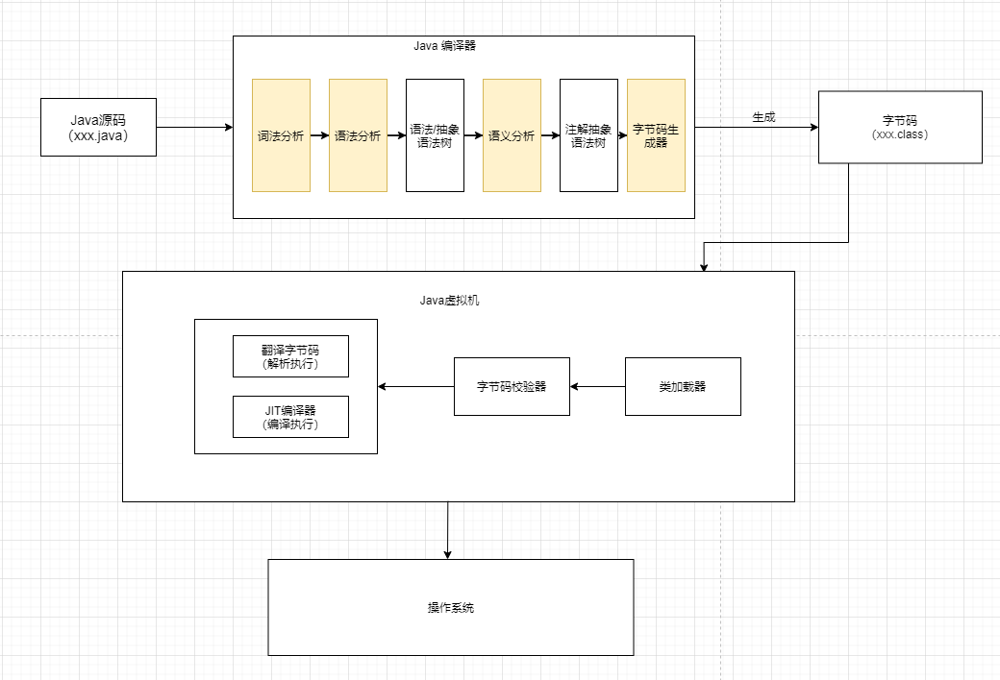

### JVM的架构模型

Java编译器输入的指令流基本上是一种基于**栈的指令集架构**，另一种架构是基于 **寄存器的指令集架构 **

*栈:跨平台性、指令集小、指令多;执行性能比寄存器差*


### JVM的生命周期

1. 虚拟机的启动

    > Java虚拟机的启动时通过引导类加载器（Bootstrap Class Loader）创建一个初始类（initial Class ）来实现的。这个类是由虚拟机的具体实现指定的

2. 虚拟机的执行

    > 一个运行中的Java虚拟机有着一个清晰的任务：执行Java程序
    >
    > 程序开始执行时他才运行，程序结束的时候他就停止
    >
    > **执行一个所谓的Java程序的时候，真真正正执行的是一个Java虚拟机的进程**

    

3. 虚拟机的退出

    > 程序的正常执行结束
    >
    > 程序在执行过程中遇到了异常或错误而异常终止
    >
    > 由于操作系统出现错误而导致Java虚拟机进程终止
    >
    > 某线程调用Runtime类或者System类的exit方法，或者Runtime类的halt方法，并且Java安全管理起页允许这次exit或者halt操作
    >
    > 除此之外，JNI（Java Native Interface）规范描述了用JNI Invocation API 来加载或卸载Java虚拟机时候，Java虚拟机退出的情况

### JVM发展史

#### jdk1.3 - Sun - HotSpot VM

- 至今也在使用

#### BEA  - JRockit  VM - 2008 被甲骨文收购

- 不包含解析器实现 全部代码使用即时编译器实现 
- 是世界上最快的虚拟机


#### IBM - J9

- 最有影响力的三大商用虚拟机之一


### Graal VM


### HotSpot VM


**解释器**和**JIT编译器**同时存在——这里的编译器和代码部分的编译器不同，这里的是将字节码文件编译成机器指令

JIT编译器的核心功能是**寻找热点代码**


## 第二章 类加载子系统

### JVM结构

简略图


详细图


### 类加载器和类的加载过程

#### 类加载器子系统的作用


- 类加载器子系统负责从文件系统或者网络中加载class文件，class文件在文件开头有特定的文件标识——```CA FE BA BE```
- classLoader只负责class文件的加载，至于它是否可以运行，则由Execution Engine决定。
- 加载的类信息存放于一块称为方法区的内存空间。除了类的信息外，方法区中还会存放运行时常量池信息，可能还包括字符串字面量和数字常量(这部分常量信息是Class文件中常量池部分的内存映射)

#### 类加载器ClassLoader角色


- class file 存在本地磁盘上，可以理解为设计师画在图纸上的模板，而最终这个模板在执行的时候是要加载到JVM当中来根据这个文件实例化出n个一摸一样的实例
- class file 加载到JVM中，被称为DNA元数据模板，放在方法区
- 在 .class 文件 -> JVM -> 最终称为元数据模板，此过程就要一个运输工具（类装载器Class Loader）扮演一个快递员的角色

#### 类的加载过程


##### 加载阶段

1. 通过一个类的全限定名获取定义此类的二进制字节流

2. 将这个字节流所代表的静态存储结构转化为方法区的运行时数据结构

3. 在堆内存中生成一个代表这个类的java.lanq.class对象，作为方法区这个类的各种数据的访问入口

##### 链接阶段

###### 验证(Verify)

- 目的在于确保class文件的字节流中包含信息符合当前虚拟机要求，保证被加载类的正确性,不会危害虚拟机自身安全。
- 主要包括四种验证，文件格式验证，元数据验证，字节码验证，符号引用验证。

###### 准备(Prepare)

- 为类变量分配内存并且设置该类变量的默认初始值，即零值
- 这里不包含用final修饰的static，因为fina1在编译的时候就会分配了，准备阶段会显式初始化
- 这里不会为实例变量分配初始化，类变量会分配在方法区中，而实例变量是会随着对象一起分配到Java堆中。

###### 解析(Resolve)

- 将常量池内的符号引用转换为直接引用的过程。
- 事实上，解析操作往往会伴随着JVM在执行完初始化之后再执行。
- 符号引用就是一组符号来描述所引用的目标。符号引用的字面量形式明确定义在《java虚拟机规范》的class文件格式中。直接引用就是直接指向目标的指针、相对偏移量或一个间接定位到目标的句柄。
- 解析动作主要针对类或接口、字段、类方法、接口方法、方法类型等。对应常量池中的CONSTANT_Class_info、CONSTANT_Fieldref_info、CONSTANT_Methodref_info等

##### 初始化

- 初始化阶段就是执行类构造器方法<clinit>()的过程
- 此方法不需要定义，是Javac编译器自动收集类中所有的类变量的赋值动作和静态代码块中的语句合并而来——没有类变量就没有该方法
- 构造器方法中指令按语句再源文件中出现的顺序执行
- <clinit>()不同于类的构造器。（关联：构造器是虚拟机视角下的<init>()）
- 若该类有父类，JVM会保证子类的<clinit>()执行之前，父类的<clinit>()已经执行完毕
- 虚拟机必须保证一个类的<clinit>() 方法在多线程下被同步加锁


如下代码：

在Linking的prepare阶段，就已经将static的num和age初始化，所以可以在static代码块中对齐在声明之前赋值——结果的10是因为同时static修饰，执行顺序按照声明顺序来

```java
public class LinkingTest {
    private static int num = 1;
    static {
        num = 2;
        age = 20;
        System.out.println(num);//2
        System.out.println(age);//报错，可以赋值但是不能调用
    }
    private static int age = 10;

    public static void main(String[] args) {
        System.out.println(num);//2
        System.out.println(age);//10
    }
}
```

#### 类加载器的分类

- JVM支持两种类型的类加载器，分别为**引导类加载器 (Bootstrap Class Loader)** 和**自定义类加载器 (User-Defined Class Loader)**
- 从概念上来讲，自定义类加载器一般指的是程序中由开发人员自定义的一类类加载器，但是Java虚拟机规范却没有这么定义，而是**将所有派生于抽象类classLoader的类加载器都划分为自定义类加载器**。
- 无论类加载器的类型如何划分，在程序中我们最常见的类加载器始终只有3个，如下所示:


```java
public class ClassLoaderTest {
    public static void main(String[] args) {
        // 获取系统类加载器
        ClassLoader systemClassLoader = ClassLoader.getSystemClassLoader();
        // sun.misc.Launcher$AppClassLoader@18b4aac2
        System.out.println(systemClassLoader);
        // 获取其上层：拓展类加载器
        ClassLoader parent = systemClassLoader.getParent();
        // sun.misc.Launcher$ExtClassLoader@1540e19d
        System.out.println(parent);
        // 获取顶层加载器 BootStrapClassLoader 获取不到 因为C/C++写的
        ClassLoader parent1 = parent.getParent();
        // null
        System.out.println(parent1);

        // 对于用户来说 默认使用的是系统类加载器
        ClassLoader classLoader = ClassLoaderTest.class.getClassLoader();
        // sun.misc.Launcher$AppClassLoader@18b4aac2
        System.out.println(classLoader);
        // sun.misc.Launcher$ExtClassLoader@1540e19d
        ClassLoader parent2 = classLoader.getParent();
        System.out.println(parent2);
        // 在上层
        // null
        ClassLoader parent3 = parent2.getParent();
        System.out.println(parent3);

        // Java的核心类库都是使用引导类加载的
        // String 类是使用引导类加载器加载的
        ClassLoader classLoader1 = String.class.getClassLoader();
        System.out.println(classLoader1);
    }
}

```

##### 虚拟机自带的类加载器

###### 启动类加载器（引导类加载器 Bootstrap ClassLoader）

- 这个类加载使用C/C++语言实现的，嵌套在JVM内部
- 它用来加载Java的核心库（JAVA_HOME/jre/lib/rt.jar、resources.jar或者sun.boot.class.path路径下的内容），用于提供JVM自身需要的类
- 并不继承自java.lang.ClassLoader ，没有父加载器
- 加载拓展类和应用程序类加载器，并指定为他们的父加载器
- 处于安全考虑，Bootstrap启动类只加载包名为 java、javax、sun等开头的类

###### 拓展类加载器 （Extension ClassLoader）

- Java语言编写，由 sun.misc.Launcher$ExtClassLoader 实现
- 派生于ClassLoader类
- 父类加载器为启动类加载器
- 从java.ext.dirs系统属性所指定的目录中加载类库，或者从JDK的安装目录jre/lib/ext子目录（拓展目录）下加载类库。如果用户创建的Jar放在此目录下，也会自带由拓展类加载器加载。

###### 应用程序类加载器（系统类加载器 AppClassLoader）

- Java语言编写，由 sun.misc.Launcher$AppClassLoader实现
- 派生于ClassLoader类
- 父类加载器为拓展类加载器
- 它负责加载的是环境变量classpath或者系统属性 java.class.path 指定路径下的类库
- **该类加载时程序中默认的类加载器**，一般来说，Java应用程序都是由它来完成加载
- 通过ClassLoader#getSystemClassLoader()方法可以获取到该类加载器

##### 自定义类加载器

###### 为什么要自定义类加载器?

1. 隔离加载类
2. 修改类加载的方式
3. 扩展加载源
4. 防止源码泄漏 

###### 用户自定义类加载器实现步骤

1. 开发人员可以通过继承抽象类 java.lang.ClassLoader类的方法，实现自己的类加载器，以满足一些特殊的要求
2. 自定义类加载逻辑写在findClass()方法中
3. 在编写自定义类加载器的时候，如果没有太过于复杂的有要求，可以直接继承URLClassLaoder类，这样可以避免自己编写findClass() 方法以及器获取字节码流的方式，使得自定义类加载器编写更加简洁

```java
public class CustomClassLoader extends ClassLoader {
    @Override
    protected Class<?> findClass(String name) throws ClassNotFoundException {

        try {
            byte[] result = getClassFromCustomPath(name);
            if(result == null){
                throw new FileNotFoundException();
            }else{
                return defineClass(name,result,0,result.length);
            }
        } catch (FileNotFoundException e) {
            e.printStackTrace();
        }

        throw new ClassNotFoundException(name);
    }

    private byte[] getClassFromCustomPath(String name){
        //从自定义路径中加载指定类:细节略
        //如果指定路径的字节码文件进行了加密，则需要在此方法中进行解密操作。
        return null;
    }

    public static void main(String[] args) {
        CustomClassLoader customClassLoader = new CustomClassLoader();
        try {
            Class<?> clazz = Class.forName("One",true,customClassLoader);
            Object obj = clazz.newInstance();
            System.out.println(obj.getClass().getClassLoader());
        } catch (Exception e) {
            e.printStackTrace();
        }
    }
}
```

#### 获取ClassLoader的途径

1. 获取当前类的ClassLoader 

    clazz.getClassLoader()

2. 获取当前线程上下文的ClassLoader

    hread.currentThread().getContextClassLoader()

3. 获取系统的ClassLoader

    ClassLoader.getSystemClassLoader()

4. 获取调用者的ClassLoader

    DriverManager.getCallerClassLoader

### 双亲委派机制

Java虚拟机对class文件采用的是**按需加载**的方式，也就是说当需要使用该类的时候才会将它的class文件加载到内存生成class对象。而且加载某个类的class文件的时候，Java虚拟机采用的是 **双亲委派机制** ，也就是把请求交给父类处理，它是一种任务委派机制

#### 工作原理

1. 如果一个类加载器收到了类加载的请求，它并不会自己先去加载，而是把这个请求委托给父类的加载器去执行
2. 如果父类加载器还存在器父类加载器，则进一步向上委托，一次递归请求最终到达顶层的启动类加载器
3. 如果父类加载器可以完成类加载任务，就成功返回，如果父类加载器无法完成此任务，子加载器才会尝试自己去加载，这就是双亲委派机制


#### 沙箱安全机制

自定义String类，但是在加载自定义String类的时候会率先使用引导类加载器加载，而引导类加载器在加载的过程中会先加载JDK自带的文件(rt.jar包中的java\lang\String.class)，报错信息是没有main方法，就是因为加载的是 rt.jar 包中的String类。这样就可以保证对Java核心源代码的保护，这就是**沙箱安全机制**


### 其他

在JVM中表示两个class对象是否为同一个类存在两个必要条件:

1. 类的完整类名必须一致，包括包名。
2. 加载这个类的classLoader(指ClassLoader实例对象)必须相同

这两个条件缺一不可。

JVM必须知道一个类型是由启动加载器加载的还是由用户类加载器加载的。如果一个类型是由用户类加载器加载的，那么**JVM会将这个类加载器的一个引用作为类型信息的一部分保存在方法区中**。当解析一个类型到另一个类型的引用的时候，JVM需要保证这两个类型的类加载器是相同的。

### 类的主动使用和被动使用

#### 主动使用的七种情况

1. 创建类的实例

2. 访问某个类的或者接口的静态变量，或者对该静态变量赋值

3. 调用类的静态方法

4. 反射(Class.forName("xxx.xxx.xxx"))

5. 初始化一个类的子类

6. Java虚拟机启动的时候被标记为启动类的类

7. Java7开始支持动态的语言支持

    java.lang.invoke.MethodHandle 实例的解析结果

    REF_getStatic、REF_putStatic、REF_invokeStatic对应的类没有初始化，则初始化

除了以上的七种情况，其他使用Java类的方式都被看作是对**类的被动使用**，都**不会导致类的初始化**

## 第三章 运行时数据区

**一个java程序对应一个进程，一个进程对应一个JVM实例，一个JVM实例中只有一个运行时数据区，一个运行时数据区只有一个堆空间和非堆空间(方法区)，一个进程中的多个线程共享一个堆和方法区，每个线程拥有自己独立的本地方法栈、虚拟机栈和程序计数器**

### 认识RunTime Data Area


#### 程序计数器（Program Counter Register）

##### 概念

程序计数器（Program Counter Register）是一块较小的内存空间，它可以看作是当前线程所执行的字节码的行号指示器。在Java虚拟机的概念模型里，字节码解释器工作时就是通过改变这个计数器的值来选取下一条需要执行的字节码指令，它是程序控制流的指示器，分支、循环、跳转、异常处理、线程恢复等基础功能都需要依赖这个计数器来完成。

由于Java虚拟机的多线程是通过线程轮流切换、分配处理器执行时间的方式来实现的，在任何确定的时刻，一个处理器 (对于多核处理器来说是一个内核) 都只会执行一条线程中的指令。因此，为了线程切换后能恢复到正确的执行位置，每条线程都需要有一个独立的程序计数器，各条线程之间计数器互不影响，独立存储，我们称这类内存区域为“线程私有”的内存。

##### 特殊

如果线程正在执行的是一个Java方法，这个计数器记录的是正在执行的虚拟机字节码指令的地

如果正在执行的是本地 (Native) 方法，这个计数器值则应为空 (Undefined) 。

#### Java虚拟机栈 (Java VitualMachine Stack)

##### 概念

Java虚拟机栈 (Java VitualMachine Stack)也是线程私有的，它的生命周期与线程相同。虚拟机栈描述的是Java方法执行的线程内存模型:每个方法被执行的时候，Java虚拟机都会同步创建一个栈帧[1] (Stack Frame) 用于存储

- 局部变量表——*局部变量表存放了编译期可知的各种Java虚拟机基本数据类型 (boolean、byte、char、short、int、float、long、double) 、对象引用(reference类型，它并不等同于对象本身，可能是一个指向对象起始地址的引用指针，也可能是指向一个代表对象的句柄或者其他与此对象相关的位置) 和returnAddress类型(指向了一条字节码指令的地址)*，**局部变量表所需的内存空间在编译期间完成分配，当进入一个方法时，这个方法需要在栈帧中分配多大的局部变量空间是完全确定的，在方法运行期间不会改变局部变量表的大小**
- 操作数栈
- 动态连接
- 方法出口等信息。

每一个方法被调用直至执行完毕的过程，就对应着一个栈帧在虚拟机栈中从入栈到出栈的过程

##### 特殊

如果线程请求的栈深度大于虚拟机所允许的深度，将抛出StackOverflowError异常；

如果Java虚拟机栈容量可以动态扩展，当栈扩展时无法申请到足够的内存会抛出OutOfMemoryError异常。

#### 本地方法栈 (Native Method Stacks)

##### 概念

本地方法栈 (Native Method Stacks) 与虚拟机栈所发挥的作用是非常相似的，其区别只是虚拟机栈为虚拟机执行Java方法(也就是字节码) 服务，而本地方法栈则是为虚拟机使用到的本地(Native)方法服务——本地方法是使用其他编程语言（如 C、C++）编写的方法，通过 Java 的本地接口（JNI）调用到虚拟机中执行。本地方法栈的作用是为本地方法的调用和执行提供支持，它和虚拟机栈在功能上非常相似

##### 特殊

本地方法栈也会在栈深度溢出或者栈扩展失败时分别抛出StackOverflowError和OutOfMemoryError异常。

#### 堆 (Heap)

##### 概念

堆 (Heap)是虚拟机所管理的内存中最大的一块。Java堆是被所有线程共享的一块内存区域，在虚拟机启动时创建。**此内存区域的唯一目的就是存放对象实例**。Java堆是**垃圾收集器管理的内存区域**，因此一些资料中它也被称作*“GC堆”(Garbage Collected Heap)*.如果从分配内存的角度看，所有线程共享的Java堆中可以划分出多个线程私有的分配缓冲区(Thread Local Allocation Buer，TLAB)，以提升对象分配时的效率。Java堆可以处于物理上不连续的内存空间中，但在逻辑上它应该被视为连续的——但对于大对象(典型的如数组对象)，多数虚拟机实现出于实现简单、存储高效的考虑，很可能会要求连续的内存空间。Java堆既可以被实现成固定大小的，也可以是可扩展的，不过当前主流的Java虚拟机都是按照可打展来实现的(通过参数-Xmx和-Xms设定)。

##### 特殊

如果在Java堆中没有内存完成实例分配，并且堆也无法再扩展时，Java虚拟机将会抛出OutOfMemoryError异常。

#### 方法区 (Method Area)

##### 概念

方法区 (Method Area) 与Java堆一样，是各个线程共享的内存区域，它用于存储已被虚拟机加载

的类型信息、常量、静态变量、即时编译器编译后的代码缓存等数据。*虽然《Java虚拟机规范》中把*

*方法区描述为堆的一个**逻辑部分，但是它却有一个别名叫作“非堆”(Non-Heap)**，目的是与Java堆区*

*分开来。*

方法区除了和Java堆一样不需要连续的内存和可以选择固定大小或者可扩展外，甚至还可以选择不实现垃圾收集。相对而言，垃圾收集行为在这个区域的确是比较少出现的——这区域的内存回收目标主要是针对常量池的回收和对类型的卸载

##### 特殊

如果方法区无法满足新的内存分配需求时，将抛出OutOfMemoryError异常。

##### 运行时常量池(Runtime Constant Pool)

运行时常量池(Runtime Constant Pool)是方法区的一部分。Class文件中除了有类的版本、字段、方法、接口等描述信息外，还有一项信息是常量池表(Constant Pool Table) ，用于存放编译期生成的各种字面量与符号引用，这部分内容将在类加载后存放到方法区的运行时常量池中。

#### 直接内存 (Direct Memoy)

直接内存 (Direct Memoy) 并不是虚拟机运行时数据区的一部分，但是这部分内存也被频繁地使用，而且也可能导致OutOfMemoryError异常出现——*只受制于总内存的大小*

NIO (New Input/Output) 类，引入了一种基于通道 (Channel) 与缓冲区(Buffer)的IO方式，它可以使用Native函数库直接分配堆外内存，然后通过一个存储在Java堆里面的DirectByteBuffer对象作为这块内存的引用进行操作——避免了在Java堆和Native堆中来回复制制数据。

### RunTime Data Area概述


#### 线程共享

1. Java虚拟机定义了若干种程序运行期间会使用到的运行时数据区，其中有一下会随着虚拟机的启动而创建，岁着虚拟机的销毁而销毁。

2. 另外一些则是与线程一一对应的，这些与线程对应的数据区域会随着线程开始和结束而创建和销毁

3. **灰色的是单独线程私有的，红色的是多个线程共享的**

    每个线程：独立包括程序计数器、栈、本地栈

    线程间共享：堆、堆外内存（永久代或者元空间、代码缓存）


**每个java应用程序都有一个RunTime实例对象**

### 线程

- 线程是一个程序里面的运行单元。JVM允许一个应用有多个线程并行执行
- 在HotSpot JVM 里，**每个线程都与操作系统的本地线程直接映射**——真正执行的其实是操作系统的本地线程
    - 当一个Java线程准备好执行以后，此时一个操作系统的本地线程也同时创建，Java线程执行结束之后，本地线程也会回收
- 操作系统负责所有线程的安排调度到任何一个可用的CPU上，一旦本地线程初始化成功，它就会调用Java线程中的run()方法
- **守护线程、普通线程**

#### JVM系统线程

主要的后台系统线程在Hotspot JVM 主要是以下几个

1. **虚拟机线程：** 这种线程的操作是需要JVM达到安全点才会出现，这些操作必须在不同的线程种发生的原因是他们都需要JVM达到安全点，这样堆才不会变化，这种线程的执行类型包括 "stop-the-world"的垃圾收集器，线程栈收集，线程挂起以及偏向锁撤销
2. **周期任务线程：**这种线程是时间周期事件的体现（比如中断），他们一般用于周期性操作的任务调度
3. **GC线程：**这种线程对在JVM里面不同种类的垃圾收集行为提供了支持
4. **编译线程：**这种线程会在运行时将字节码编译到本地代码
5. **信号调度线程：**这种线程接受信号并发送给JVM，在它内部通过调用适当的方法进行处理。

 

## 第四章 程序计数器(PC寄存器)


**JVM中的所谓PC寄存器，是对CPU中的物理寄存器的一种抽象模拟**


### 作用

**PC寄存器用来存储指向下一条指令的地址,也即将要执行的指令代码。由执行引擎读取下一条指令。**

### 介绍

1. 它是一块很小的内存空间，几乎可以忽略不计，也是运行速度最快的存储区域
2. 在JVM规范中，每个线程都有它自己的程序计数器，是线程私有的，生命周期与线程的生命周期保持一致
3. 任何时间一个线程都只有一个方法在执行，也就是所谓的**当前方法**，程序计数器会存储当前线程执行Java方法的JVM指令地址，或者，如果是在执行native方法，则是为指定值（underfed）
4. 它是程序控制流的指示器、分支、循环、跳转、异常处理、线程恢复等基础功能都需要依赖这个计数器来完成。
5. 字节码解释器工作的时候就是通过改变这个计数器的值来选取下一条需要执行的字节码指令
6. *它是唯一的一个在Java虚拟机规范中没有规定任何OutOfMemoryError的区域，并且也没有GC垃圾回收机制*——因为他就是指向下一个地址，不断被替换

举例

```java
public class PCRegisterTest {
    public static void main(String[] args) {
        int i = 10;
        int j = 12;
        int k = i + j;
        String s = "abs";
        System.out.println(k);
        System.out.println(s);
    }
}
```

```java
 public static void main(java.lang.String[]);
descriptor: ([Ljava/lang/String;)
              flags: ACC_PUBLIC, ACC_STATIC
              Code:
              stack=2, locals=5, args_size=1
              0: bipush        10
              2: istore_1
              3: bipush        12
              5: istore_2
              6: iload_1
              7: iload_2
              8: iadd
              9: istore_3
              10: ldc           #2                  // String abs
              12: astore        4
              14: getstatic     #3                  // Field java/lang/System.out:Ljava/io/PrintStream;
              17: iload_3
              18: invokevirtual #4                  // Method java/io/PrintStream.println:(I)V
              21: getstatic     #3                  // Field java/lang/System.out:Ljava/io/PrintStream;
              24: aload         4
              26: invokevirtual #5                  // Method java/io/PrintStream.println:(Ljava/lang/String;)V
              29: return
```


### 两个常见问题

- 使用PC寄存器存储字节码指令地址有什么用呢？
- 为什么使用PC寄存器记录当前线程的执行地址呢？

> 因为CPU需要不停的切换各个线程，这时候切换回来以后，就得知道接着从哪开始继续执行
>
> JVM的字节码解释器就是需要通过改变PC寄存器的值来明确下一条具体应该执行那条字节码指令

- PC寄存器为什么设定为线程私有的？

> 我们都知道所谓的多线程在一个特定的时间段只会执行其中的某一个线程的方法，CPU会不停的做任务切换，这样就必然会导致经常中断和恢复，如何保证分毫无差呢？**为了能够准确记录各个线程正在执行的当前字节码指令的地址，最好的办法就是为每一个线程都分配一个PC寄存器**，这样以来各个线程之间就可以独立计算，从而不会出现相互干扰的情况
>
> 由于CPU时间片轮转限制，众多线程在并发执行的过程中，任何一个确定的时刻，一个处理器或者多核处理器中的一个内核，只会执行某个线程中的一条指令


## 第五章 虚拟机栈

### 概述

#### 内存中的栈和堆

- **栈是运行时的单位，而堆是存储的单位**
- 即：栈是解决程序的运行问题，即程序如何执行，或者说如何处理数据。堆解决的问题是数据存储的问题。即数据怎么放，放在哪儿

#### Java虚拟机栈

> - Java虚拟机栈(Java Virtual Machine Stack)，早期也叫Java栈。每个线程在创建时都会创建一个虚拟机栈，其内部保存一个个的栈帧(Stack Erame)，对应着一次次的Java方法调用——**一个栈帧对应一个方法**
> - 是线程私有的

##### 生命周期

生命周期和线程一致。

##### 作用

主管Java程序的运行，它保存方法的局部变量(8种基本数据类型、对象的引用地址)、部分结果，并参与方法的调用和返回

- 局部变量 vs成员变量(或属性)
- 基本数据变量 vs 引用类型变量(类、数组、接口)

#### 栈的优点

- 栈式一种快速有效的分配存储的方式，访问速度仅次于程序计数器
- JVM直接对Java栈的操作只有2个
    - 每个方法执行，伴随着进栈（入栈、出栈）
    - 执行结束后的出栈工作
- 对于栈来说不存在垃圾回收问题
    - 无GC  ——只有进栈出栈操作，不需要垃圾回收
    - 有OOM——栈扩展时无法申请到足够的内存会抛出OutOfMemoryError异常

#### 栈中可能出现的异常

Java虚拟机规范允许**Java栈的大小式动态的或者是固定不变的**

- 如果采用固定大小的Java虚拟机栈，那每一个线程的Java虚拟机栈容量可以在线程创建的时候独立选定，如果请求超过虚拟机栈的最大容量，Java虚拟机将会抛出 **StackOverflowError** 异常
- 如果Java虚拟机栈可以动态扩展，并且在尝试扩展的时候无法申请到足够的内存，或者在创建新的线程的时候，没有足够的内存去创建虚拟机栈。那么Java虚拟机将会抛出 **OutOfMemoryError** 异常

```java
// StackOverflowError
public class InvokeSelf {
    public static void main(String[] args) {
        main(args);
    }
}
```

#### 设置栈内存的大小

> 栈内存大小：-Xss 以字节为单位 ，单位是可以调节的

### 栈的存储单位

#### 栈中存储什么

1. 每个线程都有自己的栈，栈中的数据都是以**栈帧（Stack Frame）**的格式存在
2. 在这个线程上正在执行的每个方法都各自对应一个栈帧（Stack Frame）
3. 栈帧式一个内存区块，是一个数据集，维系着方法执行过程中的各种数据信息

#### 栈运行的原理

1. JVM直接对Java栈的操作只有两个，就是对栈帧的 **压栈** 和 **出栈**，**遵循 先进后出/后进先出 原则**
2. 在一条活动的线程中，一个时间点上，只会有一个活动的栈帧。即只有当前正在执行的方法的栈帧（栈顶栈帧）是有效的，这个栈帧被称为 **当前栈帧 （Current  Frame）**，与当前栈帧相对应的方法就是**当前方法（Current Method）**，定义这个方法的类就是 **当前类（Current Class）**
3. 执行引擎运行所有的字节码指令只针对当前栈帧进行操作
4. 如果在该方法中调用了其他方法，对应的新的栈帧会被创建出来，放在栈的顶端，成为新的当前栈帧
5. 不同的线程中所包含的栈帧是不允许存在相互引用的，即不可能在一个栈帧之中引用另外一个线程的栈帧
6. 如果当前方法调用了其他的方法，方法返回之际，当前栈帧会传回次方法的执行结果给前一个栈帧，接着虚拟机会丢弃当前的栈帧，使得前一个栈帧重新成为当前栈帧
7. Java方法有两种返回函数的方式，**一种是正常的函数返回，使用return指令，另外一种是抛出异常，不管使用那种方式，都会导致栈帧被弹出**


```java
/**
 * @author zhuxuanyu
 */
public class StackFrame {
    public static void main(String[] args) {
        System.out.println("InvokeSelf.main 开始执行...");
        method1();
        System.out.println("InvokeSelf.main 执行结束...");
    }

    public static void method1() {
        method2();
        System.out.println("InvokeSelf.method1");
    }

    public static void method2() {
        method3();
        System.out.println("InvokeSelf.method2");
    }


    public static void method3() {
        method4();
        System.out.println("InvokeSelf.method3");
    }


    public static void method4() {
        System.out.println("InvokeSelf.method4");
    }
}
```

结果：

```java
InvokeSelf.main 开始执行...
InvokeSelf.method4
InvokeSelf.method3
InvokeSelf.method2
InvokeSelf.method1
InvokeSelf.main 执行结束...
```

#### 栈帧内部结构

1. **局部变量表 (Local Variables）**
2. **操作数栈 (operand stack)  (或表达式栈)**
3. 动态链接(Dynamic Linking) (或指向运行时常量池的方法引用)
4. 方法返回地址(Return Address) (或方法正常退出或者异常退出的定义)
5. 一些附加信息


### 局部变量表

#### 概念

1. 局部变量表也被称为局部变量数组或本地变量表
2. **定义一个数字数组，主要用于存储方法参数和定义在方法体内的局部变量，**这些数据类型包括各类型的基本数据类型、对象引用（reference），以及returnAddress类型
3. 由于局部变量表是建立在线程的栈上，是线程的私有数据。因此**不存在数据不安全的问题**
4. **局部变量表所需的容量大小是编译器确定下来的**，并保存在方法的Code属性的maximum local variables数据数据项中，在方法运行期间是不会改变局部变量表的大小的
5. **方法嵌套调用的次数由栈的大小决定，**一般来说，**栈越大，方法嵌套调用次数越多。**而对一个函数而言，它的参数和局部变量越多，使得局部变量表膨胀，它的栈帧就越大，一满足方法调用所需传递的信息增加的需求。进而函数调用就会占用更多的栈空间，而导致其嵌套调用的次数就会减少
6. **局部变量表中的变量只在当前方法中调用有效**，在方法执行的时候，虚拟机通过使用局部变量表完成参数值到参数列表的传递过程。**当方法调用结束的时候，随着方法栈帧的销毁，局部变量表也会随之销毁。**

```java
public class LocalVariables {
    private int count  = 0;
    public static void main(String[] args) {
        LocalVariables localVariables = new LocalVariables();
        int num = 10;
        localVariables.test();
    }

    public  void test(){
        System.out.println("hello world!");
    }
}
```


其中：

- **长度-起始PC=作用域长度**
- **起始PC+长度=Code Length**

#### Solt

1. 参数值的存放总是在局部变量数组的index0开始，到数组长度 -1 的索引结束

2. 局部变量表。最基本的存储单元是Slot（变量槽）

3. 局部变量表中存放编译器可知的各种基本数据类型（8种），引用类型（reference），returnAdderss类型的变量

4. 在局部变量表种。**32位以内的类型只占用一个Slot（包括returnAddress类型）——引用类型也是32位，64位的类型（long和double）占用2个Slot**

    byte、short、char在存储之前被转换为int，boolean也被转为int，0代表false，非0代表true

    long和double则占据两个Slot

5. JVM会为局部变量表中的每一个Solt都分配一个访问索引，通过这个索引即可成功访问到局部变量表中指定的局部变量值

6. 当一个实例方法被调用的时候，它的方法参数和方法体内部定义的局部变量将会 **按照顺序被复制** 到局部变量表中的每一个Slot上

7. **如果需要访问局部变量表中的一个64bit的局部变量只值的时候，只需要使用前一个索引即可**，（比如：访问long和double类型的变量）

8. 如果当前帧是由构造方法或者实例方法创建的，那么 **该对象引用this将会存放在index为0的Slot处**，其余的参数按照参数表顺序继续排列

    现在我们就可解释为什么静态方法中无法使用this调用

    因为this变量不存在与当前方法的局部变量表中


##### Slot的重复利用

**栈帧中的局部变量表中的槽位是可以重用的，**如果一个局部变量过了其作用域，那么在其他作用域只会申明的新的局部变量就很有可能会复用过期局部变量的槽位，从而**达到节省资源的目的**

可以注意到，下图中*b和c的index是相同的*


#### 变量

1. 变量按照数据类型分类：基本数据类型、引用数据类型

2. 变量按照在类中的位置分类：

    成员变量：在使用的时候是有默认初始化值

    ​	被static修饰的：类变量 - linking的prepare阶段 - 给类变量默认赋值 -> initial ，给类变量显示赋值  （静态代码块中）

    ​	没有被static修饰的：实例变量 - 随着对象的创建，会在堆空间进行分配实例变量空间，并进行默认赋值

    局部变量：没有默认初始化值，在使用之前必须初始化

#### 补充

- 在栈帧中，与性能调优关系最密切的就是前面提到的局部变量表，在方法执行时，虚拟机使用局部变量表完成方法的传递。
- **局部变量表中的变量也是重要的垃圾回收根节点，只要被局部变量表中直接或者间接引用的对象都不会被回收**


### 操作数栈(Operand Stack)

#### 概念

> 栈可以使用**数组**和链表来实现——操作数栈是使用数组实现，因此在编译时操作数栈的大小就被确定了

- 每一个独立的栈帧中除了包含局部变量表意外，还包含一个 **后进先出**（Last-In-First-Out）的操作数栈。也可以称之为**表达式栈**，（Expression Stack）
- **操作数栈，在方法执行的过程中，根据字节码指令，往栈中写入数据或者提取数据，即入栈（push）/出栈（pop）**
    - 某些字节码指令将值压入操作数栈，其余的字节码指令将操作数取出栈，使用它们后再把结果压入栈
    - 比如：执行复制、交换、求和等操作


- **如果被调用的方法带有返回值的话，其返回值将会被压入当前栈帧的操作数栈中，**并更新PC寄存器的下一条需要执行的字节码指令
- 操作数栈中元素的数据类型必须与字节码指令的序列严格匹配，这由编译器再编译期间进行验证，同时在类加载中的类检验阶段的数据流分析阶段要再次验证
- 我们说的Java虚拟机的**解释引擎时基于栈的执行引擎**，其中的栈指的就是操作数栈
- 操作数栈，**主要用来保存计算过程中的中间结果，同时作为计算过程中变量的临时存储空间**
- 操作数栈就是JVM执行引擎的一个工作区，当一个方法刚开始执行的时候，一个新栈帧也随之被创建出来，**这个方法的操作数栈时空的**
- 每一个操作数栈都会拥有一个明确的栈深度用于存储数值，其所需的最大深度在编译器就定义好了，保存在方法的Code属性中，为max_stack的值
- 栈中的任何一个元素都可以是任意的Java数据类型
    - 32bit的类型占用一个栈单位深度
    - 62bit的类型占用两个栈单位深度
- 操作数栈 **并发采用访问索引的方式来进行数据访问的**，而是只能通过标准的入栈（push）和出栈（pop）操作来完成一次数据访问

#### 代码

##### Operand

```java
public class test {
    public static void main(String[] args) {
        int  i = 15;
        int  j = 8;
        int k = i + j;
    }
}
```

```java
public void testAddOperation();
    descriptor: ()V
    flags: ACC_PUBLIC
    Code:
	  // 栈的最大深度为2 局部变量表大小为4 其中非静态方法还有个this在index=0的位置
      stack=2, locals=4, args_size=1
         0: bipush        15
         2: istore_1
         3: bipush        8
         5: istore_2
         6: iload_1
         7: iload_2
         8: iadd
         9: istore_3
        10: return
      LineNumberTable:
        line 16: 0
        line 17: 3
        line 18: 6
        line 19: 10
      LocalVariableTable: 
        Start  Length  Slot  Name   Signature
            0      11     0  this   Lcn/icanci/jvm/jmm/JvmStackTest;
            3       8     1     i   B
            6       5     2     j   I
           10       1     3     k   I
}
SourceFile: "JvmStackTest.java"
```

##### 方法返回值

```java
    public int getSum(){
        int i = 10;
        int j = 20;
        int  k = i + j;
        return k;
    }

    public  void getSumTest(){
        //获取上一个栈帧操作的结果，并保存在当前栈帧中
        int sum = getSum();
        int k = 10;
    }
```

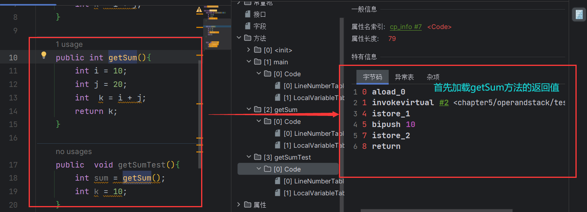

### 栈顶缓存技术

前面提到过，基于栈式架构的虚拟机所使用的零地址指令更加紧凑，但是完成一项操作的时候必然需要使用更多的入栈的出栈指令，这同时也就意味着需要将更多的指令分派（instruction dispatch）次数和内存读/写次数

由于操作数是存在内存中的，因此频繁的执行内存读/写操作必然会影响执行速度。为了解决这个问题，Hotspot JVM的设计者们提供了栈顶缓存技术（ToS, Top-of-Stack Caching）**将栈顶元素全部缓存在物理的CPU的寄存器中，以此降低对内存的读/写次数，提升执行引擎的执行效率——基于局部性原理**

### 动态链接

#### 概念


- 每一个栈帧内部都包含一个指向 **运行时常量池** **该栈帧所属方法的引用**，包含这个引用的目的即使为了支持当前方法的代码能够实现 **动态链接（Dynamic Linking） ** 比如：involvedynamic指令
- 在Java源文件被编译到字节码文件的时候，所有的变量和方法引用都作为符号引用）（Symbolic Reference）保存在class文件的常量池中。比如：描述一个方法调用了另外的其他方法的时候。就是通过常量池中指向方法的符号引用来表示的，那么 **动态链接的作用就是将这些符号引用转换为调用方法的直接引用**


**为什么需要常量池呢？**

- 为了提供一些符号和常量，便于指令的识别。

### 方法的调用：解析与分派

#### 链接方式

在JVM中，将符号引用转换为调用方法的直接引用与方法的绑定机制相关

- **静态链接**
    - 当一个字节码文件被装载到JVM内部的时候，如果被调用的 **目标方法在编译器可知**，且在运行期保持不变时，这种情况下将调用方法的符号引用转换为直接引用的过程叫做静态链接
- **动态链接**
    - 如果 **被调用的方法在编译期间无法被确定下来**，也就是说，只能够在程序运行期将调用方法的符号引用转换为直接引用，由于这种引用转换过程具备动态性，因此也就称之为动态链接。

#### 绑定机制

对应的方法绑定机制为：早期绑定（Early Binding）和晚期绑定（Late Binding） **绑定一个字段、方法或者类在符号引用替换为直接引用的过程，仅仅发生一次**

- **早期绑定**
    - 早期绑定就是指被调用的 **目标方法如果在编译期间可知，且运行期保持不变时**，即可将这个方法与所属的类型进行绑定，这样一来，由于明确了被调用的目标方法究竟是哪一个，因此可以使用静态链接的方式将符号引用转为直接引用
- **晚期绑定**
    - **如果被调用的方法在编译期无法被确定下来，只能够在程序运行期间根据实际的类型绑定相关的方法**，这种绑定叫做晚期绑定。
- 随着高级语言的横空出世，类似Java一样的基于面向对象的编程语言如今越来越多，尽管这类编程语言在语法风格上存在一定的差别，但是彼此之间始终保持一个共性，那就是都支持封装、继承、多态等面向对象的特征，既然**这一类的编程语言具备多态特性，那么自然也就具备早期绑定和晚期绑定两种绑定方式**
- Java中任意一个普通方法都具备虚函数的特征，如果某个方法不想用于虚函数的特征的时候，可以使用final关键字来标记

#### 虚方法与非虚方法

- 非虚方法
    - 如果方法在编译期就确定了具体的调用版本，这个版本在运行时候是不可变的，这样的方法叫做**非虚方法**
    - 静态方法、私有方法、final方法、实例构造器、父类方法都是非虚方法
- 虚方法  
    - 除了非虚方法都是虚方法

##### 虚拟机中提供的方法调用的指令

- 普通调用指令
    - **invokestatic：调用静态方法，解析阶段确定唯一方法版本**
    - **invokespecial：调用<init>方法、私有以及父类方法、解析阶段确定唯一方法版本**
    - invokevirtual：调用所有的虚方法
    - invokeinterface：调用接口方法
- 动态调用指令
    - invokedynamic：动态解析出需要调用的方法，然后执行
- 前四条指令固化在虚拟机内部，方法的执行调用不可人为干涉，而invokedynamic指令则支持用户确定方法版本，其中 **invokestatic指令和invokespecial指令调用的方法称为非虚方法。其余的（final修饰的除外）称为虚方法**

#####  关于involvedynamic指令

- JVM字节码指令集一直比较稳定，一直到Java7中才增加了一个invokedynamic指令，这是**Java为了实现[动态类型语言]支持而做的一种表达方式**
- 但是在Java7中并没有提供直接生成involvedynamic指令的方法，需要借助ASM这种底层字节码工具来生成involvedynamic指令。**直到Java8的Lambda表达式的出现，involvedynamic指令才有了直接的生成方式**
- Java7中增加的动态语言类型支持的本质是对Java虚拟机规范的修改，而不是对Java语言规则的修改，这里比较复杂，最直接的受益者就是运行在Java平台的动态语言的编译器。 

#### 动态类型语言和静态类型语言

- 动态类型语言的静态类型语言的区别就是对类型的检查是在编译期还是在运行期，满足前者就是静态类型语言，满足后者就是动态类型语言。
- **静态类型语言就是判断变量自身的类型信息；动态类型语言是判断变量值的信息，变量没有类型信息，变量值才有类型信息**

#### 方法重写的本质

- 找到操作数栈顶的第一个元素随执行的对象的实际类型，记作 C
- 如果在类型 C 中找到与常量中的描述符合简单名称都相符的方法，则进行访问权限校验，如果通过则返回这个方法的直接引用，查找过程结束；如果不通过，就返回 java.lang.IllegalAccessError异常
- 否则，按照继承关系从下往上一依此对 C 的各个父类进行第2步的搜索和验证过程
- 如果始终没有找到，就抛出java.lang.AbstractMethodError异常
- java.lang.IllegalAccessError异常
    - 程序试图访问一个属性或者调用一个方法的时候，这个属性或者方法没有权限进行访问。

#### 虚方法表

- 在面向对象的编程中，会很繁琐的使用到动态分派，如果每次动态分派多的过程中都要重新在类的方法元数据中搜索合适的目标的话，就可能影响到执行效率。因此，**为了提高性能**，JVM采用在类的方法区建立一个虚方法表**（virtual method table）（非虚方法不会出现在表中）来实现，使用索引表来代替查找**
- 每个类都有一个虚方法表，表中存放着各个方法的实际入口
- 虚方法表在什么时候会被创建？
    - 在类加载的链接阶段被创建并开始初始化，类的变量初始值准备完成之后，JVM会把该类的方法表  也初始化完毕


### 方法返回地址

- 存放着调用该方法的PC寄存器的值
- 一个方法的结束，有两种方式
    - 正常处理完成
    - 出现未处理的异常，非正常退出
- 无论通过那种方式退出，在方法退出后都返回到该方法被调用的位置，方法正常退出的时候，**调用者的PC寄存器的值作为返回地址，即调用该方法的指令的下一条指令的地址**。而通过异常退出的，返回的地址是要通过异常表来确定，栈帧中一般不会保持这部分的信息。 
- 本质上，方法的退出即使当前栈帧出栈的过程。此时，需要恢复上层方法的局部变量表、操作数栈、讲返回值压入调用者栈帧的操作数栈、设置PC寄存器值等，让调用者方法继续执行下去
- **正常完成出口和异常完成出口的区别在于：通过异常出口完成退出的不会给它的上层调用者产生任何的返回值**

- 当一个方法开始执行之后，只有两种方式可以退出这个方法
    - 执行引擎遇到任何一个方法返回的字节码指令（return），会有返回值传递给上层的方法调用者，简称 **正常完成出口**
- 一个方法在正常调用完成之后究竟需要使用哪一个返回指令还需要根据方法返回值的实际数据类型而定
- 在字节码指令中，返回指令包含 ireturn （返回值是boolean、byte、char、short和int类型时使用），lreturn、freturn、dreturn、areturn，另外还有一个return指令共声明void方法、实例化初始方法、类和接口的初始方法使用

- 在方法执行的过程中遇到了异常（Exception），并且这个异常没有在方法内进行处理，也就是只要在本地方法异常表没有搜索到匹配的异常处理器，就会导致方法退出，检查 **异常完成出口**
- 方法执行过程中抛出异常时的异常处理，存储在一个异常处理表。方便在发生异常的时候找到处理异常的代码

### 其他

#### 一些附加信息

- 栈帧中还允许携带与Java虚拟机实现相关的一些附加信息，例如：对程序调试支持的信息

## 第六章 本地方法接口


### 什么是本地方法

1. 简单的来讲，**一个Native Method就是一个Java调用非Java代码的接口**，一个Native Method是这样的一个Java方法：该方法的实现由非Java语言实现。比如C。这个特征并发Java所持有，其他编程语言也有，如C++，可以使用extern "c" 告知C++编译器去调用以一个C的函数
2. 在定义一个native method时候，并不提供实现体（有些像定义一个Java Interface）因为其实现体是由非Java语言在外面实现的
3. 本地接口的作用是融合不同的编程语言为Java所用，他的出现时融合C/C++程序
4. 有native标识的就是本地方法，标识符native可以与所有其它的java标识符连用，但是abstract除外

### 为什么需要使用Native Method

1. Java使用起来非常方便，然而有些层次的任务用Java实现起来不容易，或者我们对程序的效率很在意
2. **与Java环境外交互**
    - **有时候Java应该需要与Java外部的环境交互，这是本地方法存在的主要原因**
    - 你可以想象Java需要与一些底层操作系统，如操作系统或因某些硬件交换信息时的情况。本地方法就是这种交流机制：为我们提供了一个非常简洁的接口，而且我们无需去了解Java应用之外的繁琐的细节。

3. **与操作系统交互**
    - JVM支持者Java语言本身和运行时库，它是Java程序赖以生存得平台，它由一个解释器（解释字节码）和一些链接到本地代码的撸组成。然而不管怎样，它毕竟不是一个完整的系统，它经常依赖于一些底层系统的支持。这些底层系统常常是强大的操作系统。**通过使用本地方法，我们得以用Java实现了jre的与底层系统的交互，甚至JVM的一部分就是使用C写的**，还有，如果我们要使用一些Java语言本身没有提供封装的操作系统的特性的时候，我们也需要使用本地方法
4. Sun's Java
    - **Sun的解释器使用C实现的，这使得它能像一些普通的C一样与外界交互，**jre大部分是用Java实现的，它也通过一些本地方法与外界交互。例如：类java.lang.Thread 的setPriority()方法使用Java实现的，但是调用的是 setPriority0(),这个是本地方法 ，C实现的，被植入JVM内部。在Windows95平台上，这个本地方法最终将调用Win32 SetPriority() API 。这本地方法具体实现是JVM直接提供，更多的情况是本地方法由外部的动态链接库（External dynamic link library）提供，然后被JVM调用

### 现状

- **目前该方法使用的越来越少了，除非是与硬件相关的应应用**，比如通过Java程序驱动打印机或者Java系统管理生产设备，在企业级应用很少见。

## 第七章 本地方法栈

注：这是HotSpot虚拟机的构造，有的JVM可能不需要本地方法栈


#### 本地方法栈 （Native Method Stack）

- **Java虚拟机用于管理Java方法的调用，而本地方法栈用户管理本地方法的调用**
- 本地方法栈，也是线程私有的
- 允许被实现固定或者是可拓展的内存大小（在内存溢出方面是相同的）
    - 如果线程请求分配的栈容量超过本地方法栈的最大容量，Java虚拟机竟会抛出一个 StackOverflowError异常
    - 如果本地方法可以动态拓展，那么在拓展到无法申请到足够的内存的时候或者在创建新的线程没有足够的内存的时候，就会抛出 OutOfMemaryError异常
    - 本地方法是使用C语言实现的
    - 它的具体做法是Native Method Stack 中登记  native 方法。在Execution Engine 执行的时候加载本地方法库

#### 本地方法的执行流程

- **当某个线程调用一个本地方法的时候，然就进入了以恶个全新的并且不再受虚拟机限制的世界，他和虚拟机由相同的权限**
- **并不是所有的JVM都支持本地方法，因为Java虚拟机规范并没有明确要求本地方法栈的使用语言、具体实现方式、数据结构等**，如果JVM产品不打算支持native方法，也可以无需实现本地方法栈
- 在Hotspot JVM中 直接将本地方法栈和虚拟机栈合二为一

## 第八章 堆

### 概述

1. 每个**进程**拥有一个**JVM实例**

2. 一个JVM实例只存在一个堆内存，堆也是Java内存管理的核心区域

3. Java堆区在JVM启动的时候即被创建，其空间大小也就确定了，是JVM管理的最大的一块内存空间

    - *堆内存的大小是可以调节的*

4. 《Java虚拟机规范》规定，堆可以处于物理上不连续的内存空间中，但是在*逻辑上他应该是连续的*

5. 所有的线程共享Java堆，在这里还可以划分为线程私有缓冲区（Thread Local Allocation Buffer ，TLAB)——为了应对多线程

6. 《Java虚拟机规范》中对Java堆的描述是：几乎所有的对象实例以及数组都应当在运行时分配在堆上

    - 我要说的是：*“几乎“所有的对象实例都在这里进行分配内存*    [特殊](#object_instance_storage)

7. 数组和对象可能永远不会存储在栈上，因为栈帧中保存引用，这个引用指向对象或者数组在堆中的位置

8. 在方法结束后，堆中的对象不会马上被移除，仅仅在垃圾收集的时候，才会被移除

9. 堆，是GC（Garbage Collection 垃圾收集器）执行垃圾回收的重点区域

10. 测试代码 - 只用jdk自带的工具查看堆内存分析 **在jdk的安装目录下的bin下的jvisualvm.exe工具**


- 实例程序

    ```java
    package chapter8;
    
    public class SimpleHeap {
        private int id;
    
        public SimpleHeap(int id) {
            this.id = id;
        }
    
        public void show() {
            System.out.println("my id is:" + id);
        }
    
        public static void main(String[] args) {
            SimpleHeap s1 = new SimpleHeap(1);
            SimpleHeap s2 = new SimpleHeap(2);
            int[] arr = new int[10];
            Object[] arr1 = new Object[10];
        }
    }
    ```
    
- 对应内存分布


#### 内存细分


在进程执行时打印GC细节：

VM Option配置为：```-Xms20m -Xmx20m -XX:+PrintGCDetails```


### 堆空间大小的设置

1. Java堆用来存储Java对象实例，那么堆的大小在JVM启动的时候就已经设定好了，可以通过选项设置 "-Xmx"和"-Xms"来进行设置 **（设置的是年轻代+年老代的大小）**

    - -Xms：表示堆区的启始内存大小，等价于 -XX:InitialHeapSize
    - -Xmx：表示堆区的最大内存，等价于 -XX:MaxHeapSize
    - 说明：**-X是JVM的运行参数，ms是Memory Start的缩写**

2. 一旦堆区的内存大小超过 -Xmx 所指定的最大内存时，将会抛出 OutOfMemoryError异常

3. 通过会将 -Xms 和 -Xmx两个参数设置为相同的值，**为了能够在垃圾回收机制清理完堆区之后不需要重新分隔计算堆区的大小，从而提升性能**

4. 默认情况下

    - 初始内存大小：物理电脑内存大小 / 64 
    - 最大内存大小 物理电脑内存大小 / 4

    ```java
    package chapter8;
    
    public class HeapSizeDemo {
        public static void main(String[] args) {
            long initialMemory = Runtime.getRuntime().totalMemory();
            long maxMemory = Runtime.getRuntime().maxMemory();
    
            System.out.println("-Xms:" + (initialMemory / 1024 / 1024) + " M");
            System.out.println("-Xms:" + (maxMemory / 1024 / 1024) + " M");
            System.out.println("系统内存大小：" + (initialMemory * 64 / 1024 / 1024 / 1024) + " G");
            System.out.println("系统内存大小：" + (maxMemory * 4 / 1024 / 1024 / 1024) + " G");
    
        }
    }
    
    /**
    -Xms:243 M
    -Xms:3612 M
    系统内存大小：15 G
    系统内存大小：14 G
    **/
    ```

    *开发中建议将初始堆内存和最大堆内存设置相同大小*——避免造成系统额外压力

    - 在代码中我们会发现计算的结果不一致，那是因为 *s0 和 s1 区在进行计算的时候，只使用了一个*
    - 查询参数 
        - jps / jstat -gc 进程id 
        - -XX:+PrintGCDetails 

    

    ### OutOfMemoryError 举例
    
    ```java
    package chapter8;
    
    import java.util.ArrayList;
    import java.util.Random;
    
    public class OOMTest {
        public static void main(String[] args) {
            ArrayList<picture> list = new ArrayList<>();
            while (true){
                try{
                    Thread.sleep(20);
                } catch (InterruptedException e) {
                    throw new RuntimeException(e);
                }
                list.add(new picture(new Random().nextInt(1024*1024)));
            }
        }
    }
    
    class picture{
        private byte[] pixels;
    
        public picture(int length){
            this.pixels = new byte[length];
        }
    }
    
    ```
    
    当老年代满的时候，就会报OOM错误
    
    


因为代码是一直在堆空间创建byte数组，所以我们能看到在memory是背byte数组充满了

### 年轻代和老年代

1. 存储在JVM中的Java对象可以被划分为两类
    - 一类是生命周期毕竟短的瞬时对象。这类对象的创建和消亡都非常迅速
    - 另外一类对象的生命周期却非常长，在某些极端的情况下还能与JVM的生命周期保持一致——*放在老年代*
2. Java堆区进一步细分的话，可以划分为年轻代（YoungGen）和老年代（OldGen）
3. 其中年轻代又可以分为Eden空间，Survivor0空间和Survivor1空间（有时也叫from区和to区）

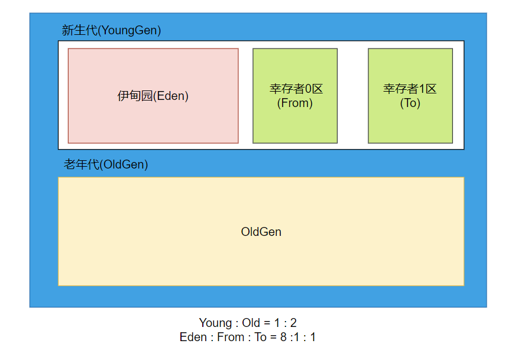

**对象创建后会首先出现在Eden(理解为上帝创造的亚当夏娃首先放在伊甸园)，当GC时，把死亡的对象的空间回收，把还活着的对象就放到幸存者区[详解](#link_survivor),下一轮在对幸存者区的对象进行GC时,回收死亡对象，把还活着的放到老年代**

4. 下面的参数在开发中一般不会调整

    Young：Old = 1：2

    Eden：s0：s1 = 8：1：1

5. 配置新生代老年代在堆结构的占比

    默认 -XX:NewRatio=2 表示新生代栈1，老年代占2 新生代占整个堆的 1/3

    可以修改 -XX:NewRatio=4 表示新生代栈1，老年代占4 新生代占整个堆的 1/5

6. 在Hotspot中，Eden空间和另外两个Survivor空间缺省占比为8：1：1

7. 当然开发人员可以通过选项 "-XX:SurvivorRatio"调整这个比例，如 -XX:SurvivorRatio=8

8. 但是默认情况下，我们看到的并不是 8:1:1 而是 6:1:1 如果像看到，就可以设置 VM参数 -XX:SurvivorRatio=8

    

9. **几乎所有的Java对象都是在Eden区被new出来的**

    *比如若是有一个很大的对象，Eden放不下就会直接放入老年代*

10. 绝大部分的Java对象的销毁都在新生代进行了
    - IBM公司的专门研究表明：新生代 80% 的对象都是”朝生夕死“的

11. 可以使用 ”-Xmn“ 设置新生代的最大内存大小
    - 这个参数一般使用默认值即可

### 对象分配过程

<a name="link_survivor">here</a>

#### 一般过程

1. new的对象先放在伊甸园区，此区没有大小限制
2. 当伊甸园区填满的时候，程序又需要创建新的对象，JVM的垃圾回收器将对伊甸园进行垃圾回收（Minor GC），将伊甸园区中的不不再被其他对象所引用的对象进行销毁，在加载新的对象放在伊甸园区
3. 然后将伊甸园区的幸存对象移动到幸存者0区
4. 如果再次触发垃圾回收，此时上次幸存下来的放到幸存者0区域的，如果没有回收，就放到幸存者1区
5. 如果再次经历垃圾回收，此时会重新放回幸存者0区，接着再去幸存者1区
    - **注意：只有Eden区满了之后才会触发YGC，而幸存者区满了不会触发YGC，但是会将Eden区和幸存者区一起回收**
6. 当一个对象经历了15次 Minor GC之后，就会放到养老区
    - 可以设置参数：-XX:MaxTenuringThreshold=<N>进行设置
7. 在养老区，相对悠闲，当养老区的内存不足的时候，再次触发GC：Major GC 进行养老区的内存清理
8. 如果养老区执行了Major GC之后依旧无法进行对象的保存，就会产生OOM异常

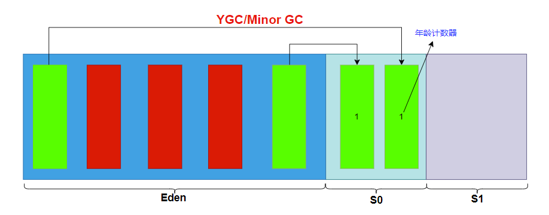


**总结**

- **针对幸存者s0，s1区的总结：复制之后有交换，谁空谁是to**
- **关于垃圾回收：频繁在新生区收集，很少在养老区收集，几乎不在永久区/元空间收集**

#### 特殊情况


幸存者区：一GC一交换，谁0谁是To

监控案例：

```java
/**
 * VM args: -Xms20m -Xmx20m
 */
public class HeapOomCase {
    static class OomObject {

    }

    public static void main(String[] args) {
        ArrayList<OomObject> list = new ArrayList<>();
        while (true) {
            list.add(new OomObject());
            try {
                Thread.sleep(10);
            } catch (InterruptedException e) {
                e.printStackTrace();
            }
        }
    }
}

```


#### 常用的调优工具

- JDK命令行
- Eclipse：Memory Analyzer Tool
- Jconsole
- VisualVM
- Jprofiler
- Java Flight Recorder
- GC Viewer
- GC Easy

### Minor GC、Major GC和Full GC

1. JVM在进行GC的时候，并非每次都对上面三个内存区域一起回收的，大部分的时候回收都是指新生代
2. 针对Hotspot VM的实现，它里面的GC按照回收区域又分为2种类型：一种是部分收集（Partial GC）一种是整堆收集（Full GC）
3. 部分收集：不是完整的整个Java堆收集
    - 新生代收集（Minor GC 完全等价于 YGC）：只是在新生代的垃圾收集
    - 老年代收集（Major GC / Old GC）：只是对老年代的垃圾收集
        - 目前只有CMS GC 会有单独收集老年代的行为
        - **注意很多时候Major GC 和 Full GC 混淆使用，需要具体判别老年代回收还是整堆回收**
    - 混合收集（Mixed GC）：收集整个新生代和部分老年代的垃圾收集
        - 目前 只有G1 GC 会有这种行为
4. 整堆收集（Full GC）：收集整个Java堆和方法区的垃圾收集

#### 年轻代GC(Minor GC/YGC)的触发机制

1. 当年轻代空间不足的时候，就会触发Minor GC,这里的年轻代满指的是Eden区满，而不是S0或者S1满。Servivor满不会触发Minor GC(*但是每次Minor GC会清理年轻代的内存，包括Edne、S0和S1*)
2. 因为Java**对象大多都朝生夕死**,所以Minor GC会非常频繁，一般回收速度也会很快
3. Minor GC会引发STW(Stop the World),暂停其他1，等待垃圾回收结束，用户线程才恢复执行


#### 老年代GC(Major GC/Full GC)的触发机制

1. 指发生在老年代的GC,对象从老年代消失的时候，我们说'Major GC'或'Full GC'发生了
2. 出现了Major GC,经常会伴随至少一次的Minor GC(非绝对，Parallel Scavenge收集器就是直接Major GC)
    - 即在老年代空间不足的时候，会先尝试触发一次Minor GC,如果空间还不足就Major GC

3. Major GC 速度会比Minor GC 慢十倍以上——空间大，STW时间也会更长
4. 如果Major GC后内存还不足就报OOM

#### Full GC 触发机制（后面细讲）

触发Full GC的情况有有下面五种

- 调用System.gc()的时候，系统建议执行Full GC，但是不是必然执行的
- 老年代空间不足
- 方法区空间不足
- 通过Minor GC 后进入老年代的平均大小大于老年代的可用内存
- 由Eden区、Survivor space0（From Space）区向Survivor space1（To Space）区复制的时候，对象大小大于 To Space的可用内存，则把该对象转存到老年代。且老年代 的可用内存大小小于该对象大小
- **说明：Full GC 是开发或者调优种尽量避免的，这样暂停的时间会短一些**

#### 实践验证

众所周知字符串是放在堆空间的

```java
package chapter8;

import java.util.ArrayList;

public class GCTest {
    public static void main(String[] args) {
        int i = 0;
        try {
            ArrayList<String> list = new ArrayList<>();
            String a= "Hello World!";
            while (true){
                list.add(a);
                a = a+ a;
                i++;
            }
        }catch (Throwable t){
            t.printStackTrace();
            System.out.println("遍历了" + i +"次");
        }
    }
}

```


### 分代思想：为什么分代？

分代的唯一理由就是**优化GC性能**，如果没有分代，那么所有的对象都在一起。GC的时候，就会对整堆进行全局扫描，然而很多对象都是朝生夕死 的，如果分代的话，把这些对象聚集在一起，GC先回收这部分，就会节省很多空间和资源

### 堆内存分配策略

1. 对象提升（Promotion）规则
    - 如果对象在Eden出现并经过第一次Minor GC之后仍然存活，并且能被Survivor容纳的话，将被移动到Survivor 区中每熬过一次MinorGC，年龄就增加1岁，当他的年龄增加到一定的程度（默认为15岁）就会晋升到老年代
    - 对象晋升老年代的年龄，可以通过 ： -XX:MaxTenuringThreshold 来设置

2. 针对不同的年龄段的对象分配原则如下所示
    - 优先分配待Eden
    - 大对象直接分配到老年代
        - 尽量避免程序中出现过多的大对象
    - 长期存活的对象分配到老年代
    - 动态对象年龄判断
        - 如果Survivor区中的相同年龄的所有的对象的总和大于Survivor空间的一半，年龄大于或者等于该年龄的对象可以直接进入老年代，无需等到MaxTenuringThreshold中要求的年龄
    - 空间分配担保
        - -XX:HandlePromotionFailure

### TLAB

<a name="TLAB">here</a>

1. 为什么要有TLAB（Thread Local Allocation Buffer）

    - 堆区是线程共享区域，任何线程都可堆区中的共享数

    - 由于对象实例的创建在JVM中非常频繁。因此在并发环境下从堆区中划分内存空间是线程不安全的

    - 为避免多个线程操作同一个地址，需要使用加锁等机制，进而影响分配速度

2. 什么是TLAB

    - 从内存模型而不是垃圾收集的角度，堆Eden区继续进行划分，**JVM为每个线程分配了一个私有缓存区域**，它包含在Eden区内

    - 多线程同时分配内存的时候，使用TLAB可以避免一系列的非线程安全问题。同时还能提升内存分配的吞吐量，因此我们可以将这种内存分配方式称为 **快速分配策略**

    - 几乎所有的OpenJDK衍生出来的JVM都提供了TLAB设计


3. TLAB的再说明

    - 尽管不是所有的对象实例都能在TLAB中成功分配内存，但是 **JVM确实把TLAB作为内存分配的首选**

    - 在程序中，开发人员可以通过选项 ”-XX:UseTLAB“ 设置是否开启TLAB空间

    - 默认情况下，TLAB空间的内存非常小，**仅仅占有整个Eden空间的1%**。当然我们可以通过选项 ”-XX:TLABWasteTargetPercent“设置TLAB空间所占用的Eden空间的百分比大小

    - 一旦对象在TLAB空间分配内存失败的时候，JVM就会尝试使用 **加锁机制**来确保数据操作的原子性，从而在Eden区中直接分配内存

    

### 堆空间参数设置

1. -XX:+PrintFlagsInitial 查看所有参数的默认初始值

2. -XX:+PrintFlagsFinal 查看所有参数的最终值（可能会存在修改，不再是初始值）

    具体查看某个参数的指令：

    ​		jps:查看当前运行中的进程

    ​		jinfo -flag SurvivorRatio 进程ID

3. -Xms：初始堆空间内存 （默认大小为 物理内存空间/64）

4. -Xmx：最大堆空间内存（默认大小为 物理内存空间/4）

5. -Xmn：设置新生代的大小（初始值和最大值）

6. -XX:NewRatio 配置新生代与老年代在堆结构的占比

7. -XX:SurvivorRatio 设置新生代中Eden和S0、S1空间的比例

8. -XX:MaxTenuringThreshold 设置新生代垃圾打最大年龄

9. -XX:+PrintGCDetails 输出详细的GC处理日志

10. -XX:PrintGC 打印GC的简要信息 -verbose:gc

11. -XX:HandlePromotionFailure 是否设置空间分配担保

------

在发生Minor GC之前，虚拟机会 **检查老年代最大可用的连续空间是大于新生代所有对象的总空间**

- 如果大于，则此此Minor GC 是安全的
- 如果小于，则虚拟机会查看 -XX:HandlePromotionFailure 设置值是否允许担保失败
    - 如果HandlePromotionFailure=true，那么会继续**检查老年代最大可用连续空间是否大于历次晋升到老年代的对象的平均大小**
        - 如果大于，则尝试进行一次Minor GC ，但这次Minor GC 仍然是有风险的
        - 如果小于，则改为一次Full GC
    - 如果HandlePromotionFailure=false 则改为进行一次 Full GC

JDK6 Update24之后，HandlePromotionFailure参数不会再影响到虚拟机的空间分配担保策略，观察OpenJDK中的源码变化，虽然源码中定义了HandlePromotionFailure参数，但是在代码中已经不会使用它。在此版本之后规则变为 **只要老年代的连续空间大于新生待对象总大小或者历次晋升的平均大小就会进行Minor GC**，否则就执行Full GC


### 堆并非是分配对象存储的唯一选择

<a name="object_instance_storage">here</a>

在《深入理解Java虚拟机》中关于Java堆内存中有这样的一段描述

- 随着JIT编译器的发展与**逃逸分析技术**逐渐成熟，**栈上分配、标量替换优化技术**将会导致一些微妙的变化，所有的对象都分配到堆上就渐渐变得不是那么绝对了
- 在Java虚拟机中。对象是在Java堆中分配内存的，这是一个普遍的常识。但是有一种特殊情况，那就是 **如果经过逃逸分析（Escape Analysis）后发现。一个对象并没有逃逸出方法的话，那么就有可能被优化成栈上分配**，这样就无需再堆上分配内存，也无需进行垃圾回收了，这是最常见的对外存储技术。
- 此外，前面提到的基于OpenJDK深度定制的TaoBaoVM，其中创新的GCIH（GC Invisible heap）技术实现 off-heap，将生命周期比较长的Java对象从heap移到heap外，并且GC不能管理GCIH内部的对象，以此达到降低GC的回收频率和提升GC的回收效率的目的

**逃逸分析概述**

- 如何将堆上的对象分配到栈，需要使用逃逸分析手段
- 这是一种可以有效减少Java程序中同步负载和内存堆分配压力的跨函数全局数据流的分析算法
- 通过逃逸分析，Java Hotspot编译器能够分析出一个新的对象的引用的适用范围从而觉得是否要将这个对象分配到堆上
- 逃逸分析的基本行为就是分析对象的动态作用域
    - 当一个对象在方法中被定义之后，对象只在方法内部使用。则认为没有发生逃逸
    - 当一个对象在方法中被定义后，它被外部的方法所引用，则认为发生逃逸，例如调用参数传递到其他方法中
- 快速判断是否发生逃逸分析
    - 就看new的对象是否可以在方法外部调用
    - 简而言之，是否只是在方法内部使用此对象
- JDK 6u23版本之后，Hotspot中默认开启了逃逸分析
- 如果使用较早的版本
    - 选项 ”-XX:+DoEscapeAnalysis“显示开启
    - 选项 ”-XX:+PrintEscapeAnalysis“查看逃逸分析筛选

**结论：开发中能使用局部变量的，就不要在方法外进行定义**

### 逃逸分析：代码优化

使用逃逸分析，编译器可以堆代码做以下优化

- **栈上分配**，将堆分配转化为栈分配，如果一个对象在子程序中被分配，要使指向该对象的指针永远不会逃逸，对象可能是栈分配的候选，而不是堆分配
- **同步策略**，如果一个对象被发现只能从一个线程被访问到，那么对于这个对象的操作可以不考虑同步
- **分离对象或者标量替换**。有的对象可能不需要作为一个联系的内存结构存在也可以被访问到，那么对象的部分（或全部）可以不存储在内存，而是存储在CPU寄存器中

#### 栈上分配

- JIT编译器在编译期间根据逃逸分析的结果，发现如果一个对象并没有逃逸出方法的话，就可能被优化成栈上分配。分配完成之后，继续在调用栈内执行，最后线程结束，栈空间被回收，局部变量对象也被回收，这样就无需进行垃圾回收了
- 常见的栈上分配场景
    - 在逃逸分析中已经说明了。分别是给成员变量赋值、方法返回值、实例引用传递

#### 同步策略 - 锁消除

- 线程之间同步的代价是非常高的，同步的后果是降低并发性和性能
- 在动态编译的同步块的时候，JIT编译器可以借助逃逸分析来 **判断同步块所使用的锁对象是否只能被一个线程访问而没有被发布到其他线程**。如果没有，那么JIT编译器在这个同步块的时候就会取消堆这部分代码的同步。这样就可以大大提高并发性和性能。这个取消同步的过程就叫同步省略，也叫**锁消除**

#### 分离对象或者标量替换

- **标量（Scalar）**是指一个无法在分解成更小的数据的数据，Java中的原始数据类型就是标量
- 相对的，哪些还可以分解的数据就叫做 **聚合量（Aggregate）**，Java中的对象就是聚合量，因为可以分解为其他的聚合量和标量。
- 在JIT阶段，如果经过逃逸分析，发现一个对象不会被外界访问的话，那么经过JIT优化，就会把这个对象拆解成若干个成员变量来替代。这个过程就是**标量替换**

- 代码演示

```java
public class Test {
    public static void main(String[] args) {
        alloc();
    }

    public static void alloc() {
        Point point = new Point(1, 23);
        System.out.println(point.x);
        System.out.println(point.y);

    }
}

class Point {
    public int x;
    public int y;

    public Point(int x, int y) {
        this.x = x;
        this.y = y;
    }
}
```

- 经过标量替换之后是这个样子 

```java
public class Test {
    public static void main(String[] args) {
        alloc();
    }

    public static void alloc() {
        int x = 1;
        int y = 23;
        System.out.println(x);
        System.out.println(y);

    }
}

class Point {
    public int x;
    public int y;

    public Point(int x, int y) {
        this.x = x;
        this.y = y;
    }
}
```

- 可以看到，Point这个聚合变量经过逃逸分析之后，发现他并没有逃逸，就会被替换为两个聚合量了
- 标量替换有什么好处呢？就是可以大大减少堆内存的占用，因为一旦不需要创建对象，那么就不再需要分配堆内存了
- 标量替换为栈上分配提供了很好的基础。
- 开启标量替换
    - 参数：-XX:+EliminateAllocations 开启了标量替换（默认打开），允许将对象打散分配在栈上。

#### 总结

- 关于逃逸分析的论文在1999就发表了，但是在JDK6才实现，技术不是很成熟
- 根本原因就是 **无法保证逃逸分析的性能消耗一定能高于他的消耗，虽然经过逃逸分析可以做标量替、栈上分配、和锁消除，但是逃逸分析自身也需要进行一系列复杂的分析。也是一个相对耗时的过程**
- 虽然技术不是很成熟，但是他是 **即时编译器优化技术中一个十分重要的手段**

## 第九章 方法区


### 栈、堆、方法区之间的交互关系

1. 从线程是否共享来看


2. 从创建对象的角度来看

    

### 方法区的基本理解

1. 《Java虚拟机规范》中明确说明：“尽管所有的方法区在逻辑上是属于堆的一部分，但是一些简单的实现可能不会选择区进行垃圾收集或者压缩”。但是对于HotSpot虚拟机而言，方法区还有个名字叫 Non-Heap（非堆），目的就是要和堆分开——所以，**方法区看作是一块独立于Java堆的内存空间**
2. 方法区（Method Area）和堆一样，是各个线程共享的内存区域
3. 方法区在JVM启动的时候被创建，并且它的实际物理内存空间中和Java堆区都一样可以是不连续的
4. 方法区的大小，和堆空间一样，可以选择固定大小或者可拓展
5. 方法区的大小决定了系统可以保存多少个类，如果系统定义了太多的类，导致方法区溢出，虚拟机就会抛出内存溢出错误：java.lang.OutOfMemory:*PermGen space* 或者 java.lang.OutOfMemory:*Metaspace*
    - **如加载了大量的第三方jar包。或者Tomcat部署的工程过多。大量动态生成反射类**
6. 关闭JVM就会释放或者区域的内存

### Hotspot中方法区演进


元空间的本质和永久代类似，都是JVM规范中方法区的体现，不过元空间与永久代最大区别就是：**元空间不在虚拟机设置的内容中，而是使用本地内存**

#### 设置方法区大小和OOM

1. 方法区的大小不必是固定的，JVM可以根据应用的需要动态调整
2. JDK7以及以前
    - **通过 -XX:PermSize 来设置永久代的初始分配空间，默认值是 20.75M**
    - **通过-XX:MaxPermSize 来设定永久代的最大可分配空间，32位机器默认时64M，64位机器默认是82M**
    - 当JVM加载的类的信息容量超过了这个值，就会抛出异常 java.lang.OutOfMemoryError:PermGen space


3. JDK8以及以后

- 元数据区大小可以使用参数 -XX:MetaspaceSize 和 -XX:MaxMetaspaceSize 指定、
- 默认值依赖于平台。windows下，-XX:MetaspaceSize 是21M，-XX:MaxMetaspaceSize 的值是-1，即没有限制
- 与永久代不同，如果不指定大小，默认情况下，虚拟机会耗尽所有的可用系统内存，如果元数据区发生溢出，虚拟机一样会抛出异常 OutOfMemoryError:Metaspace
- -XX:MetaspaceSize 设置初始值的大小。对于64位服务端的JVM来说，其默认的 -XX:MetaspaceSize 值为21 M，这就是最高水线。一旦触及这个水位线，Full GC 将会被触发并卸载没用的类。然后这个高水位线会被重置。新的水位线取决于GC之后释放了多少空间。如果释放过多，就适当降低该值，如果释放过低，就提升该值，前提是不超过 -XX:MaxMetaspaceSize
- 如果初始化的高为太低，上述的调整就会发生很多次，可以发现执行了多次Full GC，建议将 -XX:MetaspaceSize设置一个较高的值

4. 演示OOM

    ```java
    /**
     * JDK8
     * VM:-XX:MetaspaceSize=10M -XX:MaxMetaspaceSize=10M
     */
    public class OomTest extends ClassLoader {
        public static void main(String[] args) {
            int j = 0;
            try {
                OomTest oomTest = new OomTest();
                for (int i = 0; i < 10000; i++) {
                    // 用于生成类的二进制字节码
                    ClassWriter classWriter = new ClassWriter(0);
                    // 指明版本号
                    // 指明访问权限
                    // 类的名字
                    // 包名
                    // 父类
                    // 接口
                    classWriter.visit(Opcodes.V1_8, Opcodes.ACC_PUBLIC, "Class" + i, null, "java/lang/Object", null);
                    // 返回 byte[]
                    byte[] bytes = classWriter.toByteArray();
                    // 类的加载
                    oomTest.defineClass("Class" + i, bytes, 0, bytes.length);
                    j++;
                }
            } catch (Exception e) {
                e.printStackTrace();
            } finally {
                System.out.println(j);
            }
        }
    }
    ```

    

### 如何解决OOM

1. 要解决OOM异常或者heap space异常，一般的手段是首先通过内存映射分析工具如（Eclipse Memory Analyzer）对dump出来的堆转储快照进行分析，重点是确认内存中的对象是否是必要的，也就是先分清楚到底是出现了内存泄漏（Memory Leak）还是内存溢出（Memory Overflow）
2. 如果只是内存泄漏，可以进一步通过工具检查泄漏对象到GC Roots的引用链。于是就能找到泄漏对象是通过怎样的路径与GC Roots相关联并导致垃圾回收器无法自动回收，掌握了泄漏对象的类型信息，以及GC Roots的引用链信息，就可以比较准确的定位出泄漏代码的位置
3. 如果不存在内存泄漏，也就是说内存中的对象必须要存活，那就应该检查虚拟机的堆参数 （-Xms  -Xmx）与机器物理内存对比看是否还可以调大，从代码上检查是否存在某些对象的生命周期过长、持有状态时间过长、尝试减少运行期的内存消耗

### 方法区的内部结构

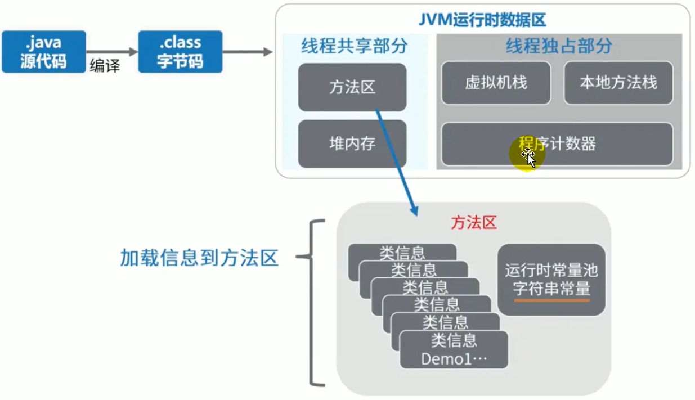

#### 方法区存储什么？

《深入理解Java虚拟机》书种对方法区（Method Area）存储的内容描述如下：它用户存储已经被虚拟机加载的**类型信息、常量、静态变量、即时编译器编译之后的代码缓存等**


**类型信息**

- 对每个加载的类型（类Class、接口interface 、枚举enum、注解annotation），JVM必须在方法区存储以下类型信息
    - 这个类型的完整有效名称（全名=包名.类名）
    - 这个类型的直接父类的完整有效名（对于interface或是java.lang.Object）都没有父类
    - 这个类型的修饰符（public abstract，final的某个子集）
    - 这个类型直接接口的一个有序列表

**域（Field）信息**

- JVM必须在方法区中保存类型的所有域相关的信息以及域的声明顺序
- 域的相关信息包括：域名称、域类型、域修饰符（public private protected static final volatile transient 的某个子集）

**方法（Method）的信息**

- JVM必须保存所有方法的以下信息，同域信息一样包括声明顺序
    - 方法名称
    - 方法的返回类型（或者void）
    - 方法参数的数量和类型（按顺序）
    - 方法的修饰符 （public private protected static final  synchronized native abstract 的某个子集）
    - 方法的字节码（bytecodes）、操作数栈、局部变量表以及大小（abstract和native方法除外）
    - 异常表（abstract和native方法除外）
        - 每个异常处理的开始位置、结束位置、代码处理在程序计数器中的偏移地址、被捕获的异常类的常量池索引

**non-final 的类变量**

- 静态变量和类关联在一起，随着类的加载和而加载它们成为类数据在逻辑上的一部分，
- 类变量被类的所有实例共享，即使没有类实例的时候你也可以访问它

```java
public class MethodAreaTest {
    public static void main(String[] args) {
        Order order = null;
        // 虽然为null 但是是可以调用的
        System.out.println(order.count);
        System.out.println(order.number);
        order.hello();
    }
}

class Order {
    public static int count = 1;
    public static final int number = 2;

    public static void hello() {
        System.out.println("Order.hello");
    }
}
```

**补充说明：全局常量：static final**

- 被声明为final的类变量的处理方式不同，其在编译器就会被分配了——需要注意的是对于final引用类型的字段（例如对象），编译器不会将对象的实例直接嵌入到字节码中。这是因为*对象的创建需要在运行时进行，并且对象的实例在堆中分配内存，因此无法在编译时将其完整描述出来*。

```java
   public static int count = 1;
   public static final int number = 2;
   private static User user1;
   private static final User user2 = new User("好耶", 2);


  public static int count;
    descriptor: I
    flags: ACC_PUBLIC, ACC_STATIC

  public static final int number;
    descriptor: I
    flags: ACC_PUBLIC, ACC_STATIC, ACC_FINAL
	// 编译就已经赋值了
    ConstantValue: int 2
        
  private static chapter9.User user1;
    descriptor: Lchapter9/User;
    flags: (0x000a) ACC_PRIVATE, ACC_STATIC

  private static final chapter9.User user2;
    descriptor: Lchapter9/User;
    flags: (0x001a) ACC_PRIVATE, ACC_STATIC, ACC_FINAL

```

*方法区会记录每个类是具体的哪一个ClassLoader记载的，同时它也加载了ClassLoader，每一个被加载的ClassLoader同时会记录它都加载了哪些类——方便后期方法区回收*

### 运行时常量池

#### 运行时常量池的理解

**运行时常量池 VS 常量池**

- 方法区，内部包含了运行时常量池
- 字节码文件，内部包含了常量池
- 要弄清楚方法区，需要理解清楚ClassFile，因为加载类的信息都在方法区
- 要弄清楚方法区的运行时常量池，需要理解清楚ClassFile中的常量池


- 一个有效的字节码文件除了包含类的版本信息、字段、方法以及接口等描述信息外，还包含一项信息那就是常量池表（Constant Pool Table） 还包括了各种字面量和对类型、域、方法的符号引用等

**为什么需要常量池**

- 一个Java源文件中的类、接口、编译后会产生一个字节码文件，而Java中的字节码需要数据支持，通常这种数据类型会很大以至于不能直接存到字节码里面，换另一种方式，可以存到常量池，这个字节码包含了指向常量池的引用，在动态链接的时候会用到运行时常量池

**常量池中有什么**

- 数值型
- 字符串型
- 类引用
- 字段引用
- 方法引用


**小结**

- 常量池。可以看作是一张表。虚拟机指令根据这张常量表找到要执行的类名、方法名、参数类型、字面量等类型

#### 运行时常量池

- 运行时常量池（Runtime Constant Pool） 是方法区的一部分
- 常量池表（Constant Pool Teble）是Class文件的一部分，**用于存放编译器生成的各种字面量与符号引用，这部分内容将在类加载之后存放在方法区的运行时常量池中**
- 运行时常量池，在加载类和接口道虚拟机后，就会创建对应的运行时常量池
- JVM为每个已经加载的类型（类和接口）都维护一个常量池，池中的数据项像数组项一样，是通过索引访问的
- 运行时常量池中包含多种不同的常量，包括编译器就已经明确的数值字面量，也包括道运行期解析后才能够获得的方法或者字段引用。此时不再是常量池中的符号地址了，这里换为真实地址
    - 运行时常量池，相对于Class文件常量池的另一重要特性：**具备动态性**
- 运行时常量池类似于传统编程语言的符号表，（Symbol table），但是他所包含的数据却比符号表更加丰富一些、
- 当创建类或者接口的时候的运行时常量池的时候，如果构造运行时常量池所需的内存空间超过了方法区所能提供的最大值，则JVM会抛出 OutOfMemeoryError 异常

#### 方法区的使用举例

- 实例代码

```java
package cn.icanci.jvm.metaspace;

/**
 * @author icanci
 */
public class MethodAreaDemo {
    public static void main(String[] args) {
        int x = 500;
        int y = 100;
        int a = x / y;
        int b = 50;
        System.out.println(a + b);
    }
}

```

- 反编译之后的代码

```java
Classfile /D:/MyStudy/JAVA/Code/NoSpringCode/JVM/out/production/JVM/chapter9/MethodAreaDemo.class
  Last modified 2023��8��1��; size 622 bytes
  SHA-256 checksum 1b409bb3fef7e164aaec9ef7d6546600ec121e8839b7661273c5c032bac89573
  Compiled from "MethodAreaDemo.java"
public class chapter9.MethodAreaDemo
  minor version: 0
  major version: 52
  flags: (0x0021) ACC_PUBLIC, ACC_SUPER
  this_class: #4                          // chapter9/MethodAreaDemo
  super_class: #5                         // java/lang/Object
  interfaces: 0, fields: 0, methods: 2, attributes: 1
Constant pool:
   #1 = Methodref          #5.#24         // java/lang/Object."<init>":()V
   #2 = Fieldref           #25.#26        // java/lang/System.out:Ljava/io/PrintStream;
   #3 = Methodref          #27.#28        // java/io/PrintStream.println:(I)V
   #4 = Class              #29            // chapter9/MethodAreaDemo
   #5 = Class              #30            // java/lang/Object
   #6 = Utf8               <init>
   #7 = Utf8               ()V
   #8 = Utf8               Code
   #9 = Utf8               LineNumberTable
  #10 = Utf8               LocalVariableTable
  #11 = Utf8               this
  #12 = Utf8               Lchapter9/MethodAreaDemo;
  #13 = Utf8               main
  #14 = Utf8               ([Ljava/lang/String;)V
  #15 = Utf8               args
  #16 = Utf8               [Ljava/lang/String;
  #17 = Utf8               x
  #18 = Utf8               I
  #19 = Utf8               y
  #20 = Utf8               a
  #21 = Utf8               b
  #22 = Utf8               SourceFile
  #23 = Utf8               MethodAreaDemo.java
  #24 = NameAndType        #6:#7          // "<init>":()V
  #25 = Class              #31            // java/lang/System
  #26 = NameAndType        #32:#33        // out:Ljava/io/PrintStream;
  #27 = Class              #34            // java/io/PrintStream
  #28 = NameAndType        #35:#36        // println:(I)V
  #29 = Utf8               chapter9/MethodAreaDemo
  #30 = Utf8               java/lang/Object
  #31 = Utf8               java/lang/System
  #32 = Utf8               out
  #33 = Utf8               Ljava/io/PrintStream;
  #34 = Utf8               java/io/PrintStream
  #35 = Utf8               println
  #36 = Utf8               (I)V
{
  public chapter9.MethodAreaDemo();
    descriptor: ()V
    flags: (0x0001) ACC_PUBLIC
    Code:
      stack=1, locals=1, args_size=1
         0: aload_0
         1: invokespecial #1                  // Method java/lang/Object."<init>":()V
         4: return
      LineNumberTable:
        line 6: 0
      LocalVariableTable:
        Start  Length  Slot  Name   Signature
            0       5     0  this   Lchapter9/MethodAreaDemo;

  public static void main(java.lang.String[]);
    descriptor: ([Ljava/lang/String;)V
    flags: (0x0009) ACC_PUBLIC, ACC_STATIC
    Code:
      stack=3, locals=5, args_size=1
         0: sipush        500
         3: istore_1
         4: bipush        100
         6: istore_2
         7: iload_1
         8: iload_2
         9: idiv
        10: istore_3
        11: bipush        50
        13: istore        4
        15: getstatic     #2                  // Field java/lang/System.out:Ljava/io/PrintStream;
        18: iload_3
        19: iload         4
        21: iadd
        22: invokevirtual #3                  // Method java/io/PrintStream.println:(I)V
        25: return
      LineNumberTable:
        line 8: 0
        line 9: 4
        line 10: 7
        line 11: 11
        line 12: 15
        line 13: 25
      LocalVariableTable:
        Start  Length  Slot  Name   Signature
            0      26     0  args   [Ljava/lang/String;
            4      22     1     x   I
            7      19     2     y   I
           11      15     3     a   I
           15      11     4     b   I
}
SourceFile: "MethodAreaDemo.java"
```

- 图解


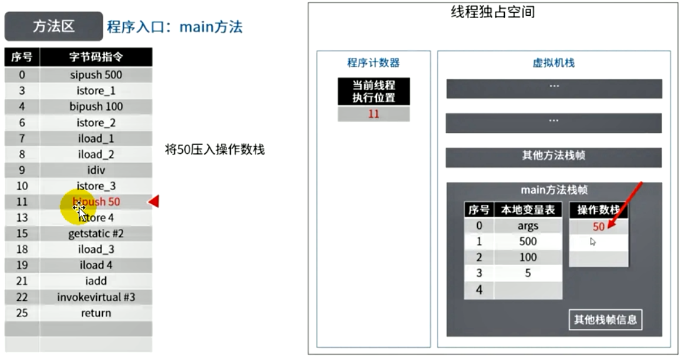

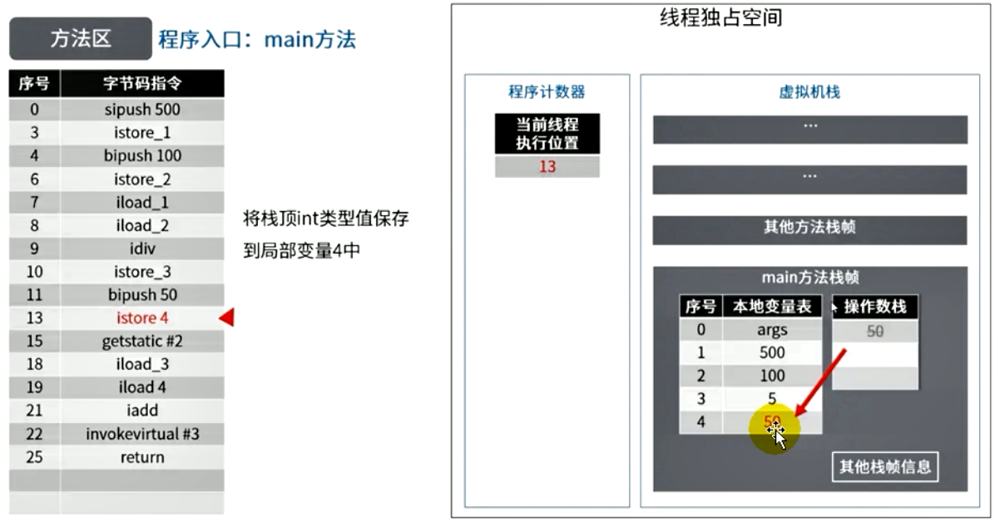


### 方法区的演进细节

- 首先明确：只有Hotspot才有永久代

- BEA Jrockit、IBM J9 等来说，是不存在永久代的概念的，原则上如何实现属于虚拟机的细节，不受《Java虚拟机规范》的约束

- Hotspot中方法区的变化

    | JDK          | 区别                                                         |
    | ------------ | :----------------------------------------------------------- |
    | JDK1.6之前   | 有永久代（permanent generation） 字符串常量池、静态变量存放在永久代上 |
    | JDK1.7       | 有永久代，但是已经逐步“去永久代”，字符串常量池、静态变量移除，保存在堆中 |
    | JDK1.8及以后 | 无永久代，类型信息、字段、方法、常量保存在本地内存的元空间，但是字符串常量池、静态变量仍在堆 |


#### 永久代为什么要被元空间替换

1. 随着JDK8的到来，Hotspot中再也见不到永久代了，但是这不意味着类的元数据消失了。这些元数据被移到了一个与 **堆不相连的本地内存区域，这个区域叫做元空间**

2. 由于元空间分配在本地内存中，元空间的最大分配空间就是系统的可用内存空间 

3. 改动的原因：

    - **永久代的设置空间大小时很难确定的**

        元空间和永久代的区别就是：元空间不在虚拟机中，而是使用本地内存。因此，默认情况下，元空间的大小仅仅受本地内存限制

    - **对永久代进行调优时很困难的**

#### StringTable为什么需要调整

- JDK7中将StringTable放到了堆空间中。因为永久代的回收效率很低，在full GC才会触发。而Full GC是老年代不足、永久代不足才会触发。
- 这就导致StringTable回收效率不高，而我们在开发中会有大量的字符串被创建，回收效率低，导致永久代内存不足。放到堆里，能及时回收内存
- **静态引用对应的对象实体始终都存在堆空间**

#### 证明静态变量在堆中

```java
package chapter9;

public class StaticFieldTest {
    private static byte[] arr = new byte[1024 * 1024 * 100];

    public static void main(String[] args) {
        System.out.println(StaticFieldTest.arr);
    }
}
```

使用VM options:```-Xms200m -Xmx200m -XX:MetaspaceSize=300m -XX:MaxMetaspaceSize=300m -XX:+PrintGCDetails```


在《深入理解Java虚拟机》第三版的第152页，有对于jhsdb工具使用的介绍，给出的示例代码：

```java
package chapter9;

public class JHSDBTest {
    static class Test{
        static ObjectHolder staticObj = new ObjectHolder();
        ObjectHolder instanceObj = new ObjectHolder();

        void foo(){
            ObjectHolder localObj = new ObjectHolder();
            //设置断点
            System.out.println("done");
        }
    }
    private static class ObjectHolder{
        private int count;
        public String name;

        public int getCount() {
            return count;
        }

        public void setCount(int count) {
            this.count = count;
        }

        public String getName() {
            return name;
        }

        public void setName(String name) {
            this.name = name;
        }
    }

    public static void main(String[] args) {
       Test test =  new JHSDBTest.Test();
       test.foo();
    }
}


//VM options:-Xmx10m -XX:+UseSerialGC -XX:-UseCompressedOops
```

在断点调试后根据```jps```指令获得进程pid,然后执行```jhsdb hsdb ---pid xxx```

##### 问题

如图，Tools下的Heap Parmeters可以看到堆空间分配，然后再打开Windows下的console


输入```scanoops Eden的起始地址 To区的结束地址 类名$变量对象类```

示例中输入```scanoops 0x0000020f7e400000 0x0000020f7e750000 JHSDBTest$ObjectHolder```预期结果如下：


(但不知道为什么我的scan不出来￣へ￣)

##### 解决

[Stack Overflow的提问](https://stackoverflow.com/questions/76808395/use-jhsdb-to-see-where-static-variables-are-located)


**因为在此之前我一直忽略了包名**

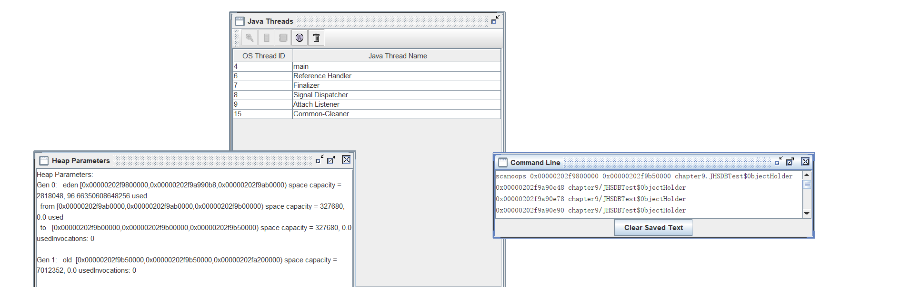


**Inspector为我们展示了对象头和指向对象元数据的指针，点击Compute Liveness可以得到我们想看到的——这个地址就是我们的staticObj变量**

在console使用命令```revptrs address```


再在Inspector查找


*也可以看到是指定的staticObj*


查找第二个可以看到只是一个实例

有必要提到对于localObj的查找——可以看到查找的结果是null，而非ObjectHolder,即revptrs命令不支持查找栈上的引用


#### 方法区的垃圾回收行为

有些人认为方法区，（如Hotspot虚拟机中的元空间或者永久代）是没有垃圾回收行为的，其实不然。《Java虚拟机规范》对方法区的约束是十分宽松的，提到过可以要求虚拟机在方法区中实现垃圾收集。事实上 也确实有未实现或者未能完整实现方法区类型卸载的收集器存在（Java11中的ZGC就不支持类卸载）

一般来说**这个区域的回收效果比较难以令人满意，尤其是类的卸载，条件相当苛刻**，但是这部分的回收时**确实有必要的**

**方法区的垃圾回收主要就是回收两部分内容：常量池中废弃的常量和不在使用的类型**

##### 常量回收

- 方法区主要存放两大类常量：字面量和符号引用。字面量比较的是比较接近Java语言的常量概念。如文本字符串，被声明为final的常量值等。而符号引用则属于编译原理方面的概念，包括下面这三类常量
    - 类和接口的全限定名
    - 字段的名称和描述符
    - 方法的名称和描述符
- Hotspot虚拟机对常量池的回收策略是很明确的，**只要常量池中的常量没有被任何地方引用，就可以被回收**
- 回收废弃常量与回收Java堆中的对象非常相似

##### 类回收

1. 判定一个常量是否“废弃”还是相对简单，而要判定一个类型是否属于不再被使用的类”的条件就比较苛刻了。需要同时满足下面三个条件:

    - 该类所有的实例都已经被回收，也就是Java堆中不存在该类及其任何派生子类的实例。

    - 加载该类的类加载器已经被回收，这个条件除非是经过精心设计的可替换类加载器的场景，如OSGi、JSP的重加载等，否则通常是很难达成的。

    - 该类对应的java.lang.class对象没有在任何地方被引用，无法在任何地方通过反射访问该类的方法。

2. Java虚拟机被允许对满足上述三个条件的无用类进行回收，这里说的仅仅是“被允许”，而并不是和对象一样，没有引用了就必然会回收。关于是否要对类型进行回收,HotSpot虚拟机提供了-Xnoclassgc参数进行控制，还可以使用-verbose:class以及-XX:+TraceClass-Loading、-XX:+TraceclassUnLoading查看类加载和卸载信息
3. 在大量使用反射、动态代理、CGLib等字节码框架，动态生成JSP以及OSGi这类频繁自定义类加载器的场景中，通常都需要Java虚拟机具备类型卸载的能力，以保证不会对方法区造成过大的内存压力。

#### 总结


## 第十章 对象的实例化内存布局与访问定位


实例代码

```java
public class ObjectTest {
    public static void main(String[] args) {
        ObjectTest objectTest = new ObjectTest();
    }
}
```

反汇编

```java
Classfile /D:/MyStudy/JAVA/Code/NoSpringCode/JVM/out/production/JVM/chapter10/ObjectTest.class
  Last modified 2023��8��2��; size 433 bytes
  SHA-256 checksum e0a81e4c029838b02902ece7eff0998bb37465ea2aee676af4d230110d668707
  Compiled from "ObjectTest.java"
public class chapter10.ObjectTest
  minor version: 0
  major version: 61
  flags: (0x0021) ACC_PUBLIC, ACC_SUPER
  this_class: #7                          // chapter10/ObjectTest
  super_class: #2                         // java/lang/Object
  interfaces: 0, fields: 0, methods: 2, attributes: 1
Constant pool:
   #1 = Methodref          #2.#3          // java/lang/Object."<init>":()V
   #2 = Class              #4             // java/lang/Object
   #3 = NameAndType        #5:#6          // "<init>":()V
   #4 = Utf8               java/lang/Object
   #5 = Utf8               <init>
   #6 = Utf8               ()V
   #7 = Class              #8             // chapter10/ObjectTest
   #8 = Utf8               chapter10/ObjectTest
   #9 = Methodref          #7.#3          // chapter10/ObjectTest."<init>":()V
  #10 = Utf8               Code
  #11 = Utf8               LineNumberTable
  #12 = Utf8               LocalVariableTable
  #13 = Utf8               this
  #14 = Utf8               Lchapter10/ObjectTest;
  #15 = Utf8               main
  #16 = Utf8               ([Ljava/lang/String;)V
  #17 = Utf8               args
  #18 = Utf8               [Ljava/lang/String;
  #19 = Utf8               objectTest
  #20 = Utf8               SourceFile
  #21 = Utf8               ObjectTest.java
{
  public chapter10.ObjectTest();
    descriptor: ()V
    flags: (0x0001) ACC_PUBLIC
    Code:
      stack=1, locals=1, args_size=1
         0: aload_0
         1: invokespecial #1                  // Method java/lang/Object."<init>":()V
         4: return
      LineNumberTable:
        line 3: 0
      LocalVariableTable:
        Start  Length  Slot  Name   Signature
            0       5     0  this   Lchapter10/ObjectTest;

  public static void main(java.lang.String[]);
    descriptor: ([Ljava/lang/String;)V
    flags: (0x0009) ACC_PUBLIC, ACC_STATIC
    Code:
      stack=2, locals=2, args_size=1
         0: new           #7                  // class chapter10/ObjectTest
         3: dup
         4: invokespecial #9                  // Method "<init>":()V
         7: astore_1
         8: return
      LineNumberTable:
        line 5: 0
        line 6: 8
      LocalVariableTable:
        Start  Length  Slot  Name   Signature
            0       9     0  args   [Ljava/lang/String;
            8       1     1 objectTest   Lchapter10/ObjectTest;
}
SourceFile: "ObjectTest.java"

```

### 对象创建的六个步骤

#### 判断对象的对应的类是否加载、链接、初始化

- 虚拟机遇到一条new指令，首先要去检查这个指令的参数能否在Metaspace的常量池中定位到一个类的符号引用，并且检查这个符号引用代表的类是否已经被加载、解析、和初始化（即判断类元信息是否存在），如果没有，那么在双亲委派机制模式下，使用当前类加载器以及ClassLoader+全限定名为key查找对应的class文件，如果没有找到文件，就抛出 ClassNotFoundException异常。如何找到，则进行类加载，并生成对应的Class类对象

#### 为对象分配内存

- 首先计算对象占用空间的大小，接着在内存中划分一块内存给新的对象，如果实例成员变量是引用变量，仅仅分配引用变量空间即可，也就是4个字节大小
- **如果内存规整**——对应标记压缩算法
    - 指针碰撞
        - 如果内存是规整的，那么虚拟机将采用指针碰撞法（Bump The Pointer）来为对象分配内存
        - 意思是所有用过的内存在一边，空闲的内存在另一边，中间放着一个指针作为分界点的指示器，分配内存就仅仅是把指针向空闲的那边挪动一段与对象大小相等的举例罢了，如果垃圾回收器选择的是Serial、ParNew这种基于压缩算法的，虚拟机采用这种分配方式。一般使用带有compact（整理）过程的收集器的时候，使用指针碰撞
- **如果内存不规整**——标记清楚算法，如CMS垃圾收集器
    - 虚拟机需要维护一个列表
    - 空闲列表分配
    - 如果对象不是规整的，已经使用的内存和未使用的内存相互交错，那么虚拟机将采用的是空闲列表法来为对象分配内存。意思是虚拟机维护了一个列表，记录上哪些内存是可用的吗，再分配的时候从列表中找到一块足够大的空间划分给对象实例，并更新列表上的内容，这种分配方式成为“空闲列表（Free List）”

**选择哪种分配方式由Java堆是否规整决定，而Java堆是否规整又由所采用的垃圾收集器是否带有压缩整理功能决定。**

#### 处理并发安全问题

- 采用CAS失败重试、区域加锁保证更新的原子性
- 每个线程预先分配一块[TLAB](#TLAB) - 通过-XX:+/-UseTLAB参数来设定

#### 初始化分配到的空间

即默认初始化(零值初始化)

- 所有属性是设置默认时值，保证对象实例字段再不赋值的时候可以直接使用
    - 属性的默认初始化
    - 显示初始化 （执行init方法进行初始化）
    - 代码块中初始化（执行init方法进行初始化）
    - 构造器中初始化（执行init方法进行初始化）

#### 设置对象的对象头

- 将对象的所属类（即类的元数据信息）、对象的HashCode和对象的GC信息、锁信息、等数据存储再对象的对象头中。在这个过程具体设置方式取决于JVM的实现

#### 执行init方法进行初始化

- 在Java程序员的视角看来，初始化才正式开始。初始化成员变量、执行实例化代码块，调用类的构造方法，并把堆内对象首地址赋值给引用变量
- 因此一般来说（由字节码中是否跟随着有 invokespecial指令决定），new指令之后会执行方法，把对象按照程序员的意愿进行初始化，这样一个真正的可用的对象才算完全的创建出来

### 对象的内存布局


#### 对象的访问定位

- JVM是如何通过栈帧中的对象引用访问到其内部的对象实例呢?


**对象访问定位**


**句柄访问**

- 优点：reference中存储稳定句柄地址，对象被移动（垃圾收集时候移动对象很普遍）时会改变句柄中的实例数据指针即可，reference本身不需要被修改

- 缺点：需要多占用一些空间


**直接指针访问**


## 第11章 直接内存

### 直接内存概述

- 直接内存不是虚拟机运行时数据区的一部分。也不是《Java虚拟机规范》中定义的内存区域
- 直接内存是在Jaav堆外的、直接向系统申请的内存空间
- 来源于NIO，通过存在堆中的DirectByteBuffer操作Native内存
- 通常访问直接内存的速度高于Java堆，也就是读写性能更高
    - 因此出于性能考虑，读写频繁的场合可能会考虑使用直接内存
    - Java的NIO库允许Java程序使用直接内存，用户数据缓冲区

| IO              | NIO(new IO/Non-blocking IO) |
| --------------- | --------------------------- |
| byte[] / char[] | Buffer                      |
| Stream          | Channel                     |


### 非直接缓冲区


- 读写文件，需要与磁盘交互，需要由用户态切换到内核态。在内核态的时候，需要内存如上图的操作，使用IO，见上图。这里需要两份内存存储数据，效率低

### 直接缓冲区


- 使用NIO的时候，上图。操作系统划出的直接缓存区可以被Java代码直接访问，只有一份，NIO适合对大文件的读写操作。

### 注意点

- 也可能导致OutOfMemoryError异常
- 由于直接内存存在在Java堆外，因此它的大小不会直接受限于-Xmx指定的最大堆大小，但是系统内存是有限的，Java堆和直接内存的总和依旧受限于操作系统能给出的操作内存
- **缺点**
    - 分配回收成本高
    - 不受JVM内存回收管理 
- 直接内存的大可以通过 MaxDirectMemorySize 设置
- 如果不指定，默认与堆的最大值 -Xmx参数保持一致


- **Java Process Memory  = Java Heap + native Memory**

## 第12章 执行引擎


### 执行引擎概述

#### 概述

- 执行引擎是Java虚拟机核心组件之一
- “虚拟机”是一个相对于“物理机”的概念，这两种机器都有代码执行的能力，其区别就是物理机的执行引擎是建立在处理器、缓存、指令集和操作系统层面上的，而**虚拟机的执行引擎则是由软件自行实现的**，因此可以不受物理条件的制约指令集和执行引擎的结构体系，**能够执行哪些不被硬件直接支持的指令集格式**。

- JVM的主要任务是负责 **装载字节码到其内部**，但是字节码并不能够直接运行在操作系统之上，因为字节码指令并非等价于本地机器指令，它内部包含的仅仅只是一些能够被JVM所识别的字节码指令、符号表、以及其他辅助信息
- 那么如果想要一个Java程序运行起来，执行引擎（Execution Engine）的任务就是 **将字节码指令解释/编译为对应平台的本地机器指令才可以**，简单来说JVM的执行引擎充当了高级语言翻译为机器语言的译者

#### 执行引擎工作流程


- 执行引擎在执行的过程中究竟需要执行什么样的字节码指令完全依赖于**PC寄存器**
- 每当执行完一项指令操作之后，PC寄存器就会更新下一条需要被执行的指令的地址
- 当然方法在执行的过程中，执行引擎可能会通过存储在局部变量表中的对象引用准确定位到存储在Java堆区中的对象的实例信息，以及通过对象头中的元数据指针定位到目标对象的类型信息
- 从外观上来看，所有的Java虚拟机的执行引擎的输入、输出都是一致的：输入的是字节码二进制流，处理过程是字节码解析执行的等效流程，输出的是执行结果

### Java代码编译和执行的过程


大部分的程序代码转换成物理机的目标代码或者虚拟机能执行的指令集之前，都需要经过上图的各个步骤。

Java代码编译是由Java源码编译器——javac来完成，流程图如下所示


Java字节码的执行是由JVM执行引擎来完成


问题：什么是解释器（Interpreter），什么是JIT编译器

- 解释器：当Java虚拟机启动的时候会根据预定义的规范 **对字节码采用逐行解释的方式执行**，将每条字节码文件中的内容“翻译”为对应平台的本地机器指令执行
- JIT（Just In Time Compiler）编译器：就是虚拟机将源代码直接编译成和本地机器平台相关的机器语言

问题：为什么说Java是半编译半解释型语言

>在Java的执行引擎中，解释器（Interpreter）和JIT编译器（Just-In-Time Compiler）是两个重要的组成部分，它们共同协作来执行Java程序。
>
>1. 解释器（Interpreter）： 解释器是Java执行引擎中的一部分，负责解释和执行Java字节码。当Java程序被编译成字节码后，解释器会逐行读取字节码，并将其转换为机器代码并执行。解释器实现简单，可以在任何平台上运行，因为它不需要生成本地代码。
>
>但是，**解释器的执行效率相对较低**，因为它需要逐行解释字节码并且无法做太多的优化。这就导致了解释器执行Java程序时较慢。
>
>2. JIT编译器（Just-In-Time Compiler）： 为了提高Java程序的执行效率，Java引入了JIT编译器。**JIT编译器将字节码转换为本地机器代码，并将其保存在方法区中**，以便下次执行时直接使用，从而避免了重复的解释过程。
>
>JIT编译器在运行时动态地将频繁执行的**热点代码**（HotSpot）编译成本地机器代码，这样就可以在执行过程中进行优化，提高程序的执行速度。由于JIT编译器可以根据实际运行情况进行优化，所以它能够针对特定的硬件和操作系统进行优化，从而获得更好的性能。
>
>JIT编译器的存在使得Java程序在执行过程中性能逐渐提升，因为它会针对热点代码进行优化，而对于冷门代码则不会做太多优化。
>
>总结： 解释器和JIT编译器在Java执行引擎中共同协作，解释器负责解释和执行字节码，而JIT编译器则负责将热点代码编译成本地机器代码，以提高程序的执行效率。这种组合的执行方式被称为混合模式执行。混合模式执行兼顾了解释器的灵活性和JIT编译器的性能优势，从而使得Java程序在执行时获得较好的性能表现。

- 现在JVM在执行Java源码的时候，通常都会将解释执行和编译执行二者结合起来进行。

### 机器码指令、汇编、高级语言的理解与执行过程


##### 机器码

- 各种用二进制编码的方式表示的指令，叫做**机器指令码**。开始，人们就用它编写程序，这就是机器语言
- 机器语言虽然能够被计算机理解和接受，但是和人们的语言差别太大，不容易被人们理解和记忆，并且用它编程容易出差错
- 用它编写的程序一经输入到计算机，CPU直接读取执行，因此和其他语言编写的程序相比，执行速度最快
- 机器指令与CPU紧密相关，所以不同种类的CPU所对应的机器指令也就不同

##### 指令

- 由于机器码是由0和1组成的二进制序列，可读性实在太差，于是人们发明了指令
- 指令就是把机器码中特定的0和1序列，简化成相应的指令（一般使用英文简写，如mov，inc等），可读性稍好
- 由于不同的硬件平台，执行同一个操作，对应的机器码可能不同，所以不同的硬件平台的同一种指令（如mov）对应的机器码也不同

##### 指令集

- 不同的硬件平台，各自支持的指令，是有差别的。因此每个平台所支持的指令，称之为对应平台的指令集
- 常见的
    - x86指令集，对应的是x86架构的平台
    - ARM指令集，对应的是ARM架构的平台  

##### 汇编语言

- 由于机器指令的可读性还是太差，于是人们有发明了汇编语言
- 在汇编语言中，用**助记符（Mnemonics）**代替**机器指令的操作码**，用**地址符号（Symbol）或者标号（Label）**代替**指令操作数的地址**
- 在不同的硬件平台，汇编语言对应着不同的机器语言指令集，通过汇编过程转称机器指令
    - 由于计算机只认识指令码，所以用**汇编语言编写的程序还必须翻译成机器指令码**。计算机才能识别和执行

##### 高级语言

- 为了使得计算机用户编程序更容易一些，后来就出现了各种高级计算机语言，高级语言比机器语言、汇编语言**更接近人的语言**
- 当计算机执行高级语言编写程序的时候，**仍然需要将程序解释和编译成机器的指令码**。完成这个过程的程序就叫做解释程序或者编译程序


##### 字节码

- 字节码是一种中间状态（中间码）的二进制代码（文件），它比机器码更抽象，需要直译器转译之后才能成为机器码
- 字节码主要是为了实现特定软件运行和软件环境、**与硬件环境无关**
- 字节码的实现方式是通过编译器和虚拟机器，编译器将源码编译成字节码，特定平台上的虚拟机器将字节码转译为可以执行的命令
    - 字节码的典型应用就是 ByteCode


**编译过程又可以分为两个阶段：编译和汇编**

- 编译过程：是读取源程序（字符流），对之进行词法和语法的分析，将高级语言指令转换为功能等效的汇编代码
- 汇编过程：实际上指把汇编语言代码翻译成目标机器指令的过程

### 解释器


- JVM的设计者们的初衷仅仅只是单纯的**为了满足Java程序的跨平台性**，因此避免采用静态编译的方式直接生成本地机器指令，从而诞生了实现解释器在运行时采用逐行解释字节码执行程序的想法

##### 解释器工作机制（或工作任务）

- 解释器真正意义上所承担的角色就是一个运行时“翻译者”，将字节码文件中的内容“翻译”为对应平台的本地机器指令执行
- 当一条字节码指令被解释执行完成之后，接着再根据PC寄存器中记录的下一条需要被执行的字节码指令执行解释操作

##### 解释器的分类

- 在Java发展历史里，一共有两套解释执行器，即古老的**字节码解释器**、现在普遍使用的是**模板解释器**
- 字节码解释器在执行时通过**纯软件代码**，模板字节码的执行，效率非常地下
- 而模板解释器将 **每一条字节码和一个模板函数相关联**，模板函数中直接产生这条字节码执行的机器码。从而很大程度上提高了解释器的性能
    - 在Hotspot VM中，解释器主要由Interpreter模块和Code模块构成
        - Interpreter模块：实现了解释器的核心功能
        - Code模块：用于管理Hotspot VM 在运行时生成的本地机器指令

##### 现状

- 由于解释器在设计上和实现上非常简单，因此除了 Java之外，其他语言也基于解释器执行。但是今天 **基于解释器执行已经沦落为低效的代名词**
- 为了解决这个问题，JVM平台支持一种即时编译的技术。即时编译的目的是避免函数被解释执行，而是**将整个函数体编译成机器码吗，每次该函数执行的时候，只执行编译后的机器码即可**，这种方式可以使得执行效率大幅度提升

### JIT编译器

Hotspot虚拟机是目前市面上高性能虚拟机的代表之一。**它是采用解释器和即时编译器并存的架构**，在其运行的时候，会找到解释器和即时编译器相互合作的节点。各自取长补短。

既然Hotspot VM中已经内置了JIT编译器了，那么为啥还需要再使用解释器来“拖累”程序的执行性能呢？

- 首先明确
    - 当虚拟机启动的时候，**解释器可以首先发挥作用**，而不必等待即时编译器全部编译完成再执行，这样可以**省去许多不必要的编译时间**。并且随着程序运行时间的推移，即时编译器逐渐发挥作用，根据热点探测功能，将**有价值的字节码**编译为本地机器指令，以换取更高的程序执行效率。
    - 所以Hotspot虚拟机，JIT编译器和解释器都进行使用，当虚拟机启动的时候，解释器首先发生作用，不必等待即时编译器全部编译完再执行，这样可以省去不必要的编译时间。随着时间的推移，越来越多的热点代码被编译为机器指令代码，所以程序执行会越来越快
    - 同时，解释执行在编译器进行激进优化不成立的时候，作为编译器的“逃生门”
- 概念解释
    - Java语言得“编译期”其实是一段“不确定”得操作过程，因为它可能是指一个**前端编译器**（其实也叫 **编译器的前端**）把 .java 文件转换成 .class 文件的过程
    - 也可能是指**后端运行编译器**（JIT编译器 Just In Time Compiler） 把字节码转换为机器码的过程
    - 还可能是使用 **静态提前编译器**（AOT编译器 Ahead Of Time Compiler）直接把 .java 文件编译成本地机器码的过程


### 热点代码以及探测方式

- 当然是否需要启动JIT编译器将字节码直接编译为对应平台的本地机器指令，则需要根据代码被调用 **执行的频率** 而定。这样的被编译为本地代码的字节码，称为**热点代码**，JIT编译器再运行时会针对哪些被频繁调用的“热点代码”做出**深度优化** 将其直接编译为对应平台的本地机器指令，以提升Java程序的执行性能 

- **一个被多次调用的方法，或者是一个方法体内部循环次数比较多的循环体都可以称为是热点代码**，因此都可以通过JIT编译器翻译为本地机器指令，由于这种编译方式发生在方法的执行过程中，因此也被称为栈上替换。或者简称为 **OSR（On Stack Replacement）**
- 一个方法**究竟要调用多少次**，或者一个循环体究竟循环多少次，才会达到这个标准？肯定需要一个明确的阈值，JIT才会编译之为本地代码。这里主要依赖 **热点探测功能**
- **目前Hotspot VM 采用热点探测方式是基于计数器的热点探测**
- 采用计数器的热点探测，Hotspot VM 将会为每一个方法都建立2个不同类型的计数器，分别为方法调用计数器，分别为方法调用计数器（Invocation Counter）和回边计数器（Back Edge Counter）
    - 方法回调计数器用于传统统计方法的调用次数
    - 回边计数器则用于统计循环体执行的循环次数

#### 方法调用计数器

- 这个计数器就是用于统计方法被调用的次数，它的默认阈值再 Client 模式下是1500次，再Server下是10000次，超过这个阈值，就会触发JIT编译
- 这个阈值可以通过虚拟机参数 -XX:ComplieThreshold 来设定
- 当一个方法被调用的时候，会先检查该方法是否存在被JIT编译过的版本，如果存在，则优先使用编译后的本地代码来执行，如果不存在已经被编译的版本，则将此方法的调用计数器值加1，然后判断 **方法调用计数器和回边调用计数器之和**是否超过方法调用计数器的阈值，如果超过，就向编译器提交一个该方法的编译请求


**热度衰减**

- 如何不做任何设置，方法调用计数器统计的不是被调用的绝对次数，而是一个相对的执行频率。即 **一段时间之内方法被调用的次数** 当超过 **一定的时间限制**，如果调用的次数不足，就可以将他转交给即时编译器编译，哪这个方法的调用计数器就会减少一半，这个过程就是调用计数器热度的**衰减（Counter Decay）**，而这段时间就称为次方法统计的**半衰周期（Counter Half Life Time）**
- 进行热度衰减的动作，是再虚拟机内部垃圾收集的时候顺便执行的，可以使用虚拟机参数 **-XX:-UseCouinterDecay**关闭
- 可以使用 **-XX:CounterHalfLifeTime** 参数设置半衰周期的时间，单位是秒

#### 回边计数器

- 统计方法中循环 体代码的执行次数，建立回边计数器统计就是为了触发 OSR 编译


#### Hotspot VM 可以设置程序的执行方式

- 缺省情况下 Hotspot 虚拟机使用解释器与编译器并存的架构，开发人员也可以对齐进行调整，**设置为完全采用解释器或者完全采用即时编译器**
- **-Xint**:完全采用解释器模式执行程序
- **-Xcomp**:完全采用即时编译器模式执行程序，如果编译出现问题，解释器会介入
- **-Xmixed**:采用解释器+即时编译器混合模式执行程序 

#### Hotspot VM 中JIT分类

- 在Hotspot VM 内嵌两个JIT编译器，分别为 Client / Server Compiler 但是大多数情况下我们称之为 C1编译器和C2编译器，可以设置使用哪一种编译器
- -client 使用c1编译器
    - C1编译器会对字节码进行 **简单和可靠的优化，耗时短** 以达到更快的编译速度
- -server 使用c2 编译器
    - C2进行 **耗时较长的优化，以及激进优化** 但是优化的代码执行效率高 

**C1和C2编译器不同的优化策略**

- 在不同的编译器上有不同的优化策略，
- C1编译器有方法内联，去虚拟化、冗余消除
    - 方法内联：将引用的函数代码编译道引用点处，这样就可减少栈帧的生成，减少参数的传递和跳转过程
    - 去虚拟化：对唯一的实现类进行内联
    - 冗余消除：在运行期间会把一些不会执行的代码折叠掉
- C2的优化主要是在全局层面，逃逸分析师优化的基础，基于逃逸分析在C2上有如下几种优化
    - 标量替换：用标量替换聚合变量
    - 栈上分配：对于为逃逸的对象分配对象的在栈而不是在堆
    - 同步消除：清除同步动作，通常指的是synchronized

- **分层编译（Tiered Compiler）策略**
    - 程序解释执行（不开启性能监控）可以触发C1，将字节码编译成机器码，可以进行简单优化，也可加上性能优化，C2编译会根据性能监控信息进行激进优化
    - 不过在Java7版本之后，一旦开发人员在程序中显示指定命令 "-server"时，默认开启，使用c1和c2共同执行

#### Graal编译器与AOT编译器

**Graal编译器**

- 在JDK10之后，Hotspot又加入了一个全新的即时编译器：Graal 编译器
- 编译效果短短几年就追平了C2编译器
- 目前还在实验阶段
    - -XX:+UnlockExperimentalVMOptions -XX:+UseJVMCICompiler去激活才能使用

**AOT编译器**

- JDK9.0 之后加入了AOT编译器（静态提前编译器 Ahead Of Time Compiler）
- JDK9 引入了实验性的 AOT 编译工具 jaotc ，它借助了 Graal 编译器。将所输入的Java类文件转换为机器码，并存放道生成的动态共享库中
- 所谓的AOT编译器 时与即时编译器对立的一个概念，**即时编译器在程序运行的时候**，而**AOT编译器是在程序运行之前**
- 最大好处：可以直接执行，不必等程序预热，减少第一次运行慢的体验
- 缺点：
    - 破坏了 Java”一次编译，到处运行“，因为直接编译之后的文件是固定的，必须为每种系统都编译
    - **降低了Java动态链接的动态性**，加载的代码在编译器期就必须全部已知
    - 还需要继续优化中，最初只支持Linux x64 java base

## 第13章 StringTable

### String的基本特性

- String：字符串，使用一对 "" 引起来表示
    - String s1 = "hello";
    - String s2 = new String("hello");
- String：声明为final的，不可被继承
- String 实现了Serializable接口：表示字符串是支持序列化的，实现了Comparable接口：表示String可以比较大小
- 在JDK8以及之前，String内部定义了**final char[] value** 用来存储字符串数据，JDK9之后使用 **byte[]**

- String：代表不可变的字符序列。简称：不可变性
    - 当对字符串重新赋值的时候，需要重写指定内存区域赋值，而不是修改原有的value进行赋值
    - 不能对现有的字符串进行连接操作，也需要重新指定内存区域，不是修改原有的value进行赋值
    - 当调用String的replace()方法修改指定字符或者字符串的时候，也需要重新指定内存区域赋值，不能使用原有的value赋值
- 通过字面量的方式（区别于new）给一个字符串赋值，此时的字符串声明在常量池中

- **字符串常量池中是不会存储相同内容的字符串的**
- String的String Pool 是一个固定大小的**HashTable** 默认长度为1009，如果放进去String Pool 的String非常多，就会造成Hash冲突严重，从而导致链表很长，而链表长了之后，会直接影响调用 String.intern()的性能
- 使用 **-XX:StringTableSize** 可设置StringTable的长度
- 在JDK6中的StringTable是固定的，就是1009的长度，如果字符串常量池中的字符串过多就会导致效率下降很快，StirngTableSize设置没有要求
- 在JDK7中，StringTable的默认长度为 60013，JDK7没有要求
- JDK8开始1009 是可设置的最小值 
- **Stirng#intern()方法：如果字符串常量池中没有对应的字符串的话，就添加在常量池**
- 当StirngTableSize较大时，Hash碰撞少了，查询快了，就会增加性能

### String的内存分配 

- 在Java语言中有8种基本数据类型和String，这些类型为了使它们在运行速度中更快，更节省内存。都提供了常量池
- 常量池就相似于一个Java系统级别提供的缓存。8中基本类型都是系统协调的，**String类型的常量池比较特殊，主要的使用方法有2种**
    - 直接使用双引号声明String的对象会直接存储在常量池种
    - 如果不是使用双引号声明的String对象，可以使用String提供的intern() 方法

- 在JDK6以及以前，字符串常量池存放在永久代
- JDK7种Oracle对字符串池的逻辑做了很大的改变，将 **字符串常量池的位置调整到Java堆内**
    - 所有的字符串都保存在堆中，和其他普通对象一样，这样可以让你在进行调优的时候仅仅需要调整堆大小就可以了
    - 字符串常量池的概念原本使用的比较多，但是这个改动使得我们有足够的理由考虑使用String.intern();
- Java8元空间，字符串常量在堆

- **StringTable为什么需要调整**
    - 之前的永久代比较小，放大量的字符串，会占用很大的空间
    - 永久代垃圾回收的频率很低

- Java语言规范要求完全相同的字符字面常量，应该包含同样的Unicode字符序列，并且必须是指向同一个String类实例

```java
package cn.icanci.jvm.string;

/**
 * @Author: icanci
 */
public class Memory {
    public static void main(String[] args) {
        int i = 1;
        Object obj = new Object();
        Memory mem = new Memory();
        mem.foo(obj);
    }

    public void foo(Object param) {
        String str = param.toString();
        System.out.println(str);
    }
}

```


### 字符串的拼接操作

- **常量与常量**的拼接结果在常量池，原理是编译期优化
- 常量池中不会存在相同内容的常量
- **只要其中有一个是变量，结果就在堆中**。变量拼接的原理是StringBuilder
- 如果拼接的结果调用intern()方法，则主动将常量池中还没有的字符串对象放入池中，并返回此对象的地址

#### 拼接操作的原理

- 实例代码

```java

public class CreateStringDemo {
    public static void main(String[] args) {
        String str = "hello ";
        String str2 = "world";
        String s = str + str2;
        System.out.println(s);
    }
}

```

##### JDK8

**创建一个新的 StringBuilder 对象——toString()约等于new String();**

```java
 0 ldc #2 <hello >
 2 astore_1
 3 ldc #3 <world>
 5 astore_2
 //创建一个新的 StringBuilder 对象
 6 new #4 <java/lang/StringBuilder>
 9 dup
10 invokespecial #5 <java/lang/StringBuilder.<init> : ()V>
13 aload_1
14 invokevirtual #6 <java/lang/StringBuilder.append : (Ljava/lang/String;)Ljava/lang/StringBuilder;>
17 aload_2
18 invokevirtual #6 <java/lang/StringBuilder.append : (Ljava/lang/String;)Ljava/lang/StringBuilder;>
21 invokevirtual #7 <java/lang/StringBuilder.toString : ()Ljava/lang/String;>
24 astore_3
25 getstatic #8 <java/lang/System.out : Ljava/io/PrintStream;>
28 aload_3
29 invokevirtual #9 <java/io/PrintStream.println : (Ljava/lang/String;)V>
32 return
```


##### JDK17

**通过动态调用指令调用一个方法，该方法实现字符串的拼接操作。**

```java
0 ldc #7 <hello >
 2 astore_1
 3 ldc #9 <world>
 5 astore_2
 6 aload_1
 7 aload_2
 //通过动态调用指令调用一个方法，该方法实现字符串的拼接操作。
 8 invokedynamic #11 <makeConcatWithConstants, BootstrapMethods #0>
13 astore_3
14 getstatic #15 <java/lang/System.out : Ljava/io/PrintStream;>
17 aload_3
18 invokevirtual #21 <java/io/PrintStream.println : (Ljava/lang/String;)V>
21 return
```


- String拼接的原理：只要是变量，就先创建一个StringBuilder对象，然后调用StringBuilder的append()方法，分别拼接两个字符串，拼接结束之后，调用StringBuilder的toString()方法，返回为新的字符串
    - 在JDK5.0之前使用的是StringBuffer进行拼接，在JDK5.0之后，StringBuilder出现，然后使用了StringBuilder来拼接
- 拼接的实际操作如下

```java
StringBuilder sb = new StringBuilder();
sb.append("hello ");
sb.append("world");
sb.toString(); // 类似于 new String("hello world");
```

- **字符串拼接操作，不一定是使用的是StringBuilder，如果两边都是final的字符串常量或者常量引用，仍然使用编译器优化，此时不使用StringBuilder的方式**
- 针对final修饰类、方法、基本数据类型、引用数据类型的量的结果的时候，能使用fianl就使用final
- 在使用StringBuilder和StringBuffer的时候，如果已知具体的大小，可以进行有参构造函数，创建一个指定初始大小的数组，可以避免返回扩容转移数组，耗费空间和资源
- 通过stringBuilder的append()的方式添加字符串的效率要远高于使用string的字符串拼接方式——还可以在实例化时指定容器大小，避免经常扩容
    * stringBuilder的append()的方式: 自始至终中只创建过一stringBuilder的对象
    * 使用string的字符串拼接方式: 创建过多stringBuilder和string的对象
- 使用string的字符串拼接方式: 内存中由于创建了较多的StrinaBuilder和string的对象，内存占用更大:如果GC还会花费额外的时间

### intern() 的使用

>Returns a canonical representation for the string object.
>A pool of strings, initially empty, is maintained privately by the class String.
>When the intern method is invoked, if the pool already contains a string equal to this String object as determined by the equals(Object) method, then the string from the pool is returned. Otherwise, this String object is added to the pool and a reference to this String object is returned.
>It follows that for any two strings s and t, s.intern() == t.intern() is true if and only if s.equals(t) is true.
>
>
>
>返回字符串对象的规范表示形式。
>
>字符串池最初为空，由String类私有地维护。
>
>当调用intern方法时，如果池中已经包含一个由equals(object)方法确定的与此string对象相等的字符串，则返回池中的字符串。否则，将此String对象添加到池中，并返回对该String对象的引用。
>
>由此可见，对于任意两个字符串s和t, s.t inintern () == t.t inintern()当且仅当s.s equals(t)为真时为真。
>
>

- 如果不是双引号声明的String对象，可以使用String提供的intern方法：intern方法会从字符串常量池中查询当前字符串是否存在，若不存在，就会将当前字符串放入常量池中
    - String myInfo = new String("icanci.cn").intern();
- 也就是说，如果在任意字符串上调用String#intern方法，那么其返回结果所指向的哪个类实例，必须和直接以常量形式出现的字符串实例完全相同。因此，下列表达式的值必为true
    - ("a"+"b"+"c").intern() == "abc"
- 通俗点讲，Interned String 就是确保字符串在内存中只有一份拷贝，这样可以节约内存空间，加快字符串操作任务的执行速度。注意：这个值会被存放在字符串内部池（String Intern Pool）
- 只要字符串对象调用了 intern() 方法，那么返回值是指向字符串常量池中的数据

- 实例代码

```java

public class StringInternDemo {
    public static void main(String[] args) {
        String s = new String("1");
        s.intern();
        String s2 = new String("1");
        System.out.println(s == s2);
        String s3 = new String("1") + new String("1");
        s3.intern();
        String s4 = "11";
        System.out.println(s3 == s4);
    }
}

// 打印结果
// false
// false
```

#### 题目

new String("ab") 会创建几个对象？

```java
public class StringNewDemo {
    public static void main(String[] args) {
        String ab = new String("ab");
    }
}
```

```java
 0 new #2 <java/lang/String>
 3 dup
 4 ldc #3 <ab>
 6 invokespecial #4 <java/lang/String.<init>>
 9 astore_1
10 return

```

- 从上面反编译看出，创建了两个对象，一个放在堆中，一个放在了字符串常量池  ldc指令	
- 如果之前常量池是有的，就字符串的值就直接引用到此常量

new String("a") + new String("b") 创建了几个对象

```java
public class StringNewDemo {
    public static void main(String[] args) {
        String ab = new String("b") + new String("b");
    }
}

```

```java
 0 new #2 <java/lang/StringBuilder>
 3 dup
 4 invokespecial #3 <java/lang/StringBuilder.<init>>
 7 new #4 <java/lang/String>
10 dup
   //将常量池中索引为5的字符串常量 "b" 加载到操作数栈上。
11 ldc #5 <b>
13 invokespecial #6 <java/lang/String.<init>>
16 invokevirtual #7 <java/lang/StringBuilder.append>
19 new #4 <java/lang/String>
22 dup
23 ldc #5 <b>
25 invokespecial #6 <java/lang/String.<init>>
28 invokevirtual #7 <java/lang/StringBuilder.append>
31 invokevirtual #8 <java/lang/StringBuilder.toString>
34 astore_1
35 return

```

- 创建了哪些对象

    - new StringBuilder()
    - new String("a")
    - 常量池中的 "a"
    - new String("b")
    - 常量池中的 "b"

- 深入刨析StringBuilderd的toString()方法

    - 对象 new String("ab")

    - **注意：toString()方法的调用，在字符串常量池中没有生成 "ab"**

    - toString底层:

        ```java
         0 new #80 <java/lang/String>
         3 dup
         4 aload_0
         5 getfield #234 <java/lang/StringBuilder.value : [C>
         8 iconst_0
         9 aload_0
        10 getfield #233 <java/lang/StringBuilder.count : I>
        13 invokespecial #291 <java/lang/String.<init> : ([CII)V>
        16 areturn
        ```

        可以看到在toString底层没有ldc指令，即并没有把“ab"存储到字符串常量池

实例代码 

##### JDK6与JDK8比较

```java
public class StringInternDemo {
    public static void main(String[] args) {
        String s = new String("1");
        // 调用此方法之前，字符串常量池已经有了 "1"
        s.intern();
        // 此时 s 指的是堆空间的地址
        // 此时 s2 指向的是常量池中的地址
        String s2 = "1";
        // JDK6：false
        // JDK7/8：false
        System.out.println(s == s2);
        // 因为 new String("1") + new String("1"); 这个过程没有把"11"放在常量池
        // 此时 s3 的地址就是相当于 new String("11"); 字符串常量池没有"11"
        String s3 = new String("1") + new String("1");
        // 在字符串常量池生成"11"
        // 这个"11"如何理解
        // 在JDK6中就是创建了一个新的对象
        // 在JDK7中，调用 s3.intern(),字符串常量池中 "11"的值就是创建对象的地址
        s3.intern();
        // 使用的是上一行代码执行时，在常量池中生成的"11" 的地址
        String s4 = "11";
        // JDK6：false
        // JDK7/8：true
        System.out.println(s3 == s4);
    }
}

```

- 反编译

```java
 0 new #2 <java/lang/String>
 3 dup
 4 ldc #3 <1>
 6 invokespecial #4 <java/lang/String.<init>>
 9 astore_1
10 aload_1
11 invokevirtual #5 <java/lang/String.intern>
14 pop
15 ldc #3 <1>
17 astore_2
18 getstatic #6 <java/lang/System.out>
21 aload_1
22 aload_2
23 if_acmpne 30 (+7)
26 iconst_1
27 goto 31 (+4)
30 iconst_0
31 invokevirtual #7 <java/io/PrintStream.println>
34 new #8 <java/lang/StringBuilder>
37 dup
38 invokespecial #9 <java/lang/StringBuilder.<init>>
41 new #2 <java/lang/String>
44 dup
45 ldc #3 <1>
47 invokespecial #4 <java/lang/String.<init>>
50 invokevirtual #10 <java/lang/StringBuilder.append>
53 new #2 <java/lang/String>
56 dup
57 ldc #3 <1>
59 invokespecial #4 <java/lang/String.<init>>
62 invokevirtual #10 <java/lang/StringBuilder.append>
65 invokevirtual #11 <java/lang/StringBuilder.toString>
68 astore_3
69 aload_3
70 invokevirtual #5 <java/lang/String.intern>
73 pop
74 ldc #12 <11>
76 astore 4
78 getstatic #6 <java/lang/System.out>
81 aload_3
82 aload 4
84 if_acmpne 91 (+7)
87 iconst_1
88 goto 92 (+4)
91 iconst_0
92 invokevirtual #7 <java/io/PrintStream.println>
95 return

```


##### JDK17

代码同上，但是结果是

>false
>
>true

字节码

```java
 new #7 <java/lang/String>
 70 dup
 71 ldc #9 <1>
 73 invokespecial #11 <java/lang/String.<init> : (Ljava/lang/String;)V>
 76 new #7 <java/lang/String>
 79 dup
 80 ldc #9 <1>
 82 invokespecial #11 <java/lang/String.<init> : (Ljava/lang/String;)V>
 85 invokedynamic #37 <makeConcatWithConstants, BootstrapMethods #0>
 90 astore 5
 92 aload 5
 94 invokevirtual #14 <java/lang/String.intern : ()Ljava/lang/String;>
 97 pop
 98 ldc #41 <11>
100 astore 6
```

可以看到在JDK17中并没有采用StringBuilder拼接字符串而是采用```makeConcatWithConstants```方法拼接，并且把拼接的结果存储在了5，然后把“11”通过intern方法在字符串常量池中创建，存储在了6

```java
public static CallSite makeConcatWithConstants
```

因此二者的存储地址是不一样的

- 练习

```java
package cn.icanci.jvm.string;

/**
 * @Author: icanci
 */
public class StringInternDemo2 {
    public static void main(String[] args) {
        // 拓展
        // 执行完之后，字符串常量池不存在 "11" 
        String s3 = new String("1") + new String("1");
        // 在字符串常量池生成 "11"
        String s4 = "11";
        String s5 = s3.intern();
        System.out.println(s3 == s4);
        System.out.println(s4 == s5);
    }
}


// 打印
// false
// true
```

**总结**

- jdk6中，将这个字符串对象尝试放入串池
    - 如果串池中有，则不会放入，返回已有的串池中的对象的地址
    - 如果没有，**会把此对象复制一份**，放入串池，并返回串池中的对象地址
- jdk7中，将这个字符串对象尝试放入串池
    - 如果串池中有，则并不会放入。返回已有的串池中的对象的地址
    - 如果没有，**会把此对象的引用地址复制一份**，放入串池，并返回串池中引用地址地址

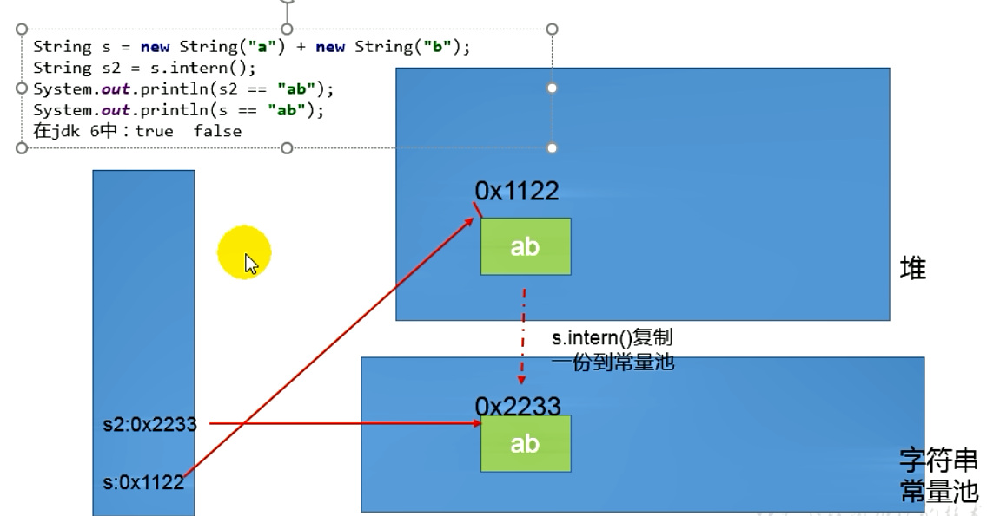


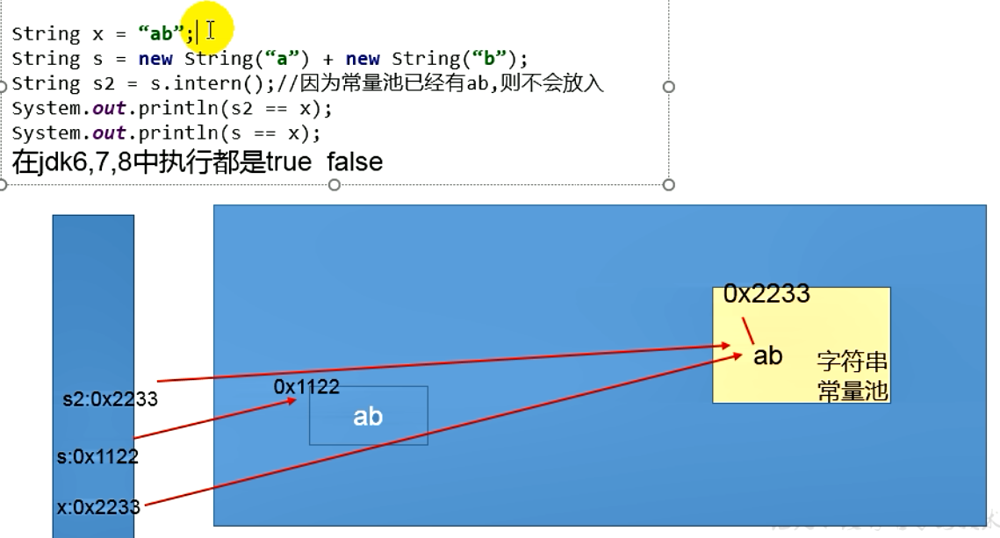

#### intern()的空间效率测试：空间角度

- 实例代码

```java
public class StringIntern {
    static final int MAX_COUNT = 1000 * 10000;
    static final String[] arr = new String[MAX_COUNT];

    public static void main(String[] args) {
        Integer[] data = {1, 2, 3, 4, 5, 6, 7, 8, 9, 1};
        long start = System.currentTimeMillis();
        for (int i = 0; i < MAX_COUNT; i++) {
            // 花费的时间：2815 ms String 实例 1000W
            // arr[i] = new String(String.valueOf(data[i % data.length]));
            // 花费的时间：1304 ms
            arr[i] = new String(String.valueOf(data[i % data.length])).intern();
        }
        long end = System.currentTimeMillis();
        System.out.println("花费的时间：" + (end - start) + " ms");
        try {
            Thread.sleep(1000000);
        } catch (InterruptedException e) {
            e.printStackTrace();
        }
    }
}
```

##### JDK8

不使用intern()

花费的时间：4210 ms


使用intern()

花费的时间：828 ms


- **对于程序中大量的重复的字符串，可以使用intern() 方法节省空间**
- 大的社交网站，需要内存中存储大量的字符串。如果都调用 intern() 方法，就会明显降低内存的大小

##### JDK17

不使用intern()

花费的时间：347 ms


使用intern()

花费的时间：873 ms


值得一提的是JDK17中不使用intern()方法反而更快，不过在这里只考虑空间效率，因此使用intern()方法更佳！！！

### StringTable的垃圾回收

- 实例代码

```java
public class StringGCTest {
    public static void main(String[] args) {
        for (int i = 0; i < 100; i++) {
            String.valueOf(i).intern();
        }
    }
}

```

- 控制台结果

```java
Heap
 PSYoungGen      total 4608K, used 2079K [0x00000000ffb00000, 0x0000000100000000, 0x0000000100000000)
  eden space 4096K, 50% used [0x00000000ffb00000,0x00000000ffd07f58,0x00000000fff00000)
  from space 512K, 0% used [0x00000000fff80000,0x00000000fff80000,0x0000000100000000)
  to   space 512K, 0% used [0x00000000fff00000,0x00000000fff00000,0x00000000fff80000)
 ParOldGen       total 11264K, used 0K [0x00000000ff000000, 0x00000000ffb00000, 0x00000000ffb00000)
  object space 11264K, 0% used [0x00000000ff000000,0x00000000ff000000,0x00000000ffb00000)
 Metaspace       used 3494K, capacity 4498K, committed 4864K, reserved 1056768K
  class space    used 387K, capacity 390K, committed 512K, reserved 1048576K
SymbolTable statistics:
Number of buckets       :     20011 =    160088 bytes, avg   8.000
Number of entries       :     14191 =    340584 bytes, avg  24.000
Number of literals      :     14191 =    604960 bytes, avg  42.630
Total footprint         :           =   1105632 bytes
Average bucket size     :     0.709
Variance of bucket size :     0.713
Std. dev. of bucket size:     0.844
Maximum bucket size     :         6
StringTable statistics:
Number of buckets       :     60013 =    480104 bytes, avg   8.000
Number of entries       :      1876 =     45024 bytes, avg  24.000
Number of literals      :      1876 =    163400 bytes, avg  87.100
Total footprint         :           =    688528 bytes
Average bucket size     :     0.031
Variance of bucket size :     0.031
Std. dev. of bucket size:     0.177
Maximum bucket size     :         2

Process finished with exit code 0

```

- 上述的情况没有发生GC
- 实例代码 增大数据量

```java
public class StringGCTest {
    public static void main(String[] args) {
        for (int i = 0; i < 100000; i++) {
            String.valueOf(i).intern();
        }
    }
}

```

- 执行结果

```java
[GC (Allocation Failure) [PSYoungGen: 4096K->488K(4608K)] 4096K->696K(15872K), 0.0063979 secs] [Times: user=0.00 sys=0.00, real=0.01 secs] 
Heap
 PSYoungGen      total 4608K, used 3802K [0x00000000ffb00000, 0x0000000100000000, 0x0000000100000000)
  eden space 4096K, 80% used [0x00000000ffb00000,0x00000000ffe3c950,0x00000000fff00000)
  from space 512K, 95% used [0x00000000fff00000,0x00000000fff7a020,0x00000000fff80000)
  to   space 512K, 0% used [0x00000000fff80000,0x00000000fff80000,0x0000000100000000)
 ParOldGen       total 11264K, used 208K [0x00000000ff000000, 0x00000000ffb00000, 0x00000000ffb00000)
  object space 11264K, 1% used [0x00000000ff000000,0x00000000ff034000,0x00000000ffb00000)
 Metaspace       used 3497K, capacity 4498K, committed 4864K, reserved 1056768K
  class space    used 387K, capacity 390K, committed 512K, reserved 1048576K
SymbolTable statistics:
Number of buckets       :     20011 =    160088 bytes, avg   8.000
Number of entries       :     14191 =    340584 bytes, avg  24.000
Number of literals      :     14191 =    604960 bytes, avg  42.630
Total footprint         :           =   1105632 bytes
Average bucket size     :     0.709
Variance of bucket size :     0.713
Std. dev. of bucket size:     0.844
Maximum bucket size     :         6
StringTable statistics:
Number of buckets       :     60013 =    480104 bytes, avg   8.000
Number of entries       :     61367 =   1472808 bytes, avg  24.000
Number of literals      :     61367 =   3495800 bytes, avg  56.965
Total footprint         :           =   5448712 bytes
Average bucket size     :     1.023
Variance of bucket size :     0.808
Std. dev. of bucket size:     0.899
Maximum bucket size     :         5

Process finished with exit code 0

```

#### G1的String去重操作

- 背景：对许多Java应用，（有大有小）做的测试结果得出以下结果
    - 堆存活数据集合里面的String对象占用了25%
    - 堆存活数据集合里面重复的对象有13.5%
    - String的平均长度时45
- 许多大规模的Java应用瓶颈在于内存，**Java堆中存活的数据集合差不多25是String对象，但是有一半是重复的，浪费了空间，所以有了G1对String的去重操作**
    * 当垃圾收集器工作的时候，会访问堆上存活的对象。对每一个访问的对象都会检查是否是候选的要去重的string对象。
    * 如果是，把这个对象的一个引用插入到队列中等待后续的处理。一个去重的线程在后台运行，处理这个队列。处理队列的一个元素意味着从队列删除这个元素，然后尝试去重它引用的string对象。
    * 使用一个hashtable来记录所有的被string对象使用的不重复的char数组。当去重的时候，会查这个hashtable，来看堆上是否已经存在一个一模一样的char数组。
    * 如果存在，string对象会被调整引用那个数组，释放对原来的数组的引用，最终会被垃圾收集器回收掉。
    * 如果查找失败，char数组会被插入到hashtable，这样以后的时候就可以共享这个数组了。

## 第14章 垃圾回收

  

### 什么是垃圾


- 关于垃圾收集有三个经典问题
    - 哪些内存需要回收
    - 什么时候回收
    - 如何回收
- 垃圾收集机制是Java的招牌能力。**极大的提高了开发效率**

- **垃圾**
    - 垃圾是指在 **运行程序中没有任何指针指向的对象**，这个对象就是需要被回收的垃圾
- 如果不及时对内存中的垃圾进行清理，那么这些垃圾会一直占用空间，直到程序运行结束，被占用的空间就浪费了，可能会导致内存溢出。

### 为什么需要GC

- 对于高级语言来说，一个基本认知是如果不进行垃圾回收，**内存迟早都会被消耗完**，因为不断地分配内存空间而不进行回收，就好像不停地生产生活垃圾而从来不打扫一样
- 除了释放没用的对象，垃圾回收也可以清除内存里地记忆碎片。碎片整理将所占用地对内存移动到堆的一端，以便 **JVM 将整理出来的内存分配给新的对象**
- 随着应用程序所应付的业务越来越庞大、复杂，用户越来越多，**没有GC就不能保证应用程序的正常进行**。而经常造成STW的GC又跟不上实际的需求，所以在不断对GC进行优化
- 在早期的C/C++时代，垃圾回收基本上是手动执行的，开发人员可以使用new关键字进行内存申请 ，并使用delete关键字进行内存释放。
- 这种方式可以灵活控制内存释放的时间，但是会给开发人员带来 **频繁申请和释放内存的管理负担**，倘若有一处内存区间由于程序员编码的问题忘记被回收，那么就会产生 **内存泄漏**，垃圾对象永远多无法被清除，随着系统运行时间的不断增长，垃圾对象所耗内存可能持续上升，直到出现了内存溢出并造成 **应用程序崩溃**

### Java的垃圾回收机制

- **好处**
    - 自动内存管理，无需开发人员手动参与内存的分配与回收，这样**降低内存泄漏和内存溢出的风险**
    - 自动内存管理机制，将程序员从繁重的内存管理中释放出来，可以 **更专心的专注于业务开发**

- **担忧**
    - 对于Java开发人员来讲，自动内存管理就是一个黑匣子。**会严重弱化Java开发人员在程序出现内存溢出是定位问题和解决问题的能力**
    - 此时了解JVM的自动内存分配和内存回收原理就显得非常重要，只有在真正了解JVM是如何自动管理内存的时候，我们才能在遇见OutOfMemoryError的时候，快速的根据错误异常日志定位问题和解决问题
    - 当需要排查各种内存溢出、内存泄漏的问题的时候，当垃圾收集称为系统达到更高并发量的瓶颈的时候，我们就必须针对这些“自动化”的技术 **实施必要的监控和调节**
- 垃圾回收器可以对年轻代回收，也可以对老年代回收，甚至是全堆和方法区的回收
    - 其中，**Java堆是垃圾回收的工作重点**
    - 从次数上来讲
        - 频繁收集Young区
        - 较少收集Old区
        - 基本不动Perm区

## 第15章 垃圾回收相关算法


### 垃圾标记阶段的算法

#### 垃圾标记阶段：对象是否存活的判断

- 在堆里存放着几乎所有的Java对象实例，在GC执行垃圾回收之前，首先**需要区分出内存中哪些是存活对象，哪些是已经死亡的对象**。只有被标记为死亡的对象，GC才会执行垃圾回收，释放掉其所占用的内存空间，因此这个过程我们称为 **垃圾标记阶段**
- 那么在JVM中究竟是怎样标记一个死亡对象呢？简答来说，当一个对象已经不再被任何存活对象引用的时候，就可以宣判为已经死亡
- 判断对象存活一般有两种方式：**引用计数法和可达性分析算法**

#### 引用计数算法

- 引用计数算法（Reference Counting）比较简单，堆每个对象保存一个完整的整型的 **引用计算属性，用于记录对象被引用的情况**
- 对于一个对象A，只要有一个对象引用类A，则A的引用计数器+1，当引用失效的时候，引用计数器就减去1，只要对象A的引用计数器为0；即表示A不可能再被使用，可进行回收
- 优点：
    - 实现简单，垃圾对象便于识别；判定效率高，回收没有延迟性
- 缺点：
    - 她需要单独的字段存储计数器，这样的做法增加了 **储存空间的开销**
    - 每次复制都需要更新计数器，伴随着加法和减法操作，这增加了 **时间开销**
    - 引用计数器有一个严重的问题，即 **无法处理循环引用**的情况，这是一条致命的缺陷，导致在Java的垃圾回收器中没有使用到这类算法。

- 循环引用


- 实例代码

```java
package cn.icanci.jvm;

/**
 * @Author: icanci
 */
public class GCTest {
    private byte[] bigSize = new byte[5 * 1024 * 1024];
    Object reference = null;

    public static void main(String[] args) {
        GCTest obj1 = new GCTest();
        GCTest obj2 = new GCTest();

        obj1.reference = obj2;
        obj2.reference = obj1;
        obj2 = null;
        obj1 = null;
        System.gc();
    }
}

```


- 如果不小心直接把 Obj1.reference 和 Obj2.reference置为null。则在Java堆当中的两块内存依然有相互引用，无法回收。

**小结**

- 引用计数算法，是很多语言的资源回收选择，入Python，支持引用计数和垃圾收集机制
- 具体哪种是最优是要看场景的，业界有大规模实践中进保留引用计数机制，以提高吞吐量的尝试
- Java并没有选择引用计数，是因为其存在一个基本的难题，就是很难处理循环引用问题
- Python如何解决?
    - 手动解除：很好理解，就是在合适的时机，解除引用关系
    - 使用弱引用weakref，weakref是Python的标准库，为了解决循环引用

#### 可达性分析（或者根搜索算法、追踪性垃圾收集）

- 相当于引用计数算法而言，可达性分析算法不仅仅具有简单和执行高效等特点，更重要的是该算法可以有效的解决 **引用计数算法中循环引用的问题，防止内存泄漏的发生**
- 相对于引用计数算法，这里的可达性分析就是 **Java、C#选择的**，这种类型的垃圾收集通常也叫做 **追踪性垃圾收集（Tracing Garbage Collection）**

- 所谓 "GC Roots"根集合就是一组必须活跃的引用
- 基本思路
    - 可达性分析算法是以根对象集合（GC Roots）为起始点，按照从上至下的方式 **搜索被根对象集合所连接的目标对象是否可达**
    - 使用可达性分析算法后，内存中的存活对象都会被根对象集合直接或者间接连接着，搜索所走过的路径叫做 **引用链（Reference Chain）**
    - 如果目标对象没有任何引用链相连，则是不可达的，就意味着该对象已经死亡，可以标记为垃圾对象
    - 在可达性分析算法中，只有能够被根对象集合直接或者间接连接的对象才是存活对象


- 在Java语言中，GC Roots 包括以下几类元素
    - 虚拟机栈中引用的对象
        - 比如：各个线程被调用的方法中使用到的参数、局部变量
    - 本地方法栈JNI（本地方法）引用的对象
        - 比如：Java类的引用静态变量
    - 方法区中常量引用对象
        - 比如：字符串常量池（StringTable）里的引用
    - 所有同步锁synchronized持有的对象
    - Java虚拟机内部的引用
        - 基本数据类型对应的Class对象，一些常驻得异常对象（NullPointerException、OutOfMemory）系统类加载器
    - 反射Java虚拟机内部情况得JMXBean、JVMTI中注册得回调、本地代码缓存
    - 除了这些固定的GC Roots集合以外，根据用户所选用的垃圾收集器以及当前回收内存区域不同，还可以有其他对象“临时性”的加入，共同构成完成GC Roots 集合，比如：分代收集和局部回收（Partial GC）
    - 小技巧
        - 由于Root 采用栈方式存储变量和指针，所以如果一个指针，它保存了堆内存里面的对象，但是自己又不存放再堆内存里面，那它就是一个Root

- 注意
    - 如果要使用可达性分析算来判断内存是否可回收，那么分析工作必须在一个能报障一致性的快照中进行，这点不满足的话分析结果的准确性就无法保证
    - 这点也是导致GC进行时必须"Stop The World"的一个重要原因
        - 即使是号称（几乎）不会发生停顿的CMS收集器中 **枚举根节点的时候也是必须要停顿的**

### 对象的finalization机制

```java
    protected void finalize() throws Throwable { }
```

- Java语言提供了对象终止（finalization）机制来允许开发人员提供 **对象被销毁之前的自定义处理逻辑**
- 当垃圾回收器发现没有引用指向一个对象，即：垃圾回收此对象之前，总会先调用这个对象的finalize() 方法
- finalize()方法允许在子类中被重新，**用于在对象被回收时进行资源释放**，通常在这个方法中进行一些资源释放和清理的工作，比如关闭文件、套接字和数据库连接等

- **永远不要主动调用某个对象的 finalize() 方法**，应该交给垃圾回收机制调用，理由包括下面三点
    - 在finalize()时可能导致对象复活
    - finalize()方法的执行时间是没有报障的，它完全由GC线程决定，极端情况下，若不发生GC，则finalize()方法没有执行机会
    - 一个糟糕的finalize()会严重影响GC性能

- 从功能上来说，finalize()方法与C++中的析构函数类似
- 由于finalize()方法的存在，**虚拟机中的对象一般处于三种可能的状态**

#### 对象生存还是死亡

- 如果从所有根节点都无法访问到某个对象，说明对象已经不再使用了，一般来说，此对象需要被回收，但是事实上，也并非是 “非死不可”的，这时候它们暂时处于”缓刑“的状态，**一个无法触及的对象由可能再某个条件下”复活“自己** 如果这样，那么对它的回收就是不合理的。为此虚拟机定义对象可能的三种状态
    - **可触及的：**从根节点开始，可以达到这个对象
    - **可复活的：**对象所有的引用都被释放，但是可能再finalize()中复活，但是只有一次复活的机会
    - **不可触及的：**对象的finalize()被调用，并且没有复活，那么就会进入不可触及状态。不可触及的状态不可能被复活，因为 **finalize()只调用一次**
- 以上三种状态，只有在对象不可触及的时候才可以被回收

- **具体过程：判断一个对象objA是否可被回收，至少要经历2次标记过程**
    - 如果对象objA到GC Roots没有引用连接，则进行第一次标记
    - 进行筛选，判断此对象是否有执行finalize()方法，
        - 如果没有重写finalize()方法，或者finalize()方法已经被虚拟机调用过，则虚拟机视为”没有必要执行“，objA被判断是不可触及的
        - 如果对象objA重写了finalize()方法，且还未执行过，那么objA会被插入到F-Queue队列中，由一个虚拟机自动创建的、低优先级的  Finalizer 线程触发其 finalize()方法执行
        - **finalize()方法是对象逃亡的最后机会**，稍后GC会对 F-Queue队列中的对象进行第二次标记     

- **代码演示可复活的对象**

```java
public class CanReliveObj {
    // 类变量，属于 GC Roots
    public static CanReliveObj obj;

    @Override
    protected void finalize() throws Throwable {
        super.finalize();
        System.out.println("调用当前类重写的finalize()方法");
        // 当前对象与引用链上任意一个对象建立了联系——让它变为可复活状态
        obj = this;
    }

    public static void main(String[] args) {
        try {
            obj = new CanReliveObj();
            // 对象第一次调用自己
            obj = null;
            System.gc();
            System.out.println("第一次GC");
            Thread.sleep(2000);
            if (obj == null) {
                System.out.println("obj is dead");
            } else {
                System.out.println("obj is alive");
            }
            System.out.println("第二次GC");
            obj = null;
            System.gc();
            if (obj == null) {
                System.out.println("obj is dead");
            } else {
                System.out.println("obj is alive");
            }
        } catch (Exception e) {
            e.printStackTrace();
        }
    }
}

/**
 * 第一次GC
 * 调用当前类重写的finalize()方法
 * obj is alive
 * 第二次GC
 */
```

### 使用MAT查看GC  Roots溯源

- MAT 是Memory Analyzer的简称 它是一款功能强大的Java堆内存分析器，用于查找内存泄漏以及查看内存消耗情况
- MAT是基于Eclipse开发的，是一款免费的性能分析工具  
    - 官网 ： http://eclipse.org/mat/ 

- **获取dump文件**
- 实例代码

```java
public class GcRootsTest {
    public static void main(String[] args) {
        ArrayList<Object> numList = new ArrayList<>();
        Date birth = new Date();
        for (int i = 0; i < 100; i++) {
            numList.add(String.valueOf(i));
            try {
                Thread.sleep(10);
            } catch (Exception e) {
                e.printStackTrace();
            }
        }
        System.out.println("数据添加完毕，请操作");
        new Scanner(System.in).nextLine();
        numList = null;
        birth = null;
        System.out.println("numList birth 已经置空，请操作");
        new Scanner(System.in).nextLine();
        System.out.println("结束");
    }
}

```

- 使用VisualVM即可生成


- 然后使用MAT打开查看


#### 使用Jprofiler进行GC Roots溯源


### 垃圾清除阶段算法

#### 标记-清除算法

- 当成功区分处内存中存活对象和死亡对象之后，GC接下来的任务就是执行垃圾回收，释放掉无用对象所占用的内存空间，以便有足够的可用内存空间为新对象分配内存
- 目前在JVM中比较常见的三种垃圾收集算法是 **标记-清除算法（Mark-Sweep）、复制算法（Copying）、标记-压缩算法（Mark-Compact）**

- **背景**
    - 标记-清除算法（Mark-Sweep）是一种非常基础和常见的垃圾收集算法，该算法被 J.McCarthy等人在1960年提出并应用于Lisp语言
- 执行过程
    - 当堆中的有效空间（available memory）被耗尽的时候，就会停止整个程序，（也称为 Stop The World）然后进行两项工作，第一项是标记，第二项是清除
    - **标记：**Collector从引用根节点开始遍历，标记所有**被引用的对象**，一般是在对象的Header中记录为可达对象 （标记的是非清除对象）
    - **清除：**Collector对堆内存从头到尾进行线性的遍历，如果发现某个对象在其Header中没有标记为可达对象，则将其回收


- **缺点**
    - 效率不算高
    - 在进行GC的时候，需要停止整个应用程序，导致用户体验差
    - 这种方式清理出来的空闲内存是不连续的，产生内存碎片，需要维护一个空闲列表
- **注意：何为清除**
    - 这里所说的清除不是真的置空，而是把需要清除的对象地址保存在空闲的列表里，下次有新的对象需要加载的时候，判断垃圾位置的空间是否足够，够就存放

#### 复制算法

- **背景**
    - 为了解决标记-清除算法在垃圾回收效率方面的缺陷，复制算法出现
- 核心思想，
    - 将或者的内存空间分为两块，每次只使用其中一块，在垃圾回收的时候将正在使用的内存的活着的对象复制到未使用的内存块中，之后清除正在使用的内存块中的所有对象，交换两个内存的角色，最后完成垃圾回收


- **优点**
    - 没有标记和清除过程，实现简单，运行高效
    - 复制过去之后保证空间的连续性，不会出现”碎片“问题
- **缺点**
    - 很明显，需要2倍的空间
    - 对于G1这种拆分未大量 region 的GC，复制而不是移动，意味着GC需要维护region之间对象的引用关系，不管是内存或者实现开销都不小
- **特别的**
    - 如果系统中的垃圾对象很多，复制算法需要复制的存活对象数量不会太大，或者非常低才行

- **应用场景**
    - 在新生代，对常规的应用的垃圾回收，一次通常可以回收 70%~99%的内存 空间，回收性价比很高，所以现在的商业虚拟机都是使用这种方式作为收集算法回收新生代


#### 压缩（整理）算法

- **背景**
    - 复制算法的高效性是建立在存活对象少、垃圾对象多的前提下的，这种情况在新生代经常发生，但是在老年代，更常见的是大部分对象都是存活对象。如果依然使用复制算法，因为存活的对象很多，复制的成本也很高。因此 **老年代的特征需要其他的算法**
    - 标记清除算法可以应用在老年代中。但是执行效率低效，而且在执行完内存回收之后还会产生内存碎片，所以JVM的设置者在此基础上，**标记 - 压缩算法** 诞生

 

- 执行过程
    - 第一阶段和标记清除算法一样，从根节点开始标记所有被引用的对象
    - 第二阶段将所有的存活对象压缩到内存的一端，按照顺序排放
    - 之后，清理边界外所有的空间

- 标记-压缩算法的最终效果等同于 标记 - 清除算法执行完成之后，在进行一次内存碎片整理，因此，也可以称之为 **标记-清除-压缩（Mark-Sweep-Compact）算法**
- 二者的本质是标记清除算法是一种 **非移动式的回收算法** 标记-压缩是 **移动式的** 是否移动回收后的存活对象是一个优点缺点并存的风险决策

- **优点**
    - 消除了 标记-清除 算法种，内存区域分散的缺点。我们需要给新对象分配内存的时候，JVM只需要持有一个内存的起始地址即可
    - 消除了复制算法当中，内存减半的高额代价
- **缺点**
    - 从效率上说，标记-整理算法要低于复制算法
    - 移动对象的同时，如果对象被引用，还需要调整引用的地址
    - 移动过程种，需要全程暂停用户应用程序 即 STW

#### 小结


- 效率上来说，复制算法是当之无愧的老大吗，但是浪费了太多内存
- 标记整理相对更平滑一点

#### 分代收集算法

- 没有一种算法可以完全取代其他算法，它们都有自己的优点和缺点
- 所以采用 **不同生命周期的对象可以采取不同的收集方式，以便提供回收效率**
- 核心思想：具体问题具体分析

- **几乎所有的GC都是采用分代收集（Generational Collecting）算法执行垃圾回收的**
- Hotspot虚拟机
    - 年轻代：区域相对老年代较小，对象生命周期短，存活率低，回收频繁 。 此时使用复制算法是最快的，同时借助了 S0和S1区
    - 老年代：区域较大，对象生命周期长，存活率高、回收不及年轻代频繁。这个时候一般使用标记-清除或者标记清除与标记整理一起出现

- 以HotSpot中的CMS回收器为例，CMS是基于 Mark-Sweep实现的。对于对象的回收效率很高。对于碎片问题，CMS采用基于Mark-Compact算法的Serial Old回收器作为补偿措施：当内存回收热点（碎片导致的 Concurrent Mode Failure时），将采用Serial  Old 执行Full GC对老年代进行内存的整理

### 增量收集算法和分区算法

**增量收集算法**

- 在上述的算法，在垃圾回收的过程中，都会出现STW的状态，影响程序的运行，所以增量收集（Incremental Collecting ）算法的诞生
- 基本思想
    - 如果一次性将所有的垃圾进程处理，需要造成系统长时间的停顿，所以可以让垃圾收集线程和应用程序线程交替执行。每次 **垃圾回收线程只收集一小部分区域空间，接着切换到应用线程，依此反复，直到完成**
    - 总的来说，基础仍然时传统的 标记-清除算法和复制算法。增量收集算法 **通过对线程间冲突的妥善管理，允许垃圾收集线程以分阶段的方式完成标记、清理、或复制工作**
- **缺点**
    - 使用这种方式，由于在垃圾回收过程中，间断性的还执行了应用程序代码，所以能减少系统的停顿时间，但是线程上下文切换，会使得垃圾回收的总体成本上升，**造成系统的吞吐量下降**

**分区算法**

- 一般来说，在相同的条件下，堆空间越大，一次GC时所需要的时间就越长，GC产生的停顿就越长。为了控制好停顿时间，将堆分为不同的区块，从而减少一次GC的影响。
- 分代算法按照对象的生命周期长短划分为2个部分，分区算法整整个堆划分为连续的不同小空间
- 每个小空间独立使用，独立回收，可以一次控制多个小区


## 第16章 垃圾回收相关概念

### System.gc()的理解

- 默认情况下，通过System.gc()或者Runtime.getRuntime().gc()的调用，**会显示触发Full GC**，同时对老年代和新生代进行回收，尝试释放被丢弃对象占用的内存
- 然后System.gc() 调用附带也该免责声明，无法保证对垃圾收集器的调用
- JVM实现着可以通过System.gc() 调用来决定JVM的GC行为 ，而一般情况下，垃圾回收应该自自动进行的 **无需手动触发，否则就太过于麻烦了** 

```java
package chapter16;

public class GCTest {

    public static void main(String[] args) {
        GCTest test = new GCTest();
        test.func3();
    }

    private void func1() {
        byte[] buffer = new byte[1024 * 1024 * 10];
        System.gc();
    }

    private void func2() {
        byte[] buffer = new byte[1024 * 1024 * 10];
        buffer = null;
        System.gc();
    }

    private void func3() {
        {
            byte[] buffer = new byte[1024 * 1024 * 10];
        }
        System.gc();
    }

    private void func4() {
        {
            byte[] buffer = new byte[1024 * 1024 * 10];
        }
        int value = 10;
        System.gc();
    }
}
```

func1不被回收和func2被回收是显而易见的

但是func3没有被回收为什么？


查看字节码


可以看到局部变量表只有一个，而多出来的那个正是buffer

再来看func4


很明显func4是被回收了的，为什么？


可以看到同样是两个变量slot


但是本地变量表有两个，即value占据了buffer的slot,new 出来的Byte数组没有了引用自然就被GC

### 内存溢出与内存泄漏

#### 内存溢出

- 内存溢出相对于内存泄漏来讲，尽管更容易被理解，但是同样的，内存溢出也是引发程序崩溃的罪魁祸首之一
- 由于GC一直在发展，所以一般情况下，除非应用程序占用的内存增长速度非常快，造成垃圾回收已经跟不上内存消耗的速度，否则不是很容易出现OOM的情况
- 大多情况下，GC会进行各种年龄段的垃圾回收，实在不行了就放发招，来一次Full GC，这个时候会释放大量的内存
- javadoc中对OutOfMemoryError的解释是，**没有空闲内存，并且垃圾收集器也无法提供更多内存**

- 首先说没有空闲内存的情况：说明Java虚拟机的堆内存不够，
    - **Java虚拟机的堆内存设置不够**
    - 比如：可能存在内存泄漏问题；也有可能是堆的大小不合理，比如我们要处理比较可观的数据量，但是没有显示指定JVM堆大小或者指定数值偏小。我们可以通过 -Xms -Xmx 来调整
    - **代码中创建了大量的大对象，并且长时间不能被垃圾收集器收集（存在引用）**
    - 对于老版本的Oracle JDK ，永久代的大小是有限的。并且JVM对永久代垃圾回收非常不积极。所以永久代出现 OutOfMemoryError 非常常见，尤其是在运行大量动态生成的场合；类似intern字符串缓存占用太多空间
    - 随着元空间的引入，方法区内存已经不再那么窘迫。所以响应的OOM有所改观，出现OOM，异常信息变成了“java.lang.OutOfMemoryError:Metaspace "  直接内存不足，也会导致OOM

- 这里隐含着一层意思，在抛出OutOfMemoryError之前，通常垃圾收集器会被触发尽其所能去收集空间
    - 在引用机制分析中，涉及到JVM会去尝试回收**软引用指向的对象等**
    - 在java.nio.Bits.reserveMemory()方法中，我们能清楚的看到，System.gc() 会被调用，以清理空间
- 当然，也不是任何情况下垃圾回收器都会被触发的
    - 比如我们去分配一个超级大的对象，JVM判断垃圾收集器不能解决这个问题，就直接抛出OutOfMemoryError

#### 内存泄漏

- 也称作”存储渗漏“ **严格来说：只有对象不会被程序用到了，但是GC又不能回收他们的情况，才叫内存泄漏**

- 但是实际情况很多时候一些不太好的实践（或疏忽）会导致对象的生命周期变得很长，甚至OOM。也可以叫做 **宽泛意义上的 内存泄漏**

    >比如把局部引用的定义为static或者成员变量
    >
    >又或者把某个没必要的数据存储在会话域等

- 尽管内存泄漏不会立刻引起程序崩溃，但是一旦发生，程序中的内存就会被逐步蚕食，直到发生OutOfMemoryError

- 这里的内存不是指的物理内存，而是虚拟机内存大小


**举例**

- 单例模式
    - 单例的生命周期和应用程序时一样长的，所以单例程序中，如果持有对象外部引用的话，那么这个外部对象时不能被回收的，则会导致内存泄漏的发生
- 一些提供close的资源未关闭而导致内存泄漏
    - 数据库连接 网络连接 和IO连接必须手动close，否则不能回收

### Stop The World

- Stop The World 简称STW，指的是GC事件发生的过程中，会产生应用程序的停顿，**停顿产生的时候整个应用程序线程都会被暂停，没有任何响应** 有点卡死的感觉
    - 可达性分析的枚举根节点（GC Roots）会导致所有的Java执行线程停顿，
        - 分析工作必须在一个确保一致性的快照中进行
        - 一致性指的是整个分析过程系统像是冻结在某个点上
        - **如果出现分析过程中对象引用关系还在不断地变化，则分析地结果无法保证**
- 被STW中断地应用会在完成GC之后恢复，频繁中段会让用户感觉像是网速不快造成电影卡带一样。

- STW事件和采用哪款GC无关，所有地GC都有整个事件
- 哪怕是G1、CMS和ZGC也不能完全避免STW，只能说垃圾回收器越来越优秀，回收效率越来越高。尽可能地缩短了暂停地时间
- STW是JVM**后台自动发起和完成的** 在用户不可见的情况下，把用户正常的工作线程全部停掉
- 开发中不要使用System.gc() 会导致Stop-the-world的发生

### 垃圾回收的并行与并发

#### 并发

- 操作系统中，一个时间段有几个程序都处于启动到运行完毕之间，且这几个程序都是在同一个处理器上运行
- 并发不是真正的 ”同时进行“ 只是CPU的时间片轮转，让用户觉得很快，没有切换的感觉


#### 并行

- 当系统有一个以上的CPU的时候，一个CPU执行一个进程，另一个CPU可以执行另外一个进程。两个进程互不抢占CPU资源。可以同时进行，我们称之为并行（Parallel）
- 其实决定并行的不是CPU的数量，而是CPU的核心数量，一个CPU多核心也可以并行


#### 二者对比

- 并发：指的是多个事情，在 **同一个时间段内同时发生了**
- 并行：指的是多个事情，在 **同一个时间点上同时发生了**
- 并发的多个任务是相互抢占资源的
- 并行的读个任务是不相互抢占资源的
- 只有多个CPU或者一个CPU多核心的情况中，才会发生并行

#### 垃圾回收的并发与并行

- 并行（Parallel）：指多条垃圾回收线程并行工作，但此时用户线程仍处于等待状态
    - 如 ParNew Parallel Scavenge Parallel Old
- 串行（Serial）
    - 单线程执行
    - 如果内存不够，程序暂停，启动JVM垃圾回收器进行垃圾回收。回收完在启动程序的线程


- 并发（Concurrent）
    - 指用户线程与垃圾收集器线程同时执行。垃圾回收线程执行的时候不会停顿用户程序的执行
        - 用户程序继续执行，垃圾在另外一个核心上执行
        - CMS G1


### 安全点和安全区域

- 程序执行时并非在所有地方都能停下来开始GC，只有在特定位置才能停下来开始GC。这些位置称为 “安全点（Safe Point）”
- Safe Point的选择十分重要。**如果太少可能导致GC等待的时间太长，太频繁就会导致运行时的性能问题** 
- 通常会根据**“是否具有让程序长时间执行的特性”**为标准。比如：选择一些执行指令作为 Safe Point ，**如方法调用、循环跳转、异常跳转等**

- 如何在GC发生时，检查所有的线程都跑到最近的安全点停顿下来呢？
    - **抢断式中断（目前没有虚拟机采用）**
    - 首先中断所有线程，如有线程不在安全的，就恢复线程，让线程跑到安全点
    - **主动式中断**
    - 设置一个中断标志，各个线程运行到Safe Point的时候主动轮询这个标志，为true，就将自己进行中断挂起
- 安全区域
    - 指一段代码片段，对象的引用关系不会发生变化。这个区域的任何位置开始GC都是安全的

### Java中的引用

> 具体的解释见 ： **Java基础学习/Java - 多线程 - 增强篇 - 四种引用类型.md**


**Java中有四种引用类型，分别是如下四种**

- 强引用
- 软引用
- 弱引用
- 虚引用

#### 强引用

- 在Java中默认声明的就是强引用，如下代码：

```java
// 只要 o 还指向Object对象，对象 o 就不会被GC回收
Object o = new Object();
o = null;
```

- 只要强引用存在，GC就永远不会回收被引用的对象，就算是内存不足的时候，JVM也会直接抛出 **OutOfMemoryError**，也不会去回收。
- 如果想中断强引用与对象之间的联系，可以显示的将强引用赋值为null，这个时候就等待GC回收对对象即可。

#### 软引用

- 软引是用来描述一些非必须但是仍有用的对象。**在内存足够的时候，软引用对象不会被回收，只有在内存不足的时候，系统会回收软引用对象，如果回收了软引用对象之后仍然没有足够的内存，才会抛出内存溢出异常** 这种特性非常适合用来做**缓存**
- 在JDK1.2之后，使用 java.lang.ref.SoftReference类来表示软引用
- 下面举例说明：先配置IDEA执行代码的VM参数 `-Xms2M -Xmx3M`JVM初始内存设为2M，最大可用内存为3M

```java
/**
 * VM参数：-Xms2M -Xmx3M
 */
public class Test2 {
    public static void main(String[] args) {
        byte[] bytes = new byte[1024 * 1024 * 3];
    }
}

// Exception in thread "main" java.lang.OutOfMemoryError: Java heap space
```

- 现在设置为软引用，如下代码所示

```java
/**
 * VM参数：-Xms2M -Xmx3M
 */
public class TestSoftReferenceOom {

    private static List<Object> list = new ArrayList();

    public static void main(String[] args) {
        testReferenceOom();
    }

    public static void testReferenceOom() {
        for (int i = 0; i < 10; i++) {
            byte[] b = new byte[1024 * 1024];
            SoftReference<byte[]> reference = new SoftReference<>(b);
            list.add(reference);
        }
        
        // 触发一次GC 注意：并不是一定会立刻执行GC
        System.gc();

        for (int i = 0; i < list.size(); i++) {
            Object obj = ((SoftReference) list.get(i)).get();
            System.out.print(obj + " ");
        }
    }
}

// null null null null null null null null null [B@1540e19d 
```

- 此时我们发现，无论创建了多少对象，之前的对象都为null，只保留了最后一个对象，这就说明了在内存空间不足的情况下，软引用会被回收
- 值得注意的一点 , 即使有 byte[] b引用指向对象, 且 b 是一个strong reference, 但是 SoftReference sr 指向的对象仍然被回收了，这是因为Java的编译器发现了在之后的代码中, b已经没有被使用了, 所以自动进行了优化。 
- 这时候稍稍改动一下代码如下

```java
/**
 * VM参数：-Xms2M -Xmx3M
 */
public class TestSoftReferenceOom {

    private static List<Object> list = new ArrayList();

    public static void main(String[] args) {
        testReferenceOom();
    }

    public static void testReferenceOom() {
        byte[] b = null;
        for (int i = 0; i < 10; i++) {
            b = new byte[1024 * 1024];
            SoftReference<byte[]> reference = new SoftReference<>(b);
            list.add(reference);
        }
        
        // 触发一次GC 注意：并不是一定会立刻执行GC
        System.gc();

        for (int i = 0; i < list.size(); i++) {
            Object obj = ((SoftReference) list.get(i)).get();
            System.out.print(obj + " ");
        }
    }
}

// Exception in thread "main" java.lang.OutOfMemoryError: Java heap space
```

- 此时b是强引用，无法被回收。报错

#### 弱引用

- 弱引用的引用强度比软引用还要低一些，只有JVM在GC的之后，**无论弱引用有没有被引用，都要被回收**
- 在JDK1.2之后，在java.lang.ref.WeekReference来创建弱引用
- 代码示例

```java
/**
 * VM参数：-Xms2M -Xmx3M
 */
public class TestSoftReferenceOom {

    private static List<Object> list = new ArrayList();

    public static void main(String[] args) {
        testWeakReferenceOom();
    }

    public static void testWeakReferenceOom() {

        for (int i = 0; i < 10; i++) {
            byte[] b = new byte[1024 * 1024];
            WeakReference<byte[]> reference = new WeakReference<>(b);
            list.add(reference);
        }
        System.gc();

        for (int i = 0; i < list.size(); i++) {
            Object obj = ((WeakReference) list.get(i)).get();
            System.out.print(obj + " ");
        }
    }
}

// null null null null null null null null null null 
```

- 此时我们发现，所有的引用都为null

#### 虚引用

-  虚引用是最弱的一种引用关系，如果一个对象仅持有虚引用，那么它就和没有任何引用一样，它随时可能会被回收 
-  在JDK1.2之后的 java.util.ref.PhantomReference
-  发现它只有一个构造函数和一个 get() 方法，而且它的 get() 方法仅仅是返回一个null，也就是说将永远无法通过虚引用来获取对象，虚引用必须要和 ReferenceQueue 引用队列一起使用。 

```java
public class PhantomReference<T> extends Reference<T> {

    public T get() {
        return null;
    }

    public PhantomReference(T referent, ReferenceQueue<? super T> q) {
        super(referent, q);
    }
}

```

-  那么传入它的构造方法中的 ReferenceQueue 又是如何使用的呢？ 

#### 引用队列

- 引用队列可以与软引用、弱引用以及虚引用一起配合使用，当垃圾回收器准备回收一个对象时，如果发现它还有引用，那么就会在回收对象之前，把这个引用加入到与之关联的引用队列中去。
- 程序可以通过判断引用队列中是否已经加入了引用，来判断被引用的对象是否将要被垃圾回收，这样就可以在对象被回收之前采取一些必要的措施。
- 与软引用、弱引用不同，虚引用必须和引用队列一起使用

#### 拓展 - WeakHashMap

- WeakHashMap类及其实现WeakHashMap类在java.util包内，它实现了Map接口，是HashMap的一种实现，它使用弱引用作为内部数据的存储方案。

```java
public void test() {
    Map map;
    // 弱引用 HashMap
    map = new WeakHashMap();
    for (int i = 0; i < 10000; i++) {
        map.put("key" + i, new byte[i]);
    }
    // 强引用HashMap
    map = new HashMap();
    for (int i = 0; i < 10000; i++) {
        map.put("key" + i, new byte[i]);
    }
}
```

- WeakHashMap会在系统内存紧张时使用弱引用，自动释放掉持有弱引用的内存数据。但如果WeakHashMap的key都在系统内持有强引用，那么WeakHashMap就退化为普通的HashMap，因为所有的表项都无法被自动清理。

#### 总结

| 类型   | 回收时间                                | 使用场景                                                     |
| ------ | --------------------------------------- | ------------------------------------------------------------ |
| 强引用 | 一直存活，除非GC Roots不可达            | 所有程序的场景，基本对象，自定义对象等。                     |
| 软引用 | 内存不足时会被回收                      | 一般用在对内存非常敏感的资源上，用作缓存的场景比较多，例如：网页缓存、图片缓存 |
| 弱引用 | 只能存活到下一次GC前                    | 生命周期很短的对象，例如ThreadLocal中的Key。                 |
| 虚引用 | 随时会被回收， 创建了可能很快就会被回收 | 业界暂无使用场景， 可能被JVM团队内部用来跟踪JVM的垃圾回收活动 |

## 第17章 垃圾回收器

### GC分类与性能指标

#### GC分类

- 垃圾回收器没有在规范中进行过多的规定，可以由不同厂商、不同版本的JVM来实现
- 由于JDK的版本在高速迭代，现在已经有了很多版本
- 从不同角度分析垃圾回收器，可以将GC分为不同的类型

- **按照线程数分，可以分为串行垃圾回收器和并行垃圾回收器**

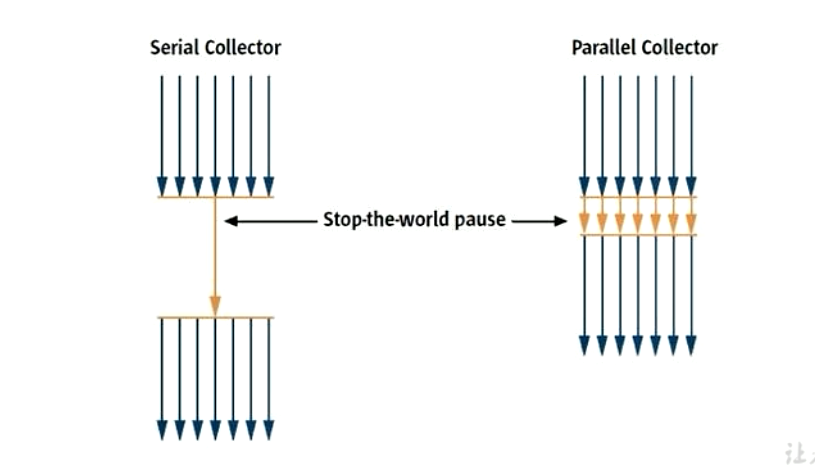

-  串行回收指的是在同一时间段内只允许有一个CPU用于执行垃圾回收操作，此时工作线程被暂停，直至垃圾收集工作结束
    - 在诸如但CPU处理器或者较小的应用内存等硬件平台不是特别优越的场合，串行回收器的性能表现可以超过并行回收器和并发回收器。所以 **串行回收默认被应用在客户端的Client模式下的JVM中**
    - 在并发能力较强的CPU上，并行回收器产生的停顿时间要短于串行回收器
-  和串行回收相反，并行收集可以运用多个CPU共同执行垃圾回收，因此提升了应用的吞吐量，不过并行回收仍然与串行回收一样，采用独占式，使用 “Stop the World”机制

-  **按照工作模式分，可以分为并发式垃圾回收器和独占式垃圾回收器**
    - 并发式垃圾回收器与应用程序线程交替工作，以尽可能较少程序的停顿时间
    - 独占式垃圾回收器（Stop The World）一旦运行，就停止程序中所有的用户线程，直到垃圾回收过程完全结束


- **按照碎片处理方式分，可以分为压缩式垃圾回收器和非压缩式垃圾回收器**
    - 压缩式垃圾回收器会在回收完成之后，对存活的对象进行压缩整理，消除回收后的碎片
    - 非压缩式的垃圾回收器不进行这操作
- **按照工作的内部区间划分，又可以分为年轻代垃圾回收器和老年代垃圾回收器**

#### 性能指标

- **吞吐量：运行用户代码的时间占总运行时间的比例**
    - （总运行时间：程序的运行时间+内存回收的时间）
- 垃圾收集器开销：吞吐量的补数，垃圾收集所有时间与总运行时间的比例
- **暂停时间：执行垃圾回收的时候，程序的工作线程被暂停的时间**
- 收集频率：相对于应用程序的执行，收集操作发生的频率
- **内存占用：Java堆区所占用的内存大小**
- 快速：一个对象从诞生到回收所经历的时间

- **吞吐量、暂停时间、内存占用 共同构成了一个“不可能三角”**
- 简单来说：吞吐量、暂停时间

##### 评估GC的性能指标：吞吐量（Throughput）

- 吞吐量就是CPU用于运行用户代码的时间与CPU总消耗时间的比值，即吞吐量 = 运行用户代码时间 / 
    （用户代码时间 + 垃圾收集时间）
    - 虚拟机运行100分钟，垃圾收集1分钟，那么吞吐量就是 99%
- 这种情况下，应用程序能容忍比较高的暂停时间，因此，高吞吐量的应用程序有更长的时间基准，快速响应式不必考虑的
- 吞吐量优先，意外着在单位时间内，STW的时间最短：0.2+02 = 0.4


##### 评估GC的性能指标：暂停时间（pause time）

- 暂停时间 式指一个时间段内应用程序线程暂停，让GC执行的状态
    - GC期间100毫秒的暂停时间，说明这100毫秒期间没有任何应用程序是活动的
- 暂停时间优先 意味着让单次 STW的时间最短，0.1+0.1+0.1+0.1+0.1 = 0.5


##### 吞吐量和暂停时间的对比

- 高吞吐量较好是因为让程序的最终用户感觉只有用户程序在做“生产性”工作，直觉上，吞吐量越高程序运行越快
- 低暂停时间（低延迟）较好因此从最终用户的角度看不管是GC还是其他原因导致一个应用被挂起始终是不好的，这取决于应用程序的类型，**有时候甚至短暂的200毫秒都可能打断用户的体验**，所以对于一个**交互式应用程序**具有低的较大的暂停时间是很有必要的
- 然后高吞吐量和低暂停时间是一对相互竞争的目标（矛盾）
- 在设计或者使用GC算法的时候，我们必须确定我们的目标：一个GC算法只能针对两个目标之一，或者尝试找到一个二者的折中
- 现在标准：**在最大吞吐量优先的情况下，降低停顿时间**

##### 关于GC控制台打印的一些参数说明

```markdown
jstat -gc 2764 250 20   //2764表示进程id ，250表示250毫秒打印一次 ，20表示一共打印20次
S0C：第一个幸存区的大小
S1C：第二个幸存区的大小
S0U：第一个幸存区的使用大小
S1U：第二个幸存区的使用大小
EC：伊甸园区的大小
EU：伊甸园区的使用大小
OC：老年代大小
OU：老年代使用大小
MC：方法区大小
MU：方法区使用大小
CCSC:压缩类空间大小
CCSU:压缩类空间使用大小
YGC：年轻代垃圾回收次数
YGCT：年轻代垃圾回收消耗时间
FGC：老年代垃圾回收次数
FGCT：老年代垃圾回收消耗时间
GCT：垃圾回收消耗总时间
```

### 垃圾回收器

#### 不同的垃圾回收器概述

- 垃圾收集器是Java的招牌能力 极大的提高了开发效率，这也是面试的重点
- **虚拟机发展历史**
    - 1999年随JDK1.3.1一起来的是串行方式的Serial Gc ，它是第一款GC。ParNew垃圾收集器是serial收集器的多线程版本
    - 2002年2月26日，Parallel Gc和concurrent Mark SweepGC跟随JDK1.4.2—起发布
    - Parallel Gc在JDK6之后成为HotSpot默认GC。
    - 2012年，在JDK1.7u4版本中，G1可用。
    - 2017年，JDK9中G1变成默认的垃圾收集器，以替代CMS。
    - 2018年3月，JDK10中G1垃圾回收器的并行完整垃圾回收，实现并行性来改善最坏情况下的延迟。
    - 2018年9月，JDK11发布。引入Epsilon垃圾回收器，又被称为"No-Op(无操作)" S回收器。同时，引入ZGC:可伸缩的低延迟垃圾回收器(Experimental)。
    - 2019年9月，JDK13发布。增强ZGC，自动返回未用堆内存给操作系统。
    - 2020年3月，JDK14发布。删除CMS垃圾回收器。扩展ZGC在macoS和windows上的应用

**7款经典垃圾收集器**（在JDK11的ZGC之前）

- 串行回收器：Serial、Serial Old
- 并行收集器：ParNew、Parallel、Scavenge、Parallel Old
- 并发回收器：CMS、G1

#### 垃圾回收器的组合关系

**7款经典垃圾回收器与垃圾分代之间的关系**


- 新生代收集器：Serial、ParNew、Parallel 、Scavenge
- 老年代收集器：Serial Old、Parallel Old、CMS
- 整堆收集器：G1

**组合关系**


- 两个收集器间有连线，表明它们可以搭配使用:

    - Serial/Serial old、Seria1/CMS、ParNew/Serial old、ParNew/CMS、Parallel Scavenge/Serial old、Parallel Scavenge/Parallel old、G1;
    - 其中serial old作为CMS出现"concurrent Mode Failure"失败的后备预案。

    - (红色虚线)由于维护和兼容性测试的成本，在JDK 8时将serial+CMS、ParNew+Serial old这两个组合声明为废弃（JEP 173），并在JDK 9中完全取消了，这些组合的支持（EP214），即:移除。
    - (绿色虚线)JDK14中:弃用Parallel Scavenge和Serial0ld Gc组合(JEP336)
    - （青色虚线)DK 14中:]删除CMS垃圾回收器(EP 363)

- 为什么要有很多收集器，一个不够吗?闳为Java的使用场景很多，移动端，服务器等。所以就需要针对不同的场景，提供不同的垃圾收集器，提高垃圾收集的性能。
- 虽然我们会对各个收集器进行比较，但并非为了挑选一个最好的收集器出来。没有一种放之四海皆准、任何场景下都适用的完美收集器存在，更加没有万能的收集器。所以**我们选择的只是对具体应用最合适的收集器。**

#### 查看默认的垃圾收集器

- -XX:+PrintCommandLineFlags 查看命令行参数，包括使用的垃圾收集器 JDK8没有使用G1收集器，JDK9才开始

```java
-XX:InitialHeapSize=266668608 -XX:MaxHeapSize=4266697728 -XX:+PrintCommandLineFlags -XX:+UseCompressedClassPointers -XX:+UseCompressedOops -XX:-UseLargePagesIndividualAllocation -XX:+UseParallelGC 
```

- 执行命令行指令：jinfo -flag 相关垃圾回收器参数 进程id

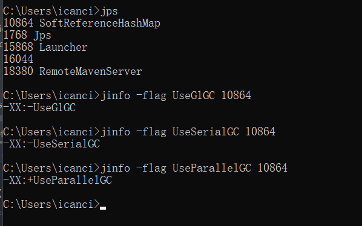

#### Serial回收器 - 串行回收

- Serial收集器是最基本、历史最悠久的垃圾收集器了。JDK1.3之前回收新生代唯一的选择
- Serial收集器作为Hotspot中Client模式下的默认新生代垃圾收集器
- **Serial收集器采用复制算法、串行回收和”Stop-the-world“ 机制的方式执行内存回收**
- 除了年轻代之外，Serial收集器还提供用于执行老年代垃圾收集的Serial Old收集器。**Serial Old 收集器同样采用了串行回收和”Stop the World“机制 只不过内存回收算法使用的是 标记-压缩算法**
    - Serial Old 是运行在Client模式下默认的老年代垃圾收集器
    - Serial Old 在Server模式下主要有两个用途
        - 与新生代的Parallel Scavenge 配合使用
        - 作为老年代CMS收集器的后备垃圾收集方案


- 这个收集器是一个单线程的收集器，但它的”单线程“的意义并不仅仅说明它 **只会使用一个CPU或一条收集线程去完成垃圾收集工作**，更重要的是在它进行垃圾收集的时候，**必须暂停其他所有的工作线程**，直到它收集结束（Stop - The - World）

- **优势：简单而高效**（和其他收集器的单线程比），对于限定的单个CPU的环境来说，Serial 收集器由于没有线程相互的开销，专心做垃圾收集自然可以获得最高的单线程的收集效率
    - 运行在Client模式下的虚拟机是个不粗的选择

- 在用户的桌面应用场景中，可用内存一般不大（几十MB至一两百MB），可以在较短时间内完成垃圾收集（几十ms至一百多ms），只要不频繁发生,。使用串行回收器是可以接受的。
- 在HotSpot虚拟机中，使用-XX:+UseSerialGC参数可以指定年轻代和老年代都使用串行收集器。
    - 等价于新生代用serial Gc，且老年代用Serial old Gc

**总结**

- 了解即可，现在已经不用串行的了。而且在限定单核CPU才可以使用，现在都不是单核的了
- 对于交互性较强的应用而言，这是不可以接受的 JavaWeb都不使用串行

#### ParNew回收器- 并行回收

- 如果说Serial GC是年轻代中的单线程垃圾收集器，那么ParNew收集器则是serial收集器的多线程版本。
    - Par是Parallel的缩写，New:只能处理的是新生代

- ParNew收集器除了采用**并行回收**的方式执行内存回收外，两款垃圾收集器之间几乎没有任何区别。ParNew收集器在年轻代中同样也是采用**复制算法、"stop-the-World"机制**
- ParNew是很多JVM运行在server模式下新生代的默认垃圾收集器。


- 对于新生代，回收次数频繁，使用并行方式高效
- 对于老年代，回收次数少，使用串行方式节省资源（CPU并行需要切换线程，串行可以省去切换线程的资源）

- ParNew收集器是基于并行回收，就可以判断ParNew收集器的回收效率在任何场景下都会比Serial收集器更高效
    - ParNew收集器在多CPU环境下，可以利用多核心的资源，可以更快完成
    - 但是 **在单个CPU的环境下，ParNew收集器不比Serial收集器跟高效**
- 因为除了 Serial 外，目前只有ParNew GC 能与CMS收集器配合工作

- 参数配置：-XX:UseParNewGC 手动设置是否开启 -XX:ParallelGCThreads 限制线程数量，默认开启个CPU数据相同的线程数

#### Parallel回收器 - 吞吐量优先

- HotSpot的年轻代中除了拥有ParNew收集器是基于并行回收的以外，Parallel scavenge收集器同样也采用了**复制算法、并行回收和"stop the World"机制。**
- 那么Parallel收集器的出现是否多此一举?

    - 和ParNew收集器不同，Parallel Scavenge收集器的目标则是达到一个**可控制的吞吐量（Throughput）**，它也被称为吞吐量优先的垃圾收集器。
    - 自适应调节策略也是Parallel scavenge与ParNew一个重要区别。
- 高吞吐量则可以高效率地利用CPU时间，尽快完成程序的运算任别主要**适合在后台运算而不需要太多交互的任务**。因此，常见在服务器环境中使用，例如：批处理、订单处理、工资支付、科学计算的应用程序
- Parallel old收集器，用来代替老年代的serial old收集器。
- Parallel old收集器采用了**标记-压缩算法**，但同样也是**基于并行回收和”Stop - the World“机制**


- 在程序吞吐量优先的应用场景中，Parallel 收集器和Parallel Old的结合在Server模式下的内存回收性能很不错
- Java8中默认是此收集器

- **参数设置**
    - -XX:+UseParallelGC 手动设置年轻代使用Parallel并行收集器执行回收任务
    - -XX:+UseParallelOldGC 手动指定老年代都是使用并行回收收集器
        - 分别适用于新生代和老年代，JDK8默认开启
        - 上面的两个参数，开启一个，另外一个也会激活
    - -XX:ParallelGCThreads 设置年轻代并行收集器的线程数，一般与CPU相等，以避免过多对的线程数影响垃圾收集行呢个
        - 默认情况下，当CPU的数量小于8个，ParallelGCThreads 的值等于CPU数量
        - 当CPU数量大于8个，ParallelGCThreads 的值等于 3+[[5*CPU_Count]/8]
    - -XX:MaxGCPauseMillis 设置垃圾收集器最大停顿时间（也就是STW的时间）单位是毫秒
        - 为了尽可能把停顿的时间控制在 MaxGCPauseMillis 内，收集器工作的时候会设置堆的大小或者其他的参数
        - **使用此参数需要谨慎**
    - -XX:GCTimeRatio 垃圾回收时间占总时间的比例（= 1/（N+1）） 用于衡量吞吐量的大小
        - 取值范围（1~100 ） 默认99
    - -XX:+UseAdaptiveSizePolicy 设置具有自适应调节

#### CMS垃圾回收器 - 低延迟

- 在JDK1.5 时期，Hotspot推出了一款在 **强交互应用**中几乎可认为时代意义的垃圾收集器:CMS (Concurrent-Mark-Sweep)收集器，**这款收集器是HotSpot虚拟机中第一款真正意义上的并发收集器，它第一次实现了让垃圾收集线程与用户线程同时工作。** 
- CMS收集器的关注点是尽可能缩短垃圾收集时用户线程的停顿时间。停顿时间越短（低延迟）就越适合与用户交互的程序，良好的响应速度能提升用户体验
    - **目前很大一部分的Java应用集中在互联网站或者B/s系统的服务端上，这类应用尤其重视服务的响应速度，希望系统停顿时间最短，以给用户带来较好的体验。**
    - CMS收集器就非常符合这类应用的需求。
- CMS的垃圾收集算法采用**标记-清除**算法，并且也会"Stop-the-world"

- CMS 不能作为老年代的收集器，却无法与JDK1.4 中已经存在新生代收集器Parallel Scavenge 配合工作，所以采用CMS来收集老年代，新生代只能选择ParNew或者Serial收集器中选择一个
- 在G1出现之前，CMS使用还是非常广泛的，一直到今天仍然有很多系统使用CMS GC


**CMS工作原理**

- CMS整个过程比之前的收集器都要复杂，整个过程分为4个主要阶段，即初始标记阶段、并发标记阶段、重新标记阶段和并发清除阶段
- 初始标记（Initial-Mark）阶段：在这个阶段，程序中所有的工作线程都会因为”STW“机制而出现短暂的暂停，这个阶段的任务**仅仅是为了标记出GC Roots能直接关联的对象** 一旦标记完成之后就会恢复之前被暂停的所有应用线程，由于直接关联对象比较小，所以这里 **速度非常快**
- 并发标记（Concurrent-Mark）阶段：从GC Roots的 **直接关联对象开始遍历整个对象图的过程**，这个过程**耗时长**但是**不需要停顿用户线程**，可以与垃圾回收线程一起并发执行
- 重新标记（Remark）阶段：由于在并发标记阶段中，程序的工作线程会和垃圾收集线程同时运行或者交叉运行，因此为了 **修正并发标记期间，因用户程序继续运作而导致标记产生变动的那一部分对象标记记录**，这个阶段的停顿稍长，但是也远比并发标记阶段段。
- 并发清除（Concurrent-Sweep）阶段：**清理删除掉标记的已经判断为死亡的对象，释放内存空间** 因为不需要移动 存活对象，所以也是并发执行
- 尽管CMS收集器采用的并发回收（非独占式），但是在其 **初始化标记进而再次标记这两个阶段仍需要执行”Stop the world“机制**来暂停工作线程。只不过时间很短
- **由于最耗费时间的并发标记与并发清除阶段都不需要暂停工作，所以整体的回收是低停顿的**
- 另外，由于在垃圾收集阶段用户线程没有中断，所以**在CMS回收过程中，还应该确保应用程序用户线程有足够的内存可用**。因此，CMS收集器不能像其他收集器那样等到老年代几乎完全被填满了再进行收集，而是**当堆内存使用率达到某一阈值时，便开始进行回收**，以确保应用程序在CNS工作过程中依然有足够的空间支持应用程序运行。要是CMS运行期间预留的内存无法满足程序需要，就会出现一次“**Concurrent Mode Failure**”失败，这时虚拟机将启动后备预案:临时启用Serial old收集器来重新进行老年代的垃圾收集，这样停顿时间就很长了。
- CMS使用标记清除算法，不可避免会有内存碎片。CMS只能选择空闲列表进行内存分配。无法使用指针碰撞
- 有人觉得MarkSweep会造成内存碎片，那么为什么不把算法换成Mark Compact?
    - 因为在并发清除的时候，用户线程还在执行，那要是把地址修改，明显不合适。所以标记压缩真适合STW的场景使用
- **CMS优点**
    - 并发收集
    - 低延迟
- **CMS的弊端**
    - 会产生内存碎片：因为有线程在并发，所以不能使用Mark Compact,导致提前Full GC
    - CMS收集器对CPU资源非常敏感：占用线程，程序变慢
    - CMS收集器无法处理浮动垃圾：在并发标记阶段如果产生新的垃圾对象，CMS将无法对这些垃圾对象进行标记，最终会导致这些新产生的垃圾对象没有被及时回收，
- CMS设置的参数
    - -XX:+UseConcMarkSweepGC 手动指定使用CMS收集器执行内存任务
        - 开启该参数之后，会自动将 -XX:+UseParNewGC 打开。即：ParNew(Young区)+CMS(Old区)+Serial Old  的组合
    - -XX:CMSInitiatingOccupanyFraction 设置内存使用率的阈值。达到阈值就开始回收
    - JDK5之前默认为68%，6之后为92%，如果内存增长缓慢，可以设置一个稍大的值，可以有效降低CMS的触发频率
    - -XX:+UseCMSCompactAtFullCollection用于指定在执行完Full GC 后对内存空间进行压缩整理，以此避免内存碎片的产生。不过由于内存压缩整理过程无法并发执行，所带来的问题就是停顿时间变得更长了。
    - -XX:CMSFullGCsBeforeCompaction设置在执行多少次Full GC后对内存空间进行压缩整理。
    - -XX:ParallelCMSThreads设置CMS的线程数量。CMS默认启动的线程数是（ParallelGcThreads+3)/4，ParallelGcThreads是年轻代并行收集器的线程数。当CPU资源比较紧张时，受到cMs收集器线程的影响，应用程序的性能在垃圾回收阶段可能会非常糟糕，

#### 小结

- Hotspot有这么多的垃圾回收器，那么如果有人问：Serial GC、Parallel GC、Concurrent Mark Sweep GC 这三个有什么不同呢？
- **口令**
- 如果你要最小化使用内存和并行开销，请选Serial GC
- 如果你想要最大化应用程序的吞吐量，请选Parallel GC
- 如果你想要最小化GC的中断或停顿时间，请选CMS GC

- 其他：JDK9中CMS标记过时。JDK14全面删除CMS

### G1垃圾收集器 - 区域化分代式

#### 简介

- 既然已经有了前面几个强大的GC，为什么还要发布Garbage First （G1）GC？
- 因为应用程序对应的 **业务越来越庞大、复杂、用户越来越多**，而实际需求不满足。就迫使新的GC出现
- 也是为了适应现在 **不断扩大的内存和不断增加的处理器数量**，进一步降低暂停时间（pause time），同时兼顾良好的吞吐量
- **官方给G1设定的目标式在延迟可控的情况下获得尽可能高的吞吐量，素以才担当起”全能收集器“的重任与期望**

- 为什么名字叫做Garbage First（G1）?
- 因为G1是一个并行回收器，他把内存分割为很多不相关的区域（Region）（物理上不连续的） 使用不同的Region来表示Eden、幸存者0区、幸存者1区、老年代
- G1 GC 有计划的避免Java堆中进行全区域的垃圾扫描。而是跟踪各个Region里面垃圾堆积的价值大小（回收所获得的空间大小以及回收所需时间的经验值），在后台维护一个优先列表，**每次根据允许的收集时间，优先回收价值最大的Region。**
- 由于这种方式的侧重点在于回收垃圾最大量的区间（Region)，所以我们给G1一个名字:垃圾优先（Garbage First） 。
- Gl (Garbage-First）是一款面向服务端应用的垃圾收集器，**主要针对配备多核cPu及大蜜量内存的机器**，以极高概率满足cC停顿时间的同时，还兼具高吞吐量的性能特征。
- 在JDK1.7版本正式启用，移除了Experimental的标识，是**JDK 9以后的默认垃圾回收器**，取代了cMS回收器以及Parallel + Parallel old组合。被oracle官方称为**“全功能的垃圾收集器”。**
- 与此同时，CMS已经在JDK 9中被标记为废弃（deprecated）。在jdk8中还不是默认的垃圾回收器，需要使用-XX:+UseG1Gc来启用。

#### G1回收器的特点（优点）


**并行与并发**

- 并行性:G1在回收期间，可以有多个Gc线程同时工作，有效利用多核计算能力。此时用户线程STW
- 并发性:G1拥有与应用程序交替执行的能力，部分工作可以和应用程序同时执行，因此，一般来说，不会在整个回收阶段发生完全阻塞应用程序的情况

**分代收集**

- 从分代上看，**G1依然属于分代型垃圾回收器**，它会区分年轻代和老年代，年轻代依然有Eden区和survivor区。但从堆的结构上看，它不要求整个Eden区、年轻代或者老年代都是连续的，也不再坚持固定大小和固定数量。
- 将**堆空间分为若干个区域（Region)，这些区域中包含了逻辑上的年轻代和老年代**。
- 和之前的各类回收器不同，它**同时兼顾年轻代和老年代**。对比其他回收器，或者工作在年轻代，或者工作在老年代;


**空间整合**

- CMS：”标记-清除”算法、内存碎片、若干次GC后进行一次碎片整理
- G1将内存划分为一个个的region。内存的回收是以region作为基本单位的。Region之间是复制算法，但整体上实际可看作是标记-压缩（Mark-Compact)算法，两种算法都可以避免内存碎片。这种特性有利于程序长时间运行，分配大对象时不会因为无法找到连续内存空间而提前触发下一次Gc。尤其是当Java堆非常大的时候，G1的优势更加明显。

**可预测的停顿时间模型 （软实时：Soft Real-Time）**

- 这是G1 相对于CMS的另一大优势，G1除了追求低停顿外，还能建立可预测的停顿时间模型，能让使用者明确指定在一个长度为M毫秒的时间片段内，消耗在垃圾收集上的时间不得超过N毫秒。
- 由于分区的原因，G1可以只选取部分区域进行内存回收，这样缩小了回收的范围，因此对于全局停顿情况的发生也能得到较好的控制。
- G1跟踪各个Region里面的垃圾堆积的价值大小（回收所获得的空间大小以及回收所需时间的经验值），在后台维护一个优先列表**，每次根据允许的收集时间，优先回收价值最大的Region。**保证了G1收集器在有限的时间内可以获取尽可能高的收集效率。
- 相比于CMs GC，G1未必能做到cMs在最好情况下的延时停顿，但是最差情况要好很多。

#### G1回收器的缺点

- 相较于CMS，G1还不具备全方位、压倒性优势。比如在用户程序运行过程中，G1无论是为了垃圾收集产生的内存占用（Footprint）还是程序运行时的额外执行负载（overload）都要比CMS要高。
- 从经验上来说，在小内存应用上CMS的表现大概率会优于G1，而G1在大内存应用上则发挥其优势。平衡点在6-8GB之间。

#### G1回收器的参数设置

- -XX:+UseG1GC 手动指定使用G1收集器执行内存回收任务。
- -XX:G1HeapRegionsize设置每个Region的大小。值是2的幂，范围是1MB到32MB之间，目标是根据最小的Java堆大小划分出约2048个区域。默认是堆内存的1/2000。
- -XX:MaxGCPauseMillis设置期望达到的最大Gc停顿时间指标(JVM会尽力实现，但不保证达到)。默认值是200ms
- -XX:ParallelGCThread设置STW工作线程数的值。最多设置为8

- -XX:ConcGCThreads设置并发标记的线程数。将n设置为并行垃圾回收线程数(ParallelGcThreads)的1/4左右。
- -XX:InitiatingHeapoccupancyPercent 设置触发并发Gc周期的Java堆占用率阈值。超过此值，就触发Gc。默认值是45。

**G1回收器的常见操作步骤**

- G1的设置原则就是简化JVM的性能调优，开发人员只需要简单的三步即可完成调优
- 第一步：开启G1垃圾收集器
- 第二步：设置堆的最大内存
- 第三步：设置最大的停顿时间

- G1中提供了三种垃圾回收模式：YoungGC、Mixed GC和Full GC 在不同的条件下被触发

#### G1回收器的适用场景

- 面向服务端应用，针对具有大内存、多处理器的机器。(在普通大小的堆里表现并不惊喜)
- 最主要的应用是需要低Gc延迟，并具有大堆的应用程序提供解决方案;
- 如:在堆大小约6GB或更大时，可预测的暂停时间可以低于0.5秒;(G1通过每次只清理一部分而不是全部的Region的增量式清理来保证每次GC停顿时间不会过长）。
- 用来替换掉JDK1.5中的CMS收集器;在下面的情况时，使用G1可能比CMS好:
    - 超过50%的Java堆被活动数据占用;
    - 对象分配频率或年代提升频率变化很大;
    - Gc停顿时间过长（长于0.5至1秒）。
- HotSpot垃圾收集器里，除了G1以外，其他的垃圾收集器使用内置的JVM线程执行GC的多线程操作，而G1 GC可以采用应用线程承担后台运行的Gc工作，即当JVM的Gc线程处理速度慢时，系统会调用应用程序线程帮助加速垃圾回收过程。 

#### 分区Region：化整为零

- 使用G1收集器时，它将整个Java堆划分成约2048个大小相同的独立Region块，每个Region块大小根据堆空间的实际大小而定，整体被控制在1MB到32MB之间，且为2的N次幂，即1MB，2MB，4MB，8MB，16MB，32MB。可以通过-Xx:GlHeapRegionsize设定。**所有的Region大小相同，且在JVM生命周期内不会被改变。**
- 虽然还保留有新生代和老年代的概念，但新生代和老年代不再是物理隔离的它们都是一部分Region（不需要连续）的集合。通过Region的动态分配方式实现**逻辑上的连续**。


- 一个region有可能属于Eden，Survivor或者old/Tenured内存区域。但是一个region只可能属于一个角色。图中的E表示该region属于Eden内存区域，s表示属于survivor内存区域，o表示属于old内存区域。图中空白的表示未使用的内存空间

- Gl垃圾收集器还增加了一种新的内存区域，叫做Humongous内存区域，如图中的H块。主要用于存储大对象，如果超过1.5个region，就放到H。

- **设置H的原因**

    - 对于堆中的大对象，默认直接会被分配到老年代，但是如果它是一个短期存在的大对象就会对垃圾收集器造成负面影响。为了解决这个问题，G1划分了一个Humongous区，它用来专门存放大对象。**如果一个H区装不下一个大对象，那么G1会寻找连续的H区来存储。**为了能找到连续的H区，有时候不得不启动Full GC。G1的大多数行为都把H区作为老年代的一部分来看待。

    - **当一个对象大小一个Region的50%时就放在Region里面，如果大于等于一个Region的50%就放在Humongous**

        


#### G1回收垃圾的过程


- 主要包括以下三个环节
    - 年轻代 GC （Young GC）
    - 老年代并发标记过程（Concurrent Marking）
    - 混合回收（Mixed GC）
    - （如果需要。单线程、独占式、高强度的Full GC还是继续存在的，它针对GC的评估失败提供了一种失败保护机制，即强力回收）

- 顺时针，Young GC -> Young GC + Concurrent mark -> Mixed GC 顺序进行垃圾回收

- 应用程序分配内存，当年轻代的Eden区用尽时开始年轻代回收过程;G1的年轻代收集阶段是一个并行的独占式收集器。在年轻代回收期，G1 Gc暂停所有应用程序线程，启动多线程执行年轻代回收。然后从年轻代区间移动存活对象到survivor区间或者老年区间，也有可能是两个区间都会涉及。
- 当堆内存使用达到一定值（默认45%）时，开始老年代并发标记过程。
- 标记完成马上开始混合回收过程。对于一个混合回收期，G1 Gc从老年区间移动存活对象到空闲区间，这些空闲区间也就成为了老年代的一部分。和年轻代不同，老年代的G1回收器和其他GC不同，*G1的老年代回收器不需要整个老年代被回收，一次只需要扫描/回收小部分老年代的Region就可以了*。同时，这个老年代Region是和年轻代一起被回收的
- 举个例子:一个web服务器，Java进程最大堆内存为4G，每分钟响应1500个请求，每45秒钟会新分配大约2G的内存。G1会每45秒钟进行一次年轻代回收，每31个小时整个堆的使用率会达到45%，会开始老年代并发标记过程，标记完成后开始四到五次的混合回收。

#### Remembered Set

- 一个对象被不同区域引用的问题
- 一个Region不可能是孤立的，一个Region中的对象可能被其他任意Region中对象引用，
- 判断对象存活时，是否需要扫描整个Java堆才能保证准确?
- 在其他的分代收集器，也存在这样的问题（而G1更突出）

- 回收新生代也不得不同时扫描老年代?
- 这样的话会降低Minor Gc的效率;

**解决方法**

- 无论G1还是其他分代收集器，JVM都是使用Remembered Set来避免全局扫描:
- 每个Region都有一个对应的Remembered Set;
- 每次Reference类型数据写操作时，都会产生一个write Barrier暂时中断操作;
- 然后检查将要写入的引用指向的对象是否和该Reference类型数据在不同的Region（其他收集器:检查老年代对象是否引用了新生代对象）﹔
- 如果不同，通过cardTable把相关引用信息记录到引用指向对象的所在Region对应的Remembered set中;
- 当进行垃圾收集时，在Gc根节点的枚举范围加入Remembered Set;就可以保证不进行全局扫描，也不会有遗漏。


#### G1回收过程一：年轻代GC


- 当JVM启动的时候，G1先准备好Eden区，程序在执行的过程中不断创建对象到Eden区，当Eden区空间耗尽的时候，G1会启动一次年轻代垃圾回收过程
- 年轻代垃圾回收只会回收Eden区和Survivor区
- YGC时，首先G1停止应用程序的执行（stop-The-world），G1创建回收集（Collection set），回收集是指需要被回收的内存分段的集合，年轻代回收过程的回收集包含年轻代Eden区和survivor区所有的内存分段。

- **第一阶段。扫描根**
    - 根是指static变量指向的对象，正在执行的方法调用链条上的局部变量等。根引用连同RSet记录的外部引用作为扫描存活对象的入口。
- **第二阶段，更新RSet。**
    - 处理dirty card queue(见备注)中的card，更新RSet。此阶段完成后，**RSet可以准确的反映老年代对所在的内存分段中对象的引用。**
- **第三阶段，处理RSet。**
    - 识别被老年代对象指向的Eden中的对象，这些被指向的Eden中的对象被认为是存活的对象。
- **第四阶段，复制对象。**
    - 此阶段，对象树被遍历，Eden区内存段中存活的对象会被复制到survivor区中空的内存分段，Survivor区内存段中存活的对象如果年龄未达阈值，年龄会加1，达到阀值会被会被复制到old区中空的内存分段。如果survivor空间不够，Eden空间的部分数据会直接晋升到老年代空间。
- **第五阶段，处理引用。**
    - 处理Soft，Weak，Phantom，Final，JNI eak等引用。最终Eden空间的数据为空，止工作，而目标内存中的对象都是连续存储的，没有碎片，所以复制过程可以达到内存整理的效果，减少碎片。

#### G1回收过程二：并发标记过程

- **初始标记阶段**
    - 标记从根节点直接可达的对象。这个阶段是STw的，并且会触发一次年轻代GC。
- **根区域扫描(Root Region Scanning)**
    - G1 GC扫描survivor区直接可达的老年代区域对象，并标记被引用的对象。这一过程必须在young 6c之前完成。
- **并发标记(Concurrent Marking)**
    - 在整个堆中进行并发标记(和应用程序并发执行)，此过程可能被young GC中断。在并发标记阶段，若发现区域对象中的所有对象都是垃圾，那这个区域会被立即回收。同时，并发标记过程中，会计算每个区域的对象活性(区域中存活对象的比例)。
- **再次标记(Remark)**
    - 由于应用程序持续进行，需要修正上一次的标记结果。是的。G1中采用了比CMS更快的初始快照算法:snapshot-at-the-beginning (SATB)
- **独占清理(cleanup,STW)**
    - 计算各个区域的存活对象和Gc回收比例，并进行排序识别可以混合回收的区域。为下阶段做铺垫。是STW的。
    - 这个阶段并不会实际上去做垃圾的收集
- **并发清理阶段**
    - 识别并清理完全空闲的区域。

#### G1回收过程三：混合回收

- 当越来越多的对象晋升到老年代old region时，为了避免堆内存被耗尽，虚拟机会触发一个混合的垃圾收集器，即Mixed Gc，该算法并不是一个old Gc，除了回收整个Young Region，还会回收一部分的old Region。这里需要注意:是一部分老年代，而不是全部老年代。可以选择哪些old Region进行收集，从而可以对垃圾回收的耗时时间进行控制。也要注意的是Mixed Gc并不是Full GC。


- 并发标记结束以后，老年代中百分百为垃圾的内存分段被回收了，部分为垃圾的内存分段被计算了出来。默认情况下，这些老年代的内存分段会分8次（可以通过-xx:G1MixedGccountTarget设置）被回收。
- 混合回收的回收集(Collection Set）包括八分之一的老年代内存分段，Eden区内存分段，Survivor区内存分段。混合回收的算法和年轻代回收的算法完全一样，只是回收集多了老年代的内存分段。具体过租请参考上面的年轻代回收过程。
- 由于老年代中的内存分段默认分8次回收，G1会优先回收垃圾多的内存分段。垃圾占内存分段比例越高的，越会被先回收。并且有一个阈值会决定内存分段是否被回收，-XX:G1MixedGCLiveThresholdPercent，默认为65%，意思是垃圾占内存分段比例要达到65%才会被回收。如果垃圾占比太低，意味着存活的对象占比高，在复制的时候会花费更多的时间。
- 混合回收并不一定要进行8次。有一个阈值-xX:G1HeapwastePercent，默认值为10%，混合回收并不一定要进行8次。有一个阈值-XX:G1HeapwastePercent，默认值为10%，存的比例低于10%，则不再进行混合回收。因为GC会花费很多的时间但是回收到的内存却很少。

#### G1回收过程四：Full GC

- G1的初衷就是要避免Full GC的出现。但是如果上述方式不能正常工作，G1会停止应用程序的执行（Stop-The-World），使用单线程的内存回收算法进行垃圾回收，性能会非常差，应用程序停顿时间会很长。
- 要避免Full GC的发生，一旦发生需要进行调整。什么时候会发生Full Gc呢?比如堆内存太小，当G1在复制存活对象的时候没有空的内存分段可用，则会回退到full gc，这种情况可以通过增大内存解决。
- 导致G1Full GC的原因可能有两个:
    - Evacuation的时候没有足够的to-space来存放晋升的对象;
    - 并发处理过程完成之前空间耗尽。

##### G1回收过程：补充

- 从Oracle官方透露出来的信息可获知，回收阶段(Evacuation)其实本也有想过设计成与用户程序一起并发执行，但这件事情做起来比较复杂，考虑到G1只是回收一部分Region, 停顿时间是用户可控制的，所以并不迫切去实现，而**选择把这个特性放到了G1之后出现的低延迟垃圾收集器(即ZGC)** 中。另外，还考虑到G1不是仅仅面向低延迟，停顿用户线程能够最大幅度提高垃圾收集效率，为了保证吞吐量所以才选择了完全暂停用户线程的实现方案。

#### G1回收器优化建议

- 年轻代大小
    - 避免使用-Xmn或-XX:NewRatio等相关选项显示设置年轻代大小
    - 固定年轻代的大小会覆盖暂停时间目标
- 暂停时间目标不要太过严苛
    - G1 GC的吞吐量目标是90%的应用程序时间和10%的垃圾回收时间
    - 评估G1 GC的吞吐量时，暂停时间目标不要太严苛。目标太过严苛表示你愿意承受更多的垃圾回收开销，而这些会直接影响到吞吐量。

#### 7种经典的垃圾回收器总结

- 在具体使用的时候，根据不同的情况选择不同的垃圾回收器


**如何选择垃圾回收器**

- Java垃圾收集器的配置对于JVM优化来说是一个很重要的选择，选择合适的垃圾收集器可以让JVM的性能有一个很大的提升。
- 优先调整堆的大小让JVM自适应完成。
- 如果内存小于10OM，使用串行收集器
- 如果是单核、单机程序，并且没有停顿时间的要求，串行收集器
- 如果是多CPU、需要高吞吐量、允许停顿时间超过1秒，选择并行或者VM自己选择
- 如果是多CPU、追求低停顿时间，需快速响应（比如延迟不能超过1秒，如互联网应用），使用并发收集器
- 官方推荐G1，性能高。**现在互联网的项目，基本都是使用G1。**

**观点**

- 没有最好的收集器，更没有万能的收集器
- 调优永远是针对特定场景、特定需求、不存在一劳永逸的收集器

### 常用的显示GC日志的参数

#### 内存分配与垃圾回收的参数列表

- -XX:+PrintGC  输出Gc日志。类似:-verbose:gc

    

- -XX:+PrintGCDetails  输出Gc的详细日志

    JDK8，可以看到GC使用的是Parallel

    

    JDK17,可以看到是G1

    

- -XX:+PrintGCTaskTimeStamps输出Gc的时间戳（以基准时间的形式)

    

- -XX:+PrintGCDatestamps输出Gc的时间戳（以日期的形式，如2013-05-04T21:53:59.234+0800)

- -XX :+PrintHeapAtGC 在进行GC前后打印出堆栈信息

- -Xloggc:./logs/gc.log 日志文件的输出路径  ——项目下创建文件夹


#### GC日志中垃圾回收参数数据的分析


#### 分析工具


```java
package chapter17;

/**
 * 在jdk7 和 jdk8中分别执行
 * -verbose:gc -Xms20M -Xmx20M -Xmn10M -XX:+PrintGCDetails -XX:SurvivorRatio=8 -XX:+UseSerialGC
 */
public class GCLogTest {
    private static final int _1MB = 1024 * 1024;

    public static void testAllocation() {
        byte[] allocation1, allocation2, allocation3, allocation4;
        allocation1 = new byte[2 * _1MB];
        allocation2 = new byte[2 * _1MB];
        allocation3 = new byte[2 * _1MB];
        allocation4 = new byte[4 * _1MB];
    }

    public static void main(String[] agrs) {
        testAllocation();
    }
}
```

```java
[GC (Allocation Failure) [DefNew: 6377K->629K(9216K), 0.0034945 secs] 6377K->4725K(19456K), 0.0039233 secs] [Times: user=0.00 sys=0.00, real=0.00 secs] 
Heap
 def new generation   total 9216K, used 7013K [0x00000000fec00000, 0x00000000ff600000, 0x00000000ff600000)
  eden space 8192K,  77% used [0x00000000fec00000, 0x00000000ff23bf10, 0x00000000ff400000)
  from space 1024K,  61% used [0x00000000ff500000, 0x00000000ff59d628, 0x00000000ff600000)
  to   space 1024K,   0% used [0x00000000ff400000, 0x00000000ff400000, 0x00000000ff500000)
 tenured generation   total 10240K, used 4096K [0x00000000ff600000, 0x0000000100000000, 0x0000000100000000)
   the space 10240K,  40% used [0x00000000ff600000, 0x00000000ffa00020, 0x00000000ffa00200, 0x0000000100000000)
 Metaspace       used 3019K, capacity 4486K, committed 4864K, reserved 1056768K
  class space    used 321K, capacity 386K, committed 512K, reserved 1048576K

```

分析工具：[Universal JVM GC analyzer - Java Garbage collection log analysis made easy (gceasy.io)](https://gceasy.io/)

### 垃圾回收器的新发展

- GC仍然处于飞速发展之中，目前的默认选项G1 GC在不断的进行改进，很多我们原来认为的缺点，例如串行的Full GC、card Table扫描的低效等，都已经被大幅改进，例如，JDK 10以后，Full Gc已经是并行运行，在很多场景下，其表现还略优于Parallel Gc的并行Full GC实现。
- 即使是serial Gc，虽然比较古老，但是简单的设计和实现未必就是过时的，它本身的开销，不管是GC相关数据结构的开销，还是线程的开销，都是非常小的，所以随着云计算的兴起，在Serverless等新的应用场景下，Serial GC找到了新的舞台
- 比较不幸的是CMS Gc，因为其算法的理论缺陷等原因，虽然现在还有非常大的用户群体，但在JDK9中已经被标记为废弃，并在JDK14版本中移除。

#### Open JDK12的shenandoah Gc:低停顿时间的Gc（实验性）

- Shenandoah，无疑是众多GC中最孤独的一个。是第一款不由oracle公司团队领导开发的HotSpot垃圾收集器。不可避免的受到官方的排挤。比如号称openJDK和oracleDK没有区别的oracle公司仍拒绝在oracleJDK12中支持Shenandoah。
- Shenandoah垃圾回收器最初由RedHat进行的一项垃圾收集器研究项目PauselessGC的实现，旨在针对JVM上的内存回收实现低停顿的需求。在2014年贡献给OpenJDK
- Red Hat研发Shenandoah团队对外宣称，Shenandoah垃圾回收器的暂停时间与堆大小无关，这意味着无论将堆设置为200 MB还是200GB，99.9%的目标都垃圾收集的停顿时间限制在十毫秒以内。不过实际使用性能将取决于实际工作堆的大小和工作负载。


总结:
shenandoah GC的弱项:高运行负担下的吞吐量下降。
Shenandoah GC的强项:低延迟时间。
shenandoah GC的工作过程大致分为九个阶段

#### 令人震惊、具有革命性的ZGC

- zGcshenandoah目标高度相似，**在尽可能对吞吐量影响不大的前提下，实现在任意堆内存大小下都可以把垃圾收集的停顿时间限制在十毫秒以内的低延迟**。
- 《深入理解Java虚拟机》一书中这样定义ZGC: zGc收集器是一款基于Region内存布局的，（暂时）不设分代的，使用了读屏障、染色指针和内存多重映射等技术来实现**可并发的标记-压缩算法**的，以**低延迟为首要目标**的一款垃圾收集器。
- ZGC的工作过程可以分为4个阶段:**并发标记-并发预备重分配-并发重分配-并发重映射**等。
- ZGC几乎在所有地方并发执行的，除了**初始标记的是STW**的。所以停顿时间几乎就耗费在初始标记上，这部分的实际时间是非常少的。


- 虽然zGC还在试验状态，没有完成所有特性，但此时性能已经相当亮眼，用“令人震惊、革命性”来形容，不为过。
- **未来将在服务端、大内存、低延迟应用的首选垃圾收集器。**


#### 其他垃圾收集器：AliGC


## 面试题

### 栈的面试题

1. 举例栈溢出的情况？

    - 递归调用深度太深 （StackOverflowError）
    - 通过 -Xss 设设置大小
    - 整个内存不足了就会出现 OOM问题

2. 调整栈的大小，就能保证不出现溢出吗？

    - 不能，只是可以延迟栈溢出的时间
    - 有可能可以解决栈内存溢出问题

3. 分配的栈内存越大越好吗？

    - 并不是，内存空间是有限的，栈内存变大了，其他的空间就少了

4. 垃圾回收是否会设计到虚拟机栈？

    - 不会的——**栈只有进栈出栈的的操作，最多只会出现StackOverflowError或者OOM,不涉及GC**

5. 方法中定义的局部变量是否线程安全？

     **内部产生，内部消亡的，就是安全的，否则就是不安全的**

    **这里没有共享变量的问题，除非是返回非安全的，或者有传入参数的**

    - 具体问题具体分析 如下

    ```java
    /**
     * 内部产生，内部消亡的，就是安全的，否则就是不安全的
     * 这里没有共享变量的问题，除非是返回非安全的，或者有传入参数的
     */
    public class StringBuilderTest {
    
        /**
         * 此时是线程安全的
         */
        public static void method1() {
            // StringBuilder 线程不安全的
            StringBuilder sb = new StringBuilder();
            sb.append("a");
            sb.append("b");
            try {
                TimeUnit.SECONDS.sleep(1);
            } catch (InterruptedException e) {
                e.printStackTrace();
            }
            System.out.println(sb.toString());
        }
    
        /**
         * 不是线程安全的
         *
         * @param sb
         */
        public static void method2(StringBuilder sb) {
            sb.append("a");
            sb.append("b");
        }
    
        /**
         * 线程不安全的 可能有多个线程枪 sb
         *
         * @return
         */
        public static StringBuilder method3() {
            StringBuilder sb = new StringBuilder();
            sb.append("a");
            sb.append("b");
            return sb;
        }
    
        /**
         * 是线程安全的
         *
         * @return
         */
        public static String method4() {
            StringBuilder sb = new StringBuilder();
            sb.append("a");
            sb.append("b");
            return sb.toString();
        }
    
    
        public static void main(String[] args) {
            for (int i = 0; i < 100; i++) {
                new Thread(() -> {
                    method1();
                }).start();
            }
            System.out.println();
        }
    }
    ```

### JVM面试

1. 说一下JVM内存模型，有哪些区？分别是干嘛的

>1. 堆
>    * 堆是所有线程共享的，几乎所有的对象都在堆被创建，也因此它是GC的重点区域
>
>2. 方法区
>
>    * 方法区主要用来存储已被虚拟机加载的类的信息、常量、静态变量和即时编译器编译后的代码等数据
>
>    * 该区域是被线程共享的
>
>    * 方法区里有一个运行时常量池，用于存放静态编译产生的字面量和符号引用。该常量池具有动态性，也就是说常量并不一定是编译时确定，运行时生成的常量也会存在这个常量池中
>
>3. 虚拟机栈
>    * 即栈内存，为Java方法服务，每个方法在执行的时候都会创建一个栈帧，用于存储局部变量表、操作数栈、动态链接和方法出口等信息
>    * 虚拟机栈是线程私有的，生命周期和线程是一样的
>    * 局部变量表里存储的是基本数据类型、returnAddress类型（指向一条字节码指令的地址）和对象引用，这个对象引用有可能是指向对象起始地址的一个指针，也有可能是代表对象的句柄或者与对象相关联的位置；局部变量所需的内存空间在编译器间确定
>    * 操作数栈的作用主要用来存储运算结果以及运算的操作数，通过入栈出栈的方式访问
>    * 每个栈帧都包含一个指向运行时常量池中该栈帧所属方法的引用，持有这个引用是为了支持方法调用过程中的动态连接.动态链接就是将常量池中的符号引用在运行期转化为直接引用
>
>4. 本地方法栈
>    * 与虚拟机栈类似，不过它是为Native方法服务
>
>5. 程序计数器
>    * 总是指向下一条指令的地址
>    * 唯一没有OOM的区域

2. Java8的内存分代改进

    >1. G1垃圾收集器（Garbage-First Garbage Collector）：Java 8引入了G1垃圾收集器作为一种新的垃圾收集器，用于取代CMS（Concurrent Mark-Sweep）垃圾收集器。G1垃圾收集器在分代收集上做了一些优化，将堆内存划分为不同的区域，分别称为"新生代"和"老年代"。G1垃圾收集器通过并发的方式来完成垃圾回收操作，以减少停顿时间，提高应用程序的响应性。
    >2. 默认垃圾收集器变更：在Java 8中，G1垃圾收集器取代了之前的Parallel垃圾收集器作为默认的垃圾收集器。这意味着，如果在Java 8中没有显式指定使用其他垃圾收集器，那么G1垃圾收集器将会被默认使用。
    >3. Metaspace取代PermGen空间：Java 8中取消了永久代（PermGen space）的概念，取而代之的是Metaspace。Metaspace是一种用于存放类元数据的内存区域，与永久代相比，Metaspace可以动态调整大小，避免了永久代常常出现的内存溢出问题。
    >4. 字符串常量池和静态变量移至Java堆：在Java 8之前，字符串常量池位于永久代空间中，而在Java 8中，字符串常量池被移至Java堆中。这样做的目的是为了进一步减少永久代的使用，避免因字符串常量池过大导致的永久代溢出问题。

    

3. JVM的内存分布/内存结构？栈和堆的区别？堆的结构？为什么需要两个Survivor区

    >1. 方法区（Method Area）：用于存储类的信息、常量、静态变量和编译后的代码等数据。在Java 8之前的版本中，方法区包括永久代（PermGen space），而在Java 8及以后的版本中，方法区被Metaspace取代。
    >2. 堆（Heap）：用于存储对象实例。Java中的所有对象都在堆上进行分配和回收。堆是JVM中最大的内存区域，被所有线程共享。
    >3. 虚拟机栈（Java Virtual Machine Stacks）：每个线程在执行Java程序时都会创建一个虚拟机栈。虚拟机栈用于存储方法调用的局部变量、操作数栈、动态链接、方法出口等信息。每个方法在执行时都会在虚拟机栈中创建一个栈帧，方法的调用和返回都是通过栈帧来实现的。
    >4. 本地方法栈（Native Method Stack）：与虚拟机栈类似，用于执行本地方法（Native Method）的信息存储。
    >5. 程序计数器（Program Counter）：记录当前线程执行的字节码指令的地址，用于线程切换后能够恢复到正确的执行位置。
    >
    >堆和栈的区别如下：
    >
    >1. 存储内容：堆用于存储Java中的对象实例，而栈用于存储方法调用的局部变量和方法调用信息。
    >2. 空间分配：堆是一个动态分配的内存区域，用于存储各种大小的对象。栈是一种固定大小的内存区域，用于存储局部变量和方法调用信息，其空间大小在编译时就确定了。
    >3. 存储方式：堆是由JVM自动管理的，对象的创建和回收都由垃圾回收器来处理。栈的存储由编译器和程序员管理，当一个方法被调用时，其局部变量在栈上分配内存，方法执行完毕后，栈上的内存会被自动释放。
    >
    >堆的结构通常可以分为以下几个部分：
    >
    >1. 新生代（Young Generation）：用于存放新创建的对象。新生代通常被分为一个Eden区和两个Survivor区（通常是Survivor0和Survivor1）。大部分新创建的对象会被分配到Eden区，当Eden区满时，存活的对象会被复制到其中一个Survivor区，同时进行Minor GC。当Survivor区满时，存活的对象会被复制到另一个Survivor区，而Eden区和已经被回收的Survivor区则会被清空。经过多次垃圾回收后，仍然存活的对象会被移到老年代。
    >2. 老年代（Old Generation）：用于存放长时间存活的对象。在新生代经过多次垃圾回收后仍然存活的对象会被移到老年代。老年代的垃圾回收相对较少，所以其空间较大，用于存放较长时间存活的对象。
    >3. 永久代（PermGen space）：在Java 8之前的版本中，用于存放类的元数据信息、常量池、静态变量等。但在Java 8中，永久代被Metaspace取代，Metaspace是一个在堆上动态分配的内存区域，用于存放类的元数据信息。Metaspace的大小可以根据应用程序的需要动态调整，避免了永久代常常出现的内存溢出问题。
    >
    >为什么需要两个Survivor区？这是为了实现更高效的垃圾回收。两个Survivor区的存在使得在进行垃圾回收时可以有一个空闲的Survivor区，用于存放经过多次垃圾回收仍然存活的对象。这样，即使一个Survivor区被使用后需要清空，另一个Survivor区也可以继续被利用，从而减少了垃圾回收时的内存复制操作。同时，两个Survivor区也为多线程并发垃圾回收提供了更好的支持。

4. Eden和Survivor的比例分配

    >8:1:1

5. JVM内存分区，为什么要有新生代和老年代

    >分代的唯一理由就是**优化GC性能**，如果没有分代，那么所有的对象都在一起。GC的时候，就会对整堆进行全局扫描，然而很多对象都是朝生夕死 的，如果分代的话，把这些对象聚集在一起，GC先回收这部分，就会节省很多空间和资源

6. JVM的运行时数据区

    

7. 什么时候对象会进入老年代

    >1. 当一个对象经历过多次GC还没有被回收时，即对象年龄达到阈值，就进入老年代
    >2. Survivor区不足：当Survivor区满了，而另一个Survivor区仍然放不下存活的对象时，这些对象会被晋升到老年代。
    >3. 当一个新的对象太大，新生代不足以存储时，会触发一次YGC，YGC后还放不下就直接进入老年代——如果老年代也存不下会触发FGC,FGC之后还放不下就报OOM
    >
    >
    >
    >
