# JavaSE

## 一、环境

### 1.jdk环境配置

1.jdk需要选用LTS版本，长期支持，学习应该学习最新的长期版本，即jdk17

2.环境变量的配置颇为重要，网上的教程却也不少：[博客](https://blog.csdn.net/weixin_43731532/article/details/112461151?ops_request_misc=%257B%2522request%255Fid%2522%253A%2522166313140016782427493388%2522%252C%2522scm%2522%253A%252220140713.130102334..%2522%257D&request_id=166313140016782427493388&biz_id=0&utm_medium=distribute.pc_search_result.none-task-blog-2~all~top_positive~default-1-112461151-null-null.142^v47^body_digest,201^v3^add_ask&utm_term=jdk&spm=1018.2226.3001.4187)

3.配置好后在Terminal检查，输入：`java -version`

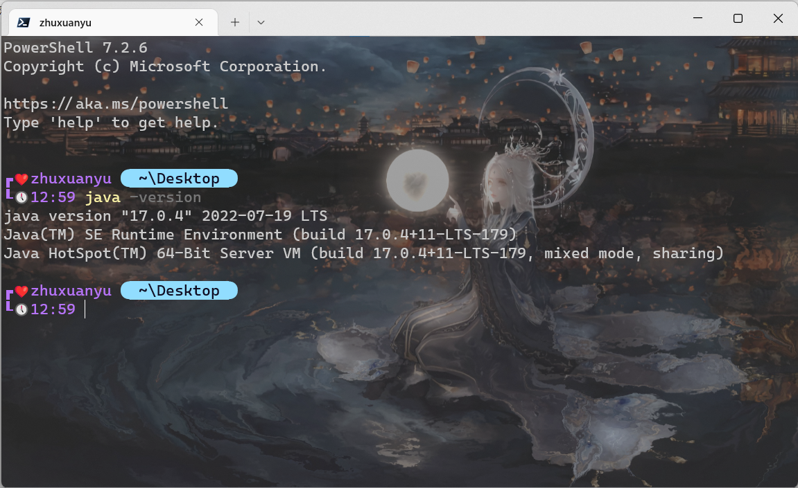

4.在执行HelloWorld,如果正常输出就已经Ok!

### 2.集成工具安装

推荐JetBrains公司的IDEA

### 3.IDEA快捷键

#### 通用型

| **说明**        | **快捷键**       |
| --------------- | ---------------- |
| 复制代码-copy   | ctrl + c         |
| 粘贴-paste      | ctrl + v         |
| 剪切-cut        | ctrl + x         |
| 撤销-undo       | ctrl + z         |
| 反撤销-redo     | ctrl + shift + z |
| 保存-save all   | ctrl + s         |
| 全选-select all | ctrl + a         |

#### 提高编写速度

| **说明**                                           | **快捷键**       |
| -------------------------------------------------- | ---------------- |
| 智能提示-edit                                      | alt + enter      |
| 提示代码模板-insert live template                  | ctrl+j           |
| 使用xx块环绕-surround with ...                     | ctrl+alt+t       |
| 调出生成getter/setter/构造器等结构-generate ...    | alt+insert       |
| 自动生成返回值变量-introduce variable ...          | ctrl+alt+v       |
| 复制指定行的代码-duplicate line or selection       | ctrl+d           |
| 删除指定行的代码-delete line                       | ctrl+y           |
| 切换到下一行代码空位-start new line                | shift + enter    |
| 切换到上一行代码空位-start new line before current | ctrl +alt+ enter |
| 向上移动代码-move statement up                     | ctrl+shift+↑     |
| 向下移动代码-move statement down                   | ctrl+shift+↓     |
| 向上移动一行-move line up                          | alt+shift+↑      |
| 向下移动一行-move line down                        | alt+shift+↓      |
| 方法的形参列表提醒-parameter info                  | ctrl+p           |

| **说明**                                    | **快捷键**   |
| ------------------------------------------- | ------------ |
| 批量修改指定的变量名、方法名、类名等-rename | shift+f6     |
| 抽取代码重构方法-extract method ...         | ctrl+alt+m   |
| 重写父类的方法-override methods ...         | ctrl+o       |
| 实现接口的方法-implements methods ...       | ctrl+i       |
| 选中的结构的大小写的切换-toggle case        | ctrl+shift+u |
| 批量导包-optimize imports                   | ctrl+alt+o   |

#### 类结构、查找和查看源码

| **说明**                                                  | **快捷键**                      |
| --------------------------------------------------------- | ------------------------------- |
| 如何查看源码-go to class...                               | ctrl + 选中指定的结构 或 ctrl+n |
| 显示当前类结构，支持搜索指定的方法、属性等-file structure | ctrl+f12                        |
| 退回到前一个编辑的页面-back                               | ctrl+alt+←                      |
| 进入到下一个编辑的页面-forward                            | ctrl+alt+→                      |
| 打开的类文件之间切换-select previous/next tab             | alt+←/→                         |
| 光标选中指定的类，查看继承树结构-Type Hierarchy           | ctrl+h                          |
| 查看方法文档-quick documentation                          | ctrl+q                          |
| 类的UML关系图-show uml popup                              | ctrl+alt+u                      |
| 定位某行-go to line/column                                | ctrl+g                          |
| 回溯变量或方法的来源-go to implementation(s)              | ctrl+alt+b                      |
| 折叠方法实现-collapse all                                 | ctrl+shift+ -                   |
| 展开方法实现-expand all                                   | ctrl+shift+ +                   |

#### 查找、替换与关闭

| **说明**                                           | **快捷键**   |
| -------------------------------------------------- | ------------ |
| 查找指定的结构                                     | ctlr+f       |
| 快速查找：选中的Word快速定位到下一个-find next     | ctrl+l       |
| 查找与替换-replace                                 | ctrl+r       |
| 直接定位到当前行的首位-move caret to line start    | home         |
| 直接定位到当前行的末位 -move caret to line end     | end          |
| 查询当前元素在当前文件中的引用，然后按 F3 可以选择 | ctrl+f7      |
| 全项目搜索文本-find in path ...                    | ctrl+shift+f |
| 关闭当前窗口-close                                 | ctrl+f4      |

#### 调整格式

| **说明**                                     | **快捷键**       |
| -------------------------------------------- | ---------------- |
| 格式化代码-reformat code                     | ctrl+alt+l       |
| 使用单行注释-comment with line comment       | ctrl + /         |
| 使用/取消多行注释-comment with block comment | ctrl + shift + / |
| 选中数行，整体往后移动-tab                   | tab              |
| 选中数行，整体往前移动-prev tab              | shift + tab      |

#### Debug快捷

| **说明**                                              | **快捷键**    |
| ----------------------------------------------------- | ------------- |
| 单步调试（不进入函数内部）- step over                 | F8            |
| 单步调试（进入函数内部）- step into                   | F7            |
| 强制单步调试（进入函数内部） - force step into        | alt+shift+f7  |
| 选择要进入的函数 - smart step into                    | shift + F7    |
| 跳出函数 - step out                                   | shift + F8    |
| 运行到断点 - run to cursor                            | alt + F9      |
| 继续执行，进入下一个断点或执行完程序 - resume program | F9            |
| 停止 - stop                                           | Ctrl+F2       |
| 查看断点 - view breakpoints                           | Ctrl+Shift+F8 |
| 关闭 - close                                          | Ctrl+F4       |

## 二、Java基础

### 1、基础语法

- 对象：对象是类的一个实例，有状态和行为。例如，一条狗是一个对象，它的状态有：颜色、名字、品种；行为有：摇尾巴、叫、吃等。
- 类：类是一个模板，它描述一类对象的行为和状态。
- 方法：方法就是行为，一个类可以有很多方法。逻辑运算、数据修改以及所有动作都是在方法中完成的。
- 实例变量：每个对象都有独特的实例变量，对象的状态由这些实例变量的值决定。

#### Java命名规则

- 大小写敏感：Java 是大小写敏感的，这就意味着标识符 Hello 与 hello 是不同的。
- 类名：对于所有的类来说，类名的首字母应该大写。如果类名由若干单词组成，那么每个单词的首字母应该大写，例如 MyFirstJavaClass 。
- 方法名：所有的方法名都应该以小写字母开头。如果方法名含有若干单词，则后面的每个单词首字母大写。
- 源文件名：源文件名必须和类名相同。当保存文件的时候，你应该使用类名作为文件名保存（切记 Java 是大小写敏感的），文件名的后缀为 *.java*。（如果文件名和类名不相同则会导致编译错误）。
- 主方法入口：所有的 Java 程序由 *public static void main(String[] args)* 方法开始执行。

#### Java 关键字

下面列出了 Java 关键字。这些保留字不能用于常量、变量、和任何标识符的名称。

| 类别 | 关键字 | 说明 |
| :--- | :--- | :--- |
| while | 循环 |  |
| volatile | 易失 |  |
| void | 无返回值 |  |
| try | 捕获异常 |  |
| transient | 短暂 |  |
| throws | 声明一个异常可能被抛出 |  |
| throw | 抛出一个异常对象 |  |
| this | 本类 |  |
| synchronized | 线程,同步 |  |
| switch | 根据值选择执行 |  |
| strictfp | 严格,精准 |  |
| static | 静态 |  |
| short | 短整型 |  |
| return | 返回 |  |
| public | 公共的 |  |
| package | 包 |  |
| new | 新,创建 |  |
| native | 本地，原生方法（非 Java 实现） |  |
| long | 长整型 |  |
| interface | 接口 |  |
| int | 整型 |  |
| instanceof | 实例 |  |
| implements | 实现（接口） |  |
| if | 如果 |  |
| for | 循环 |  |
| float | 单精度浮点 |  |
| finally | 有没有异常都执行 |  |
| final | 最终值,不可改变的 |  |
| extends | 扩充,继承 |  |
| else | 否则 |  |
| double | 双精度浮点 |  |
| do | 运行 |  |
| default | 默认 |  |
| default | 默认 |  |
| continue | 继续 |  |
| const | 是关键字，但不能使用 |  |
| class | 类 |  |
| char | 字符型 |  |
| catch | 捕捉异常 |  |
| case | 定义一个值以供 switch 选择 |  |
| byte | 字节型 |  |
| 类、方法和变量修饰符 | abstract | 声明抽象 |
| 基本类型 | boolean | 布尔型 |
| 访问控制 | private | 私有的 |
| 错误处理 | assert | 断言表达式是否为真 |
| 程序控制语句 | break | 跳出循环 |
| 变量引用 | super | 父类,超类 |
| 保留关键字 | goto | 是关键字，但不能使用 |
| 包相关 | import | 引入 |
|  | protected | 受保护的 |

**注意： Java 的 null 不是关键字，类似于 true 和 false，它是一个字面常量，不允许作为标识符使用。**

### 2、Java的对象和类

Java支持以下概念：

- 多态

- 继承

- 封装

- 抽象

- 类

- 对象

- 实例

- 方法

- 重载

  类是对一类事物的统称，如汽车类，而对象则是对类的具体，如一辆梅赛德斯奔驰，或者是一辆红旗，都只是对象。

  即：类是事物的模板，而对象是依照模板的具象化

#### Java类包含的类型变量

- 局部变量：在方法、构造方法或者语句块中定义的变量被称为局部变量。变量声明和初始化都是在方法中，方法结束后，变量就会自动销毁。
- 成员变量：成员变量是定义在类中，方法体之外的变量。这种变量在创建对象的时候实例化。成员变量可以被类中方法、构造方法和特定类的语句块访问。
- 类变量：类变量也声明在类中，方法体之外，但必须声明为 static 类型。

#### 创建对象

对象是根据类创建的。在Java中，使用关键字 new 来创建一个新的对象。创建对象需要以下三步：

- 声明：声明一个对象，包括对象名称和对象类型。

- 实例化：使用关键字 new 来创建一个对象。

- 初始化：使用 new 创建对象时，会调用构造方法初始化对象。

  ##### new关键字的作用

  1、为对象分配内存空间。

  2、引起对象构造方法的调用。

  3、为对象返回一个引用。
  
  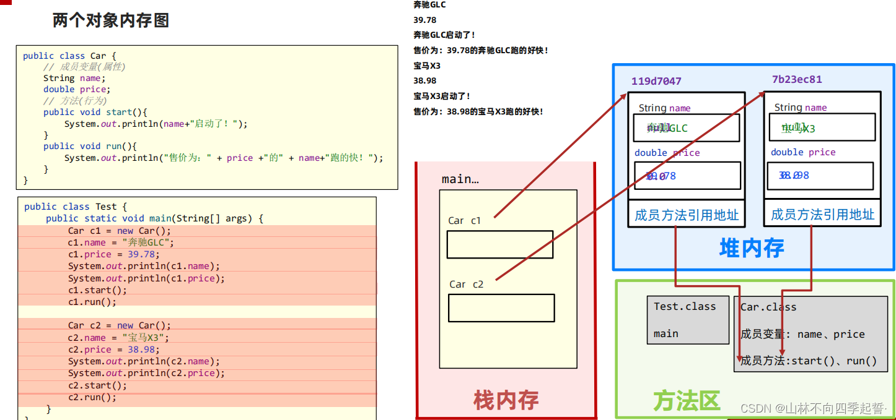

#### 构造方法

1、构造方法的名字和类名相同，并且没有返回值。

2、构造方法主要用于为类的对象定义初始化状态。

3、我们不能直接调用构造方法，必须通过new关键字来自动调用，从而创建类的实例。

4、Java的类都要求有构造方法，如果没有定义构造方法，Java编译器会为我们提供一个缺省的构造方法，也就是不带参数的构造方法。

#### 内部类

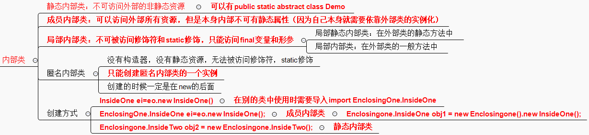

在Java中，可以将一个类定义在另一个类里面或者一个方法里边，这样的类称为内部类，广泛意义上的内部类一般包括四种：成员内部类，局部内部类，匿名内部类，静态内部类 。

1.成员内部类

（1）该类像是外部类的一个成员，可以无条件的访问外部类的所有成员属性和成员方法（包括private成员和静态成员）；

（2）成员内部类拥有与外部类同名的成员变量时，会发生隐藏现象，即默认情况下访问的是成员内部类中的成员。如果要访问外部类中的成员，需要以下形式访问：【外部类.this.成员变量  或  外部类.this.成员方法】；

（3）在外部类中如果要访问成员内部类的成员，必须先创建一个成员内部类的对象，再通过指向这个对象的引用来访问；

（4）成员内部类是依附外部类而存在的，也就是说，如果要创建成员内部类的对象，前提是必须存在一个外部类的对象；

（5）内部类可以拥有private访问权限、protected访问权限、public访问权限及包访问权限。如果成员内部类用private修饰，则只能在外部类的内部访问；如果用public修饰，则任何地方都能访问；如果用protected修饰，则只能在同一个包下或者继承外部类的情况下访问；如果是默认访问权限，则只能在同一个包下访问。外部类只能被public和包访问两种权限修饰。

2.局部内部类

（1）局部内部类是定义在一个方法或者一个作用域里面的类，它和成员内部类的区别在于局部内部类的访问仅限于方法内或者该作用域内；

（2）局部内部类就像是方法里面的一个局部变量一样，是不能有public、protected、private以及static修饰符的。

3.匿名内部类

（1）一般使用匿名内部类的方法来编写事件监听代码；

（2）匿名内部类是不能有访问修饰符和static修饰符的；

（3）匿名内部类是唯一一种没有构造器的类；

（4）匿名内部类用于继承其他类或是实现接口，并不需要增加额外的方法，只是对继承方法的实现或是重写。

4.内部静态类

（1）静态内部类是不需要依赖于外部类的，这点和类的静态成员属性有点类似；

（2）不能使用外部类的非static成员变量或者方法。

### 3、Java方法

- 方法是解决一类问题的步骤的有序组合
- 方法包含于类或对象中
- 方法在程序中被创建，在其他地方被引用

优点：

- 使程序变得更简短而清晰。
-  有利于程序维护。
-  可以提高程序开发的效率。
- 提高了代码的重用性。

#### 方法的定义

```java
修饰符 返回值类型 方法名(参数类型 参数名){
    ...
    方法体
    ...
    return 返回值;
}

//方法的动态参数列表定义
修饰符 返回值类型 方法名(Object... params){
    ...
    方法体
    ...
    return 返回值;
}
```

- 修饰符：修饰符，这是可选的，告诉编译器如何调用该方法。定义了该方法的访问类型。
- 返回值类型 ：方法可能会返回值。returnValueType 是方法返回值的数据类型。有些方法执行所需的操作，但没有返回值。在这种情况下，returnValueType 是关键字void。
- 方法名：是方法的实际名称。方法名和参数表共同构成方法签名。
- 参数类型：参数像是一个占位符。当方法被调用时，传递值给参数。这个值被称为实参或变量。参数列表是指方法的参数类型、顺序和参数的个数。参数是可选的，方法可以不包含任何参数。
- 方法体：方法体包含具体的语句，定义该方法的功能。

**注意：** 在一些其它语言中方法指过程和函数。一个返回非void类型返回值的方法称为函数；一个返回void类型返回值的方法叫做过程。

#### 构造方法

当一个对象被创建时候，构造方法用来初始化该对象。构造方法和它所在类的名字相同，但构造方法没有返回值。

通常会使用构造方法给一个类的实例变量赋初值，或者执行其它必要的步骤来创建一个完整的对象。

不管你与否自定义构造方法，所有的类都有构造方法，因为Java自动提供了一个默认构造方法，它把所有成员初始化为0。

一旦你定义了自己的构造方法，默认构造方法就会失效。

##### 构造方法使用

当创建对象时，系统会自动调用构造方法

- **没有自定义构造方法时，系统会调用默认构造方法**
- 构造方法可以重载
- 当自定义构造方法时，系统依据传入的参数类型、数量，自动匹配构造方法初始化对象

#### 方法调用

Java 支持两种调用方法的方式，根据方法是否返回值来选择。

当程序调用一个方法时，程序的控制权交给了被调用的方法。当被调用方法的返回语句执行或者到达方法体闭括号时候交还控制权给程序。

当方法返回一个值的时候，方法调用通常被当做一个值


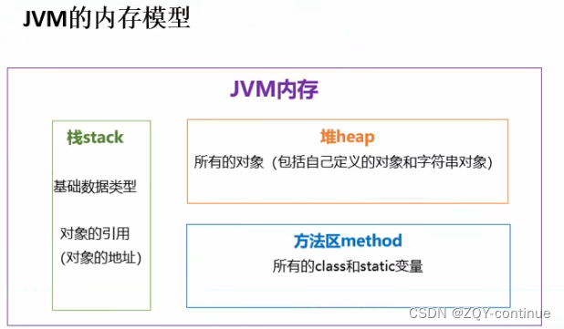

#### 通过值传递参数

**在Java中，方法的参数传递只有一种：值传递---->值传递每次传递的都是实参的副本**

##### 基本数据类型传参

基本数据类型作为参数，其实传递的只是一个副本，在方法中的操作也只是操作了副本，对原数据没有影响

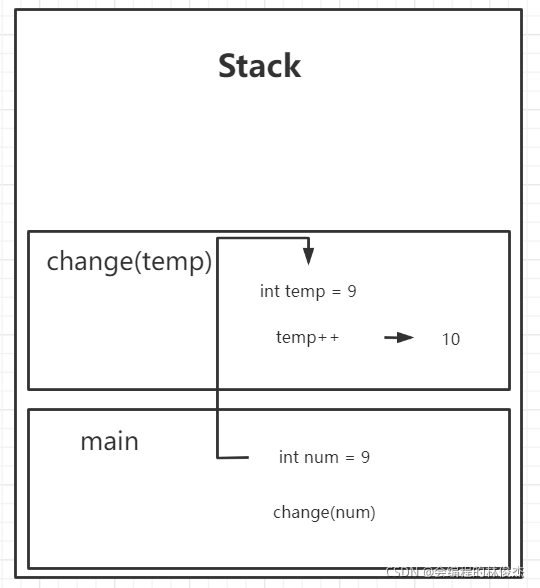

```java
public class Test {
    public static void main(String[] args) {
        int num = 9;
        System.out.println("修改前的实参为:" + num);
        change(num);
        System.out.println("修改后的实参为:" + num);
    }
 
    private static void change(int temp) {
        System.out.println("传入的形参为:" + temp);
        temp++;
        System.out.println("修改后的形参为:" + temp);
    }
}

/*
result:
修改前的实参为:9
传入的形参为:9
修改后的形参为:10
修改后的实参为:9
*/
```

##### 引用类型传参

在传递时所传递的是Person对象的地址值而非具体值，实参和形参都指向同一个堆内对象，因此在方法对形参的修改也会体现在实参

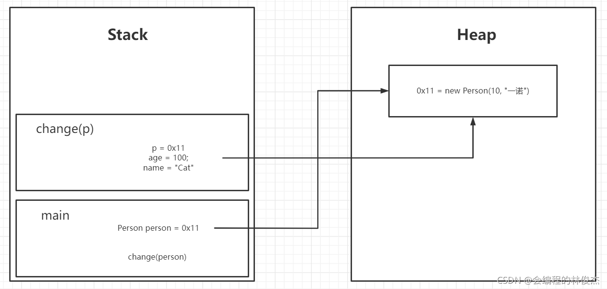

```java
public class TestUser {
    public static void main(String[] args) {
        Person person = new Person(10, "一诺");
        System.out.println("修改前的实参为:" + person);
        change(person);
        System.out.println("修改后的实参为:" + person);
    }
 
    private static void change(Person p) {
        p.setAge(100);
        p.setName("Cat");
    }
}

/*
省去Person类的定义
result：
修改前的实参为:Person{name='一诺', age=10}
修改后的实参为:Person{name='Cat', age=100}
*/
```

##### String等包装类作为形参

String包装类明明也属于引用类型，为何没有改变实参？

这就涉及到包装类的底层原理：包装类属于不可变类，当他们初始化后就不可在变，因此在方法中的操作属于重新new了一个对象，地址值是不同的！

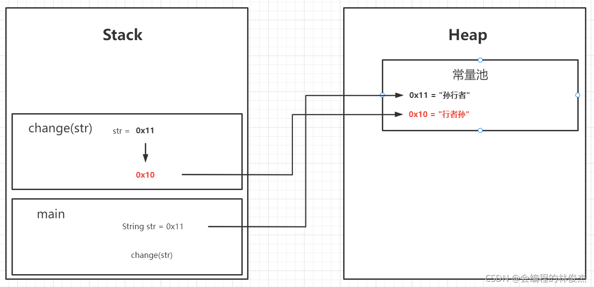

```java
//String类
public class TestString {
    public static void main(String[] args) {
        String str = new String("孙行者");
        System.out.println("字符串修改前:" + str);
        change(str);
        System.out.println("字符串修改后:" + str);
    }
 
    private static void change(String str) {
        str = "行者孙";
    }
}

//Integer类
public class test{
    public static void main(String[] args) {
        Integer a = 25;
        System.out.println("修改前:" + a);
        change(a);
        System.out.println("修改后:" + a);
    }

    private static void change(Integer a) {
        a = 18;
    }
}
/*
result:

字符串修改前:孙行者
字符串修改后:孙行者

修改前:25
修改后:25
*/
```

#### 方法的重写与重载

##### 重写

重写是建立在继承关系上，所谓方法的重写是指**子类中的方法与父类中继承的方法有完全相同的返回值类型、方法名、参数个数以及参数类型**，但是可以修改父类方法的执行内容。**如果子类将父类中的方法重写了，调用的时候默认调用子类被重写过的方法**，如果还想调用父类的方法可以通过*super*关键字

重写的好处在于子类可以根据需要，定义特定于自己的行为

```java
class Animal{
    public void move(){
        System.out.println("动物可以移动");
    }
}
class Dog extends Animal{
    public void move(){
        System.out.println("狗可以跑和走");
    }
}
public class TestDog{
    public static void main(String args[]){
        Animal a = new Animal(); // Animal 对象
        Animal b = new Dog(); // Dog 对象
        a.move();// 执行 Animal 类的方法
        b.move();//执行 Dog 类的方法
    }
}

/*
result:
动物可以移动
狗可以跑和走
*/
```

##### 重写规则

- 父类方法的参数列表必须完全与被子类重写的方法的参数列表相同，父类的返回类型必须也与被子类重写的方法返回类型相同，否则不能称其为重写而是重载。
- Java中规定，被**子类重写的方法访问权限要大于等于父类方法的访问权限**，而当父类方法权限是*private*时，子类就无房重写。

- 在继承过程中如果父类当中的方法抛出异常，那么在子类中重写父类的该方法时，也要抛出异常，而且重写方法一定不能抛出新的检查异常，或者比被重写方法声明更加宽泛的检查型异常。

##### 重载

重载是指我们可以定义一些名称相同的方法，**通过定义不同的参数来区分这些方法**，然后再调用时，Java虚拟机就会根据不同的参数列表来选择合适的方法执行。也就是说，当一个重载方法被调用时，Java用参数的类型或个数来决定实际调用的重载方法。因此，**每个重载方法的参数的类型或个数必须是不同**；不仅是一般的方法**，构造方法也可以重载**

##### 重载规则

**被重载的方法必须改变参数列表；**
**被重载的方法可以改变返回类型；**
**被重载的方法可以改变访问修饰符；**
**被重载的方法可以声明新的或更广的检查异常**；

```java
public class Overloading { 
 public int test(){
 System.out.println("test1");
 return 1;
 } 
 public void test(int a){
 System.out.println("test2");
 } 
 //以下两个参数类型顺序不同
 public String test(int a,String s){
 System.out.println("test3");
 return "returntest3";
 } 
 public String test(String s,int a){
 System.out.println("test4");
 return "returntest4";
 } 
 public static void main(String[] args){
 Overloading o = new Overloading();
 System.out.println(o.test());
 o.test(1);
 System.out.println(o.test(1,"test3"));
 System.out.println(o.test("test4",1));
 }
}
```

##### 重写与重载之间的区别

方法重载：
1、同一个类中
2、方法名相同，参数列表不同（参数顺序、个数、类型）
3、方法返回值、访问修饰符任意
4、与方法的参数名无关

方法重写：
1、有继承关系的子类中
2、方法名相同，参数列表相同（参数顺序、个数、类型），方法返回值相同
3、访问修饰符，访问范围需要大于等于父类的访问范围
4、与方法的参数名无关

| 区别点   | 重载方法 | 重写方法                                       |
| -------- | -------- | ---------------------------------------------- |
| 参数列表 | 必须修改 | 一定不能修改                                   |
| 返回类型 | 可以修改 | 一定不能修改                                   |
| 异常     | 可以修改 | 可以减少或删除，一定不能抛出新的或者更广的异常 |
| 访问     | 可以修改 | 一定不能做更严格的限制（可以降低限制）         |

#### main方法

1. main方法必须定义为

```java
public static void main(String[] args) {
}
```

2. main方法的String[] args有什么用？

- JVM负责调用main方法的时候，会自动传一个数组过来。
- main方法程序员负责写出来，JVM负责调用。JVM一定会传一个数组过来。
- JVM给传递过来的args数组对象长度默认是0。
- 其实**args这个数组是留给用户的，用户可以在控制台上输入参数，这个参数会被自动转换为"Sting[] args"。**

例如：

```java
public class Main {
    //这个方法程序员负责写出来，JVM负责调用。JVM一定会传一个数组过来
    public static void main(String[] args) {
        if (args.length == 2) {
            if ("admin".equals(args[0]) && "123".equals(args[1])) {
                System.out.println("欢迎" + args[0] + "使用本系统.........");
            } else {
                System.out.println("用户名或密码错误");
            }
        } else {
            System.out.println("账号密码格式错误，请输入两个参数，例如：hhh 123");
        }
    }

}
```

在控制台对文件进行编译运行并传参：

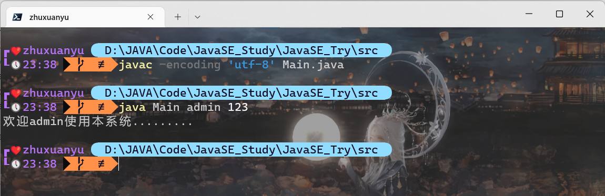

可见：

JVM会自动将"a b c" 通过空格的方式进行分离，分离完成后自动放到"String[] args"数组中 所以main方法上面String[] args数组主要是用来接收用户输入参数的。 把a b c 转换成字符数组：{"a","b","c"} 。

#### static方法

static方法也就是类方法

- 被static修饰的方法中，不能使用this关键字
- 类方法可直接通过*类名.方法名*的方式访问，而实例方法只能通过实例对象去调用
- 


### 4、Java的数据类型

#### 1.数据类型图


#### 2.基本数据类型

| 数据类型关键字 | 包装类    | 数据类型 | 最小值                              | 最大值                            | 默认值  |
| :------------- | --------- | -------- | :---------------------------------- | --------------------------------- | :------ |
| byte           | Byte      | 整型     | -128（-2^7                          | 127（2^7-1）                      | 0       |
| short          | Short     | 整型     | -32768（-2^15）                     | 32768（2^1)                       | 0       |
| int            | Integer   | 整型     | -2,147,483,648（-2^31）             | 2,147,483,648（2^31）             | 0       |
| long           | Long      | 整型     | -9,223,372,036,854,775,808（-2^63） | 9,223,372,036,854,775,808（2^63） | 0L      |
| float          | Float     | 浮点型   | IEEE754标准                         |                                   | 0.0f    |
| double         | Double    | 浮点型   | IEEE754标准                         |                                   | 0.0d    |
| char           | Character | 字节型   | \u0000(0)                           | \uffff(65535)                     | 'u0000' |
| boolean        | Boolean   | 布尔类型 | 只有true和false                     |                                   | false   |

注：值得一提，包装类方便基本数据类型可以与引用类型互相转换。

#### 3.引用数据类型

引用类型指向一个对象，不是原始值，指向对象的变量是引用变量。在java里面除去基本数据类型的其他类型都是引用类型，自己定义的class类都是引用类型，可以像基本类型一样使用。

引用类型常见的有：`String、StringBuffer、ArrayList、HashSet、HashMap`等

#### 4.数据类型的转换

##### 自动类型转换

**整型、实型（常量）、字符型数据可以混合运算。运算中，不同类型的数据先转化为同一类型，然后进行运算。**

转换从低级到高级。

```
低  ------------------------------------>  高
byte,short,char—> int —> long—> float —> double 
```

##### 强制类型转换

- 条件是转换的数据类型必须是兼容的。
- 格式：(type)value type是要强制类型转换后的数据类型

##### 隐含强制类型转换

- 整数的默认类型是 int。
- **小数默认是 double 类型浮点型**，在定义 float 类型时必须在数字后面跟上 F 或者 f。

##### 例题

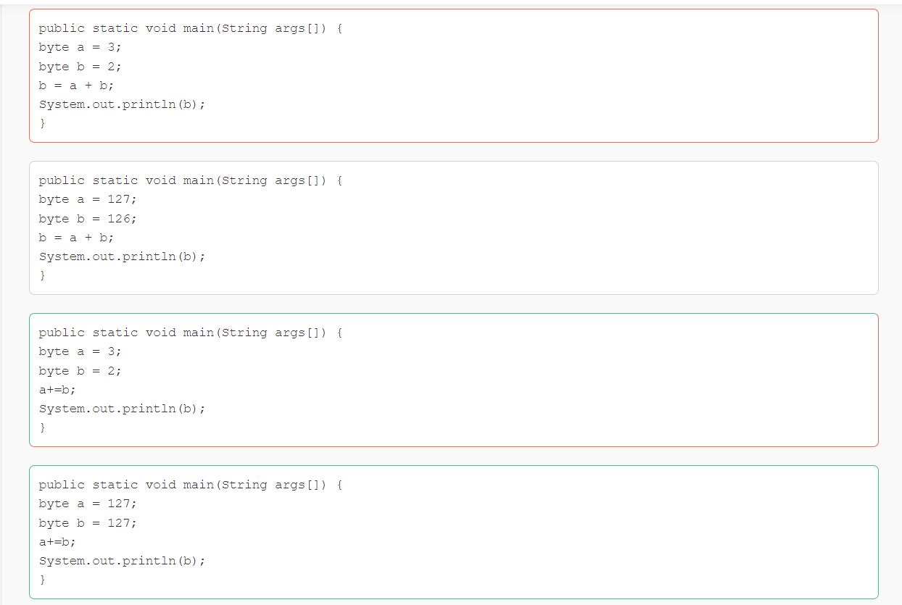

正确答案为CD
因为byte类型的变量在做运算时被会转换为int类型的值，故A、B左为byte，右为int，会报错；而C、D语句中用的是**a+=b的语句，此语句会将被赋值的变量自动强制转化为相对应的类型。**

### 5、Java的变量类型

#### 1.变量的声明

在Java语言中，所有的变量在使用前必须声明。声明变量的基本格式如下：

`type identifier [ = value][, identifier [= value] ...] ;`

#### 2.变量类型

- 类变量：独立于方法之外的变量，用 static 修饰。
- 实例变量：独立于方法之外的变量，不过没有 static 修饰。
- 局部变量：类的方法中的变量，并且不能用访问修饰符。

```java
public class Variable{
    static int allClicks=0;    // 类变量
 
    String str="hello world";  // 实例变量
 
    public void method(){
 
        int i =0;  // 局部变量
 
    }
}
```

#### 3.局部变量

- 局部变量声明在方法、构造方法或者语句块中；
- 局部变量在方法、构造方法、或者语句块被执行的时候创建，当它们执行完成后，变量将会被销毁；
- 访问修饰符不能用于局部变量；
- 局部变量只在声明它的方法、构造方法或者语句块中可见；
- 局部变量是在栈上分配的。
- 局部变量没有默认值，所以局部变量被声明后，必须经过初始化，才可以使用。

#### 4.实例变量

- 实例变量声明在一个类中，但在方法、构造方法和语句块之外；
- 当一个对象被实例化之后，每个实例变量的值就跟着确定；
- 实例变量在对象创建的时候创建，在对象被销毁的时候销毁；
- 实例变量的值应该至少被一个方法、构造方法或者语句块引用，使得外部能够通过这些方式获取实例变量信息；
- 实例变量可以声明在使用前或者使用后；
- 访问修饰符可以修饰实例变量；
- 实例变量对于类中的方法、构造方法或者语句块是可见的。一般情况下应该把实例变量设为私有。通过使用访问修饰符可以使实例变量对子类可见；
- 实例变量具有默认值。数值型变量的默认值是0，布尔型变量的默认值是false，引用类型变量的默认值是null。变量的值可以在声明时指定，也可以在构造方法中指定；
- 实例变量可以直接通过变量名访问。但在静态方法以及其他类中，就应该使用完全限定名：ObjectReference.VariableName。

```java
import java.io.*;
public class Employee{
   // 这个实例变量对子类可见
   public String name;
   // 私有变量，仅在该类可见
   private double salary;
   //在构造器中对name赋值
   public Employee (String empName){
      name = empName;
   }
   //设定salary的值
   public void setSalary(double empSal){
      salary = empSal;
   }  
   // 打印信息
   public void printEmp(){
      System.out.println("名字 : " + name );
      System.out.println("薪水 : " + salary);
   }
 
   public static void main(String[] args){
      Employee empOne = new Employee("RUNOOB");
      empOne.setSalary(1000.0);
      empOne.printEmp();
   }
}
```

#### 5.类变量（静态变量）

- 类变量也称为静态变量，在类中以 static 关键字声明，但**只能在类中声明，必须在方法之外**。
- 无论一个类创建了多少个对象，类只拥有类变量的一份拷贝。
- 静态变量除了被声明为常量外很少使用，静态变量是指声明为 public/private，final 和 static 类型的变量。静态变量初始化后不可改变。
- 静态变量储存在静态存储区。经常被声明为常量，很少单独使用 static 声明变量。
- 静态变量在第一次被访问时创建，在程序结束时销毁。
- 与实例变量具有相似的可见性。但为了对类的使用者可见，大多数静态变量声明为 public 类型。
- 默认值和实例变量相似。数值型变量默认值是 0，布尔型默认值是 false，引用类型默认值是 null。变量的值可以在声明的时候指定，也可以在构造方法中指定。此外，静态变量还可以在静态语句块中初始化。
- 静态变量可以通过：*ClassName.VariableName*的方式访问。
- 类变量被声明为 *public static final* 类型时，类变量名称一般建议使用大写字母。如果静态变量不是 public 和 final 类型，其命名方式与实例变量以及局部变量的命名方式一致。

#### 6.成员变量和类变量的区别

由static修饰的变量称为静态变量，其实质上就是一个全局变量。如果某个内容是被所有对象所共享，那么该内容就应该用静态修饰；没有被静态修饰的内容，其实是属于对象的特殊描述。

不同的对象的实例变量将被分配不同的内存空间， 如果类中的成员变量有类变量，那么所有对象的这个类变量都分配给相同的一处内存，改变其中一个对象的这个类变量会影响其他对象的这个类变量，也就是说对象共享类变量。

##### A.成员变量和类变量的区别：

  1、两个变量的生命周期不同

   成员变量随着对象的创建而存在，随着对象的回收而释放。

   静态变量随着类的加载而存在，随着类的消失而消失。

  2、调用方式不同

   成员变量只能被对象调用。

   静态变量可以被对象调用，还可以被类名调用。

  3、别名不同

   成员变量也称为实例变量。

   静态变量也称为类变量。

  4、数据存储位置[^memory]不同

   成员变量存储在堆内存的对象中，所以也叫对象的特有数据。

   静态变量数据存储在方法区（共享数据区）的静态区，所以也叫对象的共享数据。


##### B.static 关键字，是一个修饰符，用于修饰成员(成员变量和成员函数)。

  特点：

  1、想要实现对象中的共性数据的对象共享。可以将这个数据进行静态修饰。

  2、被静态修饰的成员，可以直接被类名所调用。也就是说，静态的成员多了一种调用方式。类名.静态方式。

  3、静态随着类的加载而加载。而且优先于对象存在。

 

弊端：

  1、有些数据是对象特有的数据，是不可以被静态修饰的。因为那样的话，特有数据会变成对象的共享数据。这样对事物的描述就出了问题。所以，在定义静态时，必须要明确，这个数据是否是被对象所共享的。

  2、静态方法只能访问静态成员，不可以访问非静态成员。

   因为静态方法加载时，优先于对象存在，所以没有办法访问对象中的成员。

  3、静态方法中不能使用this，super关键字。

   因为this代表对象，而静态在时，有可能没有对象，所以this无法使用。

 

##### C.什么时候定义静态成员呢？或者说：定义成员时，到底需不需要被静态修饰呢？

成员分两种：

  1、变量。（数据共享时静态化）

   该成员变量的数据是否是所有对象都一样：

   如果是，那么该变量需要被静态修饰，因为是共享的数据。 

   如果不是，那么就说这是对象的特有数据，要存储到对象中。 

  2、函数。（方法中没有调用特有数据时就定义成静态）

   如果判断成员函数是否需要被静态修饰呢？

   只要参考，该函数内是否访问了对象中的特有数据：

   如果有访问特有数据，那方法不能被静态修饰。

   如果没有访问过特有数据，那么这个方法需要被静态修饰。


### 6、Java修饰符

#### 访问控制修饰符

Java中，可以使用访问控制符来保护对类、变量、方法和构造方法的访问。Java 支持 4 种不同的访问权限。

- *default* (即默认，什么也不写）: 在同一包内可见，不使用任何修饰符。使用对象：类、接口、变量、方法。
- *private* : 在同一类内可见。使用对象：变量、方法。 **注意：不能修饰类（外部类）**
- *public* : 对所有类可见。使用对象：类、接口、变量、方法
- *protected* : 对同一包内的类和所有子类可见。使用对象：变量、方法。 **注意：不能修饰类（外部类）**。

```java
                 同一个类中     同一个包中其他类    不同包下的子类(儿子)    不同包下的无关类
* 1.private:私有       √
* 2.缺省：默认          √             √
* 3.protected:        √             √                 √
* 4.public：权限最高    √             √                 √                  √
```

##### 1.默认访问修饰符-不使用任何关键字

使用默认访问修饰符声明的变量和方法，对同一个包内的类是可见的。接口里的变量都隐式声明为 public static final,而接口里的方法默认情况下访问权限为 public。

##### 2.私有访问修饰符-private

私有访问修饰符是最严格的访问级别，所以被声明为 *private* 的方法、变量和构造方法只能被所属类访问，并且类和接口不能声明为 *private*。

声明为私有访问类型的变量只能通过类中公共的 getter 方法被外部类访问。

Private 访问修饰符的使用主要用来隐藏类的实现细节和保护类的数据

##### 3.公有访问修饰符-public

被声明为 public 的类、方法、构造方法和接口能够被任何其他类访问。

如果几个相互访问的 public 类分布在不同的包中，则需要导入相应 public 类所在的包。由于类的继承性，类所有的公有方法和变量都能被其子类继承。

##### 4.受保护的访问修饰符-protected

- 子类与基类在同一包中：被声明为 protected 的变量、方法和构造器能被同一个包中的任何其他类访问；
- 子类与基类不在同一包中：那么在子类中，子类实例可以访问其从基类继承而来的 protected 方法，而不能访问基类实例的protected方法。

protected 可以修饰数据成员，构造方法，方法成员，不能修饰类（内部类除外）。

接口及接口的成员变量和成员方法不能声明为 protected。

##### 5.访问控制和继承

请注意以下方法继承的规则：

- 父类中声明为 public 的方法在子类中也必须为 public。
- 父类中声明为 protected 的方法在子类中要么声明为 protected，要么声明为 public，不能声明为 private。
- 父类中声明为 private 的方法，不能够被子类继承。

#### 非访问修饰符

- static 修饰符，用来修饰类方法和类变量。

- final 修饰符，用来修饰类、方法和变量，final 修饰的类不能够被继承，修饰的方法不能被继承类重新定义，修饰的变量为常量，是不可修改的。

- abstract 修饰符，用来创建抽象类和抽象方法。

- synchronized 和 volatile 修饰符，主要用于线程的编程[^线程]。

  ​	synchronized 关键字声明的方法同一时间只能被一个线程访问。synchronized 修饰符可以应用于四个访问修饰符。

  ​	volatile 修饰的成员变量在每次被线程访问时，都强制从共享内存中重新读取该成员变量的值。而且，当成员变量发生变化时，会强制线程将变化值回写到共享内存。这样在任何时刻，两个不同的线程总是看到某个成员变量的同一个值。一个 volatile 对象引用可能是 null。

##### 1.static 修饰符

- 静态变量：

  static 关键字用来声明独立于对象的静态变量，无论一个类实例化多少对象，它的静态变量只有一份拷贝。 静态变量也被称为类变量。局部变量不能被声明为 static 变量。

- 静态方法：

  static 关键字用来声明独立于对象的静态方法。静态方法不能使用类的非静态变量。静态方法从参数列表得到数据，然后计算这些数据。

对类变量和方法的访问可以直接使用 classname.variablename 和 classname.methodname 的方式访问。

##### 2.final修饰符

final 变量：

final 表示"最后的、最终的"含义，变量一旦赋值后，不能被重新赋值。被 final 修饰的实例变量必须显式指定初始值。

final 修饰符通常和 static 修饰符一起使用来创建类常量。

```java
public class Test{
  final int value = 10;
  // 下面是声明常量的实例
  public static final int BOXWIDTH = 6;
  static final String TITLE = "Manager";
 
  public void changeValue(){
     value = 12; //将输出一个错误,final修饰的变量或常量是不能够被二次修改的
  }
}
```

final 方法

父类中的 final 方法可以被子类继承，但是不能被子类重写。

声明 final 方法的主要目的是防止该方法的内容被修改。

final 类(fw)

final 类不能被继承，没有类能够继承 final 类的任何特性。

##### 3.abstract 修饰符

抽象类：

```java
/*
1.类有的，抽象都有
2.抽象类可以没有抽象方法，但是有抽象方法必有是抽象类
3.如果继承抽象类，就必须重写抽象类的全部抽象方法，否则这个类也必须定义为抽象类
4.不能用abstract修饰变量，代码块，构造器
5.（重点：有的有失）：抽象类得到了抽象方法，但是失去了创造对象的能力

//Animal a = new Animal();

为什么抽象类无法创建对象
反证法：假如抽象类可以创建对象
Animal a = new Animal();
a.run();   run方法无方法体，无法运行，报错，所以抽象类不能创建

final 和 abstract 是互斥关系
final修饰类不能继承，修饰方法，方法不能重写
abstract修饰的类和方法，必须被继承和重写，不然无法使用
抽象方法的声明以分号结尾，例如：public abstract sample();。
 */
```

##### 4.transient 修饰符

1. 一旦变量被transient修饰，变量将不再是对象持久化的一部分，该变量内容在序列化后无法获得访问。
2. transient关键字只能修饰变量，而不能修饰方法和类。注意，本地变量是不能被transient关键字修饰的。变量如果是用户自定义类变量，则该类需要实现Serializable接口。
3. 被transient关键字修饰的变量不再能被序列化，一个静态变量不管是否被transient修饰，均不能被序列化。

**简单来说就是用来避免特定的实例变量不被序列化，需要注意的是，只有在实现Serilizable接口时transient才有效，其他情况另作讨论**

```java
import java.io.FileInputStream;
import java.io.FileNotFoundException;
import java.io.FileOutputStream;
import java.io.IOException;
import java.io.ObjectInputStream;
import java.io.ObjectOutputStream;
import java.io.Serializable;
 
/**
 * @description 使用transient关键字不序列化某个变量
 *        注意读取的时候，读取数据的顺序一定要和存放数据的顺序保持一致
 *        
 * @author Alexia
 * @date  2013-10-15
 */
public class TransientTest {
    
    public static void main(String[] args) {
        
        User user = new User();
        user.setUsername("Alexia");
        user.setPasswd("123456");
        
        System.out.println("read before Serializable: ");
        System.out.println("username: " + user.getUsername());
        System.err.println("password: " + user.getPasswd());
        
        try {
            ObjectOutputStream os = new ObjectOutputStream(
                    new FileOutputStream("C:/user.txt"));
            os.writeObject(user); // 将User对象写进文件
            os.flush();
            os.close();
        } catch (FileNotFoundException e) {
            e.printStackTrace();
        } catch (IOException e) {
            e.printStackTrace();
        }
        try {
            ObjectInputStream is = new ObjectInputStream(new FileInputStream(
                    "C:/user.txt"));
            user = (User) is.readObject(); // 从流中读取User的数据
            is.close();
            
            System.out.println("\nread after Serializable: ");
            System.out.println("username: " + user.getUsername());
            System.err.println("password: " + user.getPasswd());
            
        } catch (FileNotFoundException e) {
            e.printStackTrace();
        } catch (IOException e) {
            e.printStackTrace();
        } catch (ClassNotFoundException e) {
            e.printStackTrace();
        }
    }
}
 
class User implements Serializable {
    private static final long serialVersionUID = 8294180014912103005L;  
    
    private String username;
    private transient String passwd;
    
    public String getUsername() {
        return username;
    }
    
    public void setUsername(String username) {
        this.username = username;
    }
    
    public String getPasswd() {
        return passwd;
    }
    
    public void setPasswd(String passwd) {
        this.passwd = passwd;
    }
 
}

//输出为：
read before Serializable: 
username: Alexia
password: 123456

read after Serializable: 
username: Alexia
password: null
```


### 7、Java运算符

- 算术运算符
- 关系运算符
- 位运算符
- 逻辑运算符
- 赋值运算符
- 其他运算符

#### 1.算术运算符

算术运算符用在数学表达式中，它们的作用和在数学中的作用一样。下表列出了所有的算术运算符。

表格中的实例假设整数变量A的值为10，变量B的值为20：

| 操作符 | 描述                              | 例子                               |
| :----- | :-------------------------------- | :--------------------------------- |
| +      | 加法 - 相加运算符两侧的值         | A + B 等于 30                      |
| -      | 减法 - 左操作数减去右操作数       | A – B 等于 -10                     |
| *      | 乘法 - 相乘操作符两侧的值         | A * B等于200                       |
| /      | 除法 - 左操作数除以右操作数       | B / A等于2                         |
| ％     | 取余 - 左操作数除以右操作数的余数 | B%A等于0                           |
| ++     | 自增: 操作数的值增加1             | B++ 或 ++B 等于 21（区别详见下文） |
| --     | 自减: 操作数的值减少1             | B-- 或 --B 等于 19（区别详见下文） |

#### 2.关系运算符

下表为Java支持的关系运算符

表格中的实例整数变量A的值为10，变量B的值为20：

| 运算符 | 描述                                                         | 例子             |
| :----- | :----------------------------------------------------------- | :--------------- |
| ==     | 检查如果两个操作数的值是否相等，如果相等则条件为真。         | （A == B）为假。 |
| !=     | 检查如果两个操作数的值是否相等，如果值不相等则条件为真。     | (A != B) 为真。  |
| >      | 检查左操作数的值是否大于右操作数的值，如果是那么条件为真。   | （A> B）为假。   |
| <      | 检查左操作数的值是否小于右操作数的值，如果是那么条件为真。   | （A <B）为真。   |
| >=     | 检查左操作数的值是否大于或等于右操作数的值，如果是那么条件为真。 | （A> = B）为假。 |
| <=     | 检查左操作数的值是否小于或等于右操作数的值，如果是那么条件为真。 | （A <= B）为真。 |

#### 3.位运算符

Java定义了位运算符，应用于整数类型(int)，长整型(long)，短整型(short)，字符型(char)，和字节型(byte)等类型。

位运算符作用在所有的位上，并且按位运算。假设a = 60，b = 13;它们的二进制格式表示将如下：

```
A = 0011 1100
B = 0000 1101
-----------------
A&B = 0000 1100
A | B = 0011 1101
A ^ B = 0011 0001
~A= 1100 0011
```

下表列出了位运算符的基本运算，假设整数变量 A 的值为 60 和变量 B 的值为 13：

| 操作符 | 描述                                                         | 例子                           |
| :----- | :----------------------------------------------------------- | :----------------------------- |
| ＆     | 如果相对应位都是1，则结果为1，否则为0                        | （A＆B），得到12，即0000 1100  |
| \|     | 如果相对应位都是 0，则结果为 0，否则为 1                     | （A \| B）得到61，即 0011 1101 |
| ^      | 如果相对应位值相同，则结果为0，否则为1                       | （A ^ B）得到49，即 0011 0001  |
| 〜     | 按位取反运算符翻转操作数的每一位，即0变成1，1变成0。         | （〜A）得到-61，即1100 0011    |
| <<     | 按位左移运算符。左操作数按位左移右操作数指定的位数。         | A << 2得到240，即 1111 0000    |
| >>     | 按位右移运算符。左操作数按位右移右操作数指定的位数。         | A >> 2得到15即 1111            |
| >>>    | 按位右移补零操作符。左操作数的值按右操作数指定的位数右移，移动得到的空位以零填充。 | A>>>2得到15即0000 1111         |

#### 4.逻辑运算符

下表列出了逻辑运算符的基本运算，假设布尔变量A为真，变量B为假

| 操作符 | 描述                                                         | 例子                |
| :----- | :----------------------------------------------------------- | :------------------ |
| &&     | 称为逻辑与运算符。当且仅当两个操作数都为真，条件才为真。     | （A && B）为假。    |
| \| \|  | 称为逻辑或操作符。如果任何两个操作数任何一个为真，条件为真。 | （A \| \| B）为真。 |
| ！     | 称为逻辑非运算符。用来反转操作数的逻辑状态。如果条件为true，则逻辑非运算符将得到false。 | ！（A && B）为真。  |

#### 5.赋值运算符

下面是Java语言支持的赋值运算符：

| 操作符  | 描述                                                         | 例子                                     |
| :------ | :----------------------------------------------------------- | :--------------------------------------- |
| =       | 简单的赋值运算符，将右操作数的值赋给左侧操作数               | C = A + B将把A + B得到的值赋给C          |
| + =     | 加和赋值操作符，它把左操作数和右操作数相加赋值给左操作数     | C + = A等价于C = C + A                   |
| - =     | 减和赋值操作符，它把左操作数和右操作数相减赋值给左操作数     | C - = A等价于C = C - A                   |
| * =     | 乘和赋值操作符，它把左操作数和右操作数相乘赋值给左操作数     | C * = A等价于C = C * A                   |
| / =     | 除和赋值操作符，它把左操作数和右操作数相除赋值给左操作数     | C / = A，C 与 A 同类型时等价于 C = C / A |
| （％）= | 取模和赋值操作符，它把左操作数和右操作数取模后赋值给左操作数 | C％= A等价于C = C％A                     |
| << =    | 左移位赋值运算符                                             | C << = 2等价于C = C << 2                 |
| >> =    | 右移位赋值运算符                                             | C >> = 2等价于C = C >> 2                 |
| ＆=     | 按位与赋值运算符                                             | C＆= 2等价于C = C＆2                     |
| ^ =     | 按位异或赋值操作符                                           | C ^ = 2等价于C = C ^ 2                   |
| \| =    | 按位或赋值操作符                                             | C \| = 2等价于C = C \| 2                 |

#### 6.条件运算符（?:）

条件运算符也被称为三元运算符。该运算符有3个操作数，并且需要判断布尔表达式的值。该运算符的主要是决定哪个值应该赋值给变量。

#### 7.instanceof 运算符

该运算符用于操作对象实例，检查该对象是否是一个特定类型（类类型或接口类型）。

instanceof运算符使用格式如下：

```
( Object reference variable ) instanceof  (class/interface type)
```

如果运算符左侧变量所指的对象，是操作符右侧类或接口(class/interface)的一个对象，那么结果为真。

下面是一个例子：

```
String name = "James";
boolean result = name instanceof String; // 由于 name 是 String 类型，所以返回真
```

如果被比较的对象兼容于右侧类型，该运算符仍然返回 true。

```java
class Vehicle {}
 
public class Car extends Vehicle {
   public static void main(String[] args){
      Vehicle a = new Car();
      boolean result =  a instanceof Car;
      System.out.println( result);
   }
}

result:
true
```

#### 8.取反运算

负数的补码 = 原码取反 + 1，即：

```
-n = ~n + 1    →  ~n = -n -1   

~j：~10 =  - 10 - 1 = -11

i + j = 5 + -11 = -6 
```

#### 9.运算符优先级

优先级由高到低

| 类别     | 操作符                                     | 关联性   |
| :------- | :----------------------------------------- | :------- |
| 后缀     | () [] . (点操作符)                         | 左到右   |
| 一元     | expr++ expr--                              | 从左到右 |
| 一元     | ++expr --expr + - ～ ！                    | 从右到左 |
| 乘性     | * /％                                      | 左到右   |
| 加性     | + -                                        | 左到右   |
| 移位     | >> >>>  <<                                 | 左到右   |
| 关系     | > >= < <=                                  | 左到右   |
| 相等     | == !=                                      | 左到右   |
| 按位与   | ＆                                         | 左到右   |
| 按位异或 | ^                                          | 左到右   |
| 按位或   | \|                                         | 左到右   |
| 逻辑与   | &&                                         | 左到右   |
| 逻辑或   | \| \|                                      | 左到右   |
| 条件     | ？：                                       | 从右到左 |
| 赋值     | = + = - = * = / =％= >> = << =＆= ^ = \| = | 从右到左 |
| 逗号     | ，                                         | 左到右   |


### 8、Java流程控制语句

#### 1.顺序结构

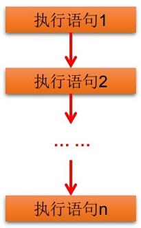

#### 2.分支结构

##### 1.if单分支结构

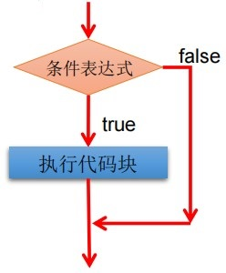

##### 2.if……else……结构

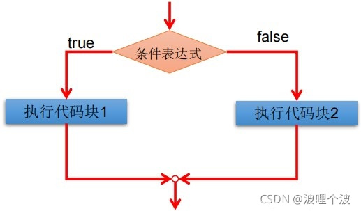

##### 3.if多分支结构

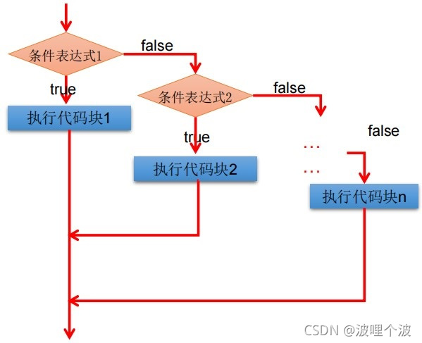

##### 4.switch分支结构

有必要强调：**如果每个符合条件的case语句结尾没有break，程序会执行到下一个case语句**

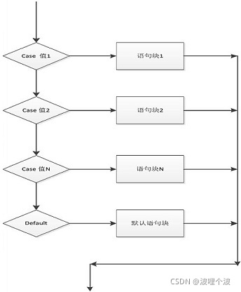

#### 3.循环结构

##### 1.循环语句的四个组成部分

- 初始化部分(init_statement)
- 循环条件部分(test_exp)
- 循环体部分(body_statement)
- 迭代部分(alter_statement)

##### 2.while 循环

while是最基本的循环，它的结构为：

```java
 ①初始化部分
 while(②循环条件部分)｛
    ③循环体部分; 
	④迭代部分; 
}
```

只要循环条件(布尔表达式)为 true，循环就会一直执行下去。

##### 3.do…while循环

```java
①初始化部分;
do{
	③循环体部分
	④迭代部分
}while(②循环条件部分);
```

###### while和do while的区别?

执行次序不同:
    while先判断，再执行;do while先执行，再判断
初始情况不满足循环条件时:
    while循环一次都不会执行
    do-while循环不管任何情况都至少执行一次

##### 4. for循环

```java
 for( ①初始化循环条件; ②循环条件表达式 ; ④迭代部分 ){
                ③循环操作(循环体);
        }
```

##### 5. Java增强 for 循环

Java 5 引入了一种主要用于数组的增强型 for 循环。

```java
for(声明语句 : 表达式)
{
   //代码句子
}
```

声明语句：声明新的局部变量，该变量的类型必须和数组元素的类型匹配。其作用域限定在循环语句块，其值与此时数组元素的值相等。

表达式：表达式是要访问的数组名，或者是返回值为数组的方法。

```java
public class Test {
   public static void main(String[] args){
      int [] numbers = {10, 20, 30, 40, 50};
 
      for(int x : numbers ){
         System.out.print( x );
         System.out.print(",");
      }
      System.out.print("\n");
      String [] names ={"James", "Larry", "Tom", "Lacy"};
      for( String name : names ) {
         System.out.print( name );
         System.out.print(",");
      }
   }
}

result:
10,20,30,40,50,
James,Larry,Tom,Lacy,
```

#### 4.流程跳转

break:用于do-while、while、for、switch中时，可跳出循环而执行循环后面的语句

**java提供带标签的break，类似C语言的goto语句**;

```java
public class Test {
    public static void main(String[] args) {
        int a = 0;
        jump:
        while (a < 100){
            for (int i = 0; i <= a; i++) {
                System.out.println("好耶");
                if (a == 3){
                    break jump;
                }
            }
            a++;
        }
        System.out.println("已经跳出循环！");
    }
}
```

continue:用在循环中,跳过本次循环,执行下一次循环.


## 三、Java的特殊类

### 1. Java Number & Math 类

所有的包装类（Integer、Long、Byte、Double、Float、Short）都是抽象类 Number 的子类。

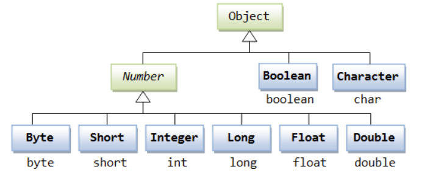

#### Number & Math 类方法

下面的表中列出的是 Number & Math 类常用的一些方法：

| 序号 | 方法与描述                                                   |
| :--- | :----------------------------------------------------------- |
| 1    | [xxxValue()](https://www.runoob.com/java/number-xxxvalue.html) 将 Number 对象转换为xxx数据类型的值并返回。 |
| 2    | [compareTo()](https://www.runoob.com/java/number-compareto.html) 将number对象与参数比较。 |
| 3    | [equals()](https://www.runoob.com/java/number-equals.html) 判断number对象是否与参数相等。 |
| 4    | [valueOf()](https://www.runoob.com/java/number-valueof.html) 返回一个 Number 对象指定的内置数据类型 |
| 5    | [toString()](https://www.runoob.com/java/number-tostring.html) 以字符串形式返回值。 |
| 6    | [parseInt()](https://www.runoob.com/java/number-parseInt.html) 将字符串解析为int类型。 |
| 7    | [abs()](https://www.runoob.com/java/number-abs.html) 返回参数的绝对值。 |
| 8    | [ceil()](https://www.runoob.com/java/number-ceil.html) 返回大于等于( >= )给定参数的的最小整数，类型为双精度浮点型。 |
| 9    | [floor()](https://www.runoob.com/java/number-floor.html) 返回小于等于（<=）给定参数的最大整数 。 |
| 10   | [rint()](https://www.runoob.com/java/number-rint.html) 返回与参数最接近的整数。返回类型为double。 |
| 11   | [round()](https://www.runoob.com/java/number-round.html) 它表示四舍五入，算法为 Math.floor(x+0.5)，即将原来的数字加上 0.5 后再向下取整，所以，Math.round(11.5) 的结果为12，Math.round(-11.5) 的结果为-11。 |
| 12   | [min()](https://www.runoob.com/java/number-min.html) 返回两个参数中的最小值。 |
| 13   | [max()](https://www.runoob.com/java/number-max.html) 返回两个参数中的最大值。 |
| 14   | [exp()](https://www.runoob.com/java/number-exp.html) 返回自然数底数e的参数次方。 |
| 15   | [log()](https://www.runoob.com/java/number-log.html) 返回参数的自然数底数的对数值。 |
| 16   | [pow()](https://www.runoob.com/java/number-pow.html) 返回第一个参数的第二个参数次方。 |
| 17   | [sqrt()](https://www.runoob.com/java/number-sqrt.html) 求参数的算术平方根。 |
| 18   | [sin()](https://www.runoob.com/java/number-sin.html) 求指定double类型参数的正弦值。 |
| 19   | [cos()](https://www.runoob.com/java/number-cos.html) 求指定double类型参数的余弦值。 |
| 20   | [tan()](https://www.runoob.com/java/number-tan.html) 求指定double类型参数的正切值。 |
| 21   | [asin()](https://www.runoob.com/java/number-asin.html) 求指定double类型参数的反正弦值。 |
| 22   | [acos()](https://www.runoob.com/java/number-acos.html) 求指定double类型参数的反余弦值。 |
| 23   | [atan()](https://www.runoob.com/java/number-atan.html) 求指定double类型参数的反正切值。 |
| 24   | [atan2()](https://www.runoob.com/java/number-atan2.html) 将笛卡尔坐标转换为极坐标，并返回极坐标的角度值。 |
| 25   | [toDegrees()](https://www.runoob.com/java/number-todegrees.html) 将参数转化为角度。 |
| 26   | [toRadians()](https://www.runoob.com/java/number-toradians.html) 将角度转换为弧度。 |
| 27   | [random()](https://www.runoob.com/java/number-random.html) 返回一个随机数。 |

#### Math 的 floor,round 和 ceil 方法实例比较

可以说：floor是取比传入参数小的最近的整数，ceil是取比传入参数大的最小的整数，而**round在正数参数是四舍五入，负数参数时五舍六入（都是对于整数部分来说）**

| 参数 | Math.floor | Math.round | Math.ceil |
| :--- | :--------- | :--------- | :-------- |
| 1.4  | 1          | 1          | 2         |
| 1.5  | 1          | 2          | 2         |
| 1.6  | 1          | 2          | 2         |
| -1.4 | -2         | -1         | -1        |
| -1.5 | -2         | -1         | -1        |
| -1.6 | -2         | -2         | -1        |

```java
public class Main {   
  public static void main(String[] args) {   
    double[] nums = { 1.4, 1.5, 1.6, -1.4, -1.5, -1.6 };   
    for (double num : nums) {   
      test(num);   
    }   
  }   
  
  private static void test(double num) {   
    System.out.println("Math.floor(" + num + ")=" + Math.floor(num));   
    System.out.println("Math.round(" + num + ")=" + Math.round(num));   
    System.out.println("Math.ceil(" + num + ")=" + Math.ceil(num));   
  }   
}

//result:
Math.floor(1.4)=1.0
Math.round(1.4)=1
Math.ceil(1.4)=2.0
Math.floor(1.5)=1.0
Math.round(1.5)=2
Math.ceil(1.5)=2.0
Math.floor(1.6)=1.0
Math.round(1.6)=2
Math.ceil(1.6)=2.0
Math.floor(-1.4)=-2.0
Math.round(-1.4)=-1
Math.ceil(-1.4)=-1.0
Math.floor(-1.5)=-2.0
Math.round(-1.5)=-1
Math.ceil(-1.5)=-1.0
Math.floor(-1.6)=-2.0
Math.round(-1.6)=-2
Math.ceil(-1.6)=-1.0
```

### 2.Java Character 类

#### 转义序列

前面有反斜杠（\）的字符代表转义字符，它对编译器来说是有特殊含义的。

下面列表展示了Java的转义序列：

| 转义序列 | 描述                     |
| :------- | :----------------------- |
| \t       | 在文中该处插入一个tab键  |
| \b       | 在文中该处插入一个后退键 |
| \n       | 在文中该处换行           |
| \r       | 在文中该处插入回车       |
| \f       | 在文中该处插入换页符     |
| \'       | 在文中该处插入单引号     |
| \"       | 在文中该处插入双引号     |
| \\       | 在文中该处插入反斜杠     |

#### Character 方法

下面是Character类的方法：

| 序号 | 方法与描述                                                   |
| :--- | :----------------------------------------------------------- |
| 1    | [isLetter()](https://www.runoob.com/java/character-isletter.html) 是否是一个字母 |
| 2    | [isDigit()](https://www.runoob.com/java/character-isdigit.html) 是否是一个数字字符 |
| 3    | [isWhitespace()](https://www.runoob.com/java/character-iswhitespace.html) 是否是一个空白字符 |
| 4    | [isUpperCase()](https://www.runoob.com/java/character-isuppercase.html) 是否是大写字母 |
| 5    | [isLowerCase()](https://www.runoob.com/java/character-islowercase.html) 是否是小写字母 |
| 6    | [toUpperCase()](https://www.runoob.com/java/character-touppercase.html) 指定字母的大写形式 |
| 7    | [toLowerCase](https://www.runoob.com/java/character-tolowercase.html)() 指定字母的小写形式 |
| 8    | [toString](https://www.runoob.com/java/character-tostring.html)() 返回字符的字符串形式，字符串的长度仅为1 |

### 3. Java String类(重点)

```java
String s1 = "Runoob";              // String 直接创建
String s2 = "Runoob";              // String 直接创建
String s3 = s1;                    // 相同引用
String s4 = new String("Runoob");   // String 对象创建
String s5 = new String("Runoob");   // String 对象创建
//注意:String 类是不可改变的，所以你一旦创建了 String 对象，那它的值就无法改变了
```

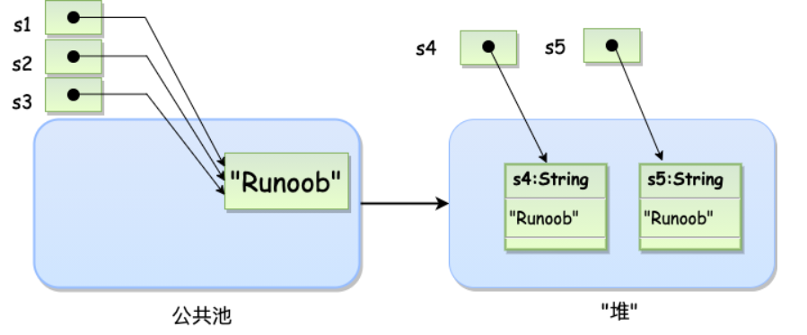

#### String 方法

| 序号 | 方法描述                                                     |
| :--- | :----------------------------------------------------------- |
| 1    | [char charAt(int index)](https://www.runoob.com/java/java-string-charat.html) 返回指定索引处的 char 值。 |
| 2    | [int compareTo(Object o)](https://www.runoob.com/java/java-string-compareto.html) 把这个字符串和另一个对象比较。 |
| 3    | [int compareTo(String anotherString)](https://www.runoob.com/java/java-string-compareto.html) 按字典顺序比较两个字符串。 |
| 4    | [int compareToIgnoreCase(String str)](https://www.runoob.com/java/java-string-comparetoignorecase.html) 按字典顺序比较两个字符串，不考虑大小写。 |
| 5    | [String concat(String str)](https://www.runoob.com/java/java-string-concat.html) 将指定字符串连接到此字符串的结尾。 |
| 6    | [boolean contentEquals(StringBuffer sb)](https://www.runoob.com/java/java-string-contentequals.html) 当且仅当字符串与指定的StringBuffer有相同顺序的字符时候返回真。 |
| 7    | [static String copyValueOf(char[\] data)](https://www.runoob.com/java/java-string-copyvalueof.html) 返回指定数组中表示该字符序列的 String。 |
| 8    | [static String copyValueOf(char[\] data, int offset, int count)](https://www.runoob.com/java/java-string-copyvalueof.html) 返回指定数组中表示该字符序列的 String。 |
| 9    | [boolean endsWith(String suffix)](https://www.runoob.com/java/java-string-endswith.html) 测试此字符串是否以指定的后缀结束。 |
| 10   | [boolean equals(Object anObject)](https://www.runoob.com/java/java-string-equals.html) 将此字符串与指定的对象比较。 |
| 11   | [boolean equalsIgnoreCase(String anotherString)](https://www.runoob.com/java/java-string-equalsignorecase.html) 将此 String 与另一个 String 比较，不考虑大小写。 |
| 12   | [byte[\] getBytes()](https://www.runoob.com/java/java-string-getbytes.html)  使用平台的默认字符集将此 String 编码为 byte 序列，并将结果存储到一个新的 byte 数组中。 |
| 13   | [byte[\] getBytes(String charsetName)](https://www.runoob.com/java/java-string-getbytes.html) 使用指定的字符集将此 String 编码为 byte 序列，并将结果存储到一个新的 byte 数组中。 |
| 14   | [void getChars(int srcBegin, int srcEnd, char[\] dst, int dstBegin)](https://www.runoob.com/java/java-string-getchars.html) 将字符从此字符串复制到目标字符数组。 |
| 15   | [int hashCode()](https://www.runoob.com/java/java-string-hashcode.html) 返回此字符串的哈希码。 |
| 16   | [int indexOf(int ch)](https://www.runoob.com/java/java-string-indexof.html) 返回指定字符在此字符串中第一次出现处的索引。 |
| 17   | [int indexOf(int ch, int fromIndex)](https://www.runoob.com/java/java-string-indexof.html) 返回在此字符串中第一次出现指定字符处的索引，从指定的索引开始搜索。 |
| 18   | [int indexOf(String str)](https://www.runoob.com/java/java-string-indexof.html)  返回指定子字符串在此字符串中第一次出现处的索引。 |
| 19   | [int indexOf(String str, int fromIndex)](https://www.runoob.com/java/java-string-indexof.html) 返回指定子字符串在此字符串中第一次出现处的索引，从指定的索引开始。 |
| 20   | [String intern()](https://www.runoob.com/java/java-string-intern.html)  返回字符串对象的规范化表示形式。 |
| 21   | [int lastIndexOf(int ch)](https://www.runoob.com/java/java-string-lastindexof.html)  返回指定字符在此字符串中最后一次出现处的索引。 |
| 22   | [int lastIndexOf(int ch, int fromIndex)](https://www.runoob.com/java/java-string-lastindexof.html) 返回指定字符在此字符串中最后一次出现处的索引，从指定的索引处开始进行反向搜索。 |
| 23   | [int lastIndexOf(String str)](https://www.runoob.com/java/java-string-lastindexof.html) 返回指定子字符串在此字符串中最右边出现处的索引。 |
| 24   | [int lastIndexOf(String str, int fromIndex)](https://www.runoob.com/java/java-string-lastindexof.html)  返回指定子字符串在此字符串中最后一次出现处的索引，从指定的索引开始反向搜索。 |
| 25   | [int length()](https://www.runoob.com/java/java-string-length.html) 返回此字符串的长度。 |
| 26   | [boolean matches(String regex)](https://www.runoob.com/java/java-string-matches.html) 告知此字符串是否匹配给定的正则表达式。 |
| 27   | [boolean regionMatches(boolean ignoreCase, int toffset, String other, int ooffset, int len)](https://www.runoob.com/java/java-string-regionmatches.html) 测试两个字符串区域是否相等。 |
| 28   | [boolean regionMatches(int toffset, String other, int ooffset, int len)](https://www.runoob.com/java/java-string-regionmatches.html) 测试两个字符串区域是否相等。 |
| 29   | [String replace(char oldChar, char newChar)](https://www.runoob.com/java/java-string-replace.html) 返回一个新的字符串，它是通过用 newChar 替换此字符串中出现的所有 oldChar 得到的。 |
| 30   | [String replaceAll(String regex, String replacement)](https://www.runoob.com/java/java-string-replaceall.html) 使用给定的 replacement 替换此字符串所有匹配给定的正则表达式的子字符串。 |
| 31   | [String replaceFirst(String regex, String replacement)](https://www.runoob.com/java/java-string-replacefirst.html)  使用给定的 replacement 替换此字符串匹配给定的正则表达式的第一个子字符串。 |
| 32   | [String[\] split(String regex)](https://www.runoob.com/java/java-string-split.html) 根据给定正则表达式的匹配拆分此字符串。 |
| 33   | [String[\] split(String regex, int limit)](https://www.runoob.com/java/java-string-split.html) 根据匹配给定的正则表达式来拆分此字符串。 |
| 34   | [boolean startsWith(String prefix)](https://www.runoob.com/java/java-string-startswith.html) 测试此字符串是否以指定的前缀开始。 |
| 35   | [boolean startsWith(String prefix, int toffset)](https://www.runoob.com/java/java-string-startswith.html) 测试此字符串从指定索引开始的子字符串是否以指定前缀开始。 |
| 36   | [CharSequence subSequence(int beginIndex, int endIndex)](https://www.runoob.com/java/java-string-subsequence.html)  返回一个新的字符序列，它是此序列的一个子序列。 |
| 37   | [String substring(int beginIndex)](https://www.runoob.com/java/java-string-substring.html) 返回一个新的字符串，它是此字符串的一个子字符串。 |
| 38   | [String substring(int beginIndex, int endIndex)](https://www.runoob.com/java/java-string-substring.html) 返回一个新字符串，它是此字符串的一个子字符串。 |
| 39   | [char[\] toCharArray()](https://www.runoob.com/java/java-string-tochararray.html) 将此字符串转换为一个新的字符数组。 |
| 40   | [String toLowerCase()](https://www.runoob.com/java/java-string-tolowercase.html) 使用默认语言环境的规则将此 String 中的所有字符都转换为小写。 |
| 41   | [String toLowerCase(Locale locale)](https://www.runoob.com/java/java-string-tolowercase.html)  使用给定 Locale 的规则将此 String 中的所有字符都转换为小写。 |
| 42   | [String toString()](https://www.runoob.com/java/java-string-tostring.html)  返回此对象本身（它已经是一个字符串！）。 |
| 43   | [String toUpperCase()](https://www.runoob.com/java/java-string-touppercase.html) 使用默认语言环境的规则将此 String 中的所有字符都转换为大写。 |
| 44   | [String toUpperCase(Locale locale)](https://www.runoob.com/java/java-string-touppercase.html) 使用给定 Locale 的规则将此 String 中的所有字符都转换为大写。 |
| 45   | [String trim()](https://www.runoob.com/java/java-string-trim.html) 返回字符串的副本，忽略前导空白和尾部空白。 |
| 46   | [static String valueOf(primitive data type x)](https://www.runoob.com/java/java-string-valueof.html) 返回给定data type类型x参数的字符串表示形式。 |
| 47   | [contains(CharSequence chars)](https://www.runoob.com/java/java-string-contains.html) 判断是否包含指定的字符系列。 |
| 48   | [isEmpty()](https://www.runoob.com/java/java-string-isempty.html) 判断字符串是否为空。 |

#### length() 方法，length 属性和 size() 方法的区别:

-  1、length() 方法是针对字符串来说的，要求一个字符串的长度就要用到它的length()方法；
-  2、length 属性是针对 Java 中的数组来说的，要求数组的长度可以用其 length 属性；
-  3、Java 中的 size() 方法是针对泛型集合说的, 如果想看这个泛型有多少个元素, 就调用此方法来查看!

```java
import java.util.ArrayList;
import java.util.List;

public class Main {

    public static void main(String[] args) {
        String array[] = { "First", "Second", "Third" };
        String a = "HelloWorld";
        List<String> list = new ArrayList<String>();
        list.add(a);
        System.out.println("数组array的长度为" + array.length);
        System.out.println("字符串a的长度为" + a.length());
        System.out.println("list中元素个数为" + list.size());

    }
}

/*
result:
数组array的长度为3
字符串a的长度为10
list中元素个数为1
*/

```

#### == 和 equals 的区别是什么
== : 它的作用是判断两个对象的地址是不是相等。即，判断两个对象是不是同 一个对象。(基本数据类型
== 比较的是值，引用数据类型 == 比较的是内存地址)
equals() : 它的作用也是判断两个对象是否相等。但它一般有两种使用情况：

 情况1：类没有覆盖equals() 方法。则通过 equals() 比较该类的两个对象时， 等价于通过“==”比较这两个对象。
情况

情况2：类覆盖了 equals() 方法。一般，我们都覆盖 equals() 方法来两个对象 的内容相等；若它们的内
容相等，则返回 true (即，认为这两个对象相等)。

```java
public class test1 {
public static void main(String[] args) {
        String a = new String("ab"); // a 为一个引用
        String b = new String("ab"); // b为另一个引用,对象的内容一样
        String aa = "ab"; // 放在常量池中
        String bb = "ab"; // 从常量池中查找
        if (aa == bb) // true
            System.out.println("aa==bb");
        if (a == b) // false，非同一对象
            System.out.println("a==b");
        if (a.equals(b)) // true
            System.out.println("aEQb");
        if (42 == 42.0) { // true
            System.out.println("true");
		}
	}
}
```

说明：
String中的equals方法是被重写过的，因为object的equals方法是比较的对象的 内存地址，而
String的equals方法比较的是对象的值。
当创建String类型的对象时，虚拟机会在常量池中查找有没有已经存在的值和要 创建的值相同的对
象，如果有就把它赋给当前引用。如果没有就在常量池中重新创建 一个String对象。


#### hashCode 与 equals (重要)

结论：hashCode 比较为true的对象不一定相等，equals 的比较结果为true的两个对象一定相等


hashCode简介：hashCode() 的作用是获取哈希码，也称为散列码；它实际上是返回一个int整 数。这个哈希码的作用是确定该对象在哈希表中的索引位置。散列表存储的是键值对(key-value)，它的特点是：能根据“键”快速的检索出 对应的“值”。这其中就利用到了散列码！**（即hashCOde可以快速找到所需要的对象）**


如果两个对象相等，则hashcode一定也是相同的 两个对象相等，对两个对象分别调用equals方法都返
回true 两个对象有相同的hashcode值，它们也不一定是相等的
**因此，equals 方法被覆盖过，则 hashCode 方法也必须被覆盖(即重写)**


#### concat() 和 + 的区别

解析：首先关于 new 出来的对象和 String s = "字符串" 的 == 执行结果为 false 就不多赘述了，因为 == 比较的是两个对象的地址值，equals() 比较的是字面值。那么 concat 方法和 **+** 号的区别在这里有体现了，我们查看concat方法的源码可以看到，它是通过复制数组在通过 char 数组进行拼接生成一个新的对象，所以地址值会有变动，而 **+** 号不会。

```java
pubic class Demo{
    pulic satic void main(String[] args){
        String str1 = "a".concat("b").concat("c")；
        String str2 = "a"+"b"+"c";
        String str3 = "abc";
        String str4 = new String("abc");
        System.out.println(str1 == str2); //运行结果为false
        System.out.println(str1 == str3); //运行结果为false
        System.out.println(str2 == str3); //运行结果为ture
        System.out.println(str2 == str4); //运行结果为false
        System.out.println(str1.equals(str4)); //运行结果为true
    }
}

/*
result:
false
false
true
false
true
*/
```

### 4. Java StringBuffer 和 StringBuilder 类

本质上这俩是单独的类。并不属于String类，但将他们放在一起是因为他们实现的功能差不多，都是创建或操作字符串，只是在不同场景下使用情况不同

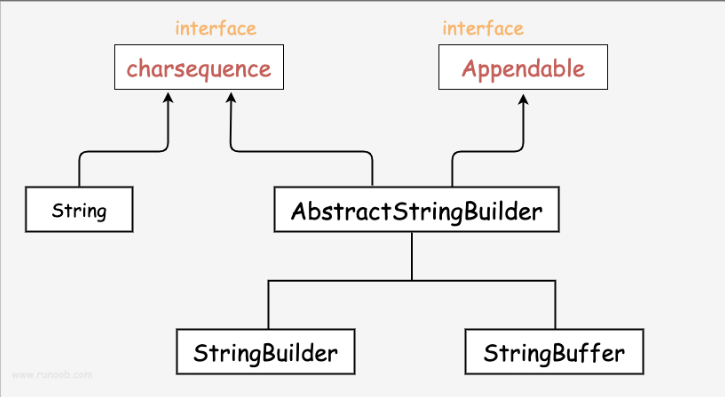

在使用 StringBuffer 类时，每次都会对 StringBuffer 对象本身进行操作，而不是生成新的对象(**避免一直生成新的对象造成内存浪费**)，所以如果需要对字符串进行修改推荐使用 StringBuffer。

StringBuilder 类在 Java 5 中被提出，它和 StringBuffer 之间的最大不同在于 StringBuilder 的方法不是线程安全的（不能同步访问）。

由于 StringBuilder 相较于 StringBuffer 有速度优势，所以多数情况下建议使用 StringBuilder 类。

```java
public class RunoobTest{
    public static void main(String args[]){
        StringBuilder sb = new StringBuilder(10);
        sb.append("Runoob..");
        System.out.println(sb);  
        sb.append("!");
        System.out.println(sb); 
        sb.insert(8, "Java");
        System.out.println(sb); 
        sb.delete(5,8);
        System.out.println(sb);  
    }
}

/*
result:
Runoob..
Runoob..!
Runoob..Java!
RunooJava!
*/
```

#### StringBuffer 方法

以下是 StringBuffer 类支持的主要方法：

| 序号 | 方法描述                                                     |
| :--- | :----------------------------------------------------------- |
| 1    | public StringBuffer append(String s) 将指定的字符串追加到此字符序列。 |
| 2    | public StringBuffer reverse()  将此字符序列用其反转形式取代。 |
| 3    | public delete(int start, int end) 移除此序列的子字符串中的字符。 |
| 4    | public insert(int offset, int i) 将 `int` 参数的字符串表示形式插入此序列中。 |
| 5    | insert(int offset, String str) 将 `str` 参数的字符串插入此序列中。 |
| 6    | replace(int start, int end, String str) 使用给定 `String` 中的字符替换此序列的子字符串中的字符。 |

以下列表列出了 StringBuffer 类的其他常用方法：

| 序号 | 方法描述                                                     |
| :--- | :----------------------------------------------------------- |
| 1    | int capacity() 返回当前容量。                                |
| 2    | char charAt(int index) 返回此序列中指定索引处的 `char` 值。  |
| 3    | void ensureCapacity(int minimumCapacity) 确保容量至少等于指定的最小值。 |
| 4    | void getChars(int srcBegin, int srcEnd, char[] dst, int dstBegin) 将字符从此序列复制到目标字符数组 `dst`。 |
| 5    | int indexOf(String str) 返回第一次出现的指定子字符串在该字符串中的索引。 |
| 6    | int indexOf(String str, int fromIndex) 从指定的索引处开始，返回第一次出现的指定子字符串在该字符串中的索引。 |
| 7    | int lastIndexOf(String str) 返回最右边出现的指定子字符串在此字符串中的索引。 |
| 8    | int lastIndexOf(String str, int fromIndex) 返回 String 对象中子字符串最后出现的位置。 |
| 9    | int length()  返回长度（字符数）。                           |
| 10   | void setCharAt(int index, char ch) 将给定索引处的字符设置为 `ch`。 |
| 11   | void setLength(int newLength) 设置字符序列的长度。           |
| 12   | CharSequence subSequence(int start, int end) 返回一个新的字符序列，该字符序列是此序列的子序列。 |
| 13   | String substring(int start) 返回一个新的 `String`，它包含此字符序列当前所包含的字符子序列。 |
| 14   | String substring(int start, int end) 返回一个新的 `String`，它包含此序列当前所包含的字符子序列。 |
| 15   | String toString() 返回此序列中数据的字符串表示形式。         |

#### 总结：

String 是被 final 修饰的，他的长度是不可变的，而在大多数情况下应该使用StringBuilder,因为需要考虑字符串线程安全的情况实在太少，而且还能节省创建多余对象所需要的内存

### 5. Java数组

#### 创建数组

```java
arrayRefVar = new dataType[arraySize];
dataType[] arrayRefVar = new dataType[arraySize];
dataType[] arrayRefVar = {value0, value1, ..., valuek};
```

- 使用 dataType[arraySize] 创建了一个数组。
- 把新创建的数组的引用赋值给变量 arrayRefVar。

数组的元素是通过索引访问的。数组索引从 0 开始，所以索引值从 0 到 arrayRefVar.length-1。

#### 多维数组

多维数组可以看成是数组的数组，比如二维数组就是一个特殊的一维数组，其每一个元素都是一个一维数组

##### 多维数组的动态初始化（以二维数组为例）

**注：在Java语言中，多维数组的声明可以不包含列，但必须说明行数**

```java
type[][] typeName = new type[typeLength1][typeLength2];
float []f1[] = new float[6][6];
float f2[][] = new float[6][];
int[][] arr = new int[6][6];
int[][][] array = new int[6][][];

//以上声明皆可以
//而这样声明就是错的
int[][] arr2 = new int[][6];

```


#### Arrays 类

java.util.Arrays 类能方便地操作数组，它提供的所有方法都是静态的。

- 给数组赋值：通过 fill 方法。
- 对数组排序：通过 sort 方法,按升序。
- 比较数组：通过 equals 方法比较数组中元素值是否相等。
- 查找数组元素：通过 binarySearch 方法能对排序好的数组进行二分查找法操作。

具体说明请查看下表：

| 序号 | 方法和说明                                                   |
| :--- | :----------------------------------------------------------- |
| 1    | **public static int binarySearch(Object[] a, Object key)** 用二分查找算法在给定数组中搜索给定值的对象(Byte,Int,double等)。数组在调用前必须排序好的。如果查找值包含在数组中，则返回搜索键的索引；否则返回 (-(*插入点*) - 1)。 |
| 2    | **public static boolean equals(long[] a, long[] a2)** 如果两个指定的 long 型数组彼此*相等*，则返回 true。如果两个数组包含相同数量的元素，并且两个数组中的所有相应元素对都是相等的，则认为这两个数组是相等的。换句话说，如果两个数组以相同顺序包含相同的元素，则两个数组是相等的。同样的方法适用于所有的其他基本数据类型（Byte，short，Int等）。 |
| 3    | **public static void fill(int[] a, int val)** 将指定的 int 值分配给指定 int 型数组指定范围中的每个元素。同样的方法适用于所有的其他基本数据类型（Byte，short，Int等）。 |
| 4    | **public static void sort(Object[] a)** 对指定对象数组根据其元素的自然顺序进行升序排列。同样的方法适用于所有的其他基本数据类型（Byte，short，Int等）。 |

### 6.日期时间

首先创建一个Date对象

```java
//无参构造器
new Date();

//有参构造器--传入参数：从 1970 年 1 月 1 日起的毫秒数
new Date(long millisec);
```

#### Date方法

| 序号 | 方法和描述                                                   |
| :--- | :----------------------------------------------------------- |
| 1    | **boolean after(Date date)** 若当调用此方法的Date对象在指定日期之后返回true,否则返回false。 |
| 2    | **boolean before(Date date)** 若当调用此方法的Date对象在指定日期之前返回true,否则返回false。 |
| 3    | **Object clone( )** 返回此对象的副本。                       |
| 4    | **int compareTo(Date date)** 比较当调用此方法的Date对象和指定日期。两者相等时候返回0。调用对象在指定日期之前则返回负数。调用对象在指定日期之后则返回正数。 |
| 5    | **int compareTo(Object obj)** 若obj是Date类型则操作等同于compareTo(Date) 。否则它抛出ClassCastException。 |
| 6    | **boolean equals(Object date)** 当调用此方法的Date对象和指定日期相等时候返回true,否则返回false。 |
| 7    | **long getTime( )** 返回自 1970 年 1 月 1 日 00:00:00 GMT 以来此 Date 对象表示的毫秒数。 |
| 8    | **int hashCode( )**  返回此对象的哈希码值。                  |
| 9    | **void setTime(long time)**   用自1970年1月1日00:00:00 GMT以后time毫秒数设置时间和日期。 |
| 10   | **String toString( )** 把此 Date 对象转换为以下形式的 String： dow mon dd hh:mm:ss zzz yyyy 其中： dow 是一周中的某一天 (Sun, Mon, Tue, Wed, Thu, Fri, Sat)。 |

#### 获取当前日期时间

Java中获取当前日期和时间很简单，使用 Date 对象的 toString() 方法来打印当前日期和时间

```java
import java.util.Date;
  
public class DateDemo {
   public static void main(String[] args) {
       // 初始化 Date 对象
       Date date = new Date();
        
       // 使用 toString() 函数显示日期时间
       System.out.println(date.toString());
   }
}

/*
Mon May 04 09:51:52 CDT 2013
*/
```

#### 日期比较

Java使用以下三种方法来比较两个日期：

- 使用 getTime() 方法获取两个日期（自1970年1月1日经历的毫秒数值），然后比较这两个值。
- 使用方法 before()，after() 和 equals()。例如，一个月的12号比18号早，则 new Date(99, 2, 12).before(new Date (99, 2, 18)) 返回true。
- 使用 compareTo() 方法，它是由 Comparable 接口定义的，Date 类实现了这个接口。

#### 格式化日期

```java
package API.APITime;

import java.time.LocalDateTime;
import java.time.format.DateTimeFormatter;

public class Demo06DateTimeFormat {
    public static void main(String[] args) {
        // 本地此刻  日期时间 对象
        LocalDateTime ldt = LocalDateTime.now();
        System.out.println(ldt);

        // 解析/格式化器
        DateTimeFormatter dtf = DateTimeFormatter.ofPattern("yyyy-MM-dd HH:mm:ss EEE a");
        // 正向格式化
        System.out.println(dtf.format(ldt));
        // 逆向格式化
        System.out.println(ldt.format(dtf));

        // 解析字符串时间
        DateTimeFormatter dtf1 = DateTimeFormatter.ofPattern("yyyy-MM-dd HH:mm:ss");
        // 解析当前字符串时间成为本地日期时间对象
        LocalDateTime ldt1 = LocalDateTime.parse("2019-11-11 11:11:11" ,  dtf1);
        System.out.println(ldt1);
        System.out.println(ldt1.getDayOfYear());
    }
}


/*
2022-09-16T00:12:51.650489700
2022-09-16 00:12:51 周五 上午
2022-09-16 00:12:51 周五 上午
2019-11-11T11:11:11
315
*/
```

#### 测量程序运行时间

```java
import java.util.*;
  
public class DiffDemo {
 
   public static void main(String[] args) {
      try {
         long start = System.currentTimeMillis( );
         System.out.println(new Date( ) + "\n");
         Thread.sleep(5*60*10);
         System.out.println(new Date( ) + "\n");
         long end = System.currentTimeMillis( );
         long diff = end - start;
         System.out.println("Difference is : " + diff);
      } catch (Exception e) {
         System.out.println("Got an exception!");
      }
   }
}

/*
Fri Jan 08 09:48:47 CST 2016

Fri Jan 08 09:48:50 CST 2016

Difference is : 3019
*/


/**
 * @title: FastPower
 * @Author 竹玄羽
 * @Date: 2022/9/23 0:58
 * 快速幂运算，且该方法求得是结果的最后三位
 */

public class FastPower {
    public static void main(String[] args) {
        int x = 2;
        int n = 100000;
         long result = 1L;

        long start = System.nanoTime();

        while (n > 0){
            if (n % 2 == 1){
                result = result * x % 1000;
            }
            n = n /2;
            x =x * x % 1000;
        }

        long end = System.nanoTime();

        System.out.println(result);
        System.out.println("用时：" + (end - start));
    }
}

/*
result:
376
用时：1200
*/
```

#### Calendar类

 Calendar类用于时间的计算

注：Calendar 的月份是从 **0** 开始的，但日期和年份是从 **1** 开始的

```java
//创建Calendar对象
Calendar c = Calendar.getInstance();//默认是当前日期

//创建一个代表2009年6月12日的Calendar对象
Calendar c1 = Calendar.getInstance();
c1.set(2009, 6 - 1, 12);
```

##### Calendar类对象字段类型

| 常量                  | 描述                           |
| :-------------------- | :----------------------------- |
| Calendar.YEAR         | 年份                           |
| Calendar.MONTH        | 月份                           |
| Calendar.DATE         | 日期                           |
| Calendar.DAY_OF_MONTH | 日期，和上面的字段意义完全相同 |
| Calendar.HOUR         | 12小时制的小时                 |
| Calendar.HOUR_OF_DAY  | 24小时制的小时                 |
| Calendar.MINUTE       | 分钟                           |
| Calendar.SECOND       | 秒                             |
| Calendar.DAY_OF_WEEK  | 星期几                         |

##### Calendar类对象信息的获得

```java
Calendar c1 = Calendar.getInstance();
// 获得年份
int year = c1.get(Calendar.YEAR);
// 获得月份
int month = c1.get(Calendar.MONTH) + 1;
// 获得日期
int date = c1.get(Calendar.DATE);
// 获得小时
int hour = c1.get(Calendar.HOUR_OF_DAY);
// 获得分钟
int minute = c1.get(Calendar.MINUTE);
// 获得秒
int second = c1.get(Calendar.SECOND);
// 获得星期几（注意（这个与Date类是不同的）：1代表星期日、2代表星期1、3代表星期二，以此类推）
int day = c1.get(Calendar.DAY_OF_WEEK);
```

#### GregorianCalendar类

Calendar类实现了公历日历，GregorianCalendar是Calendar类的一个具体实现。

| **序号** | **构造函数和说明**                                           |
| -------- | ------------------------------------------------------------ |
| 1        | **GregorianCalendar()** 在具有默认语言环境的默认时区内使用当前时间构造一个默认的 GregorianCalendar。 |
| 2        | **GregorianCalendar(int year, int month, int date)** 在具有默认语言环境的默认时区内构造一个带有给定日期设置的 GregorianCalendar |
| 3        | **GregorianCalendar(int year, int month, int date, int hour, int minute)** 为具有默认语言环境的默认时区构造一个具有给定日期和时间设置的 GregorianCalendar。 |
| 4        | **GregorianCalendar(int year, int month, int date, int hour, int minute, int second)**  为具有默认语言环境的默认时区构造一个具有给定日期和时间设置的 GregorianCalendar。 |
| 5        | **GregorianCalendar(Locale aLocale)** 在具有给定语言环境的默认时区内构造一个基于当前时间的 GregorianCalendar。 |
| 6        | **GregorianCalendar(TimeZone zone)** 在具有默认语言环境的给定时区内构造一个基于当前时间的 GregorianCalendar。 |
| 7        | **GregorianCalendar(TimeZone zone, Locale aLocale)**  在具有给定语言环境的给定时区内构造一个基于当前时间的 GregorianCalendar。 |

这里是GregorianCalendar 类提供的一些有用的方法列表：

| **序号** | **方法和说明**                                               |
| -------- | ------------------------------------------------------------ |
| 1        | **void add(int field, int amount)** 根据日历规则，将指定的（有符号的）时间量添加到给定的日历字段中。 |
| 2        | **protected void computeFields()** 转换UTC毫秒值为时间域值   |
| 3        | **protected void computeTime()** 覆盖Calendar ，转换时间域值为UTC毫秒值 |
| 4        | **boolean equals(Object obj)** 比较此 GregorianCalendar 与指定的 Object。 |
| 5        | **int get(int field)** 获取指定字段的时间值                  |
| 6        | **int getActualMaximum(int field)** 返回当前日期，给定字段的最大值 |
| 7        | **int getActualMinimum(int field)** 返回当前日期，给定字段的最小值 |
| 8        | **int getGreatestMinimum(int field)**  返回此 GregorianCalendar 实例给定日历字段的最高的最小值。 |
| 9        | **Date getGregorianChange()** 获得格里高利历的更改日期。     |
| 10       | **int getLeastMaximum(int field)** 返回此 GregorianCalendar 实例给定日历字段的最低的最大值 |
| 11       | **int getMaximum(int field)** 返回此 GregorianCalendar 实例的给定日历字段的最大值。 |
| 12       | **Date getTime()** 获取日历当前时间。                        |
| 13       | **long getTimeInMillis()** 获取用长整型表示的日历的当前时间  |
| 14       | **TimeZone getTimeZone()** 获取时区。                        |
| 15       | **int getMinimum(int field)** 返回给定字段的最小值。         |
| 16       | **int hashCode()** 重写hashCode.                             |
| 17       | **boolean isLeapYear(int year)** 确定给定的年份是否为闰年。  |
| 18       | **void roll(int field, boolean up)** 在给定的时间字段上添加或减去（上/下）单个时间单元，不更改更大的字段。 |
| 19       | **void set(int field, int value)** 用给定的值设置时间字段。  |
| 20       | **void set(int year, int month, int date)** 设置年、月、日的值。 |
| 21       | **void set(int year, int month, int date, int hour, int minute)** 设置年、月、日、小时、分钟的值。 |
| 22       | **void set(int year, int month, int date, int hour, int minute, int second)** 设置年、月、日、小时、分钟、秒的值。 |
| 23       | **void setGregorianChange(Date date)** 设置 GregorianCalendar 的更改日期。 |
| 24       | **void setTime(Date date)** 用给定的日期设置Calendar的当前时间。 |
| 25       | **void setTimeInMillis(long millis)** 用给定的long型毫秒数设置Calendar的当前时间。 |
| 26       | **void setTimeZone(TimeZone value)** 用给定时区值设置当前时区。 |
| 27       | **String toString()** 返回代表日历的字符串。                 |

代码实现：

  

```java
public class GregorianCalendarDemo {

   public static void main(String[] args) {
      String months[] = {
      "Jan", "Feb", "Mar", "Apr",
      "May", "Jun", "Jul", "Aug",
      "Sep", "Oct", "Nov", "Dec"};
      
      int year;
      // 初始化 Gregorian 日历
      // 使用当前时间和日期
      // 默认为本地时间和时区
      GregorianCalendar gcalendar = new GregorianCalendar();
      // 显示当前时间和日期的信息
      System.out.print("Date: ");
      System.out.print(months[gcalendar.get(Calendar.MONTH)]);
      System.out.print(" " + gcalendar.get(Calendar.DATE) + " ");
      System.out.println(year = gcalendar.get(Calendar.YEAR));
      System.out.print("Time: ");
      System.out.print(gcalendar.get(Calendar.HOUR) + ":");
      System.out.print(gcalendar.get(Calendar.MINUTE) + ":");
      System.out.println(gcalendar.get(Calendar.SECOND));
      
      // 测试当前年份是否为闰年
      if(gcalendar.isLeapYear(year)) {
         System.out.println("当前年份是闰年");
      }
      else {
         System.out.println("当前年份不是闰年");
      }
   }
}

/*
Date: Apr 22 2009
Time: 11:25:27
当前年份不是闰年
*/
```


### 7.BigDecimal大数据类

引入：
 浮点型运算的时候直接+  * / 可能会出现数据失真（精度问题）。
 **BigDecimal可以解决浮点型运算数据失真的问题**。

```java
import java.math.BigDecimal;
import java.math.RoundingMode;

/**
 目标：BigDecimal大数据类。

 BigDecimal类：
 包：java.math.
 创建对象的方式（最好的方式：）
 public static BigDecimal valueOf(double val) :包装浮点数成为大数据对象。
 方法声明
 public BigDecimal add(BigDecimal value)       加法运算
 public BigDecimal subtract(BigDecimal value)  减法运算
 public BigDecimal multiply(BigDecimal value)  乘法运算
 public BigDecimal divide(BigDecimal value)    除法运算
 public double doubleValue(): 把BigDecimal转换成double类型。
 */
public class BigDecimalDemo {
    public static void main(String[] args) {
        // 浮点型运算的时候直接+  * / 可能会出现数据失真（精度问题）。
        System.out.println(0.09 + 0.01);
        System.out.println(1.0 - 0.32);
        System.out.println(1.015 * 100);
        System.out.println(1.301 / 100);

        System.out.println("-------------------------");
        double a = 0.1;
        double b = 0.2;
        double c = a + b;
        System.out.println(c);
        System.out.println("--------------------------");
        // 包装浮点型数据成为大数据对象 BigDeciaml
        BigDecimal a1 = BigDecimal.valueOf(a);
        BigDecimal b1 = BigDecimal.valueOf(b);
        BigDecimal c1 = a1.add(b1);
        // BigDecimal c1 = a1.subtract(b1);
        // BigDecimal c1 = a1.multiply(b1);
        // BigDecimal c1 = a1.divide(b1);
        System.out.println(c1);

        // 目的：double
        double rs = c1.doubleValue();
        System.out.println(rs);

        // 注意事项：BigDecimal是一定要精度运算的
        BigDecimal a11 = BigDecimal.valueOf(10.0);
        BigDecimal b11 = BigDecimal.valueOf(3.0);
        /**
         参数一：除数 参数二：保留小数位数  参数三：舍入模式
         */
        BigDecimal c11 = a11.divide(b11, 5, RoundingMode.HALF_UP); // 3.3333333333
        System.out.println(c11);
        System.out.println("-------------------");
    }
}


/*
result:
0.09999999999999999
0.6799999999999999
101.49999999999999
0.013009999999999999
-------------------------
0.30000000000000004
--------------------------
0.3
0.3
3.33333
-------------------
*/
```


### 8.正则表达式

正则表达式定义了字符串的模式；可以用来搜索、编辑或处理文本。

正则表达式并不仅限于某一种语言，但是在每种语言中有细微的差别。

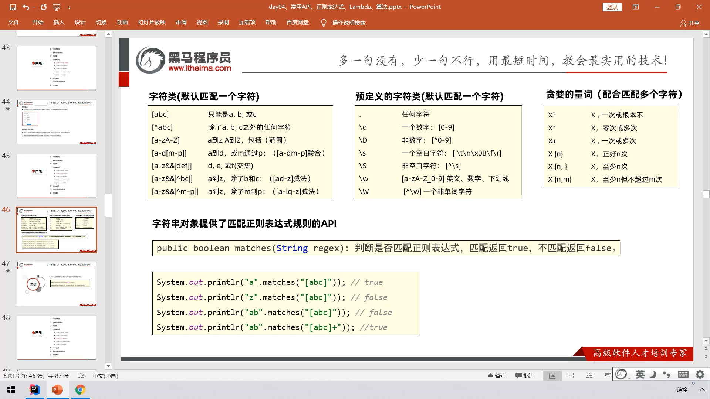

#### Regex类

- Pattern 类：

  pattern 对象是一个正则表达式的编译表示。Pattern 类没有公共构造方法。要创建一个 Pattern 对象，你必须首先调用其公共静态编译方法，它返回一个 Pattern 对象。该方法接受一个正则表达式作为它的第一个参数。

- Matcher 类：

  Matcher 对象是对输入字符串进行解释和匹配操作的引擎。与Pattern 类一样，Matcher 也没有公共构造方法。你需要调用 Pattern 对象的 matcher 方法来获得一个 Matcher 对象。

- PatternSyntaxException：

  PatternSyntaxException 是一个非强制异常类，它表示一个正则表达式模式中的语法错误

```java
String rs = "来黑马程序学习Java,电话020-43422424，或者联系邮箱" +
                "itcast@itcast.cn,电话18762832633，0203232323" +
                "邮箱bozai@itcast.cn，400-100-3233 ，4001003232";

        // 需求：从上面的内容中爬取出 电话号码和邮箱。
        // 1、定义爬取规则，字符串形式
        String regex = "(\\w{1,30}@[a-zA-Z0-9]{2,20}(\\.[a-zA-Z0-9]{2,20}){1,2})|(1[3-9]\\d{9})|(0\\d{2,6}-?\\d{5,20})|(400-?\\d{3,9}-?\\d{3,9})";

        // 2、把这个爬取规则编译成匹配对象。
        Pattern pattern = Pattern.compile(regex);

        // 3、得到一个内容匹配器对象
       Matcher matcher = pattern.matcher(rs);

        // 4、开始找了
        while (matcher.find()) {
            String rs1 = matcher.group();
            System.out.println(rs1);
        }

/*
result:
020-43422424
itcast@itcast.cn
18762832633
0203232323
bozai@itcast.cn
400-100-3233
4001003232
*/

```

#### 捕获组

捕获组是把多个字符当一个单独单元进行处理的方法，它通过对括号内的字符分组来创建。

```java
/*
在表达式（（A）（B（C））），有四个这样的组：
((A)(B(C)))
(A)
(B(C))
(C)
*/

import java.util.regex.Matcher;
import java.util.regex.Pattern;
 
public class RegexMatches
{
    public static void main( String[] args ){
 
      // 按指定模式在字符串查找
      String line = "This order was placed for QT3000! OK?";
      String pattern = "(\\D*)(\\d+)(.*)";
 
      // 创建 Pattern 对象
      Pattern r = Pattern.compile(pattern);
 
      // 现在创建 matcher 对象
      Matcher m = r.matcher(line);
      if (m.find( )) {
         System.out.println("Found value: " + m.group(0) );
         System.out.println("Found value: " + m.group(1) );
         System.out.println("Found value: " + m.group(2) );
         System.out.println("Found value: " + m.group(3) ); 
      } else {
         System.out.println("NO MATCH");
      }
   }
}

/*
result:
Found value: This order was placed for QT3000! OK?
Found value: This order was placed for QT
Found value: 3000
Found value: ! OK?
*/
```


#### 正则表达式语法

在其他语言中**\\** 表示：**我想要在正则表达式中插入一个普通的（字面上的）反斜杠，请不要给它任何特殊的意义。**

在 Java 中，**\\** 表示：**我要插入一个正则表达式的反斜线，所以其后的字符具有特殊的意义。**

| 字符          | 说明                                                         |
| :------------ | :----------------------------------------------------------- |
| \             | 将下一字符标记为特殊字符、文本、反向引用或八进制转义符。例如， *n*匹配字符 *n*。*\n* 匹配换行符。序列 *\*\\\** 匹配 *\\* ，*\\(* 匹配 *(*。 |
| ^             | 匹配输入字符串开始的位置。如果设置了 *RegExp* 对象的 *Multiline* 属性，^ 还会与"\n"或"\r"之后的位置匹配。 |
| $             | 匹配输入字符串结尾的位置。如果设置了 *RegExp* 对象的 *Multiline* 属性，$ 还会与"\n"或"\r"之前的位置匹配。 |
| *             | 零次或多次匹配前面的字符或子表达式。例如，zo* 匹配"z"和"zoo"。* 等效于 {0,}。 |
| +             | 一次或多次匹配前面的字符或子表达式。例如，"zo+"与"zo"和"zoo"匹配，但与"z"不匹配。+ 等效于 {1,}。 |
| ?             | 零次或一次匹配前面的字符或子表达式。例如，"do(es)?"匹配"do"或"does"中的"do"。? 等效于 {0,1}。 |
| {*n*}         | *n* 是非负整数。正好匹配 *n* 次。例如，"o{2}"与"Bob"中的"o"不匹配，但与"food"中的两个"o"匹配。 |
| {*n*,}        | *n* 是非负整数。至少匹配 *n* 次。例如，"o{2,}"不匹配"Bob"中的"o"，而匹配"foooood"中的所有 o。"o{1,}"等效于"o+"。"o{0,}"等效于"o*"。 |
| {*n*,*m*}     | *m* 和 *n* 是非负整数，其中 *n* <= *m*。匹配至少 *n* 次，至多 *m* 次。例如，"o{1,3}"匹配"fooooood"中的头三个 o。'o{0,1}' 等效于 'o?'。注意：您不能将空格插入逗号和数字之间。 |
| ?             | 当此字符紧随任何其他限定符（*、+、?、{*n*}、{*n*,}、{*n*,*m*}）之后时，匹配模式是"非贪心的"。"非贪心的"模式匹配搜索到的、尽可能短的字符串，而默认的"贪心的"模式匹配搜索到的、尽可能长的字符串。例如，在字符串"oooo"中，"o+?"只匹配单个"o"，而"o+"匹配所有"o"。 |
| .             | 匹配除"\r\n"之外的任何单个字符。若要匹配包括"\r\n"在内的任意字符，请使用诸如"[\s\S]"之类的模式。 |
| (*pattern*)   | 匹配 *pattern* 并捕获该匹配的子表达式。可以使用 *0...9* 属性从结果"匹配"集合中检索捕获的匹配。若要匹配括号字符 ( )，请使用"\("或者"\)"。 |
| (?:*pattern*) | 匹配 *pattern* 但不捕获该匹配的子表达式，即它是一个非捕获匹配，不存储供以后使用的匹配。这对于用"or"字符 (\|) 组合模式部件的情况很有用。例如，'industr(?:y\|ies) 是比 'industry\|industries' 更经济的表达式。 |
| (?=*pattern*) | 执行正向预测先行搜索的子表达式，该表达式匹配处于匹配 *pattern* 的字符串的起始点的字符串。它是一个非捕获匹配，即不能捕获供以后使用的匹配。例如，'Windows (?=95\|98\|NT\|2000)' 匹配"Windows 2000"中的"Windows"，但不匹配"Windows 3.1"中的"Windows"。预测先行不占用字符，即发生匹配后，下一匹配的搜索紧随上一匹配之后，而不是在组成预测先行的字符后。 |
| (?!*pattern*) | 执行反向预测先行搜索的子表达式，该表达式匹配不处于匹配 *pattern* 的字符串的起始点的搜索字符串。它是一个非捕获匹配，即不能捕获供以后使用的匹配。例如，'Windows (?!95\|98\|NT\|2000)' 匹配"Windows 3.1"中的 "Windows"，但不匹配"Windows 2000"中的"Windows"。预测先行不占用字符，即发生匹配后，下一匹配的搜索紧随上一匹配之后，而不是在组成预测先行的字符后。 |
| *x*\|*y*      | 匹配 *x* 或 *y*。例如，'z\|food' 匹配"z"或"food"。'(z\|f)ood' 匹配"zood"或"food"。 |
| [*xyz*]       | 字符集。匹配包含的任一字符。例如，"[abc]"匹配"plain"中的"a"。 |
| [^*xyz*]      | 反向字符集。匹配未包含的任何字符。例如，"[^abc]"匹配"plain"中"p"，"l"，"i"，"n"。 |
| [*a-z*]       | 字符范围。匹配指定范围内的任何字符。例如，"[a-z]"匹配"a"到"z"范围内的任何小写字母。 |
| [^*a-z*]      | 反向范围字符。匹配不在指定的范围内的任何字符。例如，"[^a-z]"匹配任何不在"a"到"z"范围内的任何字符。 |
| \b            | 匹配一个字边界，即字与空格间的位置。例如，"er\b"匹配"never"中的"er"，但不匹配"verb"中的"er"。 |
| \B            | 非字边界匹配。"er\B"匹配"verb"中的"er"，但不匹配"never"中的"er"。 |
| \c*x*         | 匹配 *x* 指示的控制字符。例如，\cM 匹配 Control-M 或回车符。*x* 的值必须在 A-Z 或 a-z 之间。如果不是这样，则假定 c 就是"c"字符本身。 |
| \d            | 数字字符匹配。等效于 [0-9]。                                 |
| \D            | 非数字字符匹配。等效于 [^0-9]。                              |
| \f            | 换页符匹配。等效于 \x0c 和 \cL。                             |
| \n            | 换行符匹配。等效于 \x0a 和 \cJ。                             |
| \r            | 匹配一个回车符。等效于 \x0d 和 \cM。                         |
| \s            | 匹配任何空白字符，包括空格、制表符、换页符等。与 [ \f\n\r\t\v] 等效。 |
| \S            | 匹配任何非空白字符。与 [^ \f\n\r\t\v] 等效。                 |
| \t            | 制表符匹配。与 \x09 和 \cI 等效。                            |
| \v            | 垂直制表符匹配。与 \x0b 和 \cK 等效。                        |
| \w            | 匹配任何字类字符，包括下划线。与"[A-Za-z0-9_]"等效。         |
| \W            | 与任何非单词字符匹配。与"[^A-Za-z0-9_]"等效。                |
| \x*n*         | 匹配 *n*，此处的 *n* 是一个十六进制转义码。十六进制转义码必须正好是两位数长。例如，"\x41"匹配"A"。"\x041"与"\x04"&"1"等效。允许在正则表达式中使用 ASCII 代码。 |
| \*num*        | 匹配 *num*，此处的 *num* 是一个正整数。到捕获匹配的反向引用。例如，"(.)\1"匹配两个连续的相同字符。 |
| \*n*          | 标识一个八进制转义码或反向引用。如果 \*n* 前面至少有 *n* 个捕获子表达式，那么 *n* 是反向引用。否则，如果 *n* 是八进制数 (0-7)，那么 *n* 是八进制转义码。 |
| \*nm*         | 标识一个八进制转义码或反向引用。如果 \*nm* 前面至少有 *nm* 个捕获子表达式，那么 *nm* 是反向引用。如果 \*nm* 前面至少有 *n* 个捕获，则 *n* 是反向引用，后面跟有字符 *m*。如果两种前面的情况都不存在，则 \*nm* 匹配八进制值 *nm*，其中 *n* 和 *m* 是八进制数字 (0-7)。 |
| \nml          | 当 *n* 是八进制数 (0-3)，*m* 和 *l* 是八进制数 (0-7) 时，匹配八进制转义码 *nml*。 |
| \u*n*         | 匹配 *n*，其中 *n* 是以四位十六进制数表示的 Unicode 字符。例如，\u00A9 匹配版权符号 (©)。 |

#### Matcher 类的方法

##### 索引方法

索引方法提供了有用的索引值，精确表明输入字符串中在哪能找到匹配：

| 序号 | 方法及说明                                                   |
| :--- | :----------------------------------------------------------- |
| 1    | *public int start()* 返回以前匹配的初始索引。                |
| 2    | *public int start(int group)*  返回在以前的匹配操作期间，由给定组所捕获的子序列的初始索引 |
| 3    | *public int end()* 返回最后匹配字符之后的偏移量。            |
| 4    | *public int end(int group)* 返回在以前的匹配操作期间，由给定组所捕获子序列的最后字符之后的偏移量。 |

##### 查找方法

查找方法用来检查输入字符串并返回一个布尔值，表示是否找到该模式：

| 序号 | 方法及说明                                                   |
| :--- | :----------------------------------------------------------- |
| 1    | *public boolean lookingAt()*  尝试将从区域开头开始的输入序列与该模式匹配。 |
| 2    | *public boolean find()* 尝试查找与该模式匹配的输入序列的下一个子序列。 |
| 3    | *public boolean find(int start)*重置此匹配器，然后尝试查找匹配该模式、从指定索引开始的输入序列的下一个子序列。 |
| 4    | *public boolean matches()* 尝试将整个区域与模式匹配。        |

##### 替换方法

替换方法是替换输入字符串里文本的方法：

| 序号 | 方法及说明                                                   |
| :--- | :----------------------------------------------------------- |
| 1    | *public Matcher appendReplacement(StringBuffer sb, String replacement)* 实现非终端添加和替换步骤。 |
| 2    | *public StringBuffer appendTail(StringBuffer sb)* 实现终端添加和替换步骤。 |
| 3    | *public String replaceAll(String replacement)*  替换模式与给定替换字符串相匹配的输入序列的每个子序列。 |
| 4    | *public String replaceFirst(String replacement)*  替换模式与给定替换字符串匹配的输入序列的第一个子序列。 |
| 5    | *public static String quoteReplacement(String s)* 返回指定字符串的字面替换字符串。这个方法返回一个字符串，就像传递给Matcher类的appendReplacement 方法一个字面字符串一样工作。 |

##### PatternSyntaxException 类的方法

PatternSyntaxException 是一个非强制异常类，它指示一个正则表达式模式中的语法错误。

PatternSyntaxException 类提供了下面的方法来帮助我们查看发生了什么错误。

| 序号 | 方法及说明                                                   |
| :--- | :----------------------------------------------------------- |
| 1    | *public String getDescription()* 获取错误的描述。            |
| 2    | *public int getIndex()*  获取错误的索引。                    |
| 3    | *public String getPattern()* 获取错误的正则表达式模式。      |
| 4    | *public String getMessage()* 返回多行字符串，包含语法错误及其索引的描述、错误的正则表达式模式和模式中错误索引的可视化指示。 |

### 9.Lambda表达式

 Lambda表达式只能简化函数式接口的匿名内部类的写法形式

-  首先必须是函数式接口----接口只有一个抽象方法
- 加上@FunctionalInterface注解，标记该接口是满足函数式接口！

#### Lambda准则

1. 参数类型可以不写
2. 如果只有一个参数，参数类型和（）都可以省略
3. 如果方法体代码只有一行，可以省略大括号，同时要省略分号
4. 如果方法体只有一行代码，可以省略大括号不写，同时如果是return语句，return不写，同时必须省去分号

```java
public class LambdaDemo {
    public static void main(String[] args) {
        /*
        Swimming s = new Swimming() {
            @Override
            public void swim() {
                System.out.println("鱼游泳很快！");
            }
        };
        */

        Swimming s = () -> System.out.println("鱼游泳很快！");

        go(s);

        System.out.println("======================");

        go(() -> System.out.println("学生游得很开心~"));

    }

    public static void go(Swimming s) {
        System.out.println("开始");
        s.swim();
        System.out.println("结束");
    }
}

@FunctionalInterface   //加上这个注解必须是函数式接口，里面只能有一个抽象方法
interface Swimming {
    void swim();
}
```

### 10.Stream

Stream（流）是一个来自数据源的元素队列并支持聚合操作

- 元素是特定类型的对象，形成一个队列。 Java中的Stream并不会存储元素，而是按需计算。
- *数据源* 流的来源。 可以是集合，数组，I/O channel， 产生器generator 等。
- *聚合操作* 类似SQL语句一样的操作， 比如filter, map, reduce, find, match, sorted等。

- *Pipelining*: 中间操作都会返回流对象本身。 这样多个操作可以串联成一个管道， 如同流式风格（fluent style）。 这样做可以对操作进行优化， 比如延迟执行(laziness)和短路( short-circuiting)。
- *内部迭代*： 以前对集合遍历都是通过Iterator或者For-Each的方式, 显式的在集合外部进行迭代， 这叫做外部迭代。 Stream提供了内部迭代的方式， 通过访问者模式(Visitor)实现。

#### 获取Stream

```java
package CollectionStudy.Stream;

/**
 * @author MOYU
 * @File JavaSE_Study-Stream
 * @Date 2022/6/6 9:14
 **/
public class Property {
    /*
    1.获取Stream流：创建一条流水线，并把数据放到流水线上准备操作
    2.中间方法：对数据进行中间操作，可以用多次
    3.终结方法：一个Stream流只有一个终结方法，用了流水线就结束

    重点：在Stream流中无法直接修改集合，数组等数据源中的数据，相当于只是获得数据进行操作，而非直接对内存中的数据操作

    Stream流获取方法：
                  1.单列结合：使用Collection接口中的默认方法stream()生成流
                            default Stream<E> stream()
                  2.双列集合：间接的生成流---可以先通过KeySet或者entrySet获取一个Set集合，在获取Stream集合
                  3.数组：Arrays中的静态方法stream生成流
                  4.同种数据类型的多个数据：如：1,2,3,4,5....使用Stream.of(T...values)生成流
     */
}

```

#### Stream提供的方法

##### 生成流

在 Java 8 中, 集合接口有两个方法来生成流：

- **stream()** − 为集合创建串行流。
- **parallelStream()** − 为集合创建并行流。

```java
List<String> strings = Arrays.asList("abc", "", "bc", "efg", "abcd","", "jkl");

//filter负责过滤数据；collect负责收集数据--获取流中剩余数据，它不负责创建容器，也不负责添加
//Collectors.toList():在底层会创建一个List集合，并把所有数据添加到List集合中
//Collectors.toSet():在底层创建一个Set集合，并把收集到的数据添加到Set集合中去
List<String> filtered = strings.stream().filter(string -> !string.isEmpty()).collect(Collectors.toList());
```

------

##### forEach

Stream 提供了新的方法 'forEach' 来迭代流中的每个数据。以下代码片段使用 forEach 输出了10个随机数：

```java
Random random = new Random();
random.ints().limit(10).forEach(System.out::println);
```

------

##### map

map 方法用于映射每个元素到对应的结果，以下代码片段使用 map 输出了元素对应的平方数：

```java
List<Integer> numbers = Arrays.asList(3, 2, 2, 3, 7, 3, 5);
// 获取对应的平方数
List<Integer> squaresList = numbers.stream().map( i -> i*i).distinct().collect(Collectors.toList());
```


------

##### filter

filter 方法用于通过设置的条件过滤出元素。以下代码片段使用 filter 方法过滤出空字符串：

```java
List<String>strings = Arrays.asList("abc", "", "bc", "efg", "abcd","", "jkl");
// 获取空字符串的数量
long count = strings.stream().filter(string -> string.isEmpty()).count();
```


------

##### limit

limit 方法用于获取指定数量的流。 以下代码片段使用 limit 方法打印出 10 条数据：

```java
Random random = new Random();
random.ints().limit(10).forEach(System.out::println);
```


------

##### sorted

sorted 方法用于对流进行排序。以下代码片段使用 sorted 方法对输出的 10 个随机数进行排序：

```java
Random random = new Random();
random.ints().limit(10).sorted().forEach(System.out::println);
```


------


##### 并行（parallel）程序

parallelStream 是流并行处理程序的代替方法。以下实例我们使用 parallelStream 来输出空字符串的数量：

```java
List<String> strings = Arrays.asList("abc", "", "bc", "efg", "abcd","", "jkl");
// 获取空字符串的数量
long count = strings.parallelStream().filter(string -> string.isEmpty()).count();
```

我们可以很容易的在顺序运行和并行直接切换。

------

##### Collectors

Collectors 类实现了很多归约操作，例如将流转换成集合和聚合元素。Collectors 可用于返回列表或字符串：

```java
List<String>strings = Arrays.asList("abc", "", "bc", "efg", "abcd","", "jkl");
List<String> filtered = strings.stream().filter(string -> !string.isEmpty()).collect(Collectors.toList());
 
System.out.println("筛选列表: " + filtered);
String mergedString = strings.stream().filter(string -> !string.isEmpty()).collect(Collectors.joining(", "));
System.out.println("合并字符串: " + mergedString);
```


------

##### 统计

另外，一些产生统计结果的收集器也非常有用。它们主要用于int、double、long等基本类型上，它们可以用来产生类似如下的统计结果。

```java
List<Integer> numbers = Arrays.asList(3, 2, 2, 3, 7, 3, 5);
 
IntSummaryStatistics stats = numbers.stream().mapToInt((x) -> x).summaryStatistics();
 
System.out.println("列表中最大的数 : " + stats.getMax());
System.out.println("列表中最小的数 : " + stats.getMin());
System.out.println("所有数之和 : " + stats.getSum());
System.out.println("平均数 : " + stats.getAverage());
```


#### 实例

##### 1.Stream可以用来过滤元素

```java
package CollectionStudy.Stream;

import java.util.ArrayList;
import java.util.List;
import java.util.Map;
import java.util.Set;
import java.util.stream.Collectors;

/**
 * @author MOYU
 * @File JavaSE_Study-Stream
 * @Date 2022/6/6 15:38
 **/
public class CollectStream {
    public static void main(String[] args) {
        //ListAndSet();

        //toMap收集
        ArrayList<String> list = new ArrayList<>();
        list.add("Mike,23");
        list.add("Michael,18");
        list.add("Jhon,22");
        list.add("Marry,19");

        //Collectors.toMap收集数据，添加到一个Map集合中
       /* Map<String, Integer> map = list.stream().filter(
                (String s) -> {
                    String[] split = s.split(",");
                    int age = Integer.parseInt(split[1]);
                    return age <= 20;
                }
        ).collect(Collectors.toMap(
                (String key) -> {
                    return key.split(",")[0];
                },
                (String value) -> {
                    return Integer.parseInt(value.split(",")[1]);
                }
        ));*/

        Map<String, Integer> map = list.stream().filter(s -> Integer.parseInt(s.split(",")[1]) <= 20)
                .collect(Collectors.toMap((key -> key.split(",")[0]), value -> Integer.parseInt(value.split(",")[1])));

        System.out.println(map);


        ListAndSet();
    }

    private static void ListAndSet() {
        ArrayList<Integer> list = new ArrayList<>();
        ArrayList<Integer> list2 = new ArrayList<>(List.of(1, 2, 3, 4, 5, 6, 7, 8, 9, 10));
        //2.
        for (int i = 1; i <= 10; i++) {
            list.add(i);
        }
        list.add(10);
        list.add(10);
        list.add(10);
        list.add(10);
        list.addAll(list2);

        //奇数不要，保留偶数
//        list.stream().filter(number -> number % 2 == 0).forEach(i -> System.out.println(i));

        //filter负责过滤数据；collect负责收集数据--获取流中剩余数据，它不负责创建容器，也不负责添加
        //Collectors.toList():在底层会创建一个List集合，并把所有数据添加到List集合中
        List<Integer> L = list.stream().filter(i -> i % 2 == 0).collect(Collectors.toList());
        System.out.println(L);

        List<Integer> collect = list.stream().filter(i -> i < 7).toList();
        System.out.println(collect);
        
        //Collectors.toSet():在底层创建一个Set集合，并把收集到的数据添加到Set集合中去
        Set<Integer> collectSet = list.stream().filter(number -> number % 2 == 0).collect(Collectors.toSet());
        System.out.println(collectSet);

        /*
        toList和toSet最大区别是：List集合和Set集合的底层逻辑不同，Set集合会自动去除重复的元素，而List集合不会
         */
    }
}

```


##### 2.Stream方法

```java
package CollectionStudy.Stream;

import java.util.ArrayList;
import java.util.List;
import java.util.stream.Stream;

/**
 * @author MOYU
 * @File JavaSE_Study-Stream
 * @Date 2022/6/6 15:12
 **/
public class MidStream {
    public static void main(String[] args) {
        ArrayList<String> list = new ArrayList<>(List.of("张三丰", "张无忌", "邢彦龙", "张蕊可", "邢彦龙", "张蕊可", "好耶", "张良", "阿巴巴"));

        //1.limit:截取指定参数个数的数据
        System.out.println("===========截取数据===========");
        list.stream().limit(6).forEach(System.out::println);

        //2.skip:跳过指定参数个数的数据
        System.out.println("===========跳过数据===========");
        list.stream().skip(3).forEach(System.out::println);

        //3.concat:合并a和b两个流为一个流
        System.out.println("===========合并流===========");
        ArrayList<String> list2 = new ArrayList<>(List.of("代静酉", "季宇晗", "王佳怡"));
        Stream<String> stream1 = list.stream();
        Stream<String> stream2 = list2.stream();
        Stream.concat(stream1, stream2).forEach(System.out::println);

        //简化
        Stream.concat(list.stream(), list2.stream()).forEach(System.out::println);

        //4.distinct:去除流中重复的元素（依赖HashCode和equals方法）
        System.out.println("===========除去数据===========");
        list.stream().distinct().forEach(System.out::println);

    }
}
```


## 四、文件(File)和IO

### 控制台输入输出(*)

#### 输入

```java
BufferedReader br = new BufferedReader(new InputStreamReader(System.in));
```

BufferedReader 对象创建后，我们便可以使用 read() 方法从控制台读取一个字符，或者用 readLine() 方法读取一个字符串。

每次调用 read() 方法，它从输入流读取一个字符并把该字符作为整数值返回。 当流结束的时候返回 -1。该方法抛出 IOException

```java
//使用 BufferedReader 在控制台读取字符
 
import java.io.*;
 
public class BRRead {
    public static void main(String[] args) throws IOException {
        char c;
        // 使用 System.in 创建 BufferedReader
        BufferedReader br = new BufferedReader(new InputStreamReader(System.in));
        System.out.println("输入字符, 按下 'q' 键退出。");
        // 读取字符
        do {
            c = (char) br.read();
            System.out.println(c);
        } while (c != 'q');
        br.close();
    }
}

//使用 BufferedReader 在控制台读取字符串
import java.io.*;
 
public class BRReadLines {
    public static void main(String[] args) throws IOException {
        // 使用 System.in 创建 BufferedReader
        BufferedReader br = new BufferedReader(new InputStreamReader(System.in));
        String str;
        System.out.println("Enter lines of text.");
        System.out.println("Enter 'end' to quit.");
        do {
            str = br.readLine();
            System.out.println(str);
        } while (!str.equals("end"));
        br.close();
    }
}
```

#### 输出

在此前已经介绍过，控制台的输出由 print( ) 和 println() 完成。这些方法都由类 PrintStream 定义，System.out 是该类对象的一个引用。

PrintStream 继承了 OutputStream类，并且实现了方法 write()。

```java
import java.io.*;
 
//演示 System.out.write().
public class WriteDemo {
    public static void main(String[] args) {
        int b;
        b = 'A';
        System.out.write(b);
        System.out.write('\n');
    }
}

/*
A
*/
```

**注意：**write() 方法不经常使用，因为 print() 和 println() 方法用起来更为方便。(废物方法)


### 文件

万物皆文件----计算机中，操作系统可以将一切设备抽象为文件

```java
public class Creat {
    public static void main(String[] args) {
        //method1();
        //method2();
        //method3();
    }

    private static void method3() {
        //        创建多级文件夹,在不存在的文件夹中创建文件夹
        //        直接调用mkdirs，mkdir没用
        File file = new File("C:\\Users\\zhuxuanyu\\Desktop\\test\\aaa\\bbb");
        boolean result = file.mkdirs();
        System.out.println(result);
    }

    private static void method2() {
        //        创建一个单级文件夹
        //        不管有没有后缀，创建的都是文件夹，即使有后缀也是文件夹的名字
        File file = new File("C:\\Users\\zhuxuanyu\\Desktop\\test");
        /*
        File file = new File("E:\\Desktop\\test\\aaa\\bbb");
        创建失败，因为bbb不存在，aaa也不存在，不能在不存在的文件夹中创建文件夹
        * */
        boolean result = file.mkdir();
        System.out.println(result);
    }


    private static void method1() {
        //        创建新的空的文件
        File file1 = new File("C:\\Users\\zhuxuanyu\\Desktop\\b.mp4");
        boolean result = false;
        try {
            //如果创建成功返回true,创建失败返回false
            //createNewFile方法不管调用者有没有文件名后缀，都会创建
            result = file1.createNewFile();
        } catch (IOException e) {
            e.printStackTrace();
        }
        System.out.println(result);
    }
}
```

**注意：mkdir()和mkdirs()都是创建文件夹，不管后缀名如何都是创建文件夹，而createNewFile()创建文件**


#### 文件方法

| 序号 | 方法描述                                                     |
| :--- | :----------------------------------------------------------- |
| 1    | *public String getName()* 返回由此抽象路径名表示的文件或目录的名称。 |
| 2    | *public String getParent()*  返回此抽象路径名的父路径名的路径名字符串，如果此路径名没有指定父目录，则返回 `null`。 |
| 3    | *public File getParentFile()* 返回此抽象路径名的父路径名的抽象路径名，如果此路径名没有指定父目录，则返回 `null`。 |
| 4    | *public String getPath()* 将此抽象路径名转换为一个路径名字符串。 |
| 5    | *public boolean isAbsolute()* 测试此抽象路径名是否为绝对路径名。 |
| 6    | *public String getAbsolutePath()* 返回抽象路径名的绝对路径名字符串。 |
| 7    | *public boolean canRead()* 测试应用程序是否可以读取此抽象路径名表示的文件。 |
| 8    | *public boolean canWrite()* 测试应用程序是否可以修改此抽象路径名表示的文件。 |
| 9    | *public boolean exists(）* 测试此抽象路径名表示的文件或目录是否存在。 |
| 10   | *public boolean isDirectory()* 测试此抽象路径名表示的文件是否是一个目录。 |
| 11   | *public boolean isFile()* 测试此抽象路径名表示的文件是否是一个标准文件。 |
| 12   | *public long lastModified()* 返回此抽象路径名表示的文件最后一次被修改的时间。 |
| 13   | *public long length()* 返回由此抽象路径名表示的文件的长度。  |
| 14   | *public boolean createNewFile() throws IOException* 当且仅当不存在具有此抽象路径名指定的名称的文件时，原子地创建由此抽象路径名指定的一个新的空文件。 |
| 15   | *public boolean delete()*  删除此抽象路径名表示的文件或目录。 |
| 16   | *public void deleteOnExit()* 在虚拟机终止时，请求删除此抽象路径名表示的文件或目录。 |
| 17   | *public String[] list()* 返回由此抽象路径名所表示的目录中的文件和目录的名称所组成字符串数组。 |
| 18   | *public String[] list(FilenameFilter filter)* 返回由包含在目录中的文件和目录的名称所组成的字符串数组，这一目录是通过满足指定过滤器的抽象路径名来表示的。 |
| 19   | *public File[] listFiles()*  返回一个抽象路径名数组，这些路径名表示此抽象路径名所表示目录中的文件。 |
| 20   | *public File[] listFiles(FileFilter filter)* 返回表示此抽象路径名所表示目录中的文件和目录的抽象路径名数组，这些路径名满足特定过滤器。 |
| 21   | *public boolean mkdir()* 创建此抽象路径名指定的目录。        |
| 22   | *public boolean mkdirs()* 创建此抽象路径名指定的目录，包括创建必需但不存在的父目录。 |
| 23   | *public boolean renameTo(File dest)*  重新命名此抽象路径名表示的文件。 |
| 24   | *public boolean setLastModified(long time)* 设置由此抽象路径名所指定的文件或目录的最后一次修改时间。 |
| 25   | *public boolean setReadOnly()* 标记此抽象路径名指定的文件或目录，以便只可对其进行读操作。 |
| 26   | *public static File createTempFile(String prefix, String suffix, File directory) throws IOException* 在指定目录中创建一个新的空文件，使用给定的前缀和后缀字符串生成其名称。 |
| 27   | *public static File createTempFile(String prefix, String suffix) throws IOException* 在默认临时文件目录中创建一个空文件，使用给定前缀和后缀生成其名称。 |
| 28   | *public int compareTo(File pathname)* 按字母顺序比较两个抽象路径名。 |
| 29   | *public int compareTo(Object o)* 按字母顺序比较抽象路径名与给定对象。 |
| 30   | *public boolean equals(Object obj)* 测试此抽象路径名与给定对象是否相等。 |
| 31   | *public String toString()*  返回此抽象路径名的路径名字符串。 |

#### 方法实例

```java
//创建文件方法
//通过给定的父抽象路径名和子路径名字符串创建一个新的File实例。
File(File parent, String child);

//通过将给定路径名字符串转换成抽象路径名来创建一个新 File 实例。
File(String pathname) 

//根据 parent 路径名字符串和 child 路径名字符串创建一个新 File 实例。
File(String parent, String child)   
    
//通过将给定的 file: URI 转换成一个抽象路径名来创建一个新的 File 实例。
File(URI uri) 

public class Creat {
    public static void main(String[] args) {
        //method1();
        //method2();
        //method3();
    }

    private static void method3() {
        //        创建多级文件夹,在不存在的文件夹中创建文件夹
        //        直接调用mkdirs，mkdir没用
        File file = new File("C:\\Users\\zhuxuanyu\\Desktop\\test\\aaa\\bbb");
        boolean result = file.mkdirs();
        System.out.println(result);
    }

    private static void method2() {
        //        创建一个单级文件夹
        //        不管有没有后缀，创建的都是文件夹，即使有后缀也是文件夹的名字
        File file = new File("C:\\Users\\zhuxuanyu\\Desktop\\test");
        /*
        File file = new File("E:\\Desktop\\test\\aaa\\bbb");
        创建失败，因为bbb不存在，aaa也不存在，不能在不存在的文件夹中创建文件夹
        * */
        boolean result = file.mkdir();
        System.out.println(result);
    }


    private static void method1() {
        //        创建新的空的文件
        File file1 = new File("C:\\Users\\zhuxuanyu\\Desktop\\b.mp4");
        boolean result = false;
        try {
            //如果创建成功返回true,创建失败返回false
            //createNewFile方法不管调用者有没有文件名后缀，都会创建
            result = file1.createNewFile();
        } catch (IOException e) {
            e.printStackTrace();
        }
        System.out.println(result);
    }
}

//删除单级文件
public class DeleteFile {
    public static void main(String[] args) {
   /* delete注意：
        1.不走回收站，直接删除
        2.删除文件，直接删除，删除文件夹，只能删除空的文件夹
        3.如果删除有内容的文件夹只能先进文件夹把内容删除
        */
//       method1();
        File file = new File("C:\\Users\\zhuxuanyu\\Desktop\\test");
        boolean result = file.delete();
        System.out.println(result);
    }

    private static void method1() {
        File file = new File("C:\\Users\\zhuxuanyu\\Desktop\\a.txt");
        boolean result = file.delete();
        System.out.println(result);
    }
}

//删除多级文件
public class DeleteFiles {
    public static void main(String[] args) {
        //delete只能删除文件和空文件夹
        //先删除里面在删除外面
        File file = new File("C:\\Users\\zhuxuanyu\\Desktop\\test");
        deleteDir(file);
    }

    private static void deleteDir(File file) {
        //delete只能删除文件和空文件夹，先删除里面
        //递归方法删除：可以解决所有文件夹和递归相结合的题目
        //1.进入
        File[] files = file.listFiles();
        for (File him : files) {
            System.out.println(him);
        }
        //2.遍历
        for (File path : files) {
            if(path.isFile()){
                //3.判断，如果遍历到的对象是一个文件，直接删除
                path.delete();
            }else {
                //4.判断：递归
                //参数一定要是file中的文件夹对象
                deleteDir(path);
            }
        }
        //最后删除外面的文件夹
        boolean result = file.delete();
        System.out.println(result);
    }
}

  
//listFile()
public class ListFile {
    public static void main(String[] args) {
        /*
        注意：
            1.当调用者是一个文件时：返回一个null
            2.当调用者是一个空文件夹时：返回一个长度为0的数组
            3.当调用者是一个有内容的文件夹：---返回文件夹下的所有
            4.当调用者是一个有权限才能进入的文件夹时：也返回一个null
         即：
            1.当调用者不存在或者是文件，或者文件夹有权限才能访问时，返回null
            2.当调用者是一个空文件夹，返回一个长度为0的数组
            3.当有内容则返回内容，包括隐藏内容
         */
        //listFiles返回路径下的所有文件和文件夹，存储在一个数组中
        //包括隐藏文件和隐藏文件夹
        File file = new File("E:\\Desktop\\test");
        File[] files = file.listFiles();
        System.out.println(files.length);
        for (File path : files) {
            System.out.println(path);
        }
    }
}


//统计一个文件夹中每种文件出现的次数
public class CountFiles {
    public static void main(String[] args) {
        //如果用变量来统计每次只能统计一种
        //可以利用map集合来统计，键--文件名后缀，值--次数
        File file = new File("E:\\Desktop");
        HashMap<String, Integer> hm = new HashMap<>();
        getCount(hm, file);
        System.out.println(hm);
    }
    private static void getCount(HashMap<String, Integer> hm, File file) {
        //1.进入
        File[] files = file.listFiles();
        //2.遍历
        for (File f : files) {
            if (f.isFile()) {
                String fileName = f.getName();
                //不考虑无后缀或者多级名称
                String[] nameArr = fileName.split("\\.");
                if (nameArr.length == 2) {
                    String endName = nameArr[1];
                    if (hm.containsKey(endName)) {
                        //在hm集合中查找该类型后缀是否存在，if中是存在
                        Integer count = hm.get(endName);
                        //当这种文件再次出现，次数加1
                        count++;
                        hm.put(endName,count);
                    } else {
                        //else中是不存在，表示当前这种文件第一次出现
                        hm.put(endName, 1);
                    }
                }
            } else {
                getCount(hm, f);
            }
        }
    }
}

//其他常用方法
public boolean isDirectory()  测试此抽象路径名表示的File是否为目录
public boolean isFile()       测试此抽象路径名表示的File是否为文件
public boolean exists()       测试此抽象路径名表示的File是否存在
public String getName()       返回由此抽象路径名表示的文件或目录的名称
//注意点:
  //1.如果调用者是文件,那么获取的是文件名和后缀名
  //2.如果调用者是一个文件夹,那么获取的是文件夹的名字
```


### IO


#### FileInputStream

```java
//可以使用字符串类型的文件名来创建一个输入流对象来读取文件：
InputStream f = new FileInputStream("C:/java/hello");

//也可以使用一个文件对象来创建一个输入流对象来读取文件。我们首先得使用 File() 方法来创建一个文件对象：
File f = new File("C:/java/hello");
InputStream in = new FileInputStream(f);
```

| 序号 | 方法及描述                                                   |
| :--- | :----------------------------------------------------------- |
| 1    | *public void close() throws IOException{}* 关闭此文件输入流并释放与此流有关的所有系统资源。抛出IOException异常。 |
| 2    | *protected void finalize()throws IOException {}* 这个方法清除与该文件的连接。确保在不再引用文件输入流时调用其 close 方法。抛出IOException异常。 |
| 3    | *public int read(int r)throws IOException{}* 这个方法从 InputStream 对象读取指定字节的数据。返回为整数值。返回下一字节数据，如果已经到结尾则返回-1。 |
| 4    | *public int read(byte[] r) throws IOException{}* 这个方法从输入流读取r.length长度的字节。返回读取的字节数。如果是文件结尾则返回-1。 |
| 5    | *public int available() throws IOException{}* 返回下一次对此输入流调用的方法可以不受阻塞地从此输入流读取的字节数。返回一个整数值。 |

#### 字节流

 字节流：操作所有类型的文件：包括音频视频图片等
            1.创建字节流输出对象：
                        没有就创建
                        有在第二个参数写上true
            2.写入数据
                        换行： win：\r\n  linux:\n  mac:\r
                        可以写一个字节，一次写一个字节数组的数据局，一次写一个字节数组的部分数据
                        可以通过"字符串“.getBytes(StandardCharsets.UTF_8)来写入字符串
            3.释放资源
                        file.close();

通过字节流实现对文件多种操作

```java
public class CopyFile {
   /*
   复制文件：
            1.复制文件其实就是把文件从一个文件中（数据源）读取出来，写到另一个文件中（目的地）
            2.数据源-----读数据：FileInputStream
            3.目的地-----写数据：FileOutputStream
   */
    public static void main(String[] args) throws IOException {
        //读文件
        FileInputStream fileInputStream = new FileInputStream("E:\\Desktop\\a.txt");

        //写文件
        FileOutputStream fileOutputStream = new FileOutputStream("D:\\JAVA\\Code\\JavaSE_Study\\JavaSE_ Advanced\\src\\IO\\ByteStream\\a.txt");

        int b;
        while ((b = fileInputStream.read()) != -1){
            System.out.print((char)b);
            fileOutputStream.write(b);
        }
        fileInputStream.close();
        fileOutputStream.close();
    }
}

```


#### 字节缓冲流

字节缓冲输出流：BufferOutputStream

字节缓冲输入流：BufferInputStream

**字节缓冲流构造方法需要字节流，而不是具体文件或者路径**

 **因为字节缓冲仅仅是提供缓冲流，真正的读写数据还得靠基本的字节流对象操作**

使用字节流读取文本文件是因为他每次只能读取一个字节的数据，而编码表对字符的编码是多个字节

```java
public class BufferInput {
    public static void main(String[] args) throws IOException {
//        利用缓冲流拷贝文件
//        创建字节缓冲输入流
//        在底层创建长度8192的字节数组
        BufferedInputStream bufferedInputStream = new BufferedInputStream(new FileInputStream("D:\\JAVA\\Code\\JavaSE_Study\\JavaSE_ Advanced\\src\\IO\\ByteStream\\a.txt"));
//        创建字节缓冲输入流
//        在底层创建长度8192的字节数组
        BufferedOutputStream bufferedOutputStream = new BufferedOutputStream(new FileOutputStream("D:\\JAVA\\Code\\JavaSE_Study\\JavaSE_ Advanced\\src\\IO\\ByteStream\\b.txt"));

        int r;
        while ((r = bufferedInputStream.read()) != -1){
            bufferedOutputStream.write(r);
        }

        //方法的底层会把字节流关闭
        bufferedInputStream.close();
        bufferedOutputStream.close();
    }
}
```


#### 字符流

字符流 = 字节流 + 编码表   (不管哪张表，中文第一个字节都是负数)

字符流写数据（读数据差不多）：
            1.创建字符流输出对象
            2.写数据
            3.释放资源

**字符流只能用来传输字符**

##### 字符流编码与解码

```java
package IO.charStream;

import java.io.UnsupportedEncodingException;
import java.nio.charset.StandardCharsets;
import java.util.Arrays;

/**
 * @author MOYU
 * @File JavaSE_Study-IO.charstream
 * @Date 2022/6/10 14:16
 **/
public class Dome {
    public static void main(String[] args) throws UnsupportedEncodingException {
        method1();

        method2();

    }

    private static void method2() throws UnsupportedEncodingException {
        //解码
        byte[] byte1 = {-26, -120, -111, -25, -120, -79, -28, -72, -83, -27, -101, -67};
        byte[] byte2 = {-50, -46, -80, -82, -42, -48, -71, -6};

        String s1 = new String(byte1);
        String s2 = new String(byte2,"GBK");

        System.out.println(s1);
        System.out.println(s2);
    }

    private static void method1() throws UnsupportedEncodingException {
        //编码
        String s = "我爱中国";
        byte[] bytes1 = s.getBytes();
        System.out.println(Arrays.toString(bytes1));

        byte[] bytes2 = s.getBytes(StandardCharsets.UTF_8);
        System.out.println(Arrays.toString(bytes2));

        byte[] bytes3 = s.getBytes("GBK");
        System.out.println(Arrays.toString(bytes3));
    }
}

```

##### 字符流方法

```java
package IO.charStream.InputAndOutput;

import java.io.FileWriter;
import java.io.IOException;

/**
 * @author MOYU
 * @File JavaSE_Study-IO.charStream
 * @Date 2022/6/10 17:03
 **/
public class WriteBasic {
    public static void main(String[] args) throws IOException {
        /*
        1.创建字符输出流的对象：
                        a.如果文件不存在则创建，但父级路径得存在
                        b.如果文件存在则清空
                        c.追加就在文件路径后面加true
         */
        FileWriter fw = new FileWriter("D:\\JAVA\\Code\\JavaSE_Study\\JavaSE_ Advanced\\src\\IO\\charStream\\a.txt",true);

        /*
        2.写数据:
                a.int类型整数直接转化为字符型
                b.写出字符串数据，是把字符串本身原样输出
         */

       //一次写一个
        fw.write(97);
        fw.write(98);
        fw.write(99);

       //一次写入一个字符数组
        char[] chars1 = {97,98,99,100,101};
        fw.write(chars1);

       //一次写入一个字符数组的一部分
        char[] chars2 = {97,98,99,100,101};
        fw.write(chars2,0,3);
        
        fw.write("\n");

       //写入一个字符串
        String line1 = "我爱中国！";
        fw.write(line1);

        //写入一个字符串的一部分
        String line2 = "我爱中国！";
        fw.write(line2,0,4);

        //3.关闭文件，释放资源
        fw.close();
    }
}


 		//flush 刷新流：即将程序运行的缓存写入文件，刷新后还能继续写数据
        //close 关闭流：释放资源，关闭后无法写入

        FileWriter file = new FileWriter("D:\\JAVA\\Code\\JavaSE_Study\\JavaSE_ Advanced\\src\\IO\\charStream\\b.txt");

        file.write("好耶！");

        //如果不关闭文件，写入的数据会一直在缓存空间，而不会写入文件
        //file.close();

        //刷新缓存区，将缓存区数据写入文件，然后继续执行程序
        file.flush();

        file.write("好耶！");
        file.close();
```


#### 字符缓冲流

##### 写入

```java
package IO.charStream.BufferStream;

import java.io.BufferedWriter;
import java.io.FileWriter;
import java.io.IOException;

/**
 * @author MOYU
 * @File JavaSE_Study-IO.charStream.BufferStream
 * @Date 2022/6/10 17:53
 **/
public class WriteBuffer {
    public static void main(String[] args) throws IOException {
        //字符缓冲输入流
        BufferedWriter bw = new BufferedWriter(new FileWriter("D:\\JAVA\\Code\\JavaSE_Study\\JavaSE_ Advanced\\src\\IO\\charStream\\b.txt"));

        //写出数据
        bw.write(97);
        char[] chars = {98,99,102,111};
        bw.write(chars);
        //换行
        bw.newLine();
        bw.write(chars,0,3);
        bw.write("好耶！");

        bw.close();
    }
}

```

##### 读取

```java
package IO.charStream.BufferStream;

import java.io.BufferedReader;
import java.io.FileReader;
import java.io.IOException;

/**
 * @author MOYU
 * @File JavaSE_Study-IO.charStream.BufferStream
 * @Date 2022/6/10 17:47
 **/
public class ReaderDome {
    /*
    同样不能直接传文件，只能传字符输入/输出流
     */
    public static void main(String[] args) throws IOException {
        //字符缓冲输入流
        BufferedReader br = new BufferedReader(new FileReader("D:\\JAVA\\Code\\JavaSE_Study\\JavaSE_ Advanced\\src\\IO\\charStream\\a.txt"));

        //读取数据
       /* char[] chars = new char[1024];
        int length;
        while ((length = br.read(chars)) != -1){
            System.out.println(new String(chars,0,length));
        }*/

        //读不到数据就返回null，而直接读取读不到返回-1
        String line1 = br.readLine();
        String line2 = br.readLine();
        String line3 = br.readLine();

        System.out.println(line1);
        System.out.println(line2);
        System.out.println(line3);

        br.close();
    }
}

```

##### Demo

```java
package IO.charStream.BufferStream;

import java.io.*;
import java.util.Arrays;

/**
 * @author MOYU
 * @File JavaSE_Study-IO.charStream.BufferStream
 * @Date 2022/6/10 18:01
 **/
public class ReadAndSortProject {
    public static void main(String[] args) throws IOException {
        //1.把数据读进来
        BufferedReader br = new BufferedReader(new FileReader("D:\\JAVA\\Code\\JavaSE_Study\\JavaSE_ Advanced\\src\\IO\\charStream\\b.txt"));
        //输出流写在这里是大错特错
        //BufferedWriter bw = new BufferedWriter(new FileWriter("D:\\JAVA\\Code\\JavaSE_Study\\JavaSE_ Advanced\\src\\IO\\charStream\\b.txt"));

        String line = br.readLine();
        System.out.println("读取到的：" + line);

        //2.排序
        //空格切割
        String[] strings = line.split(" ");
        //类型转换
        int[] arr = new int[strings.length];
        for (int i = 0; i < strings.length; i++) {
            //转换
            arr[i] = Integer.parseInt(strings[i]);
        }

        Arrays.sort(arr);
        System.out.println(Arrays.toString(arr));

        //3.把排序结果返回到本地
        //这个不能提前创建，如果写在前面，会将文件的内容清空
        BufferedWriter bw = new BufferedWriter(new FileWriter("D:\\JAVA\\Code\\JavaSE_Study\\JavaSE_ Advanced\\src\\IO\\charStream\\b.txt"));
        for (int i : arr) {
            bw.write(i + " ");
        }

        //关闭文件，释放资源
        br.close();
        bw.close();
    }
}
```


### 序列化

Java 提供了一种对象序列化的机制，该机制中，一个对象可以被表示为一个字节序列，该字节序列包括该对象的数据、有关对象的类型的信息和存储在对象中数据的类型。

将序列化对象写入文件之后，可以从文件中读取出来，并且对它进行反序列化，也就是说，对象的类型信息、对象的数据，还有对象中的数据类型可以用来在内存中新建对象。

整个过程都是 Java 虚拟机（JVM）独立的，也就是说，在一个平台上序列化的对象可以在另一个完全不同的平台上反序列化该对象。

类 ObjectInputStream 和 ObjectOutputStream 是高层次的数据流，它们包含反序列化和序列化对象的方法。

#### 注意

**每个被对象操作流操作的对象需要实现Serializable接口，它仅仅用于表示这个类是对象操作流操作的类**

##### 序列号

serialVersionUID  序列号，若过自己没生成，JVM会自动根据类的信息自动·计算出一个

  问题： 如果类的信息被修改，JVM会在算出一个，导致本地文件保存的UID和再次算出的UID不符合

解决方法：1. 每次修改javabean(对象)后，重新对象输出流操作，使UID一致

 				  2. 自己创建UID序列号，不用JVM创建就好了

##### 关键词 ---- transient

- 一旦变量被transient修饰，变量将不再是对象持久化的一部分，该变量内容在序列化后无法获得访问。
- transient关键字只能修饰变量，而不能修饰方法和类。注意，本地变量是不能被transient关键字修饰的。变量如果是用户自定义类变量，则该类需要实现Serializable接口。
- 被transient关键字修饰的变量不再能被序列化，一个静态变量不管是否被transient修饰，均不能被序列化。

##### 反序列化错误

ObjectInputStream  操作的文件，在读取时，当读取不到对象是，返回EOFException错误，应该用try...catch捕获


#### 举例

```java
package IO.ObjectOperationFlow;

import java.io.Serial;
import java.io.Serializable;

/**
 * @author MOYU
 * @File JavaSE_Study-IO.ObjectOperationFlow
 * @Date 2022/6/10 22:16
 **/
public class User implements Serializable {
    /*
    serialVersionUID  序列号，若过自己没生成，JVM会自动根据类的信息自动·计算出一个，
    问题： 如果类的信息被修改，JVM会在算出一个，导致本地文件保存的UID和再次算出的UID不符合

    解决方法：1.每次修改javabean(对象)后，重新对象输出流操作，使UID一致
            2.自己创建UID序列号，不用JVM创建就好了
     */
    @Serial
    private static final long serialVersionUID = -1413435151830185965L;
    /*
        如果想要类的对象被序列化---即可以被对象操作流操作，那么这个类必须实现一个接口   Serializable
        Serializable接口是一个标记性接口，啥都没有，仅仅用来进行标记类，表示该类可以被对象操作流操作
         */
    private String name;
    //transient   修饰的变量不被序列化
    private transient String password;

    public User() {
    }

    public User(String name, String password) {
        this.name = name;
        this.password = password;
    }

    public String getName() {
        return name;
    }

    public void setName(String name) {
        this.name = name;
    }

    public String getPassword() {
        return password;
    }

    public void setPassword(String password) {
        this.password = password;
    }

    @Override
    public String toString() {
        return "User{" +
                "name='" + name + '\'' +
                ", password='" + password + '\'' +
                '}';
    }
}


package IO.ObjectOperationFlow;

import java.io.*;

/**
 * @author MOYU
 * @File JavaSE_Study-IO.ObjectOperationFlow
 * @Date 2022/6/11 0:40
 **/
public class JavaBean {
    public static void main(String[] args) throws IOException, ClassNotFoundException {
        //序列化
        method1();
        //反序列化
        method2();
    }

    private static void method2() throws IOException, ClassNotFoundException {
        ObjectInputStream objectInputStream = new ObjectInputStream(new FileInputStream("D:\\JAVA\\Code\\JavaSE_Study\\JavaSE_ Advanced\\src\\IO\\ObjectOperationFlow\\注册.txt"));

        User o = (User) objectInputStream.readObject();

        System.out.println(o);

        objectInputStream.close();
    }

    private static void method1() throws IOException {
        User user = new User("竹玄羽", "M1281409960");

        ObjectOutputStream objectOutputStream = new ObjectOutputStream(new FileOutputStream("D:\\JAVA\\Code\\JavaSE_Study\\JavaSE_ Advanced\\src\\IO\\ObjectOperationFlow\\注册.txt"));

        objectOutputStream.writeObject(user);

        objectOutputStream.close();
    }
}

```


### properties配置文件

Properties特性：
                    1.本质是Map集合
                    2.Properties中有跟IO相关的方法
                    3.键值对的数据类型基本都定义为字符串

除了从 Hashtable 中所定义的方法，Properties 还定义了以下方法：

| 序号 | 方法描述                                                     |
| :--- | :----------------------------------------------------------- |
| 1    | *String getProperty(String key)*  用指定的键在此属性列表中搜索属性。 |
| 2    | *String getProperty(String key, String defaultProperty)* 用指定的键在属性列表中搜索属性。 |
| 3    | *void list(PrintStream streamOut)*  将属性列表输出到指定的输出流。 |
| 4    | *void list(PrintWriter streamOut)* 将属性列表输出到指定的输出流。 |
| 5    | *void load(InputStream streamIn) throws IOException*  从输入流中读取属性列表（键和元素对）。 |
| 6    | *Enumeration propertyNames( )* 按简单的面向行的格式从输入字符流中读取属性列表（键和元素对）。 |
| 7    | *Object setProperty(String key, String value)*  调用 Hashtable 的方法 put。 |
| 8    | *void store(OutputStream streamOut, String description)*  以适合使用 load(InputStream)方法加载到 Properties 表中的格式，将此 Properties 表中的属性列表（键和元素对）写入输出流。 |

##### **实例**

```java
package IO.PropertiesStudy;

import java.io.FileWriter;
import java.io.IOException;
import java.util.Properties;

/**
 * @author MOYU
 * @File JavaSE_Study-IO.PropertiesStudy
 * @Date 2022/6/11 19:35
 **/
public class StoreFun {
    public static void main(String[] args) throws IOException {
        //将集合数据以键值对形式保存到本地
        Properties properties = new Properties();
        properties.put("张三","123456");
        properties.put("王五","Hello");
        properties.put("李四","World");

        FileWriter fileWriter = new FileWriter("D:\\JAVA\\Code\\JavaSE_Study\\JavaSE_ Advanced\\src\\IO\\PropertiesStudy\\proper.properties");

        //第一个参数是字符输出流，第二个参数是会被写入到文件的注释--给null也可以
        properties.store(fileWriter,"好耶！");
        fileWriter.close();
    }
}

//proper.properties文件内容
/*
[[好耶！]]
[[Sun]] Sep 25 19:27:10 CST 2022
李四=World
张三=123456
王五=Hello
*/
```


## 五、面向对象

面向 对象 (Object Oriented)是 **软件开发方法 ，一种编程范式**。 面向 对象 的概念和应用已超越了 程序设计 和软件开发，扩展到如 数据库系统 、交互式界面、应用结构、应用平台、 分布式系统 、 网络管理 结构、CAD技术、 人工智能 等领域。 面向对象是一种对现实世界理解和抽象的方法，是计算机编程技术发展到一定阶段后的产物。 面向对象是相对于面向过程来讲的， 面向对象方法 ，把相关的数据和方法组织为一个整体来看待，从更高的层次来进行系统建模，更贴近事物的自然运行模式。

### 继承

#### 继承的概念

继承是java面向对象编程技术的一块基石，因为它允许创建分等级层次的类。

继承就是子类继承父类的特征和行为，使得子类对象（实例）具有父类的实例域和方法，或子类从父类继承方法，使得子类具有父类相同的行为。

比如：人->成年人->老师->数学老师

**继承：提高代码复用性，减少代码冗余，增强类的功能扩展性，通过extends关键词实现继承**


#### 继承类型

需要注意的是 Java 不支持多继承，但支持多重继承。


#### 继承的特性

- 子类拥有父类非 private 的属性、方法。
- 子类可以拥有自己的属性和方法，即子类可以对父类进行扩展。
- 子类可以用自己的方式实现父类的方法。
- Java 的继承是单继承，但是可以多重继承，单继承就是一个子类只能继承一个父类，多重继承就是，例如 B 类继承 A 类，C 类继承 B 类，所以按照关系就是 B 类是 C 类的父类，A 类是 B 类的父类，这是 Java 继承区别于 C++ 继承的一个特性。
- 提高了类之间的耦合性（继承的缺点，耦合度高就会造成代码之间的联系越紧密，代码独立性越差）。

#### 继承关键字

继承可以使用 extends 和 implements 这两个关键字来实现继承，而且所有的类都是继承于 java.lang.Object，当一个类没有继承的两个关键字，则**默认继承 Object**（这个类在 *java.lang* 包中，所以不需要 *import*）祖先类。

##### extends关键字

在 Java 中，类的继承是单一继承，也就是说，一个子类只能拥有一个父类，所以 extends 只能继承一个类。

##### implements关键字

使用 implements 关键字可以变相的使java具有多继承的特性，使用范围为类继承接口的情况，可以同时继承多个接口（接口跟接口之间采用逗号分隔）。

##### super 与 this 关键字

super关键字：我们可以通过super关键字来实现对父类成员的访问，用来引用当前对象的父类，super代表父类

this关键字：指向自己的引用。this代表本类对象

两者都得放在第一行，并且不能同时存在同一个构造器

#### final 关键字

final 可以用来修饰变量（包括类属性、对象属性、局部变量和形参）、方法（包括类方法和对象方法）和类。

final 含义为 "最终的"。

使用 final 关键字声明类，就是把类定义定义为最终类，不能被继承，或者用于修饰方法，该方法不能被子类重写

**注：** **final 定义的类，其中的属性、方法不是 final 的。**

#### 构造器

子类是不继承父类的构造器（构造方法或者构造函数）的，它只是调用（隐式或显式）。如果父类的构造器带有参数，则必须在子类的构造器中显式地通过 **super** 关键字调用父类的构造器并配以适当的参数列表。

如果父类构造器没有参数，则在子类的构造器中不需要使用 **super** 关键字调用父类构造器，系统会自动调用父类的无参构造器。

 

```java
package ObjectOriented.Extends;

/**
 * @title: NoteTest
 * @Author 竹玄羽
 * @Date: 2022/10/1 15:46
 */

class Base {
    public Base() {
        System.out.println("Base--默认构造方法");
    }

    public Base(int c){
        System.out.println("Base--有参构造方法--" + c);
    }
}

public class Derived extends Base {
    public Derived() {
        // super(); //系统会自动隐式先调用父类的无参构造函数 super(); //必须是第一行，否则不能编译
        System.out.println("Derived--默认构造方法");
    }

    public Derived(int c) {
        // super(); //系统会自动隐式先调用父类的无参构造函数 super(); //必须是第一行，否则不能编译
        System.out.println("Derived--有参构造方法" + c);
    }

    public Derived(int a, int b) {
        super(a); //如果子类构造方法第一行显式调用了父类构造方法，系统就不再调用无参的super()了。
        System.out.println("Derived--有参构造方法--" + b);
    }

    public static void main(String[] args) {
        System.out.println("============子类无参============");
        Derived no = new Derived();
        System.out.println("============子类有参============");
        Derived have = new Derived(33);
        System.out.println("============子类有参============");
        Derived have2 = new Derived(33, 55);
    }
}


/*
============子类无参============
Base--默认构造方法
Derived--默认构造方法
============子类有参============
Base--默认构造方法
Derived--有参构造方法33
============子类有参============
Base--有参构造方法--33
Derived--有参构造方法--55
*/
```


##### 认识继承后子类构造器的特点

super();    调用无参构造器，默认存在

特点：子类的全部构造器默认先访问父类的无参构造器，在执行自己的

原因：子类初始化之前，一定要调用父类构造器完成父类数据空间的初始化-----先有爸爸，再有儿子

子类调用父类有参构造器

super(参数);    调用有参构造器，要自己写

```java
public class test2 {
    public static void main(String[] args) {
        //1.子类不能继承父类的构造器
        //2.子类是否可以继承父类的私有成员？ 内存原理上是继承的，但是不能直接访问
        tiger t = new tiger();
        t.eat();    //公共方法可以直接访问
        //t.run();  //私有方法不能直接访问
        
        //3.子类是否可以继承父类的静态成员？  不算继承，静态成员只有一份，是共享的，不算继承
        System.out.println(tiger.location);

        //4.一个子类不能同时继承多个父类，可以多层继承，并且就近使用（父类和父类的父类有同一个方法，调用时用的是父类的）
        //5.所有类都是Object的子类
    }
}


class Animal{
    public void eat(){
        System.out.println("动物都会吃!");
    }

    private void run(){
        System.out.println("动物都会跑！");
    }

    public static String location = "动物园";
}

class tiger extends Animal {

}
```


### 重写(Override)与重载(Overload)

#### 重写(Override)

重写是子类对父类的允许访问的方法的实现过程进行重新编写, 返回值和形参都不能改变。**即外壳不变，核心重写！**

#### 重载(Overload)

重载(overloading) 是在一个类里面，方法名字相同，而参数不同。返回类型可以相同也可以不同。

每个重载的方法（或者构造函数）都必须有一个独一无二的参数类型列表。

最常用的地方就是构造器的重载。

### 多态

**以父类声明的子类对象只能使用父类方法**

#### 多态的优点

- 消除类型之间的耦合关系
- 可替换性
- 可扩充性
- 接口性
- 灵活性
- 简化性

#### 多态存在的三个必要条件

- 继承
- 重写
- 父类引用指向子类对象：**Parent p = new Child();**


示例代码：

```java
public class Test {
    public static void main(String[] args) {
      show(new Cat());  // 以 Cat 对象调用 show 方法
      show(new Dog());  // 以 Dog 对象调用 show 方法
                
      Animal a = new Cat();  // 向上转型  
      a.eat();               // 调用的是 Cat 的 eat
      Cat c = (Cat)a;        // 向下转型  
      c.work();        // 调用的是 Cat 的 work
  }  
            
    public static void show(Animal a)  {
      a.eat();  
        // 类型判断
        if (a instanceof Cat)  {  // 猫做的事情 
            Cat c = (Cat)a;  
            c.work();  
        } else if (a instanceof Dog) { // 狗做的事情 
            Dog c = (Dog)a;  
            c.work();  
        }  
    }  
}
 
abstract class Animal {  
    abstract void eat();  
}  
  
class Cat extends Animal {  
    public void eat() {  
        System.out.println("吃鱼");  
    }  
    public void work() {  
        System.out.println("抓老鼠");  
    }  
}  
  
class Dog extends Animal {  
    public void eat() {  
        System.out.println("吃骨头");  
    }  
    public void work() {  
        System.out.println("看家");  
    }  
}
```

结果：

```xml
吃鱼
抓老鼠
吃骨头
看家
吃鱼
抓老鼠
```

#### 编译看左边，运行看右边。

```java
class Animal{
    public void move(){
        System.out.println("动物可以移动");
    }
}
class Dog extends Animal{
    public void move(){
        System.out.println("狗可以跑和走");
    }
    public void bark(){
        System.out.println("狗可以吠叫");
    }
}
public class TestDog{
    public static void main(String args[]){
        Animal a = new Animal();
        Animal b = new Dog(); 
        a.move();
        b.move();
        b.bark();
    }
}
```

也就是是编译的时候会把它当成左边的类型，运行的时候看右边类型的方法体。这个题动物类没有另一个方法，而b调用了，所以编译器会认为b是一个动物类，所以报错。

### Java抽象类

#### 抽象类

 Java 语言中使用 abstract class 来定义抽象类

抽象类不能被实例化

但是可以通过实例化抽象类来new一个它的子类

#### 抽象方法

```java
1.抽象方法只有方法签名，不能声明方法体
2.一个类中如果定义了抽象方法，这个类必须声明成抽象类，否则报错
作用：抽象方法，具体实现交给子类，成抽象类可以声明成员变量，因此还是便于代码复用
注意：如果继承抽象类，就必须重写抽象类的全部抽象方法，否则这个类也必须定义为抽象类
```

  1.类有的，抽象都有
    2.抽象类可以没有抽象方法，但是有抽象方法必有是抽象类
    3.如果继承抽象类，就必须重写抽象类的全部抽象方法，否则这个类也必须定义为抽象类
    4.不能用abstract修饰变量，代码块，构造器
    5.（重点：有的有失）：抽象类得到了抽象方法，但是失去了创造对象的能力

##### 为什么抽象类无法创建对象

```

反证法：假如抽象类可以创建对象
Animal a = new Animal();
a.run();   run方法无方法体，无法运行，报错，所以抽象类不能创建
```

final 和 abstract 是互斥关系

final修饰类不能继承，修饰方法，方法不能重写

abstract修饰的类和方法，必须被继承和重写，不然无法使用

### Java封装

封装（英语：Encapsulation）是指一种将抽象性函式接口的实现细节部分包装、隐藏起来的方法

#### 封装的优点

- 良好的封装能够减少耦合。
- 类内部的结构可以自由修改。
- 可以对成员变量进行更精确的控制。
- 隐藏信息，实现细节。

**封装简单来说就是把属性或者方法私有化**

### Java 接口

#### 接口的一些性质和其他的比较

##### 接口与类相似点：

- 一个接口可以有多个方法。
- 接口文件保存在 .java 结尾的文件中，文件名使用接口名。
- 接口的字节码文件保存在 .class 结尾的文件中。
- 接口相应的字节码文件必须在与包名称相匹配的目录结构中。

##### 接口与类的区别：

- 接口不能用于实例化对象。
- 接口没有构造方法。
- 接口中所有的方法必须是抽象方法，Java 8 之后 接口中可以使用 default 关键字修饰的非抽象方法。
- 接口不能包含成员变量，除了 static 和 final 变量。
- 接口不是被类继承了，而是要被类实现。
- 接口支持多继承。

##### 接口特性

- 接口中每一个方法也是隐式抽象的,接口中的方法会被隐式的指定为 **public abstract**（只能是 public abstract，其他修饰符都会报错）。
- 接口中可以含有变量，但是接口中的变量会被隐式的指定为 **public static final** 变量（并且只能是 public，用 private 修饰会报编译错误）。
- 接口中的方法是不能在接口中实现的，只能由实现接口的类来实现接口中的方法。

##### 抽象类和接口的区别

- 抽象类中的方法可以有方法体，就是能实现方法的具体功能，但是接口中的方法不行。
- 抽象类中的成员变量可以是各种类型的，而接口中的成员变量只能是 **public static final** 类型的。
- 接口中不能含有静态代码块以及静态方法(用 static 修饰的方法)，而抽象类是可以有静态代码块和静态方法。
- 一个类只能继承一个抽象类，而一个类却可以实现多个接口。

虽然在Java8和9之后，接口中方法可以声明为private或者static等，但是一般不这么使用

#### 接口特性

- 接口是隐式抽象的，当声明一个接口的时候，不必使用**abstract**关键字。
- 接口中每一个方法也是隐式抽象的，声明时同样不需要**abstract**关键字。
- 接口中的方法都是公有的。

#### 接口的实现

当类实现接口的时候，类要实现接口中所有的方法。否则，类必须声明为抽象的类。

类使用implements关键字实现接口。在类声明中，Implements关键字放在class声明后面。

#### property

1.接口不能创建对象
        2.一个类实现多个接口，多个接口静态方法不冲突（静态方法是接口名.方法名调用）
        3.一个类继承了父类，又实现了接口，父类和接口同名方法，默认用父类    父类：亲爹    接口：干爹
        4.一个类实现多个接口，多个接口的默认方法重名，不冲突，这个类重写方法即可；
        5.一个类继承多个接口没问题，如果接口相互规则冲突则不行

 接口中的方法：
            1.必须default 修饰，默认public修饰   默认方法等于实例方法
             ---默认方法，接口不能创建对象，只能过继给实现类，有实现类的对象调用
            2.静态方法，static修饰，默认还是public
              ----必须静态接口名才能调用
            3.----1.9之后才行的私有方法：private 修饰
              ---接口内才能访问

### 枚举

1.枚举类都是继承与枚举类型
2.每句都是最终类，不可以被继承
3.枚举狗早起都是私有，不可以对外创建对象
4.第一行必须罗列枚举对象名称，建议全部大写

```
public enum Season{
    SPRING , SUMMER , AUTUMN , WINTER;
}
```

### Java 包(package)

#### 包的作用

- 1、把功能相似或相关的类或接口组织在同一个包中，方便类的查找和使用。
- 2、如同文件夹一样，包也采用了树形目录的存储方式。同一个包中的类名字是不同的，不同的包中的类的名字是可以相同的，当同时调用两个不同包中相同类名的类时，应该加上包名加以区别。因此，包可以避免名字冲突。
- 3、包也限定了访问权限，拥有包访问权限的类才能访问某个包中的类。

Java 使用包（package）这种机制是为了防止命名冲突，访问控制，提供搜索和定位类（class）、接口、枚举（enumerations）和注释（annotation）等。

#### import 关键字

为了能够使用某一个包的成员，我们需要在 Java 程序中明确导入该包。使用 "import" 语句可完成此功能。


## 多线程

1. 只从软件或者硬件上实现多个线程并发执行的技术
2. 具有多线程能力的计算机因有硬件支持而能够在同一时间执行多个线程，提升性能
3. 多线程其实就是是CPU在多个线程中高速切换

并行：同一时刻，多个指令在多个CPU上同时执行
并发：在同一时刻，多个指令在单个CPU上交替执行

进程：正在运行的软件----独立性，动态性，并发性
线程：进程中的单个顺序控制流，是一条执行路径
    单线程：一个进程如果只有一条执行路径，则称为单线程----以前写的代码都是
    多线程：一个进程如果有多条执行路径，则称为多线程程序----用的app大多都是

|                            | 优点                                 | 优缺点                                     |
| -------------------------- | ------------------------------------ | ------------------------------------------ |
| 实现Runnable、Callable接口 | 扩展性强，实现接口的同时继承其它类   | 编程相对复杂，不能直接使用Thread类中的方法 |
| 继承Thread类               | 编程比较简单，直接使用Thread中的方法 | 可扩展性差，不能再继承其他类               |

线程调度模型：
        1.分时调度模型：所有线程轮流获得CPU的使用权，平均分配每个线程占用CPU的时间片

​        2.抢占式调度模型：优先高级别线程使用CPU，优先级相同则随机一个，且优先级高的线程获得的CPU时间也相对多

Java就是**抢占式调度模型**

守护线程：当普通线程执行完毕，守护线程没必要执行了

### 生命周期

线程的六种状态：
            1.新建状态：NEW--创建
            2.就绪状态：RUNNABLE--start
            3.阻塞状态：BLOCKED--无法获得锁
            4.等待状态：WAITING--wait
            5.计时状态：TIMED_WAITING--sleep
            6.结束状态：TERMINATED--全部代码执行完毕


>- 新建状态:
>
>   使用 **new** 关键字和 **Thread** 类或其子类建立一个线程对象后，该线程对象就处于新建状态。它保持这个状态直到程序 **start()** 这个线程。
>
>- 就绪状态:
>
>   当线程对象调用了start()方法之后，该线程就进入就绪状态。就绪状态的线程处于就绪队列中，要等待JVM里线程调度器的调度。
>
>- 运行状态:
>
>   如果就绪状态的线程获取 CPU 资源，就可以执行 **run()**，此时线程便处于运行状态。处于运行状态的线程最为复杂，它可以变为阻塞状态、就绪状态和死亡状态。
>
>- 阻塞状态:
>
>   如果一个线程执行了sleep（睡眠）、suspend（挂起）等方法，失去所占用资源之后，该线程就从运行状态进入阻塞状态。在睡眠时间已到或获得设备资源后可以重新进入就绪状态。可以分为三种：
>
>   - 等待阻塞：运行状态中的线程执行 wait() 方法，使线程进入到等待阻塞状态。
>   - 同步阻塞：线程在获取 synchronized 同步锁失败(因为同步锁被其他线程占用)。
>   - 其他阻塞：通过调用线程的 sleep() 或 join() 发出了 I/O 请求时，线程就会进入到阻塞状态。当sleep() 状态超时，join() 等待线程终止或超时，或者 I/O 处理完毕，线程重新转入就绪状态。
>
>- 死亡状态:
>
>   一个运行状态的线程完成任务或者其他终止条件发生时，该线程就切换到终止状态。
>
>  **每个线程都有自己的线程栈，会将共享数据的变量值在栈中存储一个副本进行使用**

### 创建一个线程

#### 通过实现 Runnable 接口

```java
public class MyThreadRunnable implements Runnable{
    @Override
    public void run() {
        System.out.println("MyThreadRunnable");
    }
}
```

#### 通过继承 Thread 类本身

```java
public class MyThreadExtends  extends Thread{
    @Override
    public void run() {
        super.run();
        System.out.println("MyThreadExtends");
    }
}
```

#### 线程的启动

```java
 public static void main(String[] args) {
        MyThread myThread = new MyThread();
        //耗时大
        myThread.start();
        System.out.println("执行结束");
    }
```


结果如图，*线程的start()经历了多个步骤，所以耗时大*

- 通过JVM告诉OS创建Thread
- OS开辟内存并使用windows SDK中的createThraed()函数创建Thread对象
- OS对Thread对象进行调度，以确定执行时机
- Thread在OS中被成功执行

如果多次调用start()方法,会报异常

```java
Exception in thread "main" java.lang.IllegalThreadStateException
```

##### start和run方法

**run():封装线程执行的代码，直接调用，相当于普通方法的调用，并没有开启线程**

**start():启动线程，然后由JVM调用线程的run()方法**

示例

```java
public class MyThread extends Thread{
    @Override
    public void run() {
        //代码就是线程开启后执行的代码
        for (int i = 0; i < 100; i++) {
            System.out.println("线程开启了" + i);
        }
    }
}

public class Demo {
    public static void main(String[] args) {
        //创建线程对象
        MyThread myThread1 = new MyThread();
        MyThread myThread2 = new MyThread();

        //仅仅表示对象调用run方法
        myThread1.run();
        myThread2.run();


        //开启一条线程
//        myThread1.start();
        //开启另外一条线程
//        myThread2.start();
    }
}

```

当执行run方法时：
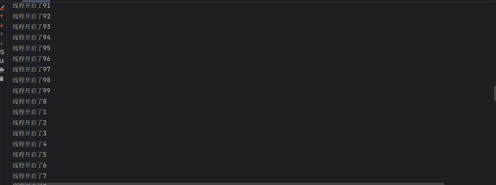

当调用start方法时：

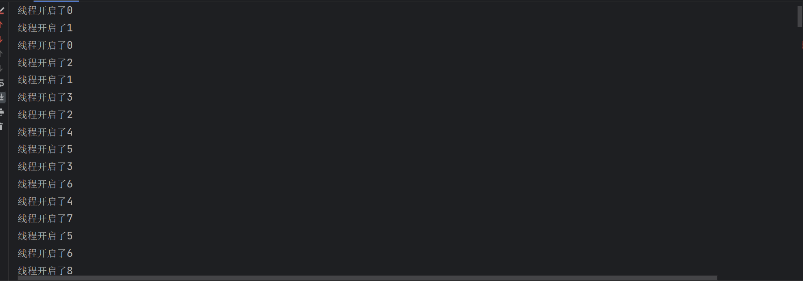

**可以看到，run方法是MyThread的核心方法，但是通过new出来的MyThread实例对象去直接使用run方法就只是普通的使用，线程并没有开启，只有调用start方法才是开启了线程**


#### 线程的状态

```java
package zhuxuanyu.advantage.multithreading;

public class Run2 {
    public static void main(String[] args) {
        for (int i = 0; i < 5; i++) {
            new Thread() {
                @Override
                public void run() {
                    try {
                        Thread.sleep(50000);
                    } catch (InterruptedException e) {
                        throw new RuntimeException(e);
                    }
                }
            }.start();
        }
    }
}
```

在jdk的bin目录下使用*jps*命令查看


找到正在执行的进程，使用*jstack -l 进程号*查看进程状态

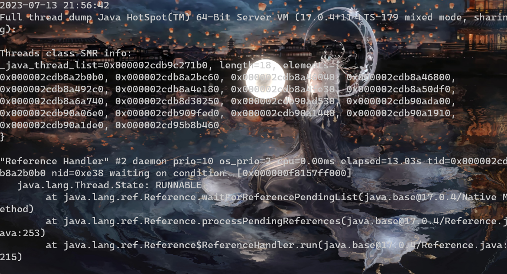

#### 线程的调用随机性

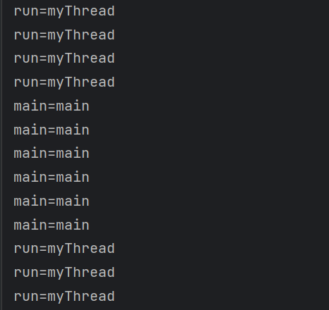

调用start方法的顺序不代表执行run方法的顺序

#### 停止线程

1. 使用退出标志使线程正常退出
2. 使用stop()方法强行终止线程——作废
3. 使用interrupt()方法中断线程

##### 使用interrupt()方法中断线程

判断线程是否中断

1. public static boolean interrupted()——**源码很清楚的显示，该方法在调用后会清除线程的中断状态**

    ```java
     public static boolean interrupted() {
            Thread t = currentThread();
            boolean interrupted = t.interrupted;
            // We may have been interrupted the moment after we read the field,
            // so only clear the field if we saw that it was set and will return
            // true; otherwise we could lose an interrupt.
            if (interrupted) {
                t.interrupted = false;
                //调用的是一个native修饰的，即本地方法进行状态清除
                clearInterruptEvent();
            }
            return interrupted;
        }
    ```

2. public boolean isInterrupted() ——**该方法只会返回是否是中断状态，不清楚状态标志**

    ```java
    public boolean isInterrupted() {
        return interrupted;
    }
    ```

回到停止线程，既然已经获取到了线程的状态，那么当线程处于中断状态，就可以直接放弃执行后续代码，书中的方法是**抛出异常**（也可以return,但是相较而言抛出异常更好），这样线程自然就真正停止了

#### 暂停线程

suspeng()和resume()方法——*废弃*

废弃原因：

1. 独占：线程被暂停后并没有释放同步锁，导致其他线程得不到锁就被阻塞
2. 数据不完整

#### 线程的优先级

线程优先级高的可以获得更多的CPU时间片，执行顺序也会更靠前

```java
public final void setPriority(int newPriority) {
    ThreadGroup g;
    checkAccess();
    if (newPriority > MAX_PRIORITY || newPriority < MIN_PRIORITY) {
        throw new IllegalArgumentException();
    }
    if((g = getThreadGroup()) != null) {
        if (newPriority > g.getMaxPriority()) {
            newPriority = g.getMaxPriority();
        }
        setPriority0(priority = newPriority);
    }
}
```

示例

```java
public class MyThread extends Thread {
    @Override
    public void run() {
        long beginTime = System.currentTimeMillis();
        int count = 0;
        //代码就是线程开启后执行的代码
        for (int i = 0; i < 10000; i++) {
//            Thread.yield();
            System.out.println(Thread.currentThread().getName() + "===>" + i);
        }
        long endTime = System.currentTimeMillis();
        System.out.println("用时：" + (endTime - beginTime));
    }
}

public class Test3 {
    public static void main(String[] args) {
        MyThread myThread1 = new MyThread();
        MyThread myThread2 = new MyThread();
        MyThread myThread3 = new MyThread();

        myThread1.setName("歼二零");
        myThread2.setName("运二零");
        myThread3.setName("轰二零");

        myThread1.setPriority(1);
        myThread2.setPriority(5);
        myThread3.setPriority(10);


        myThread1.start();
        myThread2.start();
        myThread3.start();
    }
}
```

**优先级从1-10,数字越大优先级越高——高优先级的线程大部分先执行完，并且与调度顺序无关**

当两个线程优先级差距不大的时候，就有可能出现低优先级反而先执行完——这是优先级的随机性

**优先级是可以被继承的，A线程启动的B线程，则B线程会继承A线程的优先级**

#### 守护线程

守护线程（Daemon Thread）是一种特殊类型的线程，它的存在不会阻止程序的终止。当所有的非守护线程结束时，守护线程会自动被终止，即使它还在执行。

守护线程主要用于在后台提供一种服务或支持功能，而不需要与用户交互。例如，在Java中，垃圾回收线程就是守护线程，它在后台自动回收不再使用的对象，而不需要人工干预。

创建守护线程的方式很简单，只需要在创建线程后，在启动线程之前调用`setDaemon(true)`方法将其设置为守护线程。如果不调用该方法，默认创建的线程是用户线程（非守护线程）。

```java

public class DaemonThreadExample {
    public static void main(String[] args) {
        Thread daemonThread = new Thread(new DaemonTask());
        daemonThread.setDaemon(true); // 将线程设置为守护线程
        daemonThread.start();

        // 主线程休眠一段时间
        try {
            Thread.sleep(2000);
        } catch (InterruptedException e) {
            e.printStackTrace();
        }

        // 主线程结束，守护线程也会随之结束
        System.out.println("主线程结束");
    }

    static class DaemonTask implements Runnable {
        @Override
        public void run() {
            while (true) {
                System.out.println("守护线程正在运行...");
                try {
                    Thread.sleep(500);
                } catch (InterruptedException e) {
                    e.printStackTrace();
                }
            }
        }
    }
}
```

运行结果

>守护线程正在运行...
>守护线程正在运行...
>守护线程正在运行...
>守护线程正在运行...
>主线程结束

#### 其他方法

##### sleep()

```java
public class Sleep {
    public static void main(String[] args) throws InterruptedException {
        System.out.println("睡觉前！");
        Thread.sleep(3000);
        System.out.println("睡醒了！");

        MyRunnable mr = new MyRunnable();

        Thread t1 = new Thread(mr);
        Thread t2 = new Thread(mr);

        t1.start();
        t2.start();
    }
}
```

##### yield()

放弃当前的CPU资源，让其他任务去抢占CPU执行时间，放弃的时间不确定，可能刚放弃又获得CPU时间片

```java
public class MyThread extends Thread {
    @Override
    public void run() {
        long beginTime = System.currentTimeMillis();
        int count = 0;
        //代码就是线程开启后执行的代码
        for (int i = 0; i < 50000000; i++) {
            Thread.yield();
            count = count + (i + 1);
        }
        long endTime = System.currentTimeMillis();
        System.out.println("用时：" + (endTime - beginTime));
    }
}
//不使用yield()——用时：16
//使用yield()——用时：16013
```

##### getStackTrace()

线程的堆栈跟踪

```java
public class Test1 {
    public void a() {
        b();
    }

    public void b() {
        c();
    }

    public void c() {
        d();
    }

    public void d() {
        e();
    }

    public void e() {
        StackTraceElement[] stackTrace = Thread.currentThread().getStackTrace();
        if (stackTrace != null) {
            for (int i = 0; i < stackTrace.length; i++) {
                StackTraceElement element = stackTrace[i];
                System.out.println("className = " + element.getClassName() + " methodName = " +
                        element.getMethodName() + " fileName = " + element.getFileName() + " lineNumber = " + element.getLineNumber());
            }
        }
    }

    public static void main(String[] args) {
        Test1 test1 = new Test1();
        test1.a();
    }
}
```

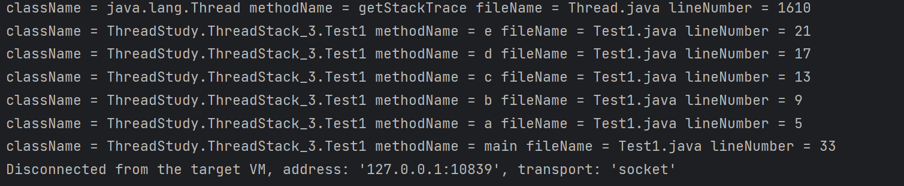

### 对象及变量的并发访问

#### Synchonized同步方法

**非线程安全问题存在于实例变量中，方法内部的变量具有私有特性，因此不存在非线程安全问题**

```java
public class Test1 {
    synchronized public static void testMethod() {


    }

    public static void main(String[] args) {
        testMethod();
    }
}

  public static synchronized void testMethod();
    descriptor: ()V
    flags: (0x0029) ACC_PUBLIC, ACC_STATIC, ACC_SYNCHRONIZED
    Code:
      stack=0, locals=0, args_size=0
         0: return
      LineNumberTable:
        line 7: 0
```

调用方法时，调用指令会先检查有没有设置 ACC_SYNCHRONIZED，设置了代表是同步方法，执行线程先持有锁然后执行方法，在方法完成时释放锁

##### 多个锁

关键字synchronized取得的锁都是对象锁——一个对象对应一把锁，而不是把一段代码或者方法当做锁，所以在上面的示例中，哪个线程先执行带synchronized关键字的方法，哪个线程就持有该方法所属对象的锁Lock,那么其他线程只能等待，前提是多个线程访问的是同一对象。但如果多个线程访问多个对象，也就是每个线程访问自己所属的业务对象，则JVM会创建多个锁，因此不存在锁争抢的问题

```java
package ThreadStudy.synchronized_4;

public class MoreObjectMoreLock {
    public static void main(String[] args) {
        Counter counter1 = new Counter();
        Counter counter2 = new Counter();

        Thread thread1 = new Thread(() -> {
            for (int i = 0; i < 5; i++) {
                counter1.increment();
                System.out.println("Thread 1: " + counter1.getCount());
            }
        });

        Thread thread2 = new Thread(() -> {
            for (int i = 0; i < 5; i++) {
                counter2.increment();
                System.out.println("Thread 2: " + counter2.getCount());
            }
        });

        thread1.start();
        thread2.start();
    }
}

class Counter {
    private int count = 0;

    public synchronized void increment() {
        count++;
    }

    public int getCount() {
        return count;
    }
}
```

**只有共享资源才需要同步，非共享资源也没有同步的必要**

##### 将synchronized方法与对象作为锁

- A线程先持有object对象的Lock锁，B线程可以以异步的方式调用object对象的非synchronized类型的方法
- A线程先持有object对象的Lock锁，B线程如果在这时调用object对象中的synchronized类型的方法，则需要等待，也就是同步
- 在方法声明时添加synchronized并不是锁方法，而是锁当前类的对象
- 在Java中只有“锁对象”，没有“锁方法”的说法
- Java中，“锁”就是”对象“，“对象”可以映射成“锁”，哪个线程拿到这把锁，哪个线程就可以执行该对象中的synchronized方法
- 如果在X对象中使用synchronized关键字声明非静态方法，则X对象就被当成锁

**同步代码块可以解决某个线程持有锁，其他线程只能一直等待的问题**

##### 脏读

即在读取实例变量时，此值已经被其他线程更改过了

##### synchronized锁重入

在使用synchronized时，当一个线程得到一个对象锁后，再次请求此对象锁时是可以得到该对象锁的，即在一个synchronized方法的内部调用本类的其他synchronized方法时是可以永远得到锁的

```java
package ThreadStudy.synchronized_4;

public class OnceAgainInputFunction {
    public synchronized void method1() {
        System.out.println("method1: Before calling method2");
        method2();
        System.out.println("method1: After calling method2");
    }

    public synchronized void method2() {
        System.out.println("method2");
    }

    public static void main(String[] args) {
        OnceAgainInputFunction example = new OnceAgainInputFunction();
        example.method1();
    }
}

//method1: Before calling method2
//method2
//method1: After calling method2
```


**锁重入还支持父子继承**

```java
package ThreadStudy.synchronized_4;

public class ExtendOnceAgainInput {
    public static class Parent {
        public synchronized void method1() {
            System.out.println("Parent method1");
            method2();
        }

        public synchronized void method2() {
            System.out.println("Parent method2");
        }
    }

    public static class Child extends Parent {
        @Override
        public synchronized void method2() {
            System.out.println("Child method2");
        }
    }

    public static void main(String[] args) {
        Child child = new Child();
        child.method1();
    }
}

//Parent method1
//Child method2
```

**当一个线程出现异常时会将锁自动释放**

```
public static native boolean holdsLock(Object obj);
```

该方法接收一个`Object`类型的参数 `obj`，代表要检查的对象。它会检查当前线程是否持有`obj`对象的锁，并返回一个`boolean`类型的结果，如果当前线程持有该对象的锁，则返回`true`，否则返回`false`。

这个方法通常用于调试和监控线程的锁状态，以便在代码中确认某个线程是否真的持有某个对象的锁，或者用于避免死锁等多线程问题。

```java
package ThreadStudy.synchronized_4;

public class HoldLock {
    public static void main(String[] args) {
        Object lock = new Object();

        // 判断当前线程是否持有lock对象的锁
        boolean isHoldingLock = Thread.holdsLock(lock);
        System.out.println("Is current thread holding the lock? " + isHoldingLock);

        // 在同步代码块中获取lock对象的锁
        synchronized (lock) {
            // 判断当前线程是否持有lock对象的锁
            isHoldingLock = Thread.holdsLock(lock);
            System.out.println("Is current thread holding the lock? " + isHoldingLock);
        }

        // 再次判断当前线程是否持有lock对象的锁
        isHoldingLock = Thread.holdsLock(lock);
        System.out.println("Is current thread holding the lock? " + isHoldingLock);
    }
}

//Is current thread holding the lock? false
//Is current thread holding the lock? true
//Is current thread holding the lock? false
```

#### Synchronized同步语句块

**synchronized声明方法是很笨的，因为这样会大大降低效率——synchronized方法是将当前对象作为锁，而synchronized代码块是将任意对象作为锁，即可以将锁看成一个标识，哪个线程持有这个标识，就可以执行同步方法**

当两个并发线程访问同一个对象object中的synchronized(this)同步代码块时，一段时间内只有一个线程可以执行，另一个线程必须等待当前线程执行完这个代码块以后才能执行该代码块；但是可以异步访问该object对象中的非synchronized(this)同步代码块

```java
package ThreadStudy.synchronized_4;

public class SynchronizedExample {
    private int count = 0;

    //synchronized同步代码块
    public void synchronizedMethod() {
        synchronized (this) {
            for (int i = 0; i < 5; i++) {
                count++;
                System.out.println(Thread.currentThread().getName() + " - Count: " + count);
            }
        }
    }

    // 非synchronized代码块
    public void noSynchronizedMethod(){
        for (int i = 0; i < 5; i++) {
            count++;
            System.out.println(Thread.currentThread().getName() + " - Count: " + count);
        }
    }

    public static void main(String[] args) {
        SynchronizedExample example = new SynchronizedExample();
        Thread thread1 = new Thread(()->{
            example.synchronizedMethod();
        });

        Thread thread2 = new Thread(() -> {
            example.noSynchronizedMethod();
        });
        
        thread1.start();
        thread2.start();
    }
}

/*
Thread-0 - Count: 1
Thread-0 - Count: 3
Thread-1 - Count: 2
Thread-0 - Count: 4
Thread-1 - Count: 5
Thread-0 - Count: 6
Thread-1 - Count: 7
Thread-0 - Count: 8
Thread-1 - Count: 9
Thread-1 - Count: 10

*/
```


当一个线程访问object的一个synchronized(this)同步代码块时，其他线程对同一个object中所有其他synchronized(this)同步代码块访问是被阻塞的，说明synchronized使用的对象监视器是同一个，即对象锁只有一个

##### 将任意对象作为锁

多个线程调用同一个对象中的不同名称的synchronized同步方法或synchronized(this)同步代码块时，调用的效果是按顺序执行的，即同步

synchronized同步方法的作用

- 对其他synchronized同步方法或synchronized(this)同步代码块调用呈同步效果
- 同一时间只有一个线程可以执行synchronized同步方法中的代码

synchronized(this)同步代码块的作用

- 对其他synchronized同步方法或synchronized(this)同步代码块调用呈同步效果
- 同一时间只有一个线程可以执行synchronized(this)同步代码块中的代码

**使用synchronized(非this对象)实现将任意对象作为锁**

synchronized(非this对象x)作用：*当多个线程争抢相同的“非this对象x'的锁时，同一时间只有一个线程可以执行synchronized(非this对象x)同步代码块中的代码*

```java
package ThreadStudy.synchronized_4;

public class SynchronizedBlockExample {
    private int count = 0;
    private Object lock = new Object(); // 共享的锁对象

    // 同步代码块使用共享的锁对象lock作为锁
    public void synchronizedMethod() {
        synchronized (lock) {
            for (int i = 0; i < 5; i++) {
                count++;
                System.out.println(Thread.currentThread().getName() + " - Count: " + count);
            }
        }
    }

    public static void main(String[] args) {
        SynchronizedBlockExample example = new SynchronizedBlockExample();

        // 创建两个线程并启动
        Thread thread1 = new Thread(() -> {
            example.synchronizedMethod();
        });

        Thread thread2 = new Thread(() -> {
            example.synchronizedMethod();
        });

        thread1.start();
        thread2.start();
    }
}

/*
Thread-0 - Count: 1
Thread-0 - Count: 2
Thread-0 - Count: 3
Thread-0 - Count: 4
Thread-0 - Count: 5
Thread-1 - Count: 6
Thread-1 - Count: 7
Thread-1 - Count: 8
Thread-1 - Count: 9
Thread-1 - Count: 10
*/
```

如上可知，使用非this对象作为锁对象，则synchronized(非this对象)代码块中的程序和同步方法是异步的，因为有两把锁，不与其他锁的this同步方法争抢this锁，可以提高运行效率

**可以结合单例模式，将项目中的单例对象作为锁**

##### 结论

synchronized(非this对象x)是将x对象本身作为“对象监视器，则：

- 当多个线程同时执行synchronized(X){}同步代码块时呈同步效果
- 当其他线程执行x对象中synchronized同步方法时呈同步效果
- 当其他线程执行x对象方法里面的synchronized(this)代码块时呈同步效果
- 其他线程调用x对象方法里面的非synchronized关键字修饰的方法则还是异步

##### 多锁异步

```java
 public void synchronizedMethod() {
     Object lock = new Object();
     synchronized (lock) {
         for (int i = 0; i < 5; i++) {
             count++;
             System.out.println(Thread.currentThread().getName() + " - Count: " + count);
         }
     }
 }
```

如上假如将锁定义在方法内，则多线程共享的不是一个变量，则不会同步，而是异步

**同步代码块放在非同步方法中进行声明，并不能保证调用方法的线程的执行顺序是按照调用顺序的——但他们在同步代码块中是同步的**

##### 静态同步synchronized与synchronized(class)代码块

已知[类Class具有单例性](#class_static_singleton),因此如果将synchronized应用在static静态方法上，就是把当前的class类对象进行持锁，*把synchronized加在非static方法上是把当前class的实例作为锁，而加在static方法上是把整个Class类对象作为锁*

synchronized(class)或者synchronized修饰静态方法都可以做到堆类的所有对象实例起作用

##### 知识点

- <a name="class_static_singleton">类Class的单例性</a>：Class类用于描述类的基本信息，内存中只存放一份——JVM有学，放在方法区
- **死锁会造成线程假死，所以必须避免**
- String常量池和synchronized(String)：简单来说就是在JVm的堆中，字符串常量池中对每个字符串只会保留一份，当synchronized(String)时，作为锁对象的string只有一份，当多个线程访问时就只能有一个线程拿到这个锁

##### 总结

synchronized的主要作用是保证同一时刻只有一个线程可以执行某一个方法，亦或是某一个代码块，synchronized可以修饰方法及代码块。

三大特征：

- 可见性
- 原子性：保证同一时刻只有一个线程可以执行某一个方法，亦或是某一个代码块
- 禁止代码重排

#### Volatile关键字

- **可见性**：B线程能马上看到A线程更改的数据
- **原子性**：volatile并不能保证原子性
- 禁止代码重排序

##### 可见性

每个线程都有自己的线程栈，会将共享数据的变量值在栈中存储一个副本进行使用

**volatile :强制线程在使用变量前，去线程池中查看该变量的值**——所以volatile具有可见性

```java
public class BoyThread extends Thread{
    @Override
    public void run() {
        Money.money = 90000;
    }
}

public class GirlThread extends Thread{
    @Override
    public void run() {
        while (Money.money == 100000){
            System.out.println("结婚基金是100000");
        }
        System.out.println("结婚基金已经不是100000");
    }
}

public class Money {
    public static volatile int money = 100000;
}

public class Demo {
    public static void main(String[] args) {
        GirlThread girlThread = new GirlThread();
        girlThread.setName("小鹿同学");
        girlThread.start();

        BoyThread boyThread = new BoyThread();
        boyThread.setName("小皮同学");
        boyThread.start();
    }
}

/*
结婚基金是100000
结婚基金已经不是100000
*/
```

`synchronized`代码块除了实现线程之间的互斥访问，还具有增加可见性的作用。当一个线程进入`synchronized`代码块时，它会清空工作内存中的数据，并从主内存中重新读取变量的值，确保了该线程看到的是最新的变量值。

##### 不保证原子性

```java
package ThreadStudy.myvolatile;

public class VolatileNotAtomicExample {
    private static volatile int counter = 0;

    public static void main(String[] args) {
        Runnable incrementTask = () -> {
            for (int i = 0; i < 10000; i++) {
                counter++; // 自增操作
            }
        };

        Thread thread1 = new Thread(incrementTask);
        Thread thread2 = new Thread(incrementTask);

        thread1.start();
        thread2.start();

        try {
            thread1.join();
            thread2.join();
        } catch (InterruptedException e) {
            e.printStackTrace();
        }

        System.out.println("Final counter value: " + counter);
    }
}
//Final counter value: 15279
```

这是因为i++底层实现其实是有3步，而volatile不保证原子性，所以会导致数据出现错误

能实现原子性的是Atomic类

```java
package ThreadStudy.myvolatile;

import java.util.concurrent.atomic.AtomicInteger;

public class AtomicExample {
    private static AtomicInteger counter = new AtomicInteger(0);

    public static void main(String[] args) {
        Runnable incrementTask = () -> {
            for (int i = 0; i < 10000; i++) {
                counter.incrementAndGet(); // 自增操作，保证原子性
            }
        };

        Thread thread1 = new Thread(incrementTask);
        Thread thread2 = new Thread(incrementTask);

        thread1.start();
        thread2.start();

        try {
            thread1.join();
            thread2.join();
        } catch (InterruptedException e) {
            e.printStackTrace();
        }

        System.out.println("Final counter value: " + counter.get());
    }
}
//Final counter value: 20000
```

##### 禁止代码重排序

因为JIT会对代码进行优化所以可能会造成代码重排

```java
package ThreadStudy.myvolatile;

public class VolatileReorderExample {
    private static volatile int x = 0, y = 0;
    private static volatile int a = 0, b = 0;

    public static void main(String[] args) throws InterruptedException {
        int count = 0;
        while (true) {
            count++;
            x = 0;
            y = 0;
            a = 0;
            b = 0;

            Thread thread1 = new Thread(() -> {
                a = 1;
                x = b;
            });

            Thread thread2 = new Thread(() -> {
                b = 1;
                y = a;
            });

            thread1.start();
            thread2.start();
            thread1.join();
            thread2.join();

            // 判断是否发生了指令重排序
            if (x == 0 && y == 0) {
                System.out.println("发生了指令重排序，循环次数：" + count);
                break;
            }
        }
    }
}
```

给变量加上volatile后代码一直没有发生重排——甚至通过JProfiler分析发现，在多次GC后也没有发生指令重排，而不加volatile时循环了1000次就进行了重排。

##### 总结

关键字volatile和synchronized的使用场景：

- 当想实现一个变量的值被更改时，让其他线程能够取到最新的值时，就要对变量使用volatile
- 当多个线程对同一个对象中的同一个实例变量进行操作时，为了避免出现非线程安全问题，就要使用synchronized

### 线程间通信

线程间通信是指多个线程在并发执行过程中，通过一定的机制实现信息的交换和共享，从而实现协同工作。线程间通信的主要目的是使多个线程能够协调完成任务，共享资源，或者实现数据交换。

线程与线程之间不是独立的个体，它们彼此是可以互相通信和协作的。

#### wait/notify机制

`wait()`和`notify()`是Java中基于对象的等待/通知机制，用于实现线程间的协作和通信。这种机制通常用于生产者-消费者模型等场景，其中一个线程等待某个条件满足，而另一个线程在满足条件时通知等待的线程继续执行。

这种机制需要配合`synchronized`关键字使用，因为`wait()`和`notify()`都要在同步块中调用。以下是`wait()`和`notify()`的详细解释和示例代码：

- `wait()`方法：使当前线程进入等待状态，释放当前持有的锁，并等待其他线程通过`notify()`或`notifyAll()`方法来唤醒。
- `notify()`方法：唤醒正在等待当前对象锁的一个线程。如果有多个线程在等待，那么只会唤醒其中一个线程，具体唤醒哪个线程由JVM决定。
- `notifyAll()`方法：唤醒正在等待当前对象锁的所有线程，让它们竞争获取锁。

##### 机制原理

`wait()`和`notify()`机制的原理涉及Java中的对象监视器(Monitor)——锁和线程状态的改变。这种机制是基于对象的，每个Java对象都有一

个与之相关联的监视器。

当一个线程调用某个对象的`wait()`方法时，它会释放该对象的锁，并进入等待状态（WAITING或TIMED_WAITING状态）。等待状

态表示线程暂时不再执行，它会在某个条件满足时被唤醒。同时，该对象的监视器会被标记为"等待集"，表示有线程正在等待该对象的唤

醒。

当另一个线程调用相同对象的`notify()`或`notifyAll()`方法时，它会通知处于等待状态的线程，使其从等待状态转换为可运行状态

（RUNNABLE状态）。被唤醒的线程会重新尝试获取对象的锁，一旦获取到锁，它就可以继续执行。

这里需要注意的是，唤醒等待的线程并不是立即执行，而是在当前线程释放了对象锁之后，被唤醒的线程才有机会获得锁并继续执行。如

果当前线程没有释放对象锁，被唤醒的线程仍然无法执行。

`notify()`和`notifyAll()`的区别在于唤醒等待线程的方式。`notify()`方法只会唤醒处于等待集中的一个线程（通常是等待时间最长的

线程），而`notifyAll()`方法会唤醒所有处于等待集中的线程，让它们竞争获得锁。

##### 示例

```java
package ThreadStudy.wait_notify_6;

import java.util.ArrayList;

public class WaitNotifyTry {
    public static void main(String[] args) {
        ArrayList<String> list = new ArrayList<>();

        Thread threadA = new Thread(() -> {
            synchronized (list) {
                System.out.println("线程A,启动");
                if (list.size() < 6) {
                    System.out.println("list集合大小小于6");
                    try {
                        System.out.println("线程A,等待");
                        list.wait();
                    } catch (InterruptedException e) {
                        throw new RuntimeException(e);
                    }
                }
                System.out.println("list集合大小大于等于6！");
            }
        });

        Thread threadBuilder = new Thread(() -> {
            synchronized (list) {
                System.out.println("线程B,启动");
                for (int i = 0; i < 10; i++) {
                    list.add(String.valueOf(i));
                    if (list.size() >= 6) {
                        list.notify();
                        System.out.println("苏醒吧，线程A！");
                        break;
                    }
                }
            }
        });

        threadA.start();
        try {
            Thread.sleep(1000);
        } catch (InterruptedException e) {
            throw new RuntimeException(e);
        }
        threadBuilder.start();
    }
}

/*
线程A,启动
list集合大小小于6
线程A,等待
线程B,启动
苏醒吧，线程A！
list集合大小大于等于6！
*/
```

##### notifyAll

`notifyAll()`是Java多线程中的一个方法，用于唤醒因调用对象的`wait()`方法而处于等待状态的所有线程。当一个线程调用了某个对象的`wait()`方法后，它会释放该对象的锁，并进入等待状态，直到其他线程调用了该对象的`notify()`或`notifyAll()`方法来唤醒它。

`notifyAll()`方法会唤醒所有因调用对象的`wait()`方法而处于等待状态的线程。这些被唤醒的线程会开始竞争该对象的锁，然后继续执行。

`notifyAll()`方法应该慎用，因为它会唤醒所有等待的线程，而不是只唤醒一个线程。如果有大量线程在等待，使用`notifyAll()`可能会导致线程饥饿或性能问题。在某些情况下，使用`notify()`方法可以更加合适，因为它只会唤醒一个等待的线程。

```java
package ThreadStudy.wait_notify_6;

public class NotifyAllExample {
    public static void main(String[] args) {
        Message message = new Message();

        // 创建5个线程，每个线程都会等待消息的到来
        for (int i = 1; i <= 5; i++) {
            Thread thread = new Thread(() -> {
                synchronized (message) {
                    try {
                        System.out.println("Thread " + Thread.currentThread().getId() + " is waiting.");
                        message.wait();
                        System.out.println("Thread " + Thread.currentThread().getId() + " is woken up.");
                    } catch (InterruptedException e) {
                        e.printStackTrace();
                    }
                }
            });
            thread.start();
        }

        // 主线程休眠一段时间后唤醒所有等待的线程
        try {
            Thread.sleep(2000);
        } catch (InterruptedException e) {
            e.printStackTrace();
        }

        synchronized (message) {
            message.notifyAll();
        }
    }
}

class Message {
    // 空类，用于演示
}

/*
Thread 18 is waiting.
Thread 22 is waiting.
Thread 21 is waiting.
Thread 20 is waiting.
Thread 19 is waiting.
Thread 18 is woken up.
Thread 19 is woken up.
Thread 20 is woken up.
Thread 21 is woken up.
Thread 22 is woken up.
*/
```

如上也验证了notifyAll唤醒线程的[倒序特性](#notifyAll)

##### 线程状态切换

1. 创建一个新的线程对象后，调用它的start()方法，系统会为此线程分配CPU资源，此时线程处于runnable（可运行）状态，即准备运行阶段。如果线程抢占到CPU资源，则此线程就处于running（运行）状态。

2. 因为可能有高优先级的线程来抢占CPU，因此就绪状态和运行状态是可以相互转换的

    线程进入runnable状态有四种情况：

    - 调用sleep()方法后经过的时间超过了指定的休眠时间；
    - 线程成功获得了试图同步的监视器
    - 线程正在等待某个通知，其他线程发出了通知
    - 处于挂起状态的线程调用了resume恢复方法

3. blocked是阻塞状态

    阻塞可能发生的五种情况：

    - 线程调用sleep()方法，主动放弃占用处理器资源
    - 线程调用了阻塞式I/O方法，在该方法返回前处于阻塞
    - 线程视图获得一个同步监视器，但该监视器被其他线程所持有
    - 线程等待某个通知（notify）
    - 程序调用了suspend()方法将线程挂起——该方法容易导致死锁，避免使用

4. run()方法运行结束后进入销毁阶段，整个线程执行完毕。


##### wait(Long)

1. 带参设置上限时间，如果没有其他线程唤醒，在超过时间后会自动唤醒
2. 唤醒后只是出于就绪状态，因此想要继续执行还是要获得锁，如果没有就一直等待

##### 管道(Pipe)

`Pipe`是一个类，用于实现管道通信机制，允许一个线程将数据写入管道输出流，而另一个线程可以从管道输入流读取相应的数据。这

样，可以在不同的线程之间实现数据传递和协作。

###### 源码解析

```java
//表示管道可读端的通道。
public static abstract class SourceChannel
    extends AbstractSelectableChannel
    implements ReadableByteChannel, ScatteringByteChannel
{
    /**
     * 构造该类的新实例。
     */
    protected SourceChannel(SelectorProvider provider) {
        super(provider);
    }

    /**
     * 返回标识此通道支持的操作的操作集。
     * 管道源通道只支持读取，因此该方法返回SelectionKey.OP_READ
     */
    public final int validOps() {
        return SelectionKey.OP_READ;
    }

}

/**
 * 表示管道可写端的通道。
 */
public static abstract class SinkChannel
    extends AbstractSelectableChannel
    implements WritableByteChannel, GatheringByteChannel
{
    /**
     * 初始化该类的新实例。
     */
    protected SinkChannel(SelectorProvider provider) {
        super(provider);
    }

    /**
     * 返回标识此通道支持的操作的操作集。
     * 管道接收通道只支持写入，因此此方法返回SelectionKey.OP_WRITE。
     */
    public final int validOps() {
        return SelectionKey.OP_WRITE;
    }

}
```

###### 示例——字节流

```java
package ThreadStudy.pipe_7;

import java.io.IOException;
import java.nio.ByteBuffer;
import java.nio.channels.Pipe;

public class PipeExample {
    public static void main(String[] args) throws IOException {
        // 创建管道
        Pipe pipe = Pipe.open();

        // 获取管道的输出通道和输入通道
        Pipe.SinkChannel sinkChannel = pipe.sink();
        Pipe.SourceChannel sourceChannel = pipe.source();

        // 创建一个线程用于写数据到管道的输出通道
        Thread writerThread = new Thread(() -> {
            String data = "Hello, Pipe!";
            try {
                ByteBuffer buffer = ByteBuffer.allocate(1024);
                buffer.put(data.getBytes());
                buffer.flip();
                sinkChannel.write(buffer);
            } catch (IOException e) {
                e.printStackTrace();
            } finally {
                try {
                    sinkChannel.close();
                } catch (IOException e) {
                    e.printStackTrace();
                }
            }
        });

        // 创建一个线程用于从管道的输入通道读取数据
        Thread readerThread = new Thread(() -> {
            try {
                ByteBuffer buffer = ByteBuffer.allocate(1024);
                int bytesRead = sourceChannel.read(buffer);
                if (bytesRead > 0) {
                    buffer.flip();
                    byte[] data = new byte[bytesRead];
                    buffer.get(data);
                    System.out.println("Received: " + new String(data));
                }
            } catch (IOException e) {
                e.printStackTrace();
            } finally {
                try {
                    sourceChannel.close();
                } catch (IOException e) {
                    e.printStackTrace();
                }
            }
        });

        // 启动线程
        writerThread.start();
        readerThread.start();
    }
}


```

```java

import java.io.IOException;
import java.io.PipedOutputStream;

public class WriteData {
    public void writeMethod(PipedOutputStream out){
        try {
            System.out.println("write:");
            for (int i = 0; i < 300; i++) {
                String outData = "" + (i + 1);
                out.write(outData.getBytes());
                System.out.print(outData);
            }
            System.out.println();
            out.close();
        }catch (IOException e){
            e.printStackTrace();
        }
    }
}

import java.io.IOException;
import java.io.PipedInputStream;

public class ReadData {
    public void readMethod(PipedInputStream in) {
        try {
            System.out.println("read:");
            byte[] bytes = new byte[20];
            //在此阻塞，直到管道中有数据
            int read = in.read(bytes);
            while (read != -1) {
                String newData = new String(bytes, 0, read);
                System.out.print(newData);
                read = in.read(bytes);
            }
            System.out.println();
            in.close();
        } catch (IOException e) {
            throw new RuntimeException(e);
        }
    }
}

import java.io.PipedInputStream;

public class ThreadRead extends Thread{
    private ReadData read;
    private PipedInputStream inputStream;

    public ThreadRead( ReadData read, PipedInputStream inputStream){
        this.read = read;
        this.inputStream = inputStream;
    }

    @Override
    public void run() {
        read.readMethod(inputStream);
    }
}

import java.io.PipedOutputStream;

public class ThreadWrite extends Thread{
        private WriteData write;
        private PipedOutputStream outputStream;

        public ThreadWrite( WriteData write, PipedOutputStream outputStream){
            this.write = write;
            this.outputStream = outputStream;
        }

        @Override
        public void run() {
            write.writeMethod(outputStream);
        }
}

import java.io.IOException;
import java.io.PipedInputStream;
import java.io.PipedOutputStream;

public class PipeTest {
    public static void main(String[] args) {
        try {
            WriteData writeData = new WriteData();
            ReadData readData = new ReadData();

            PipedInputStream inputStream = new PipedInputStream();
            PipedOutputStream outputStream = new PipedOutputStream();

            // inputStream.connect(outputStream);
            outputStream.connect(inputStream);

            ThreadRead threadRead = new ThreadRead(readData, inputStream);
            //先启动读线程，因为管道中没有数据因此会在内部阻塞
            threadRead.start();

            Thread.sleep(2000);

            ThreadWrite threadWrite = new ThreadWrite(writeData, outputStream);
            threadWrite.start();
        } catch (IOException e) {
            throw new RuntimeException(e);
        } catch (InterruptedException e) {
            throw new RuntimeException(e);
        }
    }
}
```

执行结果如下：

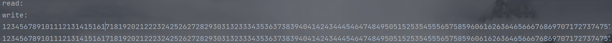

###### 示例——字符流

```java
import java.io.*;
import java.nio.ByteBuffer;
import java.nio.CharBuffer;
import java.nio.channels.Pipe;

public class PipeCharacterStreamExample {
    public static void main(String[] args) throws IOException {
        // 创建管道
        Pipe pipe = Pipe.open();

        // 获取管道的输出通道和输入通道
        Pipe.SinkChannel sinkChannel = pipe.sink();
        Pipe.SourceChannel sourceChannel = pipe.source();

        // 创建一个线程用于写字符数据到管道的输出通道
        Thread writerThread = new Thread(() -> {
            String data = "Hello, Pipe with Character Stream!";
            try {
                // 将字符数据转换为字节数据
                ByteBuffer buffer = ByteBuffer.allocate(data.length() * 2);
                buffer.asCharBuffer().put(data);
                sinkChannel.write(buffer);
            } catch (IOException e) {
                e.printStackTrace();
            } finally {
                try {
                    sinkChannel.close();
                } catch (IOException e) {
                    e.printStackTrace();
                }
            }
        });

        // 创建一个线程用于从管道的输入通道读取字符数据
        Thread readerThread = new Thread(() -> {
            try {
                ByteBuffer buffer = ByteBuffer.allocate(1024);
                int bytesRead = sourceChannel.read(buffer);
                if (bytesRead > 0) {
                    buffer.flip();
                    CharBuffer charBuffer = buffer.asCharBuffer();
                    System.out.println("Received: " + charBuffer.toString());
                }
            } catch (IOException e) {
                e.printStackTrace();
            } finally {
                try {
                    sourceChannel.close();
                } catch (IOException e) {
                    e.printStackTrace();
                }
            }
        });

        // 启动线程
        writerThread.start();
        readerThread.start();
    }
}
```

##### wait/notify实现交叉备份

###### 代码

```java
public class DBTools {
    volatile private boolean prevIsA = false;

    synchronized public void backupA() {
        try {
            while (prevIsA == true) {
                wait();
            }
            for (int i = 0; i < 5; i++) {
                System.out.println("★★★★★");
            }
            prevIsA = true;
            notifyAll();
        } catch (InterruptedException e) {
            throw new RuntimeException(e);
        }
    }

    synchronized public void backupB(){
        try {
            while (prevIsA == false) {
                wait();
            }
            for (int i = 0; i < 5; i++) {
                System.out.println("☆☆☆☆☆");
            }
            prevIsA = false;
            notifyAll();
        } catch (InterruptedException e) {
            throw new RuntimeException(e);
        }
    }
}

public class BackupA extends Thread{
    private DBTools dbTools;

    public BackupA(DBTools dbTools){
        this.dbTools = dbTools;
    }

    @Override
    public void run() {
        dbTools.backupA();
    }
}

public class BackupB  extends Thread{
        private DBTools dbTools;

        public BackupB(DBTools dbTools){
            this.dbTools = dbTools;
        }

        @Override
        public void run() {
            dbTools.backupB();
        }
}

public class Run {
    public static void main(String[] args) {
        DBTools dbTools = new DBTools();
        for (int i = 0; i < 20; i++) {
            BackupB output = new BackupB(dbTools);
            output.start();
            BackupA input = new BackupA(dbTools);
            input.start();
        }
    }
}
```

部分输出如下：


可见AB线程交替执行，关键在于**volatile private boolean prevIsA = false——使用它作为交替执行的标记**

##### 知识点

1. 执行wait()方法后，会立即释放锁

2. sleep()方法不会释放锁

3. notify()方法不会立即释放锁——必须执行完notify()方法所在的同步代码块后才会释放锁

4. `interrupt()`是Java多线程中的一个方法，用于中断线程的执行——当调用wait()后在调用该方法会报错

5. 执行wait/notify方法时当前线程必须持有该对象的锁，不然会报错```IllegalMonitorStateException```,是RuntimeException的子类，因此不需要try-catch;

6. *notify()只会唤醒一个线程，唤醒的顺序与执行wait()方法的顺序一致*

7. <a name="notifyAll">notifyAll()会按照执行wait()方法的倒叙依次对其他线程进行唤醒</a>

8. 通知过早会打乱程序执行的顺序——逻辑问题

9. 在使用wait/notify时，如果wait条件变化，容易造成逻辑混乱

    >这是因为当线程被唤醒后，它会再次检查等待条件，如果条件不满足，线程会再次进入等待状态，直到满足条件为止。如果在等待期间等待条件一直没有改变，可能会导致线程陷入死循环等待的情况。
    >
    >当唤醒时，在调用`wait()`方法之前，再次检查等待条件是否满足，如果不满足则继续等待，直到条件满足为止。通常使用`while`循环来实现这个过程。

10. 生产者/消费者模式中，当所有线程都进入waiting状态，即程序不再执行任何业务功能，整个项目呈停止状态，即出现**假死**

    > 在生产者和消费者模式中，如果多个生产者和多个消费者在wait/notify机制中，使用notify唤醒的不是异类而是同类，积少成多就会让所有线程处于waiting,程序陷入假死——*唤醒时将同类、异类一同唤醒就可以解决，即不使用notify(),转为使用notifyAll()*

#### Join

##### 概念和使用

**等待线程对象销毁**

1. `join()`: 等待调用该方法的线程执行完毕。
2. `join(long millis)`: 等待调用该方法的线程执行完毕，最多等待指定的毫秒数。

当一个线程调用另一个线程的 `join()` 方法时，它将会被阻塞，直到被调用的线程执行完毕。这在协调多个线程的执行顺序时非常有用。

join与synchronized的区别是**join方法在内部使用wait方法等待**，而synchronized使用锁作为同步

```java
  public final synchronized void join(final long millis)
    throws InterruptedException {
        if (millis > 0) {
            if (isAlive()) {
                final long startTime = System.nanoTime();
                long delay = millis;
                do {
                    //调用了wait方法
                    wait(delay);
                } while (isAlive() && (delay = millis -
                        TimeUnit.NANOSECONDS.toMillis(System.nanoTime() - startTime)) > 0);
            }
        } else if (millis == 0) {
            while (isAlive()) {
                //调用了wait方法
                wait(0);
            }
        } else {
            throw new IllegalArgumentException("timeout value is negative");
        }
    }
```

##### join

等待线程死亡的时间最多为毫秒加纳纳秒。如果两个参数都为0，则意味着永远等待。

这个实现使用了This的循环。wait调用以this.isAlive为条件。当线程终止this时。调用notifyAll方法。建议应用程序不要在Thread实例上使用wait、notify或notifyAll。

参数说明：

- `millis`: 等待的毫秒数。
- `nanos`: 等待的纳秒数（额外的等待时间，范围在 0 到 999999 之间）。

```java
public final synchronized void join(long millis, int nanos)
    throws InterruptedException {

        if (millis < 0) {
            throw new IllegalArgumentException("timeout value is negative");
        }

        if (nanos < 0 || nanos > 999999) {
            throw new IllegalArgumentException(
                                "nanosecond timeout value out of range");
        }

        if (nanos > 0 && millis < Long.MAX_VALUE) {
            millis++;
        }

        join(millis);
    }
```

##### 知识点

1. join和interrupt相遇就会出现异常，不管先后顺序
2. x.join(long) 方法中的参数用于设定等待时间，不管x线程是否执行完，时间到了重新获得锁——**因为内部是调用了wait方法，wait方法会释放锁**，则当前线程会继续向前运行，没获得就一直尝试获取
3. join释放锁而sleep不释放锁

#### ThreadLocal

##### 概念和使用

这个类提供线程局部变量。这些变量与普通变量的不同之处在于，访问一个变量的每个线程(通过它的get或set方法)都有它自己的、独立初始化的变量副本。ThreadLocal实例通常是类中的私有静态字段，希望将状态与线程(例如，用户ID或事务ID)相关联。

**类ThreadLocal主要作用是将数据放入当前线程对象中的Map中,它只是数据和线程之间的桥梁**

```java
  /* ThreadLocal values pertaining to this thread. This map is maintained
     * by the ThreadLocal class. */
    ThreadLocal.ThreadLocalMap threadLocals = null;
```


在多线程环境下，使用全局变量可能会引发线程安全问题。而 `ThreadLocal` 可以避免这种问题，因为每个线程都有自己独立的变量副本，不会出现竞争条件。

```java
public class ThreadLocalExample {
    private static ThreadLocal<Integer> threadLocal = ThreadLocal.withInitial(() -> 0);

    public static void main(String[] args) {
        Runnable task = () -> {
            int num = threadLocal.get();
            num++;
            threadLocal.set(num);
            System.out.println(Thread.currentThread().getName() + ": " + num);
        };

        Thread thread1 = new Thread(task);
        Thread thread2 = new Thread(task);

        thread1.start();
        thread2.start();
    }
}

/*
Thread-1: 1
Thread-0: 1
即证明了线程的独立性
*/
```


##### get()

```java
public T get() {
        Thread t = Thread.currentThread();
        ThreadLocalMap map = getMap(t);
        if (map != null) {
            ThreadLocalMap.Entry e = map.getEntry(this);
            if (e != null) {
                @SuppressWarnings("unchecked")
                T result = (T)e.value;
                return result;
            }
        }
        return setInitialValue();
    }
```

返回此线程局部变量的当前线程副本中的值。如果变量对当前线程没有值，则首先将其初始化为[initialValue](#ThreadLocal_initialValue)方法调用返回的值——*如果没有重写此方法，默认为null*。

##### set

1. 执行ThreadLocal.set(value)

    ```java
    public void set(T value) {
        Thread t = Thread.currentThread();
        ThreadLocalMap map = getMap(t);
        if (map != null) {
            map.set(this, value);
        } else {
            createMap(t, value);
        }
    }
    ```

2. getMap(t)

    ```java
     ThreadLocalMap getMap(Thread t) {
         return t.threadLocals;
     }
    ```

3. 变量t.threadLocals声明如下——在Thread类中

    ```java
    /*
    Thread类中的实例变量
    */
    ThreadLocal.ThreadLocalMap threadLocals = null;
    ```

4. 取得ThreadLocal.ThreadLocalMap后，第一次存数据会调用createMap()方法来创建ThreadLocal.ThreadLocalMap对象

    ```java
     if (map != null) {
         map.set(this, value);
     } else {
         createMap(t, value);
     }
    ```

5. createMap(t,value)源码,将当前的·ThreadLocal对象作为key,设置Value

    ```java
     void createMap(Thread t, T firstValue) {
         t.threadLocals = new ThreadLocalMap(this, firstValue);
     }
    ```

6. new ThreadLocalMap(this.firstValue)源码如下

    ```java
    ThreadLocalMap(ThreadLocal<?> firstKey, Object firstValue) {
        table = new Entry[INITIAL_CAPACITY];
        int i = firstKey.threadLocalHashCode & (INITIAL_CAPACITY - 1);
        table[i] = new Entry(firstKey, firstValue);
        size = 1;
        setThreshold(INITIAL_CAPACITY);
    }
    ```

    ```new Entry[INITIAL_CAPACITY]```可看出，ThreadLocal对象和值被封装为Entry对象并放到table数组里面

7. table

    ```java
     private Entry[] table;
    ```

**经过上述7个步骤，value成功通过ThreadLocal被放入当前线程currentThread()中的ThreadLocalMap对象中**

为什么不直接给=向Thread类中的ThreadLcoalMap对象存取？

```java
ThreadLocal.ThreadLocalMap threadLocals = null;
```

再看会发现它是一个默认的访问权限，即包级访问权限，而ThreadLocal和它同包

```java
public class ThreadLocalExample {

    // 创建一个 ThreadLocal 对象
    private static ThreadLocal<Integer> threadLocal = ThreadLocal.withInitial(() -> 0);

    public static void main(String[] args) {
        // 创建并启动两个线程
        Thread thread1 = new Thread(() -> {
            threadLocal.set(1); // 在线程1中设置值为1
            System.out.println("Thread 1 - Value: " + threadLocal.get()); // 获取值并输出
            threadLocal.remove(); // 清除值
        });

        Thread thread2 = new Thread(() -> {
            threadLocal.set(2); // 在线程2中设置值为2
            System.out.println("Thread 2 - Value: " + threadLocal.get()); // 获取值并输出
            threadLocal.remove(); // 清除值
        });

        thread1.start();
        thread2.start();
    }
}
/*
Thread 2 - Value: 2
Thread 1 - Value: 1
*/
```

##### ThreadLocal可以实现线程变量隔离

1. 每个线程都会拥有独立的变量副本，因此在线程间不需要进行同步操作。
2. 使用完 `ThreadLocal` 存储的数据后，应该调用 `remove()` 方法进行清除，以避免内存泄漏。
3. `ThreadLocal` 并不解决线程安全问题，只是提供了一种在多线程环境下隔离变量的机制。

##### initialValue——解决get返回null

<a name="ThreadLocal_initialValue">here</a>

```java
 protected T initialValue() {
     //默认为null,即新创建的ThreadLocalMap的值为null，所以如果在没设置的时候第一次获得的就是null
     return null;
 }

 private T setInitialValue() {
     T value = initialValue();
     Thread t = Thread.currentThread();
     ThreadLocalMap map = getMap(t);
     if (map != null) {
         map.set(this, value);
     } else {
         createMap(t, value);
     }
     if (this instanceof TerminatingThreadLocal) {
         TerminatingThreadLocal.register((TerminatingThreadLocal<?>) this);
     }
     return value;
 }
```

需要重写，指定初始化的Map中的值

```java
package ThreadStudy.ThreadLocalPackage_8;

public class ThreadLocalInitialValueExample {

    private static ThreadLocal<String> threadLocal = new ThreadLocal<String>() {
        @Override
        protected String initialValue() {
            return "Default Value" + Thread.currentThread().getName();
        }
    };

    public static void main(String[] args) {
        Runnable task = () -> {
            System.out.println(Thread.currentThread().getName() + ": " + threadLocal.get());
        };

        Thread thread1 = new Thread(task);
        thread1.setName("A");
        Thread thread2 = new Thread(task);
        thread2.setName("B");

        thread1.start();
        thread2.start();
    }
}
/*
A: Default ValueA
B: Default ValueB
*/
```

#### InheritableThreadLocal

##### 概念

`InheritableThreadLocal` 是 Java 中的一个类，它是 `ThreadLocal` 的一个变体，用于在多线程环境中实现线程范围的变量隔离，并允许子线程继承父线程的变量副本

与普通的 `ThreadLocal` 不同，`InheritableThreadLocal` 允许子线程访问父线程设置的变量，从而实现了线程之间的数据传递。这在某些情况下可以很有用，比如在主线程设置一些配置信息，然后让子线程使用这些配置

```java
public class InheritableThreadLocal<T> extends ThreadLocal<T>
```

`InheritableThreadLocal` 的实现原理与普通的 `ThreadLocal` 类似，但在继承方面有所不同。它使用了一个特殊的 `ThreadLocalMap` 来存储每个线程的变量副本。在子线程创建时，`InheritableThreadLocal` 会尝试从父线程获取变量副本并进行复制，以实现继承。

具体原理如下：

1. 每个线程都有一个 `ThreadLocalMap`，其中存储了线程范围内的变量副本。
2. 当使用 `InheritableThreadLocal` 设置变量时，实际上是将变量存储在当前线程的 `ThreadLocalMap` 中。
3. 当子线程创建时，`InheritableThreadLocal` 会尝试从父线程的 `ThreadLocalMap` 中获取变量副本。如果成功获取，它会将这个变量副本存储在子线程的 `ThreadLocalMap` 中。
4. 这样，子线程就可以继承父线程的变量，并在自己的线程范围内使用。

##### 核心实现

```java
protected T childValue(T parentValue) {
    return parentValue;
}

ThreadLocalMap getMap(Thread t) {
   return t.inheritableThreadLocals;
}

void createMap(Thread t, T firstValue) {
    t.inheritableThreadLocals = new ThreadLocalMap(this, firstValue);
}
```

因为getMap和createMap都被重写了，所以在ThreadLocal中执行

```java
 if (map != null) {
     map.set(this, value);
 } else {
     createMap(t, value);
 }
```

时其实调用的时子类即InheritableThreadLocal的方法，而重写的这两个方法不把数据放在*ThreadLocal.ThreadLocalMap threadLocals*中，而是放在*ThreadLocal.ThreadLocalMap inheritableThreadLocals*中

在创建子线程时，子线程主动引用父线程中的inheritableThreadLocals对象值

```java
private Thread(ThreadGroup g, Runnable target, String name,
               long stackSize, AccessControlContext acc,
               boolean inheritThreadLocals) {
    if (name == null) {
        throw new NullPointerException("name cannot be null");
    }

    this.name = name;

    Thread parent = currentThread();
    SecurityManager security = System.getSecurityManager();
    if (g == null) {
        /* Determine if it's an applet or not */

        /* If there is a security manager, ask the security manager
           what to do. */
        if (security != null) {
            g = security.getThreadGroup();
        }

        /* If the security manager doesn't have a strong opinion
           on the matter, use the parent thread group. */
        if (g == null) {
            g = parent.getThreadGroup();
        }
    }

    /* checkAccess regardless of whether or not threadgroup is
       explicitly passed in. */
    g.checkAccess();

    /*
     * Do we have the required permissions?
     */
    if (security != null) {
        if (isCCLOverridden(getClass())) {
            security.checkPermission(
                    SecurityConstants.SUBCLASS_IMPLEMENTATION_PERMISSION);
        }
    }

    g.addUnstarted();

    this.group = g;
    this.daemon = parent.isDaemon();
    this.priority = parent.getPriority();
    if (security == null || isCCLOverridden(parent.getClass()))
        this.contextClassLoader = parent.getContextClassLoader();
    else
        this.contextClassLoader = parent.contextClassLoader;
    this.inheritedAccessControlContext =
            acc != null ? acc : AccessController.getContext();
    this.target = target;
    setPriority(priority);
    if (inheritThreadLocals && parent.inheritableThreadLocals != null)
        this.inheritableThreadLocals =
            ThreadLocal.createInheritedMap(parent.inheritableThreadLocals);
    /* Stash the specified stack size in case the VM cares */
    this.stackSize = stackSize;

    /* Set thread ID */
    this.tid = nextThreadID();
}
```

查看Thread的构造函数可以看到，传进的参数中有*inheritThreadLocals*，即控制是否继承父类线程的值，而在下面的构造参数中：

```java
public Thread(ThreadGroup group, Runnable target, String name,
              long stackSize) {
    this(group, target, name, stackSize, null, true);
}
```

可以看到*inheritThreadLocals*是被传递True的，即代表默认继承

再看构造函数中的

```java
if (inheritThreadLocals && parent.inheritableThreadLocals != null)
    this.inheritableThreadLocals =
        ThreadLocal.createInheritedMap(parent.inheritableThreadLocals);
```

这一句即代表当父线程值不为null，就调用createInheritedMap方法——**创建一个ThreadLocalMap，并且传递的是父线程的值**,即实现了*子线程对父线程的值继承——但是当父线程值改变时子线程不会变，因为值的继承发生在创建子线程时*

##### childValue

```java
protected T childValue(T parentValue) {
    return parentValue;
}
```

重写该方法可以实现在继承父线程值的时候对数据进行加工

### Lock

`Lock` 是 Java 中用于实现多线程同步的一种更灵活和强大的机制，相对于传统的 `synchronized` 关键字，它提供了更多的控制和功能。`Lock` 接口的实现类可以实现更复杂的线程同步操作。

主要的 `Lock` 实现类包括 `ReentrantLock`、`ReentrantReadWriteLock.ReadLock` 和 `ReentrantReadWriteLock.WriteLock`。

#### ReentrantLock

`ReentrantLock` 是 Java 中的一个可重入互斥锁（也称为独占锁），用于对共享资源进行并发控制，同一时刻只允许一个线程持有锁来访问临界区。与 synchronized 关键字相比，`ReentrantLock` 提供了更多的灵活性和扩展性，例如可中断锁、公平锁等。

1. **可重入性**：与 synchronized 类似，`ReentrantLock` 支持可重入，同一个线程可以多次获取同一个锁。
2. **可设置公平性**：`ReentrantLock` 可以是公平锁（等待时间较长的线程会优先获取锁），也可以是非公平锁（线程抢占锁的顺序不受控制，默认为非公平锁）。
3. **可中断性**：`ReentrantLock` 支持线程的中断，即等待锁的线程可以被其他线程中断。
4. **超时等待**：`ReentrantLock` 支持设置等待锁的超时时间。

##### 实现同步

```java
import java.util.concurrent.locks.Lock;
import java.util.concurrent.locks.ReentrantLock;

public class ReentrantLockExample {
    private static int counter = 0;
    private static Lock lock = new ReentrantLock();

    public static void main(String[] args) {
        Runnable incrementTask = () -> {
            for (int i = 0; i < 10000; i++) {
                lock.lock();
                try {
                    counter++;
                } finally {
                    lock.unlock();
                }
            }
        };

        Thread thread1 = new Thread(incrementTask);
        Thread thread2 = new Thread(incrementTask);

        thread1.start();
        thread2.start();

        try {
            thread1.join();
            thread2.join();
        } catch (InterruptedException e) {
            e.printStackTrace();
        }

        System.out.println("Final counter value: " + counter);
    }
}

```

将```lock.lock()```和```lock.unlock()```注释之后，输出的counter并没有达到2000，说明数据没有同步，但是放开后就可以实现——**即ReentrantLock可以实现代码的同步**

##### 多代码块同步

```java
import java.util.concurrent.locks.Lock;
import java.util.concurrent.locks.ReentrantLock;

public class MyService {
    private Lock lock = new ReentrantLock();

    public void testMethod() {
        lock.lock();
        for (int i = 0; i < 5; i++) {
            System.out.println("ThreadName = " + Thread.currentThread().getName() + (" " + (i + 1)));
        }
        lock.unlock();
    }
}

/*
ThreadName = Thread-0 1
ThreadName = Thread-0 2
ThreadName = Thread-0 3
ThreadName = Thread-0 4
ThreadName = Thread-0 5
ThreadName = Thread-1 1
ThreadName = Thread-1 2
ThreadName = Thread-1 3
ThreadName = Thread-1 4
ThreadName = Thread-1 5
ThreadName = Thread-2 1
ThreadName = Thread-2 2
ThreadName = Thread-2 3
ThreadName = Thread-2 4
ThreadName = Thread-2 5
ThreadName = Thread-4 1
ThreadName = Thread-4 2
ThreadName = Thread-4 3
ThreadName = Thread-4 4
ThreadName = Thread-4 5
ThreadName = Thread-3 1
ThreadName = Thread-3 2
ThreadName = Thread-3 3
ThreadName = Thread-3 4
ThreadName = Thread-3 5
*/
```

可以看出在线程内部输出有序，但是线程的调度是随机的

##### await

await是Condition接口类定义的方法，在AbstractQueuedLongSynchronizer中实现

```java
 public final void await() throws InterruptedException {
     if (Thread.interrupted())
         throw new InterruptedException();
     ConditionNode node = new ConditionNode();
     long savedState = enableWait(node);
     LockSupport.setCurrentBlocker(this); // for back-compatibility
     boolean interrupted = false, cancelled = false, rejected = false;
     while (!canReacquire(node)) {
         if (interrupted |= Thread.interrupted()) {
             if (cancelled = (node.getAndUnsetStatus(COND) & COND) != 0)
                 break;              // else interrupted after signal
         } else if ((node.status & COND) != 0) {
             try {
                 if (rejected)
                     node.block();
                 else
                     ForkJoinPool.managedBlock(node);
             } catch (RejectedExecutionException ex) {
                 rejected = true;
             } catch (InterruptedException ie) {
                 interrupted = true;
             }
         } else
             Thread.onSpinWait();    // awoke while enqueuing
     }
     LockSupport.setCurrentBlocker(null);
     node.clearStatus();
     acquire(node, savedState, false, false, false, 0L);
     if (interrupted) {
         if (cancelled) {
             unlinkCancelledWaiters(node);
             throw new InterruptedException();
         }
         Thread.currentThread().interrupt();
     }
 }
```

1. **等待和通知机制**：`await` 方法和 `signal`（或 `signalAll`）方法是等待和通知机制的一部分，用于线程之间的通信。一个线程可以调用 `await` 方法使自己进入等待状态，直到其他线程调用相应的 `signal` 方法通知等待线程继续执行。
2. **与锁配合使用**：`Condition` 接口通常与 `ReentrantLock` 一起使用，以实现更灵活的同步机制。每个 `ReentrantLock` 实例可以关联多个 `Condition` 实例，用于不同的等待条件。
3. **等待队列**：`Condition` 对象内部维护了一个等待队列，等待队列中的线程会按照一定的顺序等待在该条件下。`await` 方法将线程加入等待队列，并释放关联的锁，从而允许其他线程进入临界区。
4. **唤醒操作**：当某个条件满足时，其他线程可以调用相应的 `signal` 或 `signalAll` 方法，通知等待在该条件上的线程。被唤醒的线程将从等待队列中移出并重新参与锁的争夺。

```java
Lock lock = new ReentrantLock();
Condition condition = lock.newCondition();

// 等待线程
lock.lock();
try {
    while (condition不满足) {
        condition.await(); // 将线程置于等待状态
    }
    // 执行需要的操作
} finally {
    lock.unlock();
}

// 唤醒线程
lock.lock();
try {
    // 修改条件使之满足
    condition.signalAll(); // 唤醒等待在该条件上的所有线程
} finally {
    lock.unlock();
}
```

**await方法和notify一样，需要使用必须是处在同步代码块中，即被lock.lock()和lock.unlock()方法包裹**

await方法的线程暂停运行是什么原理？

jdk.internal.misc包下的Unsafe类中的本地方法

```java
@IntrinsicCandidate
public native void park(boolean isAbsolute, long time);
```

##### await和signal

```java
package ThreadStudy.ReentrantLock_9;

import java.util.LinkedList;
import java.util.Queue;
import java.util.concurrent.locks.Condition;
import java.util.concurrent.locks.Lock;
import java.util.concurrent.locks.ReentrantLock;

public class ProducerConsumerExample {
    private static final int MAX_SIZE = 5;
    private final Queue<Integer> buffer = new LinkedList<>();
    private final Lock lock = new ReentrantLock();
    private final Condition notFull = lock.newCondition();
    private final Condition notEmpty = lock.newCondition();

    public static void main(String[] args) {
        ProducerConsumerExample example = new ProducerConsumerExample();

        Thread producerThread = new Thread(() -> {
            try {
                for (int i = 1; i <= 10; i++) {
                    example.produce(i);
                }
            } catch (InterruptedException e) {
                Thread.currentThread().interrupt();
            }
        });

        Thread consumerThread = new Thread(() -> {
            try {
                for (int i = 1; i <= 10; i++) {
                    example.consume();
                }
            } catch (InterruptedException e) {
                Thread.currentThread().interrupt();
            }
        });

        producerThread.start();
        consumerThread.start();

        try {
            producerThread.join();
            consumerThread.join();
        } catch (InterruptedException e) {
            Thread.currentThread().interrupt();
        }
    }

    public void produce(int item) throws InterruptedException {
        lock.lock();
        try {
            while (buffer.size() >= MAX_SIZE) {
                notFull.await();
            }
            buffer.add(item);
            System.out.println("Produced: " + item);
            notEmpty.signal();
        } finally {
            lock.unlock();
        }
    }

    public int consume() throws InterruptedException {
        lock.lock();
        try {
            while (buffer.isEmpty()) {
                notEmpty.await();
            }
            int item = buffer.poll();
            System.out.println("Consumed: " + item);
            notFull.signal();
            return item;
        } finally {
            lock.unlock();
        }
    }
}

/*
Produced: 1
Produced: 2
Produced: 3
Produced: 4
Produced: 5
Consumed: 1
Consumed: 2
Consumed: 3
Consumed: 4
Consumed: 5
Produced: 6
Produced: 7
Produced: 8
Produced: 9
Produced: 10
Consumed: 6
Consumed: 7
Consumed: 8
Consumed: 9
Consumed: 10
*/
```

`notFull` 和 `notEmpty` 是 `Condition` 对象，分别表示缓冲区不满和不空的条件。生产者在缓冲区不满时等待，消费者在缓冲区不空时等待。当某个线程生产或消费后，会通过 `signal` 方法唤醒等待在相应条件上的线程，以实现类似于传统的 `wait` 和 `notify` 机制的功能。

##### 唤醒部分线程

```java
public class MyService {
    private final Lock lock = new ReentrantLock();
    private final Condition conditionA = lock.newCondition();
    private final Condition getConditionB = lock.newCondition();

    public void awaitA() {
        try {
            lock.lock();
            System.out.println("begin awaitA: " + System.currentTimeMillis() + " ThreadName = " + Thread.currentThread().getName());
            conditionA.await();
            System.out.println("end awaitA: " + System.currentTimeMillis() + " ThreadName = " + Thread.currentThread().getName());
        } catch (InterruptedException e) {
            throw new RuntimeException(e);
        } finally {
            lock.unlock();
        }
    }

    public void awaitB() {
        try {
            lock.lock();
            System.out.println("begin awaitB: " + System.currentTimeMillis() + " ThreadName = " + Thread.currentThread().getName());
            getConditionB.await();
            System.out.println("end awaitB: " + System.currentTimeMillis() + " ThreadName = " + Thread.currentThread().getName());
        } catch (InterruptedException e) {
            throw new RuntimeException(e);
        } finally {
            lock.unlock();
        }
    }

    public void signalAll_A() {
        try {
            lock.lock();
            System.out.println("begin signalAll_A: " + System.currentTimeMillis() + " ThreadName = " + Thread.currentThread().getName());
            conditionA.signalAll();
            System.out.println("end signalAll_A: " + System.currentTimeMillis() + " ThreadName = " + Thread.currentThread().getName());
        } finally {
            lock.unlock();
        }
    }
    public void signalAll_B() {
        try {
            lock.lock();
            System.out.println("begin signalAll_B: " + System.currentTimeMillis() + " ThreadName = " + Thread.currentThread().getName());
            getConditionB.signalAll();
            System.out.println("end signalAll_B: " + System.currentTimeMillis() + " ThreadName = " + Thread.currentThread().getName());
        } finally {
            lock.unlock();
        }
    }
}


public class ThreadA extends Thread {
    private MyService service;

    public ThreadA(MyService service) {
        this.service = service;
    }

    @Override
    public void run() {
        service.awaitA();
    }
}

public class ThreadB extends Thread {
    private MyService service;

    public ThreadB(MyService service) {
        this.service = service;
    }

    @Override
    public void run() {
        service.awaitB();
    }
}


public class Run {
    public static void main(String[] args) throws InterruptedException {
        MyService service = new MyService();
        ThreadA a = new ThreadA(service);
        a.setName("A");
        a.start();

        ThreadB b = new ThreadB(service);
        b.setName("B");
        b.start();

        Thread.sleep(3000);
        service.signalAll_A();
    }
}

/*
begin awaitA: 1691821403698 ThreadName = A
begin awaitB: 1691821403715 ThreadName = B
begin signalAll_A: 1691821406700 ThreadName = main
end signalAll_A: 1691821406700 ThreadName = main
end awaitA: 1691821406700 ThreadName = A
*/
```

**通过Condition对象，可以做到唤醒指定的的线程种类**，这也是相较于synchronized更灵活的

##### 公平锁与非公平锁

公平锁：采用先到先得的策略，每次获取锁之前都会检查等待队列里面有没有线程，没有才尝试获取锁，有则追加到队列中

非公平锁：采用“有机会插队”的策略，一个线程获取锁之前要先去尝试获取锁而非等待，如果获取成功则插队成功，否则才将自己追加到等待队列

**默认是使用非公平锁的**

*A线程持有锁后B线程不能执行的原理是因为在内部执行了unsafe.park(false,0L);A线程释放后B可以运行的原理是因为内部执行了unsafe.unpark(bThread),B线程才能继续运行*

```java
@IntrinsicCandidate
public native void park(boolean isAbsolute, long time);

 @IntrinsicCandidate
public native void unpark(Object thread);
```

##### 方法

1. ```public int getHoldCount()```:查询当前线程在此锁上的保存次数。
2. ``` public final int getQueueLength() ```:等待这个锁的线程数量估计数
3. ``` public int getWaitQueueLength(Condition condition) ```:预计的等待与此锁相关的给定条件Condition的线程数量
4. ``` public final boolean hasQueuedThread(Thread thread) ```：查询给定的线程是否等待获得此锁
5. ``` public final boolean hasQueuedThreads() ```：查询是否有线程等待获得此锁。
6. ``` public boolean hasWaiters(Condition condition) ```：查询是否有任何线程在等待与此锁关联的给定条件
7. ``` public final boolean isFair() ```：如果这个锁有公平设置,返回true
8. ``` public boolean isHeldByCurrentThread() ```：查询当前线程是否保持此锁
9. ```public boolean isLocked()```:查询此锁是否由任意线程保持并没有释放
10. ```public void lockInterruptibly() ```:当某个线程尝试获得锁并阻塞在lockInterruptibly()方法时，该线程可以被中断
11. ```public boolean tryLock()```:嗅探拿锁，如果发现锁被其他线程占用返回false,这样程序就可以继续执行而非阻塞
12. ```public boolean tryLock(long timeout, TimeUnit unit)```:在指定时间内嗅探拿锁，如果发现锁被其他线程占用返回false,这样程序就可以继续执行而非阻塞；在指定时间内拿到返回true,超时返回false

#### ReentrantReadWriteLock

`ReentrantReadWriteLock`（可重入读写锁）是 Java 中的一个锁机制，它是对读写操作进行并发控制的一种手段，**允许多个线程同时读取共享资源，但在写操作时只允许一个线程进行操作**，从而提高并发性能。

`ReentrantReadWriteLock` 包含两种锁：读锁（共享锁）和写锁（排他锁）。

1. **读锁（共享锁）**：多个线程可以同时获取读锁，只要没有线程持有写锁。*读锁之间不会互斥*，因此在读多写少的情况下，多个线程可以同时读取共享资源，从而提高并发性能。
2. **写锁（排他锁）**：写锁是独占锁，*只有一个线程可以持有写锁*，其他线程无法获取读锁或写锁。写锁用于对共享资源进行修改，保证在写操作时的原子性和一致性。

`ReentrantReadWriteLock` 的特点：

- 读锁可以由多个线程同时持有，但写锁只能由一个线程持有。
- 写锁的获取优先级高于读锁，当有线程持有写锁时，其他线程无法获取读锁或写锁。
- 当没有线程持有写锁时，多个线程可以同时持有读锁，实现读多写少的并发控制。

```java
package ThreadStudy.ReentrantReadWriteLock_10;

import java.util.concurrent.locks.ReentrantReadWriteLock;

public class ReentrantReadWriteLockDemo {
    private static ReentrantReadWriteLock lock = new ReentrantReadWriteLock();
    private static int sharedResource = 0;

    public static void main(String[] args) throws InterruptedException {
        Thread writerThread1 = new Thread(ReentrantReadWriteLockDemo::writeResource);
        Thread writerThread2 = new Thread(ReentrantReadWriteLockDemo::writeResource);
        Thread readerThread1 = new Thread(ReentrantReadWriteLockDemo::readResource);
        Thread readerThread2 = new Thread(ReentrantReadWriteLockDemo::readResource);

        writerThread1.start();
        readerThread1.start();
        readerThread2.start();
        Thread.sleep(100);
        writerThread2.start();

    }

    private static void writeResource() {
        lock.writeLock().lock();
        try {
            System.out.println("Writing resource...");
            sharedResource++;
            Thread.sleep(2000);  // Simulate writing process
        } catch (InterruptedException e) {
            e.printStackTrace();
        } finally {
            lock.writeLock().unlock();
        }
    }

    private static void readResource() {
        lock.readLock().lock();
        try {
            System.out.println("Reading resource: " + sharedResource);
            Thread.sleep(1000);  // Simulate reading process
        } catch (InterruptedException e) {
            e.printStackTrace();
        } finally {
            lock.readLock().unlock();
        }
    }
}

/*
Writing resource...
Reading resource: 1
Reading resource: 1
Writing resource...
*/
```

写锁每次只能一个线程持有，因此写的时候读锁也在等待——共用一个锁，当写锁完成后，两个读线程同时执行，即读共享，最后才是写锁——因为写锁要独占锁，所以不能共享

**读读共享，写写互斥，读写互斥**

### 定时器

```java
package ThreadStudy.thread11_TimeTask;

import java.util.Timer;
import java.util.TimerTask;

public class TimerExample {
    public static void main(String[] args) {
        Timer timer = new Timer();

        TimerTask task = new TimerTask() {
            @Override
            public void run() {
                System.out.println("TimerTask executed!");
            }
        };

        // 延迟1秒后执行，然后每隔2秒执行一次
        timer.schedule(task, 1000, 2000);
    }
}
```


Timer线程能够不被销毁的原因就是因为它在创建Timer对象时创建了一个新的非守护线程

```java
/**
 * The timer thread.
 */
private final TimerThread thread = new TimerThread(queue);

//具体实现
/**
 * 此“帮助类”实现计时器的任务执行线程，该线程等待计时器队列上的任务，在触发时执行它们，重新计划重复任务，并从队列中删除已取消  * 的任务和已花费的非重复任务
 */
class TimerThread extends Thread {
    /**
     * 收割者将此标志设置为 false，以通知我们不再有对 Timer 对象的实时引用。一旦此标志为 true，并且我们的队列中没有更多任	  * 务，我们就没有工作要做，因此我们优雅地终止。请注意，此字段受队列监视器保护！
     */
    boolean newTasksMayBeScheduled = true;

    /**
     * 我们的计时器队列。我们优先存储此引用而不是对计时器的引用，以便引用图保持非循环。否则，计时器永远不会被垃圾回收，这个	  * 线程永远不会消失
     */
    private TaskQueue queue;

    TimerThread(TaskQueue queue) {
        this.queue = queue;
    }

    public void run() {
        try {
            mainLoop();
        } finally {
            // Someone killed this Thread, behave as if Timer cancelled
            synchronized(queue) {
                newTasksMayBeScheduled = false;
                queue.clear();  // Eliminate obsolete references
            }
        }
    }

    
    /**
     * 因为有这个非守护线程一直在循环，仅当
      if (queue.isEmpty())
      break; // Queue is empty and will forever remain; die
      如上就会退出
     */
    private void mainLoop() {
        while (true) {
            try {
                TimerTask task;
                boolean taskFired;
                synchronized(queue) {
                    // Wait for queue to become non-empty
                    while (queue.isEmpty() && newTasksMayBeScheduled)
                        queue.wait();
                    if (queue.isEmpty())
                        break; // Queue is empty and will forever remain; die

                    // Queue nonempty; look at first evt and do the right thing
                    long currentTime, executionTime;
                    task = queue.getMin();
                    synchronized(task.lock) {
                        if (task.state == TimerTask.CANCELLED) {
                            queue.removeMin();
                            continue;  // No action required, poll queue again
                        }
                        currentTime = System.currentTimeMillis();
                        executionTime = task.nextExecutionTime;
                        if (taskFired = (executionTime<=currentTime)) {
                            if (task.period == 0) { // Non-repeating, remove
                                queue.removeMin();
                                task.state = TimerTask.EXECUTED;
                            } else { // Repeating task, reschedule
                                queue.rescheduleMin(
                                  task.period<0 ? currentTime   - task.period
                                                : executionTime + task.period);
                            }
                        }
                    }
                    if (!taskFired) // Task hasn't yet fired; wait
                        queue.wait(executionTime - currentTime);
                }
                if (taskFired)  // Task fired; run it, holding no locks
                    task.run();
            } catch(InterruptedException e) {
            }
        }
    }
}
```

```java
/**
 * 计时器任务队列。此数据结构与计时器线程共享。计时器通过其各种计划调用生成任务，计时器线程使用，根据需要执行计时器任务，并在** 它们过时时将它们从队列中删除。
 */
private final TaskQueue queue = new TaskQueue();
```

如上，在内部的TimerThread创建时传递的queue,即是计时器任务队列

#### schedule

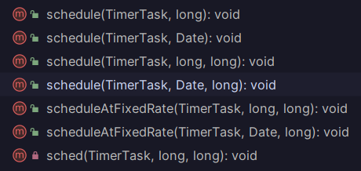

最重要的方法：**从指定时间开始，安排指定任务重复执行固定 延迟。随后的执行大约定期进行，由指定的时间段隔开。**

```java
public void schedule(TimerTask task, Date firstTime, long period) {
    if (period <= 0)
        throw new IllegalArgumentException("Non-positive period.");
    sched(task, firstTime.getTime(), -period);
}

private void sched(TimerTask task, long time, long period) {
    if (time < 0)
        throw new IllegalArgumentException("Illegal execution time.");

    // Constrain value of period sufficiently to prevent numeric
    // overflow while still being effectively infinitely large.
    if (Math.abs(period) > (Long.MAX_VALUE >> 1))
        period >>= 1;

    synchronized(queue) {
        if (!thread.newTasksMayBeScheduled)
            throw new IllegalStateException("Timer already cancelled.");

        synchronized(task.lock) {
            if (task.state != TimerTask.VIRGIN)
                throw new IllegalStateException(
                "Task already scheduled or cancelled");
            task.nextExecutionTime = time;
            task.period = period;
            task.state = TimerTask.SCHEDULED;
        }

        queue.add(task);
        if (queue.getMin() == task)
            queue.notify();
    }
}

```

#### cancel

**终止此计时器**，放弃任何当前计划的任务。不会干扰当前正在执行的任务（如果存在）。计时器终止后，其执行线程将正常终止，并且不会再在其上计划任务

```java
public void cancel() {
    synchronized(queue) {
        queue.clear();
        cleanup.clean();
    }
}
```

### 单例模式与多线程

#### 立即加载/饿汉模式

```java
public class EagerSingleton {
    private static final EagerSingleton instance = new EagerSingleton();

    // 私有构造方法，防止外部实例化
    private EagerSingleton() {
    }

    public static EagerSingleton getInstance() {
        return instance;
    }
}
```

##### 饿汉模式优点：

1. **线程安全：** 饿汉模式在类加载时就创建了实例，因此不存在多线程并发创建实例的问题，保证了线程安全。
2. **简单明了：** 代码实现相对简单，单例实例的初始化在静态代码块中完成，不需要考虑线程同步问题。

##### 饿汉模式缺点：

1. **资源浪费：** 由于实例在类加载时就被创建，如果该实例在后续的程序中没有被使用，就会造成资源浪费。
2. **加载时机不可控：** 饿汉模式在类加载时就创建实例，无法在运行时根据需要来延迟加载实例，可能会导致不必要的性能开销。

#### 延迟加载/懒汉模式

##### 懒汉模式优点：

1. **延迟加载：** 懒汉模式实现了延迟加载，只有在第一次调用 `getInstance()` 方法时才会创建实例，能够避免不必要的资源浪费。
2. **资源占用小：** 在实例没有被创建之前，不会占用额外的内存空间。

##### 懒汉模式缺点：

1. **线程安全问题：** 最初的懒汉模式实现在多线程环境下可能会存在线程安全问题，需要通过加锁等方式来解决，可能会影响性能。
2. **性能开销：** 由于使用了同步机制来保证线程安全，可能导致在高并发情况下的性能开销较大。

#### 解决缺点

##### 解决饿汉模式的缺点：

1. **使用静态内部类：** 可以使用静态内部类来实现懒加载，只有在调用静态内部类的静态方法时，才会加载内部类并创建单例实例。这样既实现了懒加载，又保证了线程安全。
2. **双重检查锁定：** 在 getInstance 方法中使用双重检查锁定机制，可以在保证线程安全的情况下延迟加载实例，提高性能。

##### 解决懒汉模式的缺点：

1. **使用 synchronized 关键字：** 在 getInstance 方法上加上 synchronized 关键字，可以解决多线程环境下的线程安全问题，但可能会降低性能。
2. **使用 volatile 关键字：** 将实例对象声明为 volatile 可以保证多线程环境下的可见性和有序性，但不会解决并发性能问题。
3. **使用双重检查锁定：** 在 getInstance 方法中使用双重检查锁定机制，可以在保证线程安全的情况下实现延迟加载和性能优化。

#### 序列化与反序列化的单例模式

```java
import java.io.Serializable;

public class SerializedSingleton implements Serializable {

    private static final long serialVersionUID = 1L;

    private static SerializedSingleton instance;

    private SerializedSingleton() {
        // Private constructor to prevent instantiation.
    }

    public static SerializedSingleton getInstance() {
        if (instance == null) {
            synchronized (SerializedSingleton.class) {
                if (instance == null) {
                    instance = new SerializedSingleton();
                }
            }
        }
        return instance;
    }

    // Override readResolve to maintain singleton after deserialization
    protected Object readResolve() {
        return getInstance();
    }
}
```

1. `serialVersionUID`：实现 `Serializable` 接口时需要指定一个序列化版本号，以确保在类结构变化时，反序列化仍然能够正确恢复。
2. `readResolve` 方法：通过在单例类中实现 `readResolve` 方法，可以确保在反序列化时返回现有的单例实例，而不是重新创建新的实例。

### 拾遗增补

#### 线程状态

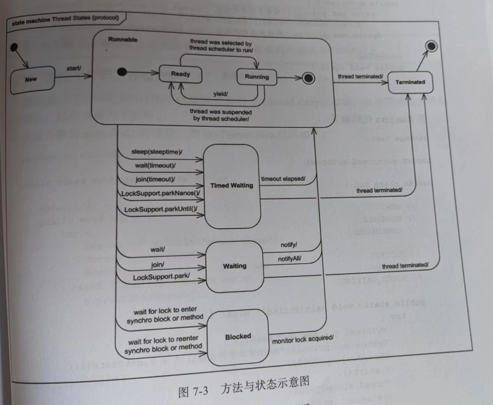

1. **NEW（新建）**：线程刚被创建但还没有被启动。
2. **RUNNABLE（可运行）**：线程正在Java虚拟机中运行，但可能正在等待操作系统分配资源。
3. **BLOCKED（阻塞）**：线程在等待锁以进入同步区域，因为其他线程已经占用了所需的锁。
4. **WAITING（等待）**：线程在等待另一个线程执行特定操作（如通知或中断）。
5. **TIMED_WAITING（定时等待）**：类似于等待状态，但可以在指定的时间后自动解除等待。
6. **TERMINATED（终止）**：线程已经完成执行，或者因为异常退出。

新建：创建线程对象--(start)--就绪：有执行权力--(抢到CPU执行权)--运行：有执行资格，有执行权--(run结束)--死亡：线程死亡，变成垃圾意外：1.其他线程在运行前抢走了执行权
            2.阻塞状态：无法获取锁
            3.等待状态：wait()等待，知道被notify唤醒
            4.计时等待状态：sleep睡眠

```java
public class ThreadStateExample {

    public static void main(String[] args) {
        Thread newThread = new Thread(() -> {
            System.out.println("New Thread is running...");
        });

        Thread blockedThread = new Thread(() -> {
            synchronized (ThreadStateExample.class) {
                System.out.println("Blocked Thread is running...");
                try {
                    Thread.sleep(2000);
                } catch (InterruptedException e) {
                    e.printStackTrace();
                }
            }
        });

        Thread waitingThread = new Thread(() -> {
            synchronized (ThreadStateExample.class) {
                try {
                    System.out.println("Waiting Thread is waiting...");
                    ThreadStateExample.class.wait();
                } catch (InterruptedException e) {
                    e.printStackTrace();
                }
            }
        });

        newThread.start();
        blockedThread.start();
        waitingThread.start();

        try {
            Thread.sleep(100);
        } catch (InterruptedException e) {
            e.printStackTrace();
        }

        System.out.println("New Thread State: " + newThread.getState());
        System.out.println("Blocked Thread State: " + blockedThread.getState());
        System.out.println("Waiting Thread State: " + waitingThread.getState());
    }
}

/*
New Thread is running...
Waiting Thread is waiting...
Blocked Thread is running...
New Thread State: TERMINATED
Blocked Thread State: TIMED_WAITING
Waiting Thread State: WAITING

*/
```

#### 线程池

线程池是一种用于管理和复用线程的机制，它可以有效地管理线程的生命周期、创建和销毁，以及线程的数量和调度。在多线程编程中，频繁地创建和销毁线程会带来较大的开销，而线程池可以帮助减少这些开销，提高程序的性能和资源利用率。

Java中提供了一个`ThreadPoolExecutor`类来实现线程池。线程池通常包含以下主要组件：

1. **任务队列（Task Queue）**：用于存储等待执行的任务。线程池中的线程会从任务队列中取任务进行执行。
2. **线程池管理器（ThreadPool Manager）**：负责管理线程池的创建、销毁和维护。
3. **工作线程（Worker Threads）**：实际执行任务的线程。

线程池的优点包括：

- **资源控制**：可以限制线程的数量，避免创建过多线程导致系统资源耗尽。
- **线程复用**：线程池会复用已经创建的线程，减少线程创建和销毁的开销。
- **更好的性能**：通过减少线程创建和销毁的开销，可以提高程序的性能。
- **任务调度**：线程池可以根据实际情况调度任务的执行。

##### Executors.newFixedThreadPool(int m)创建线程池——固定线程数

```java
import java.util.concurrent.ExecutorService;
import java.util.concurrent.Executors;

public class MyPool {
    public static void main(String[] args) {
        ExecutorService pool = Executors.newFixedThreadPool(3);
        for (int i = 0; i < 10; i++) {
            final int taskId = 1;
            pool.execute(()->{
                System.out.println("Task " + taskId + "is running on thread: " + Thread.currentThread().getName());
            });
        }
        pool.shutdown();
    }
}

//输出有随机性
/*
Task 1is running on thread: pool-1-thread-3
Task 1is running on thread: pool-1-thread-3
Task 1is running on thread: pool-1-thread-1
Task 1is running on thread: pool-1-thread-3
Task 1is running on thread: pool-1-thread-2
Task 1is running on thread: pool-1-thread-2
Task 1is running on thread: pool-1-thread-2
Task 1is running on thread: pool-1-thread-3
Task 1is running on thread: pool-1-thread-1
Task 1is running on thread: pool-1-thread-2
*/
```

#####  Executors.newCachedThreadPool()——创建动态数量的线程

```java
import java.util.concurrent.ExecutorService;
import java.util.concurrent.Executors;

/**
 * @author MOYU
 * @File JavaSE_Study-ThreadStudy.thethreadpool
 * @Date 2022/6/18 21:04
 **/
public class Demo {
    public static void main(String[] args) throws InterruptedException {
        //1.创建一个默认线程池对象，池子中默认是空的，默认容纳int类型的最大值  executor-执行者
        //Executros---帮助创建线程池
        //ExecutorService---帮助我们控制线程池
        ExecutorService executorService = Executors.newCachedThreadPool();

        executorService.submit(()->{
            System.out.println(Thread.currentThread().getName() + "在执行了");
        });

        Thread.sleep(2000);

        //当睡眠时，第一个线程执行完毕，并且返回给线程池，所以在第二次输出时依然是已经存在的线程，而不用在创建一个线程
        //当没有睡眠，第一个线程来不及归还给线程池，因此又创建了第二个线程
        executorService.submit(()->{
            System.out.println(Thread.currentThread().getName() + "在执行了");
        });

        executorService.shutdown();
    }
}
/*
-- 休眠
pool-1-thread-1在执行了
pool-1-thread-1在执行了
-- 不休眠
pool-1-thread-1在执行了
pool-1-thread-2在执行了
*/
```

##### new ThreadPoolExecutor方法实现

```java
import java.util.concurrent.ArrayBlockingQueue;
import java.util.concurrent.Executors;
import java.util.concurrent.ThreadPoolExecutor;
import java.util.concurrent.TimeUnit;

/**
 * @author MOYU
 * @File JavaSE_Study-ThreadStudy.mythreadpool
 * @Date 2022/6/18 21:34
 **/
public class Demo3 {
    public static void main(String[] args) {
//    参数一：核心线程数量
//    参数二：最大线程数
//    参数三：空闲线程最大存活时间
//    参数四：时间单位
//    参数五：任务队列
//    参数六：创建线程工厂
//    参数七：任务的拒绝策略
//                    --什么时候拒绝：当提交的任务 > 池子中的最大线程数 + 阻塞队列的容量
//                    --如何拒绝：见
        ThreadPoolExecutor pool = new ThreadPoolExecutor(2, 5, 2, TimeUnit.SECONDS, new ArrayBlockingQueue<>(10), Executors.defaultThreadFactory(), new ThreadPoolExecutor.AbortPolicy());

        System.out.println(pool.getPoolSize());

        pool.submit(new MyRunnable());
        pool.submit(new MyRunnable());

        System.out.println(pool.getPoolSize());

        pool.shutdown();
    }
}
```

##### 总结

```java
public static ExecutorService newFixedThreadPool(int nThreads) {
    return new ThreadPoolExecutor(nThreads, nThreads,
                                  0L, TimeUnit.MILLISECONDS,
                                  new LinkedBlockingQueue<Runnable>());
}

public static ExecutorService newCachedThreadPool() {
    return new ThreadPoolExecutor(0, Integer.MAX_VALUE,
                                  60L, TimeUnit.SECONDS,
                                  new SynchronousQueue<Runnable>());
}
```

不难看出，其实*newFixedThreadPool*和*newCachedThreadPool*方法内部实现也是*ThreadPoolExecutor*，只是对它做了封装，这样使用起来更方便，但*ThreadPoolExecutor*更灵活


## 集合

集合分为Collection 和 Map
              单列 Collection 分为  可重复的List 和 不可重复的Set
                     List 分为 ArrayList 和 LinkedList
                     Set 分为 HashSet 和 TreeSet
             双列  Map 分为   HashMap 和 TreeMap

Stream流是为了方便使用集合

### Collection

#### 迭代器

迭代器（Iterator）是一种设计模式，它用于顺序访问集合对象中的元素，而无需暴露集合的内部表示。迭代器提供了一种统一的方式来遍历不同类型的集合，使得客户端代码无需关心集合的底层数据结构，从而提高了代码的灵活性和可维护性。

迭代器的原理：

1. 接口定义：迭代器模式中通常会定义一个迭代器接口（Iterator Interface），它包含用于遍历集合的方法，例如`hasNext()`用于检查是否有下一个元素，`next()`用于获取下一个元素。
2. 集合提供迭代器：集合类（例如ArrayList、LinkedList、HashSet等）实现迭代器接口，并提供返回迭代器对象的方法，通常命名为`iterator()`。
3. 迭代器遍历：客户端代码通过获取集合的迭代器对象，并使用迭代器提供的方法进行遍历，无需知道集合的内部结构。

常用的迭代器方法：

1. `hasNext()`：用于检查集合中是否还有下一个元素，返回布尔值。如果还有下一个元素，返回`true`，否则返回`false`。
2. `next()`：用于获取集合中的下一个元素，并将迭代器的指针移动到下一个位置。如果没有下一个元素，可能会抛出`NoSuchElementException`异常。
3. `remove()`：用于从集合中删除迭代器最后一次返回的元素。如果在调用`next()`之前调用了`remove()`，或者在一次调用`remove()`之后再次调用`remove()`，可能会抛出`IllegalStateException`异常。这个方法在某些集合中可能不支持。

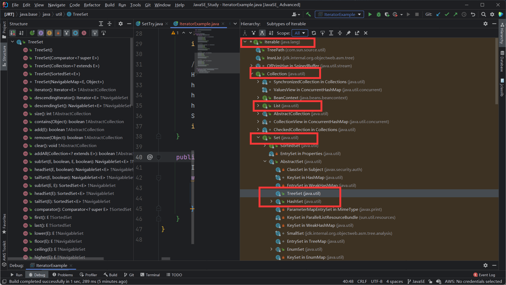

**可以看到Collection是实现了Iterable接口，因此所有单列集合都可以用迭代器遍历**

```java
import java.util.*;

public class IteratorExample {
    public static void main(String[] args) {
        // 遍历ArrayList
        ArrayList<String> arrayList = new ArrayList<>();
        arrayList.add("apple");
        arrayList.add("banana");
        arrayList.add("orange");
        System.out.println("ArrayList:");
        iterateCollection(arrayList);

        // 遍历LinkedList
        LinkedList<String> linkedList = new LinkedList<>();
        linkedList.add("cat");
        linkedList.add("dog");
        linkedList.add("elephant");
        System.out.println("\nLinkedList:");
        iterateCollection(linkedList);

        // 遍历TreeSet
        TreeSet<String> treeSet = new TreeSet<>();
        treeSet.add("zoo");
        treeSet.add("park");
        treeSet.add("garden");
        System.out.println("\nTreeSet:");
        iterateCollection(treeSet);

        // 遍历HashSet
        HashSet<String> hashSet = new HashSet<>();
        hashSet.add("red");
        hashSet.add("green");
        hashSet.add("blue");
        System.out.println("\nHashSet:");
        iterateCollection(hashSet);
    }

    public static void iterateCollection(Iterable<String> collection) {
        Iterator<String> iterator = collection.iterator();
        while (iterator.hasNext()) {
            String element = iterator.next();
            System.out.println(element);
        }
    }
}
```

#### List

List集合特点：

1. 有序：存储和取出的元素顺序一致
2. 有索引：可以通过索引操作元素
3. 可重复：存储的元素可以重复

List 分为 ArrayList 和 LinkedList

##### ArrayList

 数组底层：查询快，增删慢
       1. ArrayList底层原理是创建一个10个大小的数组，当10个装不下，自动创建一个1.5倍的数组来装——当然，这些是在内存中的
       2. ArrayList有一个变量size，他自动指向数组中所有元素的下一个空的位置，这也是为什么ArrayList用size来获取长度的原因

注意：

1. 集合长度可变
2. 集合只能存储引用类型,不能存储基本类型，当存储基本类型数据，其实存储的是包装类

##### 遍历

 * 1.相对索引进行操作用原始for
 * 2.想删除用迭代器
 * 3.仅仅遍历用增强for

```java
package CollectionStudy.Collection.MyList.MyArrayList;

import java.util.ArrayList;
import java.util.Iterator;

/**
 * @author MOYU
 * @File JavaSE_Study-MyCollection
 * @Date 2022/5/31 20:14
 *
 **/
public class IteratorDel {
    public static void main(String[] args) {
        ArrayList<String> list = new ArrayList<>();
        list.add("a");
        list.add("b");
        list.add("b");
        list.add("c");
        list.add("d");

        System.out.println(list);

      /*  for (int i = 0; i < list.size(); i++) {
            String s = list.get(i);
            if (s.equals("b")){
                list.remove(i);
                i--;
            }
        }
        System.out.println(list);*/

       /* for (int i = list.size() - 1;i >= 0; i--) {
            String s = list.get(i);
            if (s.equals("b")){
                list.remove(i);
            }
        }
        System.out.println(list);*/

        Iterator<String> it = list.iterator();
        while (it.hasNext()){
            String s = it.next();
            if (s.equals("b")){
                it.remove();
            }
        }
        System.out.println(list);

        //增强for循环----仅仅适用于实现了Iterable接口的类
        //1.该数据类型必须与集合或者数组的数据类型一样
        //2.str仅仅代表的当前元素，
        //3.list就是被便利的数组或者集合
        for(String str : list){
            System.out.println(str);
        }
        for (String s : list) {
            System.out.println(s);
        }

        //str如同创建了了一个新的容器来接收传过来的值，它改变不会影响原来数组或者集合的值
        for(String str : list){
            str = "q";
            System.out.println(str);
        }
        System.out.println(list);
    }
}
```

##### LinkedList

 底层逻辑是链表，查询慢，增删快
    1. LinkedList是双向链表  所谓的双向链表就是每个结点有三个值，前一个元素的地址，后一个元素的地址，以及本身的值；
       2. 查询时，判断距离头近还是尾近，距离头近则从头开始查询，离尾近从尾开始查询

#### Set

特点:

1. Set的集合可以去除重复
2. 存取顺序不一致
3. 不存在索引，所以不能普通for或者直接使用索引来遍历

Set 有两个实现类  HashSet 和 TreeSet

##### TreeSet

###### 底层原理

底层数据结构：树
     树的一个结点有四个值：父节点的地址，结点的值，左子节点的地址，右子节点的地址
     树有左旋和右旋，又有左左，左右，右右，右左四种情况，哪边子树大就往另一边旋转

1. 二叉树：每个节点的子节点最多两个；

2. 二叉查找树：每个节点的左子节点比自己小，右子节点比自己大；

3. 平衡二叉树：每个结点的左子树和右子树的高度差不超过1（即<=1）

4. 红黑树：  （红黑树的结点还有第五个数据：颜色）

    * 红黑树的结点只有红色和黑色，且根节点和叶节点必须是黑色

    * 如果一个节点没有父节点或者子节点，则子节点设为Nil,颜色为黑色

    * 不能出现两个红色节点相连接

红黑树添加节点：

[红黑树](https://blog.csdn.net/cy973071263/article/details/122543826)

1. 设所有元素结点初始都为红色，根节点必须是黑色
2. 每个叶节点是黑色（Nil)
3. 不能出现两个红色节点相连接
4. 对每一个节点，到其每一个后代叶节点的简单路径上，所经过的黑色结点数目相同
5. 父节点为黑色时，添加子节点不需要任何操作；
6. 如果父节点和叔叔节点都是红色，则
    * 将父节点和叔叔节点都设为黑色，
    * 将祖父节点设为红色
    * 如果祖父节点为根节点则还是黑色

7. 如果父节点红色，叔叔节点黑色，则
    * 将父节点变为黑色，
    * 将祖父节点变为红色，
    * 以祖父节点位置点旋转（旋转的是这个祖父节点为根的子树）

###### 特点

1. Set的集合可以去除重复
2. 存取顺序不一致
3. 不存在索引，所以不能普通for或者直接使用索引来遍历

重点：可以将元素按照规则进行排序,自定义排序规则有两个接口可以实现  Comparator 和  Comparable

```java
//Comparable接口是一个内部排序接口，它允许在类的内部定义默认的比较规则。当一个类实现了Comparable接口，并重写了compareTo方法时，该类的对象可以通过调用Collections.sort()或Arrays.sort()方法进行排序。——如下就是一个在Student类内部定义的方法
//public class Student implements Comparable<Student>{}
@Override
public int compareTo(Student o) {
    //总成绩排名
    int result = o.getSum() - this.getSum();
    //总成绩一样，语文排名
    result = result == 0 ? o.getChinese() - this.getChinese() : result;
    //语文一样，数学排名
    result = result == 0 ? o.getMath() - this.getMath() : result;
    //数学一样，英语排名
    result = result == 0 ? o.getEnglish() - this.getEnglish() : result;
    //英语一样，姓名排名
    result =  result == 0 ? o.name.compareTo(this.getName()) : result;
    return result;
}


//Comparator接口是一个外部排序接口，它允许在类的外部定义不同的比较规则。您可以创建多个实现了Comparator接口的类，每个类代表一种不同的排序规则。通过使用不同的Comparator对象，可以在不修改原始类的情况下对对象进行不同的排序。这种方式适用于对已有的类进行多样化的排序需求，或者对某个类的排序规则有多个不同的使用场景。

 public static void main(String[] args) {
     List<Student> students = new ArrayList<>();
     students.add(new Student("Alice", 85));
     students.add(new Student("Bob", 78));
     students.add(new Student("Cathy", 92));

     // 使用Comparator接口实现定制排序规则
     Comparator<Student> scoreComparator = new Comparator<Student>() {
         @Override
         public int compare(Student s1, Student s2) {
             return Integer.compare(s1.getScore(), s2.getScore());
         }
     };

     Collections.sort(students, scoreComparator);

     for (Student student : students) {
         System.out.println(student);
     }
 }
```


##### HashSet

哈希值：是JDk根据对象的地址或者属性值，算出来的int类型的整数

故：同一个对象的哈希值相同

重写HashCode方法后，根据对象属性值来计算哈希值，因此同一个对象或者属性值相同的对象哈希值相同

注意：**如果用HashSet存储自定义类，则必须重写HashCode方法**

######  特点

1. 底层是哈希表
2. 不能保证存取顺序一致
3. 没有带索引的方法，所以不能使用普通for循环遍历
4. 由于是Set集合，所以元素唯一，不重复

###### 底层原理

  HashSet在1.7版本之前：
                底层：哈希表（数组+链表）
                1.HashSet默认创建16长度的数组，加载因子为0.75，数组名为table
                2.根据元素的哈希值根数组长度计算出应该存入的位置
                3.判断当前位置是否是null，如果是null直接存入
                4.如果应存入的位置不为null，表示有元素，则调用equals方法比较属性
                5.如果一样，则不存，如果不一样，则存入数组，老元素挂在新元素下面（链表）
                6.如果该位置已经有一个链表，则和整个链表元素进行比较，如有一个相同，不存；如都不同，则新元素进入数组，做链表头
                7.当数组里面（注意是数组里面，挂在某个数组元素上的链表不属于数组）存入16*0.75=12个元素时，数组会扩容到原先的两倍

  HashSet在1.8版本之后 ：
            底层：哈希表（数组+链表+红黑树）
            优化：在1.7版本的基础上，对链表进行长度监控，如果链表长度超过8时，自动转换为红黑树

###### 重写hashCode

```java
public class Student {
    private String name;
    private int age;

    public Student() {
    }

    public Student(String name, int age) {
        this.name = name;
        this.age = age;
    }

    public String getName() {
        return name;
    }

    public void setName(String name) {
        this.name = name;
    }

    public int getAge() {
        return age;
    }

    public void setAge(int age) {
        this.age = age;
    }

    @Override
    public String toString() {
        return "Student{" +
                "name='" + name + '\'' +
                ", age=" + age +
                '}' + "\n";
    }

    @Override
    public boolean equals(Object o) {
        if (this == o) {
            return true;
        }
        if (o == null || getClass() != o.getClass()) {
            return false;
        }

        Student student = (Student) o;

        if (age != student.age) {
            return false;
        }
        return Objects.equals(name, student.name);
    }

    /**
     * 我们可以对Object中的HashCode方法进行重写，重写后就是根据对象属性值来计算哈希值，跟地址就没关系了
     */
    @Override
    public int hashCode() {
        int result = name != null ? name.hashCode() : 0;
        result = 31 * result + age;
        return result;
    }
}


public class HashProject {
    public static void main(String[] args) {
        HashSet<Student> hs = new HashSet<>();

        Student s1 = new Student("Mike",18);
        Student s2 = new Student("Michael",18);
        Student s3 = new Student("Marry",20);
        Student s4 = new Student("Michael",18);

        hs.add(s1);
        hs.add(s2);
        hs.add(s3);
        hs.add(s4);

        //没有重写HashCode方法，每个对象是new出来的，所以地址不同，所以都存入哈希表
        //重写方法后，根据成员变量计算，所以成员变量相同则是同一个对象
        System.out.println(hs);
    }
}

//结果
[Student{name='Mike', age=18}
, Student{name='Michael', age=18}
, Student{name='Marry', age=20}
]
```

### Map

双列集合：

1. 一次存储一对元素（键和值），其中键不能重复，而值可以重复

2. 键和值一一对应：键值对或者是键值对对象--Entry

 Map是接口，因此要有实现方法   Interface Map<K,V>   K: 键的数据类型  V:值的数据类型

#### TreeMap

##### 底层逻辑

红黑树：

1. 添加的是键值对罢了，同样，在意的只有键，不在意值
2. 依赖自然排序，对键进行排序
3. 如果键存储的是自定义对象，则需要实现Comparable接口或者在创建TreeMap对象时给出比较器排序(Collector)

#### HashMap

##### 底层逻辑

哈希表结构（和HashSet一样：数组+链表+红黑树）

区别：他所计算和存储的都是键，必须保证键的唯一，而当自定义对象时需要重写equals方法和HashCode方法，同样保证键唯一

##### 遍历

```java
import java.util.HashMap;
import java.util.Map;
import java.util.Set;

/**
 * @author MOYU
 * @File JavaSE_Study-Map.HashMap
 * @Date 2022/6/5 17:38
 **/
public class HashMapProject {
    public static void main(String[] args) {
        HashMap<Student, String> hm = new HashMap<>();

        Student s1 = new Student("Mike", 18);
        Student s2 = new Student("Michael", 18);
        Student s3 = new Student("Marry", 20);
        Student s4 = new Student("Michael", 21);

        hm.put(s1, "北京");
        hm.put(s2, "西安");
        hm.put(s3, "宝鸡");
        hm.put(s4, "深圳");

        //三种方法遍历
        //1.键找值
        Set<Student> keys = hm.keySet();
        for (Student key : keys) {
            String value = hm.get(key);
            System.out.println(key + "---" + value);
        }

        System.out.println("======================================");

        //2.键值对
        Set<Map.Entry<Student, String>> entries = hm.entrySet();
        for (Map.Entry<Student, String> entry : entries) {
            Student key = entry.getKey();
            String value = entry.getValue();
            System.out.println(key + "---" + value);
        }

        System.out.println("======================================");

        //3.直接点用Map方法
        hm.forEach(
                (Student key, String value) -> {
                    System.out.println(key + "---" + value);
                }
        );
    }
}
```

### Stream

1. 获取Stream流：创建一条流水线，并把数据放到流水线上准备操作
2. 中间方法：对数据进行中间操作，可以用多次
3. 终结方法：一个Stream流只有一个终结方法，用了流水线就结束

*在Stream流中无法直接修改集合，数组等数据源中的数据，相当于只是获得数据进行操作，而非直接对内存中的数据操作*

#### Stream流获取方法

                 1. 单列结合：使用Collection接口中的默认方法stream()生成流——default Stream<E> stream()
                 2. 双列集合：间接的生成流---可以先通过KeySet或者entrySet获取一个Set集合，在获取Stream集合
                 3. 数组：Arrays中的静态方法stream生成流
                 4. 同种数据类型的多个数据：如：1,2,3,4,5....使用Stream.of(T...values)生成流

```java
import java.util.ArrayList;
import java.util.Arrays;
import java.util.HashMap;
import java.util.stream.IntStream;
import java.util.stream.Stream;

public class TryGetStream {
    public static void main(String[] args) {
        //单列集合
        ArrayList<Integer> list = new ArrayList<>();
        list.add(2);
        list.add(2);
        list.add(3);
        list.add(2);
        list.forEach(num -> System.out.print(num + " "));
        System.out.println();


        //双列集合
        HashMap<Integer, String> map = new HashMap<>();
        map.put(1, "a");
        map.put(2, "a");
        map.put(3, "a");
        map.put(4, "a");
        map.forEach((key, value) -> System.out.println(key + "->" + value));

        //Arrays方法
        int[] arr = {1, 2, 2, 3, 3, 4};
        IntStream stream = Arrays.stream(arr);
        stream.forEach(num -> System.out.print(num + " "));

        //Stream.of(...value)
        Stream<Integer> integerStream = Stream.of(1, 2, 3, 4, 546, 7, 86, 8);
        integerStream.forEach(System.out::println);

        System.out.println();
    }
}
```

#### 常用方法及举例

```java
import java.util.Arrays;
import java.util.List;
import java.util.stream.Collectors;
import java.util.stream.Stream;

public class StreamExamples {

    public static void main(String[] args) {
        List<Integer> numbers = Arrays.asList(1, 2, 3, 4, 5, 5, 6, 7, 8, 9);

        // 1. filter(Predicate<T> predicate)：筛选出大于等于5的元素。
        List<Integer> filteredNumbers = numbers.stream()
                                               .filter(num -> num >= 5)
                                               .collect(Collectors.toList());
        System.out.println("Filtered Numbers: " + filteredNumbers); // Output: [5, 5, 6, 7, 8, 9]

        // 2. map(Function<T, R> mapper)：将每个元素乘以2。
        List<Integer> mappedNumbers = numbers.stream()
                                             .map(num -> num * 2)
                                             .collect(Collectors.toList());
        System.out.println("Mapped Numbers: " + mappedNumbers); // Output: [2, 4, 6, 8, 10, 10, 12, 14, 16, 18]

        // 3. distinct()：去除重复元素。
        List<Integer> distinctNumbers = numbers.stream()
                                               .distinct()
                                               .collect(Collectors.toList());
        System.out.println("Distinct Numbers: " + distinctNumbers); // Output: [1, 2, 3, 4, 5, 6, 7, 8, 9]

        // 4. sorted()：对集合进行自然排序。
        List<Integer> sortedNumbers = numbers.stream()
                                             .sorted()
                                             .collect(Collectors.toList());
        System.out.println("Sorted Numbers: " + sortedNumbers); // Output: [1, 2, 3, 4, 5, 5, 6, 7, 8, 9]

        // 5. limit(long maxSize)：限制元素个数为3个。
        List<Integer> limitedNumbers = numbers.stream()
                                              .limit(3)
                                              .collect(Collectors.toList());
        System.out.println("Limited Numbers: " + limitedNumbers); // Output: [1, 2, 3]

        // 6. skip(long n)：跳过前3个元素。
        List<Integer> skippedNumbers = numbers.stream()
                                              .skip(3)
                                              .collect(Collectors.toList());
        System.out.println("Skipped Numbers: " + skippedNumbers); // Output: [4, 5, 5, 6, 7, 8, 9]

        // 7. forEach(Consumer<T> action)：对 Stream 中的每个元素执行指定的操作。
        numbers.stream().forEach(num -> System.out.print(num + " ")); // Output: 1 2 3 4 5 5 6 7 8 9
        System.out.println();

        // 8. collect(Collectors.toList())：将元素收集到 List 集合中。
        List<Integer> collectedNumbers = numbers.stream()
                                                .collect(Collectors.toList());
        System.out.println("Collected Numbers: " + collectedNumbers); // Output: [1, 2, 3, 4, 5, 5, 6, 7, 8, 9]

        // 9. anyMatch(Predicate<T> predicate)：判断是否存在大于10的元素。
        boolean anyGreaterThan10 = numbers.stream()
                                         .anyMatch(num -> num > 10);
        System.out.println("Any Greater Than 10? " + anyGreaterThan10); // Output: false

        // 10. allMatch(Predicate<T> predicate)：判断是否所有元素都小于等于10。
        boolean allLessThanOrEqual10 = numbers.stream()
                                             .allMatch(num -> num <= 10);
        System.out.println("All Less Than or Equal to 10? " + allLessThanOrEqual10); // Output: true

        // 11. noneMatch(Predicate<T> predicate)：判断是否不存在小于0的元素。
        boolean noneLessThan0 = numbers.stream()
                                       .noneMatch(num -> num < 0);
        System.out.println("None Less Than 0? " + noneLessThan0); // Output: true
    }
}

```


## Java 特性

### Java初始化顺序


```java
public class ClassMethodOrder {
    static int SM=0;
	static{
		System.out.println("++++++++++++父类静态代码块+++++++++++++++");
	};	
 
	{
		System.out.println("++++++++++父类普通代码块++++++++++");
	};
	
	public ClassMethodOrder() {
		System.out.println("++++++父类构造方法+++++");	
	}	
	public  void getName(String name) {
		System.out.println("+++父类普通方法+++");		
	}
	public static void main(String[] args) {
		System.out.println("++++++父类main方法+++++");	
		ClassMethodOrder methodOrder = new  ClassMethodOrder();
		methodOrder.getName("hello");
	}
}

/*
result:
++++++++++++父类静态代码块+++++++++++++++
++++++父类main方法+++++
++++++++++父类普通代码块++++++++++
++++++父类构造方法+++++
+++父类普通方法+++
*/

/*
倘若在new两个对象
 ClassMethodOrder methodOrder2 = new  ClassMethodOrder();
 ClassMethodOrder methodOrder3 = new  ClassMethodOrder();

这个时候执行结果是
++++++++++++父类静态代码块+++++++++++++++
++++++父类main方法+++++
++++++++++父类普通代码块++++++++++
++++++父类构造方法+++++
+++父类普通方法+++
++++++++++父类普通代码块++++++++++
++++++父类构造方法+++++
++++++++++父类普通代码块++++++++++
++++++父类构造方法+++++
*/
```

**静态代码块只执行了一次，构造方法和普通代码块执行次数和创建对象的个数相同**


**静态代码什么情况下会执行？**

1. **类被使用时静态代码块自动执行**
2. **使用了类中的静态变量时会执行**
3. **创建一个类实例时被使用。**


父类存在时代码的执行顺序

```java
public class ClassMethodOrder {
    public static void main(String[] args) {
        Apple apple = new Apple();
        apple.getName("hello");
    }
}

class Fruit {
    static {
        System.out.println("++++++++++++父类静态代码块+++++++++++++++");
    }

    {
        System.out.println("++++++++++父类普通代码块++++++++++");
    }

    public Fruit() {
        System.out.println("++++++父类构造方法+++++");
    }

    public void getName(String name) {
        System.out.println("+++父类普通方法+++");
    }
}

class Apple extends Fruit {
    static {
        System.out.println("++++++++++++子类静态代码块+++++++++++++++");
    }

    {
        System.out.println("++++++++++子类普通代码块++++++++++");
    }

    public Apple() {
        System.out.println("++++++子类构造方法+++++");
    }

    public void getName(String name) {
        System.out.println("+++子类普通方法+++");
    }
}

/*
++++++++++++父类静态代码块+++++++++++++++
++++++++++++子类静态代码块+++++++++++++++
++++++++++父类普通代码块++++++++++
++++++父类构造方法+++++
++++++++++子类普通代码块++++++++++
++++++子类构造方法+++++
+++子类普通方法+++
*/
```

所以执行顺序为：

**父类静态代码块-->子类静态代码块-->父类普通代码块-->父类构造方法-->子类代码块-->子类构造方法；**


### 异常处理

异常是程序中的一些错误，但并不是所有的错误都是异常，并且错误有时候是可以避免的。

**犯错在所难免，不断解决问题才是真正的不断进步**

- **检查性异常：**最具代表的检查性异常是用户错误或问题引起的异常，这是程序员无法预见的。例如要打开一个不存在文件时，一个异常就发生了，这些异常在编译时不能被简单地忽略。
- **运行时异常：** 运行时异常是可能被程序员避免的异常。与检查性异常相反，运行时异常可以在编译时被忽略。
- **错误：** 错误不是异常，而是脱离程序员控制的问题。错误在代码中通常被忽略。例如，当栈溢出时，一个错误就发生了，它们在编译也检查不到的。

编译时异常必须显示处理，运行时异常交给虚拟机。
运行时异常可以不处理。当出现这样的异常时，总是由虚拟机接管。比如我们从来没有人去处理过Null Pointer Exception异常，它就是运行时异常，并且这种异常还是最常见的异常之一。出现运行时异常后，系统会把异常一直往上层抛，一直遇到处理代码。如果没有处理块，到最上层，如果是多线程就由Thread.run()抛出，如果是单线程就被main()抛出。抛出之后，如果是线程，这个线程也就退出了。如果是主程序抛出的异常，整个程序也就退出了。运行时异常是Exception的子类，也有一般异常的特点，是可以被Catch块处理的。只不过往往不对它处理罢了。也就是说，如果不对运行时异常进行处理，那么出现运行时异常之后，要么是线程中止，要么是主程序终止。

#### 异常处理流程

当代码出现异常，那么JVM就在这里创建一个异常对象

1.看程序中有没有自己处理异常的方法
2.如果没有处理方法，交给本方法调用者处理
3.最终会交给虚拟机JVM处理
JVM处理：
    1.将异常信息用红色字体展示在控制台
    2.哪里出现异常，程序就在那里停止运行，即下面的代码不会被执行


#### Exception 类的层次

所有的异常类是从 java.lang.Exception 类继承的子类。Exception 类是 Throwable 类的子类。

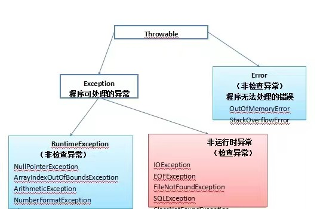

都是Throwable的子类：
1.Exception（异常）:是程序本身可以处理的异常。

2.Error（错误）:是程序无法处理的错误。这些错误表示故障发生于虚拟机自身、或者发生在虚拟机试图执行应用时，一般不需要程序处理。

3.检查异常（编译器要求必须处置的异常）: 除了Error，RuntimeException及其子类以外，其他的Exception类及其子类都属于可查异常。这种异常的特点是Java编译器会检查它，也就是说，当程序中可能出现这类异常，要么用try-catch语句捕获它，要么用throws子句声明抛出它，否则编译不会通过。

4.非检查异常（编译器不要求处置的异常）：包括运行时异常(RuntimeException与其子类)和错误(Error)。

#### 异常方法

下面的列表是 Throwable 类的主要方法:

| 序号 | 方法及说明                                                   |
| :--- | :----------------------------------------------------------- |
| 1    | *public String getMessage()* 返回关于发生的异常的详细信息。这个消息在Throwable 类的构造函数中初始化了。 |
| 2    | *public Throwable getCause()* 返回一个 Throwable 对象代表异常原因。 |
| 3    | *public String toString()* 返回此 Throwable 的简短描述。     |
| 4    | *public void printStackTrace()* 将此 Throwable 及其回溯打印到标准错误流。。 |
| 5    | *public StackTraceElement [] getStackTrace()* 返回一个包含堆栈层次的数组。下标为0的元素代表栈顶，最后一个元素代表方法调用堆栈的栈底。 |
| 6    | *public Throwable fillInStackTrace()* 用当前的调用栈层次填充Throwable 对象栈层次，添加到栈层次任何先前信息中。 |

#### (多重)捕获异常

使用 try 和 catch 关键字可以捕获异常。try/catch 代码块放在异常可能发生的地方。

try/catch代码块中的代码称为保护代码，使用 try/catch 的语法如下：

```java
try
{
   // 程序代码
}catch(ExceptionName e1)
{
   //Catch 块
}
```

Catch 语句包含要捕获异常类型的声明。当保护代码块中发生一个异常时，try 后面的 catch 块就会被检查。

如果发生的异常包含在 catch 块中，异常会被传递到该 catch 块，这和传递一个参数到方法是一样。

#### throws/throw 关键字

如果一个方法没有捕获到一个检查性异常，那么该方法必须使用 throws 关键字来声明。throws 关键字放在方法签名的尾部。

也可以使用 throw 关键字抛出一个异常，无论它是新实例化的还是刚捕获到的。

一个方法可以声明抛出多个异常，多个异常之间用逗号隔开。

#### finally关键字

finally 关键字用来创建在 try 代码块后面执行的代码块。

无论是否发生异常，finally 代码块中的代码总会被执行。

在 finally 代码块中，可以运行清理类型等收尾善后性质的语句。

- catch 不能独立于 try 存在。
- 在 try/catch 后面添加 finally 块并非强制性要求的。
- try 代码后不能既没 catch 块也没 finally 块。
- try, catch, finally 块之间不能添加任何代码。

#### try-with-resources

JDK7 之后，Java 新增的 **try-with-resource** 语法糖来打开资源，并且可以在语句执行完毕后确保每个资源都被自动关闭 。

JDK7 之前所有被打开的系统资源，比如流、文件或者 Socket 连接等，都需要被开发者手动关闭，否则将会造成资源泄露。

```java
try (resource declaration) {
  // 使用的资源
} catch (ExceptionType e1) {
  // 异常块
}
```

以上的语法中 try 用于声明和实例化资源，catch 用于处理关闭资源时可能引发的所有异常。

**注意：try-with-resources 语句关闭所有实现 AutoCloseable 接口的资源。**

​			**try-with-resources 语句中可以声明多个资源，方法是使用分号 ; 分隔各个资源**

```java
import java.io.*;

public class RunoobTest {

    public static void main(String[] args) {
    String line;
        try(BufferedReader br = new BufferedReader(new FileReader("test.txt"))) {
            while ((line = br.readLine()) != null) {
                System.out.println("Line =>"+line);
            }
        } catch (IOException e) {
            System.out.println("IOException in try block =>" + e.getMessage());
        }
    }
}

/*
IOException in try block =>test.txt (No such file or directory)
*/

//处理多个资源关闭
import java.io.*;
import java.util.*;
class RunoobTest {
    public static void main(String[] args) throws IOException{
        try (Scanner scanner = new Scanner(new File("testRead.txt"));
            PrintWriter writer = new PrintWriter(new File("testWrite.txt"))) {
            while (scanner.hasNext()) {
                writer.print(scanner.nextLine());
            }
        }
    }
}
```


#### 自定义异常

在 Java 中你可以自定义异常。编写自己的异常类时需要记住下面的几点。

- 所有异常都必须是 Throwable 的子类。
- 如果希望写一个检查性异常类，则需要继承 Exception 类。
- 如果你想写一个运行时异常类，那么需要继承 RuntimeException 类。

例：

自定义异常：检测传入的年龄是否符合规定

```java
/**
 * @author MOYU
 * @File JavaSE_Study-Exception
 * @Date 2022/6/1 10:52
 **/
public class AgeOutBoundsException extends RuntimeException{
    //自定义异常

    public AgeOutBoundsException() {
    }

    public AgeOutBoundsException(String message) {
        super(message);
    }
}
```

测试类：是一个学生的Javabean，但是这里只展示会抛出自定义异常的setAge方法

```java
 public void setAge(int age) {
        if (age >= 18 && age <= 25) {
            this.age = age;
        }else{
            throw new AgeOutBoundsException("年龄超出范围");
        }
    }
```

#### throws和throw的区别

 throws:  1. 用在方法声明后面，跟的都是异常类名

​				2. 表示声明异常，调用该方法有可能会出现这样的异常

 throw:   1. 用在方法体内，跟的是异常对象名

​				2. 表示手动抛出异常，由方法体内的语句处理


```java
 public static void main(String[] args) {
        System.out.println("好耶！");
        System.out.println("好棒！");
        System.out.println("好快乐！");
        System.out.println("放假真爽！");
        /*
        当代码执行到这里，就创建一个异常对象
        该异常创建后，暂时没有手动处理，抛给了调用者对象处理
        下面的代码不会再执行了
         */
        throw new RuntimeException();
        /*
        手动抛出异常得作用：
                1.在方法中，当传递的参数有误，没有继续运行的必要，则抛出异常，表示该方法结束
                2.告诉调用者方法中出现了问题
         */


        //System.out.println("放假只有三天！");
    }
}
```

### 日常收获

1. 序列化保存的是对象的状态，静态变量属于类的状态，因此，序列化并不保存静态变量


# 笔记选色

| 样式名称     | 名称     | RGB          |
| ------------ | -------- | ------------ |
| h2           | 魏紫     | 126,22,113   |
| h3           | 孔雀蓝   | 14, 176, 201 |
| h4           | 克莱因蓝 | 0,47,167     |
| h5           | 榲桲红   | 237,47,106   |
| h6           | 枇杷黄   | 252,161,6    |
| strong(加粗) | 鹤顶红   | 212, 37, 23  |
| em(斜体)     | 孔雀绿   | 34, 148, 83  |

