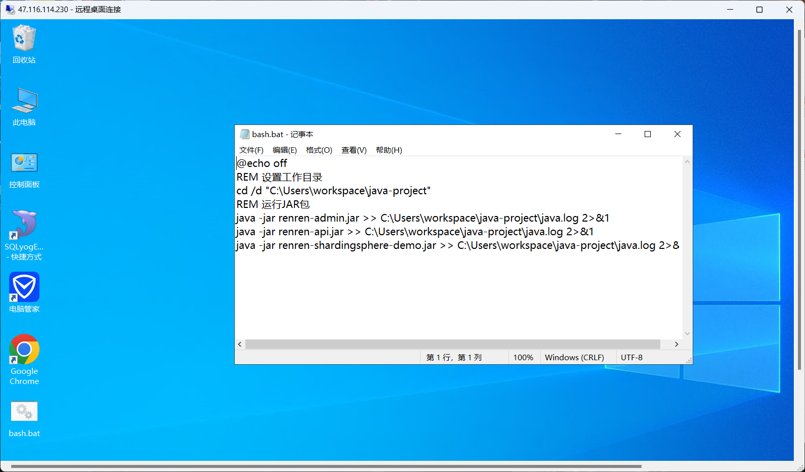

# 数据库

1.  不要在表中插入错误的数据——即不符合要求的测试数据，否则会出错

2.  如果表锁死需要查看是哪里的问题

    数据库liquibase被锁，锁住后LOCKED字段记录为1，LOCKEDBY记录锁住的操作人——在这次问题中锁住的原因是因我而起，可能是因为在关闭项目的时候未能完全关闭，导致数据库被锁住。
    将表的数据改为如图所示，即可。

# 后端

## 代码一定要优雅

不仅保证了可读性，也方便于后续调整

## HTTP和HTTPS不同导致的Bug

*对应的jar包是org.apache.coyote.http11*

```java
java.lang.IllegalArgumentException: Invalid character found in method name [0x030x000x00/*0xe00x000x000x000x000x00Cookie: ]. HTTP method names must be tokens
```

源码：```org.apache.coyote.http11```


**错误抛出**


**错误输出语句的定义**```LocalStrings.properties```


**总结：**

**原因：谷歌浏览器会自动修改请求为HTTPS，或者在访问时误输入HTTPS的协议头**

**解决方法：改用HTTP就行**

## 脚本命令运行项目

方便快捷，同时将日志输出到指定的文件也保证了日志记录的完整性和实时性




# git
## git commit 提交规范
### message 格式
```
<type>(<scope>): <subject>
```
### type(必须)
用于说明git commit的类别，只允许使用下面的标识。
1. feat：新功能（feature）。
2. fix/to：修复bug，可以是QA发现的BUG，也可以是研发自己发现的BUG。
- fix：产生diff并自动修复此问题。适合于一次提交直接修复问题
- to：只产生diff不自动修复此问题。适合于多次提交。最终修复问题提交时使用fix
3. docs：文档（documentation）。
4. style：格式（不影响代码运行的变动）。
5. refactor：重构（即不是新增功能，也不是修改bug的代码变动）。
6. perf：优化相关，比如提升性能、体验。
7. test：增加测试。
8. chore：构建过程或辅助工具的变动。
9. revert：回滚到上一个版本。
10. merge：代码合并。
11. sync：同步主线或分支的Bug。
### scope(可选)

scope用于说明 commit 影响的范围，比如数据层、控制层、视图层等等，视项目不同而不同。

例如在Angular，可以是location，browser，compile，compile，rootScope， ngHref，ngClick，ngView等。如果你的修改影响了不止一个scope，你可以使用\*代替。

### subject(必须)
subject是commit目的的简短描述，不超过50个字符。
建议使用中文（感觉中国人用中文描述问题能更清楚一些）。
- 结尾不加句号或其他标点符号。
- 根据以上规范git commit message将是如下的格式：
### 示例
```text
fix(DAO):用户查询缺少username属性 
feat(Controller):用户查询接口开发
```


